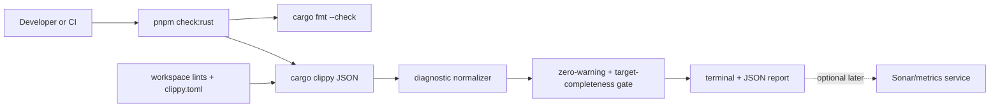
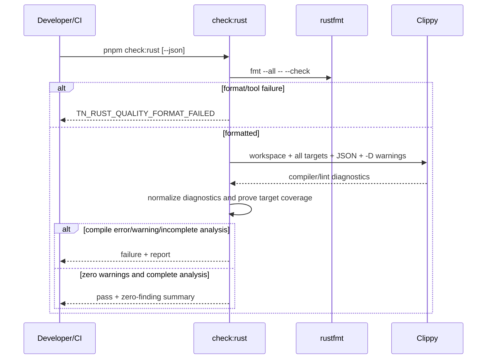

# PRD: Rust Static Analysis And Code-Smell Quality Ratchet

Complexity: 7 -> HIGH mode

Date: 2026-07-13
Status: COMPLETE
Owner: Native runtime and verification tooling

Sections 1–7 retain the executed migration plan for audit history. Checked
items describe completed steps; the durable post-migration contract is the
zero-warning checker documented in the completion evidence.

## 1. Context

**Problem:** ThreeNative documents `cargo fmt` and `cargo clippy`, but its root
Rust check and blocking verification integration do not exist, while current
lint debt makes an immediate blanket `-D warnings` cutover unrealistic.

**Complexity score:** +3 for more than 10 eventual files, +2 for a new quality
ratchet, and +2 for Rust-workspace/root-verification/CI scope = 7 (HIGH).

**Files analyzed:** `package.json`, `.github/workflows/ci.yml`,
`runtime-bevy/Cargo.toml`, `runtime-bevy/crates/*/Cargo.toml`,
`scripts/run-root-tests.mjs`, `scripts/verify-pre-push.mjs`,
`scripts/verify-pre-push.test.mjs`, `scripts/check-source-size.mjs`, its tests,
`docs/architecture/tech-stack.md`, `docs/workflows/developer-workflow.md`, and
`docs/status/source-size-audit-2026-07-04.md`.

### Historical planning behavior and baseline

- `pnpm lint` reaches package-local TypeScript tasks, not `runtime-bevy`.
- At planning time, docs named `pnpm check:rust` but `package.json` did not yet
  provide it.
- At planning time, pre-push built/tested Rust but its static-check phase
  contained only TypeScript typechecking.
- `pnpm check:source-size` scans Rust, TS, and TSX, but all file/type/`impl`
  size findings are intentionally warning-only.
- On 2026-07-13,
  `cargo clippy --workspace --all-targets --message-format short` reported 91
  warnings for the `threenative_runtime` library, plus test/bin warnings. The
  warning set included argument count, complex types, collapsible branches,
  ineffective struct updates, `clone` on `Copy`, inefficient searches, and
  non-`Drop` values passed to `drop`.
- The scan then failed because `tests/overlay_host.rs` imported three symbols
  absent from the current module surface. Active overlay work may resolve this
  before implementation, so Phase 1 must reproduce before editing.

The planning count is evidence, not a permanent allowance. Capture the exact
complete inventory again after all targets compile.

## 2. Goals

- Provide one root `pnpm check:rust` command for formatting and static analysis.
- Analyze every workspace member and expected library, binary, and test target.
- Block compilation/analysis failures and new Clippy regressions immediately.
- Track existing debt through a structured shrinking ratchet keyed by lint and
  path, then remove the ratchet and enforce `-D warnings` at zero debt.
- Explicitly cover long functions, excessive nesting, excessive arguments,
  and complex types as maintainability signals.
- Emit actionable human output and stable JSON for CI/future Sonar import.

## 3. Non-goals

- No runtime behavior changes merely to satisfy style preferences.
- No blanket `clippy::pedantic` or `clippy::restriction`; select individual
  rules with reasons.
- No repository-wide `cargo clippy --fix`.
- No Sonar account/token provisioning. Sonar adoption remains a follow-up.
- No blocking rule based only on repository-wide lines of code.
- No dependency-security expansion (`cargo audit`/`cargo deny`) here.

## 4. Integration Points

**How will this feature be reached?**

- [x] Entry point: developer/agent/CI runs `pnpm check:rust`; `--json` returns
  a normalized report.
- [x] Caller: `scripts/verify-pre-push.mjs` invokes the root command in its
  static-check phase; CI reaches it through pre-push.
- [x] Wiring: the root script owns public invocation, Cargo workspace config
  owns lint levels. The temporary structured debt policy was deleted at zero.

**Is this user-facing?** No product UI. This is developer-facing tooling shown
in terminal and pre-push reports.

**Full user flow:**

1. Contributor changes Rust and runs `pnpm check:rust`, locally or through CI.
2. The checker runs rustfmt and Clippy for the owned target set.
3. It normalizes Cargo JSON and validates complete expected-target analysis.
4. Compile errors, incomplete analysis, or any warning fail early.
5. Human and JSON reports identify the owning lint and source location.

## 5. Solution

### Approach

- Use rustfmt and Clippy for semantic analysis; do not parse Rust in JS.
- Define shared lint levels in `[workspace.lints]`, inherited by all member
  crates, and thresholds in `runtime-bevy/clippy.toml`.
- Use a small runner that consumes Cargo JSON, normalizes diagnostics, proves
  expected-target coverage from metadata, and treats every warning as fatal.
- Format, tool, compiler, incomplete-analysis, and warning failures block.
- Keep source-size reporting complementary and warning-only.
- At zero debt, delete baseline comparison and invoke Clippy with `-D warnings`.



### Key decisions

- [x] `pnpm check:rust` is the only public command owner; pre-push and CI do
  not duplicate Cargo argv.
- [x] Target scope is `--workspace --all-targets`. Platform exclusions use
  legitimate Cargo `cfg` boundaries, not silent target omissions.
- [x] Thresholds are 120 function/method lines, 8 arguments, nesting 5, and
  type complexity 300.
- [x] Do not use `clippy::cognitive_complexity` as a score; Clippy itself warns
  it is misleading. Prefer nesting and function length.
- [x] During migration, each debt entry had `lint`, repo-relative `path`,
  `maximum`, `reason`, and `removeByPhase`; the complete policy was deleted at
  zero debt.
- [x] Stale debt entries failed so the migration ratchet could only shrink.
- [x] Tests inject a command runner and fixture diagnostics; unit tests do not
  compile Bevy.
- [x] Stable diagnostics use `TN_RUST_QUALITY_*` and include lint, path/line,
  source location and a suggested fix.

### Data changes

No product, IR, or bundle schema change. The migration policy JSON was
temporary and is deleted. Generated reports live under
`tools/verify/artifacts/` and are not durable source.

## 6. Sequence Flow



## 7. Execution Phases

### Phase 1: Restore a complete baseline - Every expected target is analyzable

**Files (max 5):**

- `runtime-bevy/crates/threenative_runtime/src/overlay_host.rs` - only if the
  missing exports remain after active work settles
- `runtime-bevy/crates/threenative_runtime/tests/overlay_host.rs` - align with
  supported ownership without weakening assertions
- `docs/status/rust-static-analysis-baseline-2026-07-13.md` - exact inventory

**Implementation:**

- [x] Re-run the focused overlay test before editing.
- [x] If still broken, fix the owning surface; do not delete the test or add
  unused exports solely for Clippy.
- [x] Capture complete JSON counts by lint, path, and target.
- [x] Classify correctness/suspiciousness, performance, complexity, and style.

**Tests:**

| Command | Assertion |
| --- | --- |
| `cargo test -p threenative_runtime --test overlay_host` | Target compiles and assertions remain |
| `cargo clippy --workspace --all-targets --message-format=json` | Completes and inventories every target |

**User verification:** Run both commands from `runtime-bevy`; expect no compile
error and a documented nonzero lint inventory.

### Phase 2: Establish one workspace policy - Every crate inherits the same rules

**Files (max 5):**

- `runtime-bevy/Cargo.toml` - `[workspace.lints]`
- `runtime-bevy/clippy.toml` - numeric thresholds
- `runtime-bevy/crates/threenative_components/Cargo.toml` - opt-in
- `runtime-bevy/crates/threenative_loader/Cargo.toml` - opt-in
- `runtime-bevy/crates/threenative_runtime/Cargo.toml` - opt-in

**Implementation:**

- [x] Keep default Clippy groups and enable the four selected smell lints at
  `warn` during migration.
- [x] Configure thresholds above; do not enable whole opinionated groups.
- [x] Prove all members inherit policy without duplicate crate-local lists.

**Tests:** `cargo metadata --no-deps --format-version 1`, then temporarily add
a threshold-breaking fixture function, prove its lint appears, and remove it.

### Phase 3: Add the structured ratchet - New smells fail while debt stays visible

**Files (max 5):**

- `scripts/rust-quality-policy.json` - target policy and lint/path debt
- `scripts/check-rust-quality.mjs` - orchestration/normalization
- `scripts/check-rust-quality.test.mjs` - fixture-driven tests
- `package.json` - public `check:rust`
- baseline status doc - connect captured evidence to policy

**Implementation:**

- [x] Validate policy shape and reject duplicates, wildcards, negative counts,
  unknown phases, and stale entries.
- [x] Preserve compiler errors even when no Clippy code exists.
- [x] Fail new pairs, count increases, stale debt, format drift, missing tools,
  timeout, and incomplete targets.
- [x] Keep stdout JSON-pure under `--json`; deep logs go to the artifact.

**Tests required:**

| Test name | Assertion |
| --- | --- |
| `should pass when findings stay within baseline` | Pass with debt visible |
| `should fail for a new lint/path pair` | `TN_RUST_QUALITY_NEW_FINDING` |
| `should fail when a count increases` | Observed and allowed reported |
| `should fail for stale debt` | Baseline must shrink |
| `should preserve compiler errors` | Failed analysis cannot look clean |
| `should keep json stdout pure` | One parseable document |

**Verification:** `node --test scripts/check-rust-quality.test.mjs` and
`pnpm check:rust -- --json`.

### Phase 4: Wire pre-push and CI - Static failures stop before expensive proof

**Files (max 5):**

- `scripts/verify-pre-push.mjs` - add Rust to static checks
- `scripts/verify-pre-push.test.mjs` - enrollment/fail-fast tests
- `.github/workflows/ci.yml` - explicitly install `clippy` and `rustfmt`
- `docs/workflows/developer-workflow.md` - real command contract
- `docs/architecture/tech-stack.md` - replace aspirational text

**Implementation:**

- [x] Run Rust quality with TypeScript static checks after setup.
- [x] Stop tests/conformance/visual proof on either static failure.
- [x] Reuse `pnpm check:rust`, preserve its report path, and set a measured timeout.

**Tests required:**

| Test name | Assertion |
| --- | --- |
| `should run Rust quality in static checks` | Enrolled exactly once |
| `should stop when Rust quality fails` | No expensive phase starts |
| `should preserve Rust report metadata` | Aggregate links the report |

**User verification:** `pnpm verify:pre-push` names Rust analysis before tests.

### Phase 5: Burn down high-signal debt - Correctness, suspiciousness, and performance reach zero

Execute repeated vertical slices. Each slice changes at most four production
Rust files plus `scripts/rust-quality-policy.json`.

**Order:** suspicious/ineffective operations; performance clones/searches/
collections; safe machine-applicable readability findings; then test/bin debt.

**Per-slice requirements:**

- [x] Add/strengthen a focused test before behavior-adjacent cleanup.
- [x] Lower/remove the allowance in the same change.
- [x] Prefer a semantic fix over `#[allow]`; a retained narrow allow needs a
  local reason and cannot also remain in baseline.
- [x] Do not smuggle subsystem refactors into lint cleanup.

**Verification:** focused Cargo tests, `pnpm check:rust`, and checkpoint.

### Phase 6: Close maintainability debt - Ordinary warnings become fatal

Again use slices of at most four Rust files plus the policy file.

**Implementation:**

- [x] Treat excessive arguments as an SRP/API signal; introduce a cohesive
  parameter object only when it has durable meaning.
- [x] Name genuinely unreadable Bevy query/system types without hiding ownership.
- [x] Reduce nesting with early returns/cohesive helpers while preserving order.
- [x] Split long functions only at stable responsibility boundaries.
- [x] At zero debt, remove baseline comparison/data, retain normalization, and
  invoke Clippy with `-D warnings`.

**Final proof:**

```bash
cd runtime-bevy
cargo fmt --all -- --check
cargo clippy --workspace --all-targets -- -D warnings
cd ..
pnpm check:rust -- --json
pnpm verify:pre-push
```

### Phase 7: Close docs and status - The implemented contract is discoverable

**Files (max 5):** systems quality status, baseline status doc, PRD index, this
PRD, and its destination under `docs/PRDs/done/`.

- [x] Record final zero-debt evidence without committing generated logs.
- [x] Move this finished PRD to `done` and update links.
- [x] Remove all prose describing `check:rust` as future work.
- [x] Run `pnpm check:docs`.

## 8. Checkpoint Protocol

After every phase (and every Phase 5/6 slice), spawn `prd-work-reviewer` with
this PRD path, phase, changed files, and verification summary. Proceed only on
PASS. Because this is HIGH mode, also present:

```text
PHASE N COMPLETE - CHECKPOINT
Files changed: ...
Focused tests: PASS/FAIL
pnpm check:rust: PASS/FAIL (or not yet reachable, with reason)
Baseline delta: old -> new
Manual review: behavior preserved; no broad lint allow added.
```

## 9. Verification Strategy

- Unit-test Cargo JSON parsing and normalization, stable diagnostics, JSON
  purity, target completeness, timeout, warning/error, and tool failure paths.
- Integration-test pre-push enrollment and fail-fast behavior with a fake runner.
- Use real rustfmt/Clippy for end-to-end proof; mocks alone are insufficient.
- Run focused Cargo tests for every behavior-adjacent remediation.
- Run `pnpm verify:conformance` when cleanup touches serialization, mapping,
  scheduling, shared contracts, or cross-adapter behavior.

## 10. Acceptance Criteria

- [x] `pnpm check:rust` is the only public owner of Rust static-check argv.
- [x] Rustfmt, all workspace members, and all expected targets are checked.
- [x] Every crate inherits one workspace lint policy.
- [x] New warnings, compile errors, and incomplete analysis fail.
- [x] Pre-push/CI run the check before expensive proof.
- [x] Final debt is zero and `--all-targets -- -D warnings` passes.
- [x] Function length, nesting, arguments, and type complexity are covered.
- [x] Source-size remains complementary and warning-only.
- [x] No blanket crate/module lint suppression is introduced.
- [x] PRD-owned tests, checkpoints, docs check, Rust check, pre-push
  enrollment/static phase, and relevant conformance commands pass; unrelated
  broader pre-push blockers are recorded in the evidence below.
- [x] Evidence is filled and this finished PRD moves to `docs/PRDs/done`.

## 11. Risks And Mitigations

- **Active worktree:** reproduce the overlay failure; never revert concurrent work.
- **Stable-toolchain lint churn:** update toolchain and policy in one reviewed change.
- **False positives:** use narrow reasoned local allows, never disable a group.
- **CI cost:** run early, reuse Cargo caching, and measure before adding metrics.
- **Behavior drift:** bounded slices and focused tests are mandatory.
- **Debt hidden by movement:** exact lint/path keys, no wildcards, stale-entry failure.

## 12. Deferred Extensions

- Sonar Rust analysis (Clippy import, complexity, duplication, coverage) after
  service ownership and secrets are decided.
- Pinned `rust-code-analysis-cli` trend artifacts for cyclomatic complexity,
  maintainability index, Halstead, and logical/physical lines, only if the
  Clippy/source-size combination leaves a demonstrated decision gap.
- Dependency and unsafe-code policy through separate security work.

## 13. Verification Evidence

Planning baseline: Clippy failed after reporting 91 library warnings because
the active overlay test imported missing symbols. The repaired all-target
capture normalized to 201 findings across 128 lint/path pairs.

Completion evidence: every bounded remediation slice passed focused tests and
read-only checkpoint review. The temporary baseline reached zero and was
deleted. Direct all-target Clippy passes with `-D warnings`; the real
`pnpm --silent check:rust -- --json` result reports zero findings and zero
errors. Pre-push enrollment, CI component installation, structured checker
tests, cross-adapter conformance, and scoped formatting checks passed during
execution. The final full pre-push run passed build, typecheck, and the new
zero-warning Rust phase, then exposed unrelated broader-gate blockers: the
gameplay smoke native build exceeded its 120-second timeout and concurrent
CLI/agent-benchmark work failed package tests. A stale procedural fixture
entity ID found by the Rust suite was corrected and its focused test passes.
Final release proof is recorded by the completion commit rather than generated
logs.

## 14. References

- <https://doc.rust-lang.org/stable/clippy/usage.html>
- <https://doc.rust-lang.org/stable/clippy/lint_configuration.html>
- <https://doc.rust-lang.org/cargo/reference/workspaces.html#the-lints-table>
- <https://docs.sonarsource.com/sonarqube-server/2026.1/analyzing-source-code/languages/rust>
- <https://mozilla.github.io/rust-code-analysis/metrics.html>
