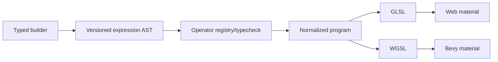

# PRD-007: Portable Shader Expression Grammar V2

`Complexity: 9 -> HIGH mode` (`+3` 10+ files, `+2` new versioned grammar,
`+2` complex type/codegen logic, `+2` multi-package)

## Disposition

**Closed without promotion on 2026-07-24.** The Phase 0 repository audit found
no second shipped material that requires portable expression composition.
Battle of Pacific water remains the sole identified forcing function and is
already owned by the adapter-private `OceanWater` implementations. The
conformance-only `portable-shader-material` fixture proves the bounded
leaf-expression V1 contract; it is not a shipped gameplay material and does not
justify a new language version. Per the promotion gate below, Phases 1-4 were
not executed.

## 1. Context

**Problem:** Portable shader expressions can reference literals, uniforms,
textures, and builtins but cannot compose arithmetic, vector, comparison, or
transcendental operations, so custom animated materials require
adapter-private shaders.

**Files analyzed:** `packages/ir/src/types.ts`,
`packages/ir/src/materialValidation.ts`,
`packages/ir/src/shaderCodegen.ts`,
`packages/sdk/src/ShaderMaterial.ts`,
`packages/runtime-web-three/src/worldMapping/oceanWater.ts`.

**Current behavior:**

- Expression kinds are leaf-only.
- Validation and code generation duplicate the same closed leaf switch.
- Native OceanWater is already planned as an adapter-private material and does
  not depend on this PRD.
- This work is promotion-gated until a second shipped material besides water
  requires portable composition.

## 2. Solution

- Introduce a versioned typed expression AST with a single descriptor registry
  owning operator ID, arity, operand/result types, constant-folding behavior,
  GLSL emission, WGSL emission, and diagnostic metadata.
- Support the minimal proven operator set; do not attempt an unrestricted
  language, loops, arbitrary functions, or raw shader source.
- Compile and validate once into a normalized shader program consumed by both
  adapters.

**Initial candidate operators:** scalar/vector `add`, `sub`, `mul`, `div`,
`negate`, `min`, `max`, `clamp`, `mix`, `dot`, `normalize`, `sin`, `cos`,
`abs`, `pow`, `step`, `smoothstep`, and vector construction/swizzle. Admission
requires the two forcing-function materials; unused candidates are omitted.

## 3. Integration points

- [x] Entry: SDK shader builders and structured portable material IR.
- [x] Callers: compiler/IR validation, shader codegen, web material mapper,
  native portable material plugin, conformance gate.
- [x] User-facing: authored material contract and diagnostics; no editor UI in
  this PRD.

**Flow:** Author composes typed expressions -> compiler validates and
normalizes -> both adapters emit target shader -> paired fixture compares
samples and images.

## 4. Execution phases

### Phase 0: Promotion gate and two forcing functions

**Files (max 5):**

- `docs/PRDs/done/session-learnings-remediation-2026-07-23/PRD-007-portable-shader-expression-grammar-v2.md` - record evidence.
- `packages/ir/fixtures/portable-shader-v2/README.md` - requirements.
- `docs/status/capabilities/rendering.md` - retain private-shader boundary.

**Implementation:**

- [x] Audit shipped examples and templates for two forcing functions; none use
  portable shader expression composition.
- [x] Stop because water is the only identified consumer; retain the
  adapter-private implementation.
- [x] Do not freeze numeric tables or design a grammar when the promotion
  precondition is unmet.

### Phase 1: Descriptor-owned typed AST

Not executed: the Phase 0 promotion gate did not pass.

**Files (max 5):**

- `packages/ir/src/shaderExpressions.ts` - AST and registry.
- `packages/ir/src/shaderExpressions.test.ts` - type/arity/folding cases.
- `packages/ir/src/types.ts` - versioned program reference.
- `packages/ir/src/materialValidation.ts` - registry delegation.
- `packages/sdk/src/ShaderMaterial.ts` - typed builders.

**Implementation:**

- [ ] Every operator has one descriptor with exact scalar/vector signatures.
- [ ] Reject divide-by-zero constants, invalid swizzles, type mismatches,
  excessive depth/nodes, and non-finite literals.
- [ ] Bound program size and texture/uniform counts.
- [ ] Normalize/fold deterministically without changing authored values.

### Phase 2: Web GLSL code generation

Not executed: the Phase 0 promotion gate did not pass.

**Files (max 5):**

- `packages/ir/src/shaderCodegen.ts` - normalized GLSL emitter.
- `packages/ir/src/shaderCodegen.test.ts` - golden/numeric cases.
- `packages/runtime-web-three/src/materials.ts` - compiled program use.
- `packages/runtime-web-three/src/materials.test.ts` - compile/runtime errors.
- `packages/ir/fixtures/portable-shader-v2/materials.ir.json` - fixture.

### Phase 3: Native WGSL code generation

Not executed: the Phase 0 promotion gate did not pass.

**Files (max 5):**

- `packages/ir/src/shaderCodegenWgsl.ts` - WGSL emitter from same registry.
- `packages/ir/src/shaderCodegenWgsl.test.ts` - golden/numeric cases.
- `runtime-bevy/crates/threenative_runtime/src/portable_shader.rs` - runtime.
- `runtime-bevy/crates/threenative_runtime/tests/portable_shader.rs` - failures.
- `packages/ir/fixtures/portable-shader-v2/game.bundle` - paired fixture.

**Implementation:**

- [ ] Preserve uniform layout/type semantics across GLSL/WGSL.
- [ ] Fail unsupported target operations at compile time with the same code.
- [ ] Never silently replace an expression with a constant/material fallback.

### Phase 4: Numeric and visual conformance

Not executed: the Phase 0 promotion gate did not pass.

**Files (max 5):**

- `tools/verify/src/portableShaderV2.ts` - paired samples/images.
- `tools/verify/src/portableShaderV2.test.ts` - negative controls.
- `packages/ir/fixtures/portable-shader-v2/expected.json` - independent values.
- `docs/status/capabilities/rendering.md` - bounded promotion.
- `docs/STATUS.md` - one-line update.

**Implementation:**

- [ ] Expected samples are independently computed, not fed into generators.
- [ ] Compare intermediate numeric probes before pixels.
- [ ] Use one owned tolerance registry and mutation negative controls.
- [ ] Document operations and explicit absence of loops/raw code.

## 5. Checkpoints and acceptance

Automated reviewer after every phase; manual visual checkpoint after Phase 4.

- [x] Repository audit demonstrates that two shipped forcing functions do not
  exist, so the grammar is not promoted.
- [x] No grammar, duplicate operator registry, fallback, or unsupported parity
  claim was introduced.
- [x] Existing V1/private-shader boundaries remain documented in
  `docs/status/capabilities/rendering.md`.
- [x] Documentation validation passes after closing the gated PRD.

## Verification evidence

- `rg -l '"kind"\s*:\s*"shader"|new ShaderMaterial|ShaderMaterial\(' examples
  templates --glob '!**/dist/**' --glob '!**/artifacts/**'` returned no shipped
  example or template consumers.
- The only repository shader-material examples are the
  `packages/ir/fixtures/conformance/portable-shader-material` V1 conformance
  fixture and focused package tests.
- `examples/battle-of-pacific/AGENT_GAME_PLAN.md` records water as the deferred
  expression-grammar use case; its runtime water remains adapter-private.
