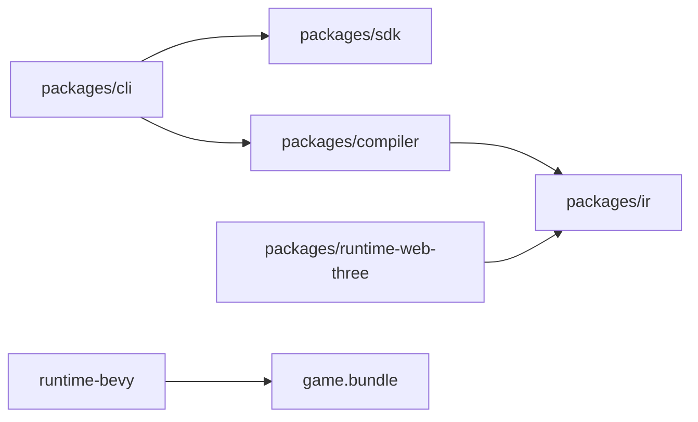

# V1-01 Monorepo and CLI Skeleton

Complexity: 6 -> MEDIUM mode

## Context

**Problem:** The repository is currently documentation-only and needs a concrete
workspace skeleton before implementation tickets can land cleanly.

**Files Analyzed:** `docs/tech-stack.md`, `docs/architecture.md`,
`docs/developer-workflow.md`, `docs/ROADMAP.md`.

**Current Behavior:**

- Docs recommend `pnpm` workspaces and strict TypeScript.
- Target packages are described but not present.
- CLI commands are named but not implemented.
- Rust Bevy runtime is planned as a top-level `runtime-bevy/` workspace.

## Solution

**Approach:**

- Create the smallest monorepo skeleton needed for V1.
- Add package boundaries without filling in broad future packages.
- Add a `tn` CLI entry that returns structured "not implemented" output for
  future commands.
- Add top-level verification scripts that can become release gates.

**Architecture Diagram:**

**Data Changes:** None.

## Integration Points

**How will this feature be reached?**

- Entry point identified: `pnpm` scripts and `tn` CLI.
- Caller file identified: root `package.json`, `packages/cli/src/index.ts`.
- Registration/wiring needed: package bin mapping for `tn`.

**Is this user-facing?** Yes, developer CLI.

**Full user flow:**

1. Developer runs `pnpm install`.
2. Developer runs `pnpm verify`.
3. Developer runs `pnpm tn -- --help`.
4. CLI lists V1 commands and structured output options.

## Execution Phases

#### Phase 1: Workspace Skeleton - Developers can install and run empty checks

**Files (max 5):**

- `package.json` - root scripts and package manager metadata.
- `pnpm-workspace.yaml` - workspace package list.
- `tsconfig.base.json` - strict shared TypeScript config.
- `packages/cli/package.json` - CLI package manifest.
- `packages/cli/src/index.ts` - command entry point.

**Implementation:**

- [ ] Add `pnpm` workspace config.
- [ ] Add root scripts: `typecheck`, `test`, `lint`, `build`, `verify`, `tn`.
- [ ] Add CLI package with `bin` named `tn`.
- [ ] Implement `--help` and placeholder command dispatch.

**Tests Required:**

| Test File | Test Name | Assertion |
| --- | --- | --- |
| `packages/cli/src/index.test.ts` | `should print help when requested` | CLI output includes V1 commands. |

**User Verification:**

- Action: Run `pnpm install && pnpm verify`.
- Expected: Empty project checks pass or clearly report pending checks.

#### Phase 2: Package Boundaries - Future tickets have stable directories

**Files (max 5):**

- `packages/sdk/package.json` - SDK package shell.
- `packages/ir/package.json` - IR package shell.
- `packages/compiler/package.json` - compiler package shell.
- `packages/runtime-web-three/package.json` - web runtime package shell.
- `runtime-bevy/Cargo.toml` - Rust workspace shell.

**Implementation:**

- [ ] Add package manifests with provisional names.
- [ ] Keep exports minimal.
- [ ] Add placeholder README files only where needed for empty dirs.
- [ ] Add Rust workspace without Bevy dependency until runtime ticket.

**Tests Required:**

| Test File | Test Name | Assertion |
| --- | --- | --- |
| `package.json` | `should include all v1 packages` | `pnpm -r exec pwd` discovers V1 packages. |

**User Verification:**

- Action: Run `pnpm -r list --depth -1`.
- Expected: V1 packages are visible.

## Verification Strategy

- `pnpm install`
- `pnpm verify`
- `pnpm tn -- --help`
- `cargo metadata --manifest-path runtime-bevy/Cargo.toml`

## Acceptance Criteria

- [ ] Workspace install works from a clean checkout.
- [ ] CLI executable exists.
- [ ] Root scripts are present.
- [ ] Package boundaries match V1 PRD index.
- [ ] No implementation depends on Bevy or Three.js before adapter tickets.
