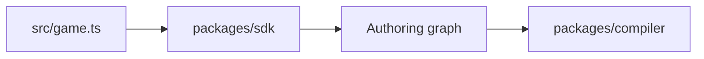

# V1-03 Minimal SDK Surface

Complexity: 6 -> MEDIUM mode

## Context

**Problem:** V1 needs a small Three.js-like TypeScript SDK subset that captures
scene authoring without promising arbitrary Three.js compatibility.

**Files Analyzed:** `docs/sdk.md`, `docs/ecs.md`, `docs/architecture.md`,
`docs/ROADMAP.md`.

**Current Behavior:**

- Supported V1 objects are documented.
- The repository has no SDK implementation.
- Arbitrary Three.js imports must remain unsupported.

## Solution

**Approach:**

- Implement plain TypeScript authoring objects that build a capture graph.
- Support `Scene`, `Object3D`, `Mesh`, `PerspectiveCamera`, `DirectionalLight`,
  `AmbientLight`, `Transform` vectors, `BoxGeometry`, `SphereGeometry`,
  `PlaneGeometry`, and `MeshStandardMaterial`.
- Preserve hierarchy and local transforms.
- Keep unsupported features explicit and diagnosable.

**Architecture Diagram:**

**Data Changes:** None.

## Integration Points

**How will this feature be reached?**

- Entry point identified: user imports from `@threenative/sdk`.
- Caller file identified: generated `src/game.ts` and compiler capture entry.
- Registration/wiring needed: package exports for supported SDK classes.

**Is this user-facing?** Yes, public authoring API.

**Full user flow:**

1. User writes `new Scene()`.
2. User adds a mesh, camera, and light.
3. Compiler receives the returned scene.
4. Compiler serializes supported objects to IR.

## Execution Phases

#### Phase 1: Scene Graph Objects - User can author a static scene

**Files (max 5):**

- `packages/sdk/src/scene/Object3D.ts` - hierarchy and transforms.
- `packages/sdk/src/scene/Scene.ts` - root scene.
- `packages/sdk/src/scene/Mesh.ts` - renderable object.
- `packages/sdk/src/math/Vector3.ts` - position/scale helpers.
- `packages/sdk/src/index.ts` - public exports.

**Implementation:**

- [ ] Implement parent-child add/remove semantics.
- [ ] Store name and stable optional ID.
- [ ] Store local transform only.
- [ ] Prevent cycles in hierarchy.

**Tests Required:**

| Test File | Test Name | Assertion |
| --- | --- | --- |
| `packages/sdk/src/scene/Object3D.test.ts` | `should reparent child when added to new parent` | Child has one parent and no duplicate references. |
| `packages/sdk/src/scene/Object3D.test.ts` | `should reject hierarchy cycles` | Adding ancestor as child throws SDK diagnostic error. |

**User Verification:**

- Action: Author a scene with nested objects.
- Expected: Object hierarchy is stable and inspectable.

#### Phase 2: V1 Render Primitives - User can describe visible objects

**Files (max 5):**

- `packages/sdk/src/geometry/primitives.ts` - box/sphere/plane geometry.
- `packages/sdk/src/materials/MeshStandardMaterial.ts` - material data.
- `packages/sdk/src/scene/Camera.ts` - perspective camera.
- `packages/sdk/src/scene/Light.ts` - ambient/directional lights.
- `packages/sdk/src/index.ts` - public exports.

**Implementation:**

- [ ] Add geometry constructors with finite numeric validation.
- [ ] Add standard material color validation.
- [ ] Add camera and light data objects.
- [ ] Defer unsupported fields with explicit error codes.

**Tests Required:**

| Test File | Test Name | Assertion |
| --- | --- | --- |
| `packages/sdk/src/geometry/primitives.test.ts` | `should reject non-finite box size` | Invalid size throws a stable SDK error. |
| `packages/sdk/src/materials/MeshStandardMaterial.test.ts` | `should store standard material color` | Color is preserved for compiler capture. |

**User Verification:**

- Action: Run starter scene through SDK unit tests.
- Expected: Supported primitives build without runtime adapter imports.

## Verification Strategy

- `pnpm --filter @threenative/sdk test`
- `pnpm --filter @threenative/sdk typecheck`

## Acceptance Criteria

- [ ] V1 SDK classes are exported from `@threenative/sdk`.
- [ ] SDK does not import Three.js, Bevy, DOM, or runtime packages.
- [ ] Hierarchy and transforms are deterministic.
- [ ] Unsupported APIs fail explicitly instead of being ignored.
