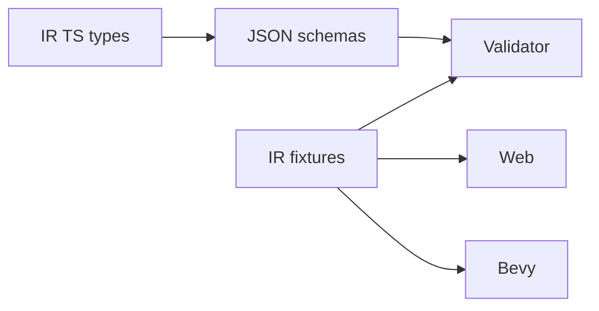

# V1-04 IR Bundle and Schemas

Complexity: 6 -> MEDIUM mode

## Context

**Problem:** The IR is the platform contract, so V1 needs versioned schemas and
fixtures before compiler and runtimes depend on them.

**Files Analyzed:** `docs/ir.md`, `docs/ecs.md`, `docs/runtime-adapters.md`,
`docs/architecture.md`.

**Current Behavior:**

- Docs define JSON-first bundle layout.
- Some capability/version wording is inconsistent.
- No schemas or fixtures exist.

## Solution

**Approach:**

- Add TypeScript IR types and JSON Schema files from one source of truth.
- Define V1 bundle layout around `manifest.json`, `world.ir.json`,
  `materials.ir.json`, `assets.manifest.json`, and `target.profile.json`.
- Keep optional UI IR, systems IR, animations IR, and script bundle manifest
  entries allowed but not required for V1 static scene proof.
- Add fixtures for empty world and cube/camera/light.

**Architecture Diagram:**

**Data Changes:** New schema files only.

## Integration Points

**How will this feature be reached?**

- Entry point identified: compiler emits schemas and validator consumes them.
- Caller file identified: `packages/compiler` and runtime adapters.
- Registration/wiring needed: package exports from `@threenative/ir`.

**Is this user-facing?** Internal, but diagnostics expose schema paths.

**Full user flow:**

1. Compiler emits `game.bundle/manifest.json`.
2. Validator loads manifest entries.
3. Runtime adapters load only validated bundle files.
4. Errors point to stable IR paths.

## Execution Phases

#### Phase 1: Core Bundle Schemas - Empty and static worlds validate

**Files (max 5):**

- `packages/ir/src/types.ts` - V1 IR TypeScript types.
- `packages/ir/src/schemas.ts` - schema exports or generated schema loader.
- `packages/ir/schemas/manifest.schema.json` - manifest schema.
- `packages/ir/schemas/world.schema.json` - world schema.
- `packages/ir/src/index.ts` - public exports.

**Implementation:**

- [ ] Define `schema` and `version` fields.
- [ ] Define entity, component, resource, hierarchy, and transform shapes.
- [ ] Define manifest entry references.
- [ ] Reject native/runtime handles by type design.

**Tests Required:**

| Test File | Test Name | Assertion |
| --- | --- | --- |
| `packages/ir/src/schema.test.ts` | `should validate empty v1 bundle` | Empty world fixture passes schema validation. |
| `packages/ir/src/schema.test.ts` | `should reject duplicate entity ids` | Duplicate IDs fail semantic fixture validation. |

**User Verification:**

- Action: Inspect fixture JSON.
- Expected: Bundle is readable and deterministic.

#### Phase 2: Render Domain Schemas - Cube fixture has mesh and material data

**Files (max 5):**

- `packages/ir/schemas/materials.schema.json` - V1 material schema.
- `packages/ir/schemas/assets.schema.json` - generated mesh asset schema.
- `packages/ir/schemas/target-profile.schema.json` - target profile schema.
- `packages/ir/fixtures/cube-scene/game.bundle/manifest.json` - fixture manifest.
- `packages/ir/fixtures/cube-scene/game.bundle/world.ir.json` - fixture world.

**Implementation:**

- [ ] Add standard material fields.
- [ ] Add generated mesh asset kinds for box/sphere/plane.
- [ ] Add target profile with `web` and `desktop`.
- [ ] Keep material and asset ID uniqueness rules explicit.

**Tests Required:**

| Test File | Test Name | Assertion |
| --- | --- | --- |
| `packages/ir/src/schema.test.ts` | `should validate cube scene fixture` | Cube fixture validates all referenced files. |

**User Verification:**

- Action: Open the cube fixture bundle.
- Expected: `manifest.json` references every required file.

## Verification Strategy

- `pnpm --filter @threenative/ir test`
- `pnpm --filter @threenative/ir typecheck`
- `rg 'world.ir.json' packages/ir docs/PRDs/v1`

## Acceptance Criteria

- [ ] V1 schemas are versioned.
- [ ] `world.ir.json` is the canonical world file.
- [ ] Core render fixture validates.
- [ ] Runtime adapters can depend on schema package without depending on SDK.
