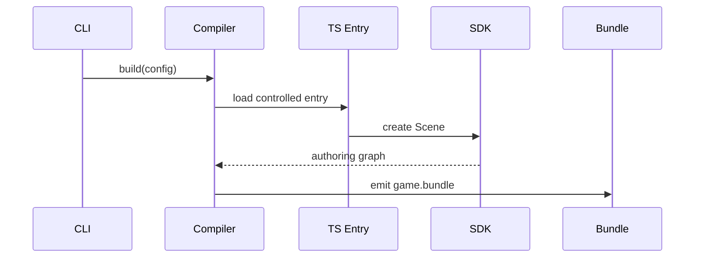

# V1-05 Compiler Capture and Emit

Complexity: 6 -> MEDIUM mode

## Context

**Problem:** Supported SDK authoring must produce deterministic IR without
attempting arbitrary JavaScript or arbitrary Three.js compilation.

**Files Analyzed:** `docs/sdk.md`, `docs/ir.md`, `docs/developer-workflow.md`,
`docs/architecture.md`.

**Current Behavior:**

- Docs require controlled SDK capture.
- No compiler package exists.
- V1 should prioritize structured SDK objects over source-string scraping.

## Solution

**Approach:**

- Load a configured TypeScript entry point in a controlled Node process.
- Accept only returned `Scene`, `World`, or later `Game` roots from the SDK.
- Normalize SDK scene objects into ECS-shaped IR.
- Emit deterministic JSON bundle files with sorted stable IDs.

**Architecture Diagram:**

**Data Changes:** Emits generated `game.bundle/`.

## Integration Points

**How will this feature be reached?**

- Entry point identified: `tn build`.
- Caller file identified: `packages/cli/src/commands/build.ts`.
- Registration/wiring needed: compiler API exported from `@threenative/compiler`.

**Is this user-facing?** Yes, through CLI output and generated bundle.

**Full user flow:**

1. User runs `tn build`.
2. Compiler loads `threenative.config.json`.
3. Compiler captures the starter scene.
4. Compiler emits `dist/game.bundle/`.
5. Validator and runtimes consume the bundle.

## Execution Phases

#### Phase 1: Entry Capture - Starter scene can be loaded

**Files (max 5):**

- `packages/compiler/src/config.ts` - config loader.
- `packages/compiler/src/capture.ts` - controlled entry loading.
- `packages/compiler/src/errors.ts` - compiler diagnostics.
- `packages/compiler/src/index.ts` - compiler API.
- `packages/compiler/src/capture.test.ts` - capture tests.

**Implementation:**

- [ ] Load V1 config file.
- [ ] Compile/load TypeScript entry with Node-compatible tooling.
- [ ] Verify returned root is an SDK supported root.
- [ ] Reject direct `three` runtime contract imports when detectable.

**Tests Required:**

| Test File | Test Name | Assertion |
| --- | --- | --- |
| `packages/compiler/src/capture.test.ts` | `should capture starter scene root` | Returned `Scene` is accepted. |
| `packages/compiler/src/capture.test.ts` | `should reject unsupported root` | Plain object root returns compiler diagnostic. |

**User Verification:**

- Action: Run compiler capture on template project.
- Expected: Capture succeeds and reports root summary.

#### Phase 2: Deterministic Bundle Emit - Static scene becomes IR files

**Files (max 5):**

- `packages/compiler/src/emit/scene-to-world.ts` - SDK to world IR mapping.
- `packages/compiler/src/emit/materials.ts` - material IR emit.
- `packages/compiler/src/emit/assets.ts` - generated geometry assets.
- `packages/compiler/src/emit/bundle.ts` - file writer.
- `packages/compiler/src/emit/bundle.test.ts` - emit tests.

**Implementation:**

- [ ] Map scene hierarchy to entities and `Hierarchy`.
- [ ] Map transforms to local `Transform`.
- [ ] Map primitive geometry to generated asset IDs.
- [ ] Map standard materials to `materials.ir.json`.
- [ ] Serialize JSON with deterministic key ordering.

**Tests Required:**

| Test File | Test Name | Assertion |
| --- | --- | --- |
| `packages/compiler/src/emit/bundle.test.ts` | `should emit deterministic cube bundle` | Same source emits byte-identical JSON twice. |
| `packages/compiler/src/emit/scene-to-world.test.ts` | `should preserve parent child hierarchy` | Child entity references parent ID. |

**User Verification:**

- Action: Run `tn build` in generated starter.
- Expected: `dist/game.bundle/manifest.json` and `world.ir.json` exist.

## Verification Strategy

- `pnpm --filter @threenative/compiler test`
- `pnpm tn -- build --project templates/v1`
- `diff -r first.bundle second.bundle`

## Acceptance Criteria

- [ ] Supported SDK scene emits valid V1 bundle files.
- [ ] Output is deterministic.
- [ ] Compiler does not depend on runtime adapters.
- [ ] Unsupported roots and APIs produce structured diagnostics.
