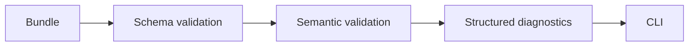

# V1-06 Validator Diagnostics

Complexity: 6 -> MEDIUM mode

## Context

**Problem:** AI and human workflows need strict validation with stable
diagnostics before web or native runtimes start.

**Files Analyzed:** `docs/ir.md`, `docs/ai-workflows.md`,
`docs/developer-workflow.md`, `docs/ROADMAP.md`.

**Current Behavior:**

- Docs define diagnostic shape and validation stages.
- No validator exists.
- V1 must reject unsupported APIs and invalid IR early.

## Solution

**Approach:**

- Implement schema validation plus semantic validation in `@threenative/compiler`
  or a dedicated validator module.
- Return diagnostics with stable code, severity, message, file/path, target, and
  suggestion.
- Wire `tn validate` and `tn build` to use the same validator.
- Add fixture tests for missing materials, duplicate IDs, invalid transforms,
  missing manifest references, and unsupported capabilities.

**Architecture Diagram:**

**Data Changes:** None.

## Integration Points

**How will this feature be reached?**

- Entry point identified: `tn validate`.
- Caller file identified: `packages/cli/src/commands/validate.ts` and
  `packages/compiler/src/build.ts`.
- Registration/wiring needed: shared diagnostic JSON type.

**Is this user-facing?** Yes.

**Full user flow:**

1. User runs `tn validate`.
2. Validator loads source or emitted bundle.
3. Validator reports actionable diagnostics.
4. User or agent fixes source before runtime startup.

## Execution Phases

#### Phase 1: Bundle Validation - Invalid IR fails with stable diagnostics

**Files (max 5):**

- `packages/compiler/src/validate/schema.ts` - schema validation.
- `packages/compiler/src/validate/semantic.ts` - cross-reference validation.
- `packages/compiler/src/diagnostics.ts` - diagnostic type and helpers.
- `packages/compiler/src/validate/index.ts` - validator API.
- `packages/compiler/src/validate/validate.test.ts` - validator tests.

**Implementation:**

- [ ] Validate manifest references.
- [ ] Validate entity ID uniqueness.
- [ ] Validate material and mesh references.
- [ ] Validate finite transform values.
- [ ] Validate target profile support for V1 features.

**Tests Required:**

| Test File | Test Name | Assertion |
| --- | --- | --- |
| `packages/compiler/src/validate/validate.test.ts` | `should return TN-IR-2104 when material is missing` | Diagnostic includes code, path, value, suggestion. |
| `packages/compiler/src/validate/validate.test.ts` | `should reject duplicate entity ids` | Duplicate fixture returns one stable error. |

**User Verification:**

- Action: Run `tn validate --bundle invalid.bundle --json`.
- Expected: JSON diagnostics include stable codes and IR paths.

#### Phase 2: CLI Validation - Users can run validation directly

**Files (max 5):**

- `packages/cli/src/commands/validate.ts` - command implementation.
- `packages/cli/src/index.ts` - command registration.
- `packages/cli/src/output.ts` - human and JSON output formatting.
- `packages/cli/src/commands/validate.test.ts` - CLI tests.

**Implementation:**

- [ ] Support `--project`, `--bundle`, `--target`, and `--json`.
- [ ] Exit nonzero on errors.
- [ ] Keep warnings distinct from errors.
- [ ] Print concise human output by default.

**Tests Required:**

| Test File | Test Name | Assertion |
| --- | --- | --- |
| `packages/cli/src/commands/validate.test.ts` | `should exit nonzero for invalid bundle` | Process result has nonzero exit and JSON diagnostics. |

**User Verification:**

- Action: Run `tn validate` in generated starter.
- Expected: Valid starter exits zero.

## Verification Strategy

- `pnpm --filter @threenative/compiler test -- --run validate`
- `pnpm tn -- validate --bundle packages/ir/fixtures/cube-scene/game.bundle`
- `pnpm tn -- validate --bundle invalid.bundle --json`

## Acceptance Criteria

- [ ] Invalid bundles never reach runtime startup.
- [ ] Diagnostics are stable and machine-readable.
- [ ] Validator covers schema and semantic cross-file references.
- [ ] `tn build` and `tn validate` share validation logic.
