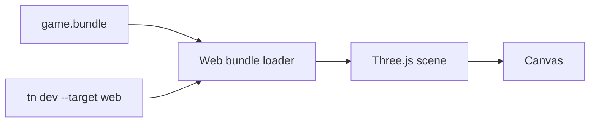

# V1-07 Web Three Runtime

Complexity: 6 -> MEDIUM mode

## Context

**Problem:** V1 must render the validated bundle in a browser through Three.js
as the fast preview and screenshot verification target.

**Files Analyzed:** `docs/runtime-adapters.md`, `docs/tech-stack.md`,
`docs/ROADMAP.md`, `docs/developer-workflow.md`.

**Current Behavior:**

- Docs require a Three.js web runtime adapter.
- WebGPU is discussed but not required by roadmap V1.
- No runtime package exists.

## Solution

**Approach:**

- Implement `@threenative/runtime-web-three` as a bundle loader and Three.js
  renderer.
- Use a Vite-based dev shell for `tn dev --target web`.
- Map V1 `Transform`, generated geometry, `MeshRenderer`, standard material,
  camera, and light IR to Three.js objects.
- Expose runtime diagnostics and a simple readiness hook for Playwright.

**Architecture Diagram:**

**Data Changes:** None.

## Integration Points

**How will this feature be reached?**

- Entry point identified: `tn dev --target web`.
- Caller file identified: `packages/cli/src/commands/dev.ts`.
- Registration/wiring needed: dev server serves bundle and web runtime shell.

**Is this user-facing?** Yes, browser preview.

**Full user flow:**

1. User runs `tn build`.
2. User runs `tn dev --target web`.
3. CLI starts local server and prints preview URL.
4. Browser renders the V1 scene.

## Execution Phases

#### Phase 1: Bundle Loader and Scene Mapping - Cube fixture renders in browser

**Files (max 5):**

- `packages/runtime-web-three/src/loadBundle.ts` - manifest and IR loading.
- `packages/runtime-web-three/src/mapWorld.ts` - IR to Three.js scene.
- `packages/runtime-web-three/src/render.ts` - renderer setup.
- `packages/runtime-web-three/src/index.ts` - public runtime API.
- `packages/runtime-web-three/src/mapWorld.test.ts` - mapping tests.

**Implementation:**

- [ ] Load manifest and required V1 files.
- [ ] Create Three.js objects from world/material/asset IR.
- [ ] Apply local hierarchy transforms.
- [ ] Select active camera.
- [ ] Return structured runtime diagnostics.

**Tests Required:**

| Test File | Test Name | Assertion |
| --- | --- | --- |
| `packages/runtime-web-three/src/mapWorld.test.ts` | `should map cube fixture to three scene` | Scene contains mesh, camera, and light. |

**User Verification:**

- Action: Open the web runtime shell with cube fixture.
- Expected: A cube is visible on canvas.

#### Phase 2: CLI Dev Preview - Users can launch web preview

**Files (max 5):**

- `packages/runtime-web-three/src/devServer.ts` - Vite/server helper.
- `packages/runtime-web-three/src/browser/main.ts` - browser entry.
- `packages/runtime-web-three/index.html` - preview shell.
- `packages/cli/src/commands/dev.ts` - target dispatch.
- `packages/cli/src/commands/dev.test.ts` - CLI tests.

**Implementation:**

- [ ] Serve built bundle from project output.
- [ ] Print preview URL.
- [ ] Add `window.__THREENATIVE_READY__` or equivalent for verification.
- [ ] Fail fast if bundle validation fails.

**Tests Required:**

| Test File | Test Name | Assertion |
| --- | --- | --- |
| `packages/cli/src/commands/dev.test.ts` | `should start web dev server for valid bundle` | Command returns URL and keeps server alive. |

**User Verification:**

- Action: Run `tn dev --target web`.
- Expected: Preview URL loads a nonblank scene.

## Verification Strategy

- `pnpm --filter @threenative/runtime-web-three test`
- `pnpm tn -- dev --target web --project examples/v1-canonical`
- Playwright smoke: canvas exists and has nonzero size.

## Acceptance Criteria

- [ ] Web runtime consumes validated bundle, not SDK objects.
- [ ] Three.js internals do not become public SDK API.
- [ ] V1 cube/player scene renders.
- [ ] Preview exposes enough state for automated screenshot verification.
