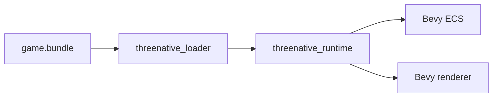

# V1-08 Native Bevy Runtime

Complexity: 7 -> HIGH mode

## Context

**Problem:** V1 must prove the same validated bundle can load and render in a
native desktop Bevy runtime without exposing Bevy to TypeScript authors.

**Files Analyzed:** `docs/runtime-adapters.md`, `docs/scripting.md`,
`docs/tech-stack.md`, `docs/architecture.md`, `docs/ROADMAP.md`.

**Current Behavior:**

- Docs define Bevy as internal native adapter.
- Native JavaScript hosting is unresolved and not required for V1 static proof.
- No Rust workspace exists.

## Solution

**Approach:**

- Implement a minimal Bevy app that loads V1 bundle JSON from disk.
- Map SDK entity IDs to Bevy entities and attach a stable ID component.
- Map `Transform`, hierarchy, generated primitive meshes, standard material,
  camera, and light.
- Keep TypeScript systems out of V1 native runtime unless a built-in fixture
  system is needed for visual motion.

**Architecture Diagram:**

**Data Changes:** None.

## Integration Points

**How will this feature be reached?**

- Entry point identified: `tn dev --target desktop`.
- Caller file identified: `packages/cli/src/commands/dev.ts`,
  `runtime-bevy/crates/threenative_runtime/src/main.rs`.
- Registration/wiring needed: CLI command invokes Cargo app with bundle path.

**Is this user-facing?** Yes, native desktop window.

**Full user flow:**

1. User runs `tn build`.
2. User runs `tn dev --target desktop`.
3. CLI validates bundle and starts Bevy runtime.
4. Bevy window renders the same V1 scene data.

## Execution Phases

#### Phase 1: Rust Loader - Bevy runtime can parse validated V1 bundle

**Files (max 5):**

- `runtime-bevy/Cargo.toml` - workspace.
- `runtime-bevy/crates/threenative_loader/Cargo.toml` - loader crate.
- `runtime-bevy/crates/threenative_loader/src/lib.rs` - bundle structs/load.
- `runtime-bevy/crates/threenative_loader/tests/load_bundle.rs` - loader tests.
- `runtime-bevy/crates/threenative_runtime/Cargo.toml` - app crate.

**Implementation:**

- [ ] Mirror V1 IR structs needed by runtime.
- [ ] Load manifest and referenced files by bundle-relative path.
- [ ] Reject unsupported schema major versions.
- [ ] Preserve stable entity IDs in loader output.

**Tests Required:**

| Test File | Test Name | Assertion |
| --- | --- | --- |
| `runtime-bevy/crates/threenative_loader/tests/load_bundle.rs` | `should load cube fixture bundle` | Loader returns world with cube, camera, and light. |

**User Verification:**

- Action: Run `cargo test --manifest-path runtime-bevy/Cargo.toml`.
- Expected: Loader tests pass.

#### Phase 2: Bevy Mapping - Cube fixture renders in native window

**Files (max 5):**

- `runtime-bevy/crates/threenative_components/src/lib.rs` - stable ID component.
- `runtime-bevy/crates/threenative_runtime/src/lib.rs` - app/plugin setup.
- `runtime-bevy/crates/threenative_runtime/src/map_world.rs` - IR to Bevy.
- `runtime-bevy/crates/threenative_runtime/src/main.rs` - CLI app entry.
- `runtime-bevy/crates/threenative_runtime/tests/map_world.rs` - mapping tests.

**Implementation:**

- [ ] Spawn entities with stable SDK ID component.
- [ ] Map transforms and hierarchy.
- [ ] Map generated box/sphere/plane meshes.
- [ ] Map standard material colors.
- [ ] Spawn camera and light.

**Tests Required:**

| Test File | Test Name | Assertion |
| --- | --- | --- |
| `runtime-bevy/crates/threenative_runtime/tests/map_world.rs` | `should spawn stable ids for cube fixture` | Bevy world contains expected stable ID components. |

**User Verification:**

- Action: Run native runtime with cube fixture.
- Expected: Desktop window opens and renders the scene.

#### Phase 3: CLI Desktop Target - Users can start native runtime from `tn`

**Files (max 5):**

- `packages/cli/src/commands/dev.ts` - desktop dispatch.
- `packages/cli/src/native/bevy.ts` - Cargo invocation helper.
- `packages/cli/src/commands/dev.test.ts` - desktop command tests.

**Implementation:**

- [ ] Validate bundle before native startup.
- [ ] Pass bundle path to runtime.
- [ ] Surface Cargo/runtime failures as structured CLI diagnostics.
- [ ] Keep Bevy command details out of generated game README except through `tn`.

**Tests Required:**

| Test File | Test Name | Assertion |
| --- | --- | --- |
| `packages/cli/src/commands/dev.test.ts` | `should invoke bevy runtime for desktop target` | Cargo helper receives bundle path after validation. |

**User Verification:**

- Action: Run `tn dev --target desktop`.
- Expected: Native desktop render starts from the same bundle.

## Verification Strategy

- `cargo test --manifest-path runtime-bevy/Cargo.toml`
- `cargo fmt --manifest-path runtime-bevy/Cargo.toml --check`
- `cargo clippy --manifest-path runtime-bevy/Cargo.toml --all-targets -- -D warnings`
- `pnpm tn -- dev --target desktop --project examples/v1-canonical`

## Acceptance Criteria

- [ ] Bevy runtime loads V1 bundle from disk.
- [ ] Stable SDK IDs are present on spawned Bevy entities.
- [ ] Same bundle used by web and native renders a static scene.
- [ ] No public TypeScript API exposes Bevy concepts.
- [ ] Native JS script host remains explicitly deferred unless separately
  accepted.
