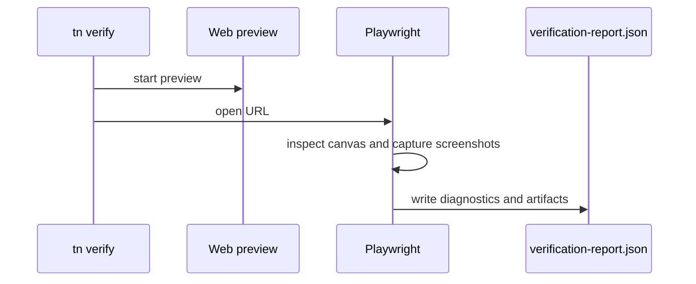

# V1-10 Visual Self Verification

Complexity: 7 -> HIGH mode

## Context

**Problem:** Rendering bugs can pass type checks and validation while producing
a blank canvas, missing canvas, bad camera framing, or frozen scene.

**Files Analyzed:** `docs/ROADMAP.md`, `docs/ai-workflows.md`,
`docs/developer-workflow.md`.

**Current Behavior:**

- Docs require Playwright-backed screenshot verification for V1 web preview.
- No web runtime or verification command exists yet.
- Native image capture is explicitly lighter in V1.

## Solution

**Approach:**

- Add `tn verify` for web visual verification.
- Launch or reuse `tn dev --target web`.
- Use Playwright to check canvas existence and size.
- Capture screenshots to predictable artifact paths.
- Detect nonblank image and visible frame-to-frame changes.
- Emit machine-readable report with pass/fail diagnostics, preview URL, and
  artifact paths.

**Architecture Diagram:**

**Data Changes:** Writes verification artifacts under project output.

## Integration Points

**How will this feature be reached?**

- Entry point identified: `tn verify`.
- Caller file identified: `packages/cli/src/commands/verify.ts`.
- Registration/wiring needed: CLI command and Playwright dependency.

**Is this user-facing?** Yes, developer/AI verification.

**Full user flow:**

1. User runs `tn verify --project examples/v1-canonical`.
2. CLI builds and validates the bundle.
3. CLI starts web preview.
4. Playwright captures screenshots and compares frames.
5. Report identifies pass/fail and artifact paths.

## Execution Phases

#### Phase 1: Screenshot Capture - Verification sees the rendered output

**Files (max 5):**

- `packages/cli/src/commands/verify.ts` - verify command.
- `packages/cli/src/verify/playwright.ts` - browser orchestration.
- `packages/cli/src/verify/report.ts` - report shape.
- `packages/cli/src/commands/verify.test.ts` - command tests.
- `packages/runtime-web-three/src/browser/main.ts` - readiness hook support.

**Implementation:**

- [ ] Build and validate before preview.
- [ ] Start web preview or accept `--url`.
- [ ] Wait for runtime readiness.
- [ ] Assert canvas exists and has nonzero size.
- [ ] Save at least one screenshot to `artifacts/verify/`.

**Tests Required:**

| Test File | Test Name | Assertion |
| --- | --- | --- |
| `packages/cli/src/commands/verify.test.ts` | `should fail when canvas is missing` | Report includes missing canvas diagnostic. |

**User Verification:**

- Action: Run `tn verify --project examples/v1-canonical`.
- Expected: Screenshot artifact is saved.

#### Phase 2: Image Analysis - Verification detects blank and changed frames

**Files (max 5):**

- `packages/cli/src/verify/imageAnalysis.ts` - pixel checks.
- `packages/cli/src/verify/report.ts` - report diagnostics.
- `packages/cli/src/verify/imageAnalysis.test.ts` - image tests.
- `packages/cli/src/commands/verify.ts` - multi-frame flow.

**Implementation:**

- [ ] Detect blank or near-blank screenshot.
- [ ] Capture two or more screenshots across time.
- [ ] Compute simple pixel-diff percentage.
- [ ] Report frozen/no-change when motion is expected.
- [ ] Include thresholds in report.

**Tests Required:**

| Test File | Test Name | Assertion |
| --- | --- | --- |
| `packages/cli/src/verify/imageAnalysis.test.ts` | `should detect blank image` | Solid black/transparent image fails nonblank check. |
| `packages/cli/src/verify/imageAnalysis.test.ts` | `should detect changed frames` | Two different fixture images exceed diff threshold. |

**User Verification:**

- Action: Run `tn verify --project examples/v1-canonical --frames 2`.
- Expected: Report includes screenshot paths and diff result.

#### Phase 3: AI-Friendly Report - Failures localize likely source area

**Files (max 5):**

- `packages/cli/src/verify/diagnostics.ts` - likely cause mapping.
- `packages/cli/src/commands/verify.ts` - JSON output.
- `examples/v1-canonical/README.md` - verify command docs.

**Implementation:**

- [ ] Include preview URL.
- [ ] Include screenshot paths.
- [ ] Include likely area: SDK, compiler, runtime-web, example, camera/framing.
- [ ] Support `--json`.

**Tests Required:**

| Test File | Test Name | Assertion |
| --- | --- | --- |
| `packages/cli/src/commands/verify.test.ts` | `should emit machine readable report` | JSON contains status, diagnostics, artifacts, preview URL. |

**User Verification:**

- Action: Run `tn verify --json`.
- Expected: Machine-readable report is printed and saved.

## Verification Strategy

- `pnpm --filter @threenative/cli test -- --run verify`
- `pnpm tn -- verify --project examples/v1-canonical`
- Inspect `examples/v1-canonical/artifacts/verify/verification-report.json`.

## Acceptance Criteria

- [ ] `tn verify` checks web preview canvas existence and size.
- [ ] Nonblank screenshot detection works.
- [ ] Multi-frame difference detection works for simple movement/rotation.
- [ ] Artifacts are saved to predictable paths.
- [ ] Report is useful to an AI agent without manual browser inspection.
