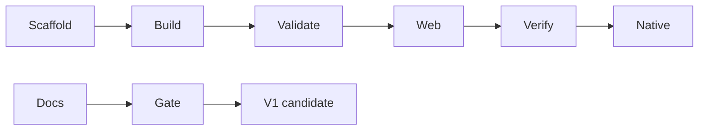

# V1-11 Release Gate and Docs Consistency

Complexity: 5 -> MEDIUM mode

## Context

**Problem:** V1 should only be considered complete when the end-to-end loop works
and the Markdown docs match the actual supported API and commands.

**Files Analyzed:** all docs under `docs/`, plus V1 PRDs.

**Current Behavior:**

- Existing docs describe V1, V2, V3, MVP, and future directions at different
  granularity.
- Implementation is not yet present.
- The user explicitly requested Markdown docs remain consistent.

## Solution

**Approach:**

- Add one release gate that runs the whole V1 loop from a clean scaffold and the
  canonical example.
- Check that docs do not advertise unsupported V1 capabilities.
- Keep future-facing docs intact but label post-V1 work clearly.
- Require each V1 ticket to update docs when behavior or command names change.

**Architecture Diagram:**

**Data Changes:** None.

## Integration Points

**How will this feature be reached?**

- Entry point identified: `pnpm verify:v1`.
- Caller file identified: root `package.json`.
- Registration/wiring needed: release gate script and docs check.

**Is this user-facing?** Yes, release and docs quality.

**Full user flow:**

1. Maintainer runs `pnpm verify:v1`.
2. Script scaffolds a fresh project and builds the canonical example.
3. Script validates, starts web preview, verifies screenshots, and runs native
   smoke checks.
4. Script scans docs for known V1 consistency risks.
5. V1 is accepted only when checks pass.

## Execution Phases

#### Phase 1: End-to-End Gate - One command proves the V1 loop

**Files (max 5):**

- `package.json` - `verify:v1` script.
- `scripts/verify-v1.mjs` - release gate orchestration.
- `packages/cli/src/commands/doctor.ts` - prerequisite checks if needed.
- `docs/PRDs/v1/README.md` - gate command documentation.

**Implementation:**

- [ ] Create a temp project with `tn create`.
- [ ] Run validate/build/web verify on temp project.
- [ ] Run validate/build/web verify/native smoke on canonical example.
- [ ] Fail with structured summary.

**Tests Required:**

| Test File | Test Name | Assertion |
| --- | --- | --- |
| `scripts/verify-v1.test.mjs` | `should fail when a gate command fails` | Gate exits nonzero and reports failing step. |

**User Verification:**

- Action: Run `pnpm verify:v1`.
- Expected: V1 loop passes from clean scaffold and canonical example.

#### Phase 2: Markdown Consistency Check - Docs match shipped V1

**Files (max 5):**

- `scripts/check-docs-v1.mjs` - docs consistency checks.
- `package.json` - `check:docs:v1` script.
- `docs/README.md` - link to V1 PRDs and supported status.
- `docs/ROADMAP.md` - update only if V1 scope changes.
- `docs/PRDs/v1/README.md` - release checklist.

**Implementation:**

- [ ] Check V1 docs use `world.ir.json`.
- [ ] Check V1 command names match CLI help.
- [ ] Check V1 unsupported/post-V1 features are not listed as release gates.
- [ ] Check every V1 ticket has acceptance criteria.

**Tests Required:**

| Test File | Test Name | Assertion |
| --- | --- | --- |
| `scripts/check-docs-v1.test.mjs` | `should catch legacy bundle names in v1 docs` | Fixture with a legacy world-file name fails. |

**User Verification:**

- Action: Run `pnpm check:docs:v1`.
- Expected: Docs consistency passes.

## Verification Strategy

- `pnpm verify:v1`
- `pnpm check:docs:v1`
- Manual review of `docs/ROADMAP.md` V1 success criteria against release output.

## Acceptance Criteria

- [ ] V1 release gate proves scaffold, validate, build, web preview, visual
  verification, and native desktop smoke.
- [ ] Markdown docs consistently identify V1 versus post-V1 behavior.
- [ ] CLI help, generated project README, canonical example README, and PRDs use
  the same command names.
- [ ] Every V1 implementation ticket has tests and user verification steps.
