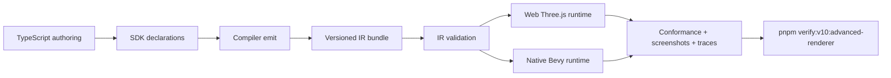
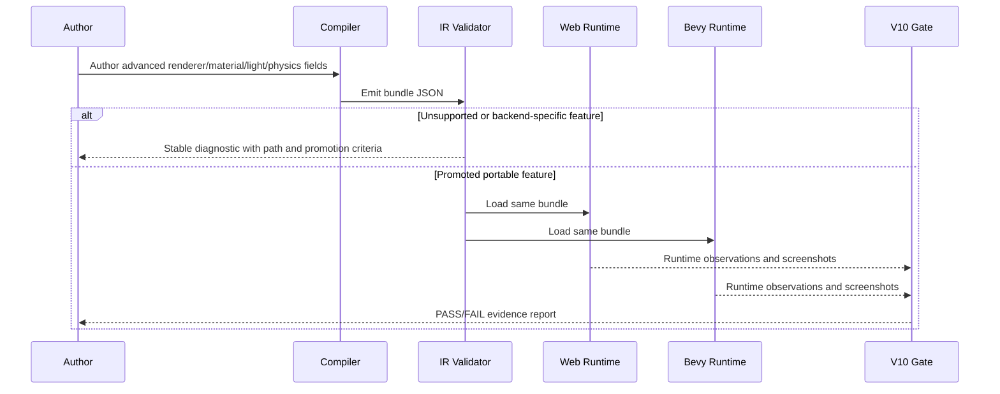

# V10-02 Advanced Renderer, Materials, Lighting, and Physics Parity

Complexity: 12 -> HIGH mode

Score basis: +3 touches 10+ implementation/test/docs files, +2 adds several
new portable rendering/material/physics contract surfaces, +2 spans
SDK/IR/compiler/web/Bevy/CLI, +2 includes complex runtime feature negotiation
and visual evidence, +2 covers shader/renderer diagnostics and promotion
criteria, +1 affects release-gate documentation.

## Context

**Problem:** V9 closes many practical renderer, material, lighting, and
primitive-physics gaps, but the remaining high-end parity items still need a
single V10 plan that distinguishes promotable portable behavior from stable
diagnostic-only deferrals.

**Files Analyzed:**

- `AGENTS.md`
- `docs/bevy-feature-parity.md`
- `docs/PRDs/v9/V9-02-physics-character-runtime-parity.md`
- `docs/PRDs/v9/V9-04-rendering-lights-post-processing-parity.md`
- `docs/PRDs/v9/V9-07-engine-quality-control-hardening.md`
- `/home/joao/.claude/skills/prd-creator/SKILL.md`

**Current Behavior:**

- Directional, point, spot, and ambient lights are promoted, with shadow bias,
  point-light filtering metadata, dynamic light budget observations, light
  probes, environment maps, and debug-gizmo observations.
- Materials support base PBR factors, promoted texture slots, alpha/blend/depth
  policy, emissive color/intensity observations, clearcoat/transmission/specular
  factors and textures, texture transforms, and constrained extended presets.
- Rendering supports fog/sky metadata, skyboxes, runtime bloom and MSAA, color
  grading observations, visibility/HLOD observations, and V9 visual evidence.
- Physics supports primitive colliders, primitive solver v2, broad sensors,
  character pushing, and static navigation path queries.
- Remaining unchecked gaps include spherical/area lights, lightmaps and mixed
  baked lighting, HDR bloom contribution from emissive materials,
  shader-promotion criteria and custom-shader diagnostics, advanced PBR
  diagnostics, atmospheric/volumetric lighting, post-processing modes,
  screen-space effects, decals, deferred rendering, native instancing/batching,
  virtual geometry, custom post passes, dynamic mesh colliders, joints,
  constraints, and CCD.

## Checklist Coverage

### Promoted or Attempted in V10-02

- `P1` HDR bloom contribution from emissive materials.
- `P1` Renderer-level native instancing and batching parity.
- `P2` FXAA, TAA, and SMAA anti-aliasing modes, with promotion only for modes
  that can prove web/native parity.
- `P2` Depth of field, with promotion only if bounded visual parity is stable.
- `P2` Decals, scoped to static mesh-surface decal projection.
- `P2` Explicit portable shader promotion criteria and unsupported-feature
  diagnostics.
- `P2` Dynamic mesh colliders, scoped first to static triangle-mesh terrain and
  diagnostic-only dynamic mesh bodies unless deterministic parity lands.

### Diagnostic-Only Unless Promotion Criteria Are Met

- `P3` Spherical/area-light behavior.
- `P3` Lightmaps and mixed baked/dynamic lighting.
- `P3` Parallax mapping and depth maps.
- `P3` Anisotropy, specular tint, and advanced PBR fields.
- `P3` Custom shaders, shader defs, storage buffers, render phases, and bindless
  materials/textures.
- `P3` Atmospheric scattering, atmospheric fog, volumetric fog, and volumetric
  lighting.
- `P3` Auto exposure.
- `P3` Motion blur and motion vectors.
- `P3` Screen-space reflections and mirrors.
- `P3` Deferred rendering.
- `P3` Virtual geometry and meshlet rendering.
- `P3` Custom post-processing passes.
- Physics joints, constraints, continuous collision detection, soft bodies,
  ragdolls, vehicles, and public backend physics handles.

## Integration Points

**How will this feature be reached?**

- [x] Entry point identified: SDK material/light/runtime-config/physics
  declarations, compiler extraction, IR validation, web and Bevy runtime
  adapters, conformance reports, V10 examples, and `pnpm verify:v10:advanced-renderer`.
- [x] Caller file identified: SDK scene/material/runtime/physics helpers,
  compiler world/environment/runtime emitters, IR validators and schemas,
  web rendering/material/physics adapters, Bevy rendering/material/physics
  adapters, CLI verification utilities, package scripts, and docs guards.
- [x] Registration/wiring needed: schema/type updates, manifest capabilities,
  conformance report fields, stable diagnostics, V10 fixtures, visual evidence
  capture, package script registration, docs status/parity updates during
  implementation, and aggregate V10 gate integration.

**Is this user-facing?**

- [x] YES -> user-facing through TypeScript authoring APIs, validation
  diagnostics, runtime visual output, conformance JSON, verification reports,
  screenshots, and example scenes.
- [ ] NO -> Internal/background feature.

**Full user flow:**

1. User authors advanced renderer, material, light, or physics declarations in
   TypeScript.
2. The compiler emits structured bundle JSON and required capabilities.
3. IR validation accepts promoted portable fields and rejects unsupported or
   backend-specific requests with stable diagnostics.
4. Web Three.js and native Bevy consume the same bundle and map promoted fields
   into runtime behavior or report explicit unsupported observations.
5. The user runs `pnpm verify:v10:advanced-renderer` and receives screenshots,
   conformance reports, diagnostics, and checklist coverage for promoted and
   deferred features.

## Solution

**Approach:**

- Promote only features with a narrow portable contract, bounded inputs,
  matching web/native runtime observations, and executable evidence.
- Treat high-end renderer features as capability-gated slices: authoring,
  validation, runtime mapping, conformance, visual proof, and docs must land
  together before parity checklist items are checked.
- Keep custom shader, deferred-renderer, virtual-geometry, volumetric, SSR, and
  advanced-physics backend escape hatches diagnostic-only until they have
  portable IR, deterministic semantics, and web/native evidence.
- Extend the existing V8/V9 visual-verification style rather than introducing a
  separate artifact shape.
- Use diagnostics as a product surface: unsupported features must fail before
  runtime with code, severity, path, suggestion, and promotion criteria.



**Key Decisions:**

- [x] Library/framework choices: reuse Three.js, Bevy 0.14.2, current runtime
  adapters, current conformance report utilities, and existing visual verifier
  helpers; do not add a public raw-renderer plugin or backend escape hatch.
- [x] Error-handling strategy: unsupported advanced features fail IR validation
  with stable `TN_IR_RENDERER_*`, `TN_IR_LIGHT_*`, `TN_IR_MATERIAL_*`,
  `TN_IR_SHADER_*`, or `TN_IR_PHYSICS_*` diagnostics before runtime.
- [x] Reused utilities: runtime-config validation, material/light validators,
  asset manifest validation, conformance report normalization, V9 rendering
  visual sampling, physics fixture comparison, and docs guard patterns.

**Data Changes:** Extend existing IR schemas and conformance report types only.
No database migrations.

## Stable Diagnostic Expectations

Every deferred or rejected feature in this PRD must produce a diagnostic with:

- `code`: stable string listed below or a more specific documented descendant.
- `severity`: `error` for invalid bundle/runtime-breaking requests, `warning`
  only for explicitly report-only observations.
- `path`: JSON pointer or source path to the offending authored field.
- `message`: concise reason the feature is not portable.
- `suggestion`: promoted alternative or promotion criteria.
- `capability`: omitted for invalid input, or the requested capability when
  useful for tooling.

Required diagnostic families:

- `TN_IR_LIGHT_AREA_UNSUPPORTED` for rectangular, disk, spherical, tube, or
  other non-promoted area-light requests.
- `TN_IR_LIGHTMAP_UNSUPPORTED` and `TN_IR_LIGHTMAP_MIXED_UNSUPPORTED` for
  baked or mixed baked/dynamic lighting before a portable lightmap contract
  exists.
- `TN_IR_MATERIAL_EMISSIVE_BLOOM_REQUIRED` when emissive bloom is requested
  without renderer bloom/HDR prerequisites.
- `TN_IR_MATERIAL_PARALLAX_UNSUPPORTED`,
  `TN_IR_MATERIAL_ANISOTROPY_UNSUPPORTED`, and
  `TN_IR_MATERIAL_ADVANCED_PBR_UNSUPPORTED` for advanced PBR fields outside
  promoted factors.
- `TN_IR_SHADER_CUSTOM_UNSUPPORTED`, `TN_IR_SHADER_DEFS_UNSUPPORTED`,
  `TN_IR_SHADER_STORAGE_BUFFER_UNSUPPORTED`,
  `TN_IR_SHADER_RENDER_PHASE_UNSUPPORTED`, and
  `TN_IR_SHADER_BINDLESS_UNSUPPORTED` for raw shader features.
- `TN_IR_RENDERER_ATMOSPHERIC_SCATTERING_UNSUPPORTED`,
  `TN_IR_RENDERER_VOLUMETRIC_FOG_UNSUPPORTED`,
  `TN_IR_RENDERER_AUTO_EXPOSURE_UNSUPPORTED`,
  `TN_IR_RENDERER_MOTION_BLUR_UNSUPPORTED`,
  `TN_IR_RENDERER_SSR_UNSUPPORTED`,
  `TN_IR_RENDERER_MIRROR_UNSUPPORTED`,
  `TN_IR_RENDERER_DEFERRED_UNSUPPORTED`,
  `TN_IR_RENDERER_VIRTUAL_GEOMETRY_UNSUPPORTED`, and
  `TN_IR_RENDERER_CUSTOM_POST_UNSUPPORTED`.
- `TN_IR_PHYSICS_DYNAMIC_MESH_COLLIDER_UNSUPPORTED`,
  `TN_IR_PHYSICS_JOINT_UNSUPPORTED`,
  `TN_IR_PHYSICS_CONSTRAINT_UNSUPPORTED`, and
  `TN_IR_PHYSICS_CCD_UNSUPPORTED` for physics features outside the promoted
  solver contract.

## Promotion Criteria

### Renderer and Post-Processing

- Accepted and rejected SDK/IR fixtures exist.
- Runtime mapping exists in web and Bevy or the feature remains unchecked.
- Visual evidence includes nonblank web/native screenshots, region samples,
  diff/contact-sheet output, and a conformance report.
- Numeric thresholds and sample regions are documented in the verifier.
- Backend-specific parameters are not exposed in public IR.

### Materials and Shaders

- Material fields are bounded, portable, and documented in schema/types.
- Texture dependencies are bundle-local or explicitly declared assets.
- Shader promotion requires a constrained portable shader model, deterministic
  binding layout, validated attributes/uniforms, web/native codegen or mapping,
  rejected fixtures for unsupported shader features, and visual evidence.
- Until that shader model exists, custom shaders remain diagnostic-only.

### Lighting

- Light behavior must have a portable shape, intensity model, bounds, budget
  behavior, and conformance observations.
- Spherical/area lights require matching approximation rules or matching native
  support in both runtimes before checklist promotion.
- Lightmaps require a portable UV/channel policy, asset format, color-space
  policy, static/dynamic mixing semantics, and runtime evidence.

### Physics

- Dynamic mesh colliders require deterministic mesh asset ingestion, bounded
  triangle counts, matching broad/narrow-phase traces, stable contact ordering,
  and performance limits.
- Joints, constraints, and CCD require accepted/rejected fixtures, deterministic
  solver behavior, tolerance thresholds, and web/native traces before promotion.

## Sequence Flow



## Execution Phases

#### Phase 1: Advanced Feature Diagnostics Baseline - Authors get stable errors for high-end features that are not yet portable.

**Files (max 5):**

- `packages/ir/src/validate.ts` - add diagnostic-only validation for advanced
  renderer, material, shader, light, and physics requests.
- `packages/ir/src/runtimeConfig.ts` - add rejected advanced renderer request
  shapes when needed for path-specific diagnostics.
- `packages/ir/src/types.ts` - add diagnostic request types only where existing
  bundle parsing needs structured fields.
- `packages/ir/src/diagnostics.ts` - register stable diagnostic code metadata.
- `packages/ir/src/__tests__/advanced-feature-diagnostics.test.ts` - cover
  all rejected feature families.

**Implementation:**

- [ ] Add or centralize stable diagnostic families listed in this PRD.
- [ ] Reject spherical/area lights, lightmaps, mixed baked lighting, custom
  shaders, shader defs, storage buffers, render phases, bindless textures,
  atmospheric scattering, volumetrics, auto exposure, motion blur/vectors,
  SSR/mirrors, deferred rendering, virtual geometry, custom post passes, dynamic
  mesh bodies, joints, constraints, and CCD when authored.
- [ ] Include path-specific suggestions that name promoted alternatives such as
  point/spot/directional lights, environment probes, bloom-enabled emissive
  materials, primitive colliders, and static navigation/path queries.
- [ ] Ensure diagnostics are emitted before web or Bevy runtime loading.

**Tests Required:**

| Test File | Test Name | Assertion |
| --- | --- | --- |
| `packages/ir/src/__tests__/advanced-feature-diagnostics.test.ts` | `should reject unsupported advanced renderer features with stable diagnostics` | Each deferred renderer feature has code, severity, path, and suggestion. |
| `packages/ir/src/__tests__/advanced-feature-diagnostics.test.ts` | `should reject unsupported custom shader features with promotion criteria` | Shader/storage/render-phase diagnostics are stable. |
| `packages/ir/src/__tests__/advanced-feature-diagnostics.test.ts` | `should reject unsupported advanced physics features before runtime` | Dynamic mesh body, joints, constraints, and CCD diagnostics are stable. |

**Verification Plan:**

1. **Unit Tests:** `pnpm --filter @threenative/ir test`.
2. **Integration Test:** invalid V10 fixture validation fails with the expected
   diagnostic manifest.
3. **Evidence Required:** rejected-fixture report under
   `artifacts/v10/advanced-renderer/diagnostics/`.

**User Verification:**

- Action: request each deferred feature in a V10 invalid fixture.
- Expected: validation fails before runtime with stable actionable diagnostics.

**Checkpoint:** Spawn `prd-work-reviewer` after this phase with:

```text
Review checkpoint for phase 1 of PRD at docs/PRDs/v10/V10-02-advanced-renderer-materials-and-physics.md
```

#### Phase 2: Emissive HDR Bloom and Advanced Material Boundaries - Emissive materials visibly contribute to bloom while advanced PBR fields fail clearly.

**Files (max 5):**

- `packages/sdk/src/materials.ts` - expose or refine emissive bloom authoring
  prerequisites and advanced PBR rejected fields.
- `packages/ir/src/materials.ts` - validate HDR emissive bloom bounds and
  unsupported PBR fields.
- `packages/runtime-web-three/src/materials.ts` - map promoted emissive/HDR
  bloom contribution and report observations.
- `runtime-bevy/crates/threenative_runtime/src/materials.rs` - map native
  emissive bloom prerequisites and report observations.
- `scripts/verify-v10-advanced-renderer.mjs` - add emissive bloom visual sample
  capture.

**Implementation:**

- [ ] Promote emissive bloom only when renderer bloom is enabled, HDR
  contribution is bounded, and both runtimes report applied bloom inputs.
- [ ] Add visual sample regions for emissive source, bloom halo, non-emissive
  reference material, and background.
- [ ] Reject parallax/depth maps, anisotropy, specular tint, and advanced PBR
  fields with stable diagnostics unless a field meets promotion criteria.
- [ ] Preserve existing emissive color/intensity material observations.

**Tests Required:**

| Test File | Test Name | Assertion |
| --- | --- | --- |
| `packages/ir/src/materials.test.ts` | `should accept emissive bloom contribution when renderer bloom prerequisites are present` | Bundle validates and advertises the promoted material capability. |
| `packages/ir/src/materials.test.ts` | `should reject emissive bloom when HDR bloom prerequisites are missing` | Diagnostic is `TN_IR_MATERIAL_EMISSIVE_BLOOM_REQUIRED`. |
| `packages/ir/src/materials.test.ts` | `should reject advanced PBR fields with stable diagnostics` | Parallax, anisotropy, and specular tint paths are reported. |
| `packages/runtime-web-three/src/materials.test.ts` | `should report emissive bloom material observations` | Web observation includes emissive intensity and bloom contribution. |
| `runtime-bevy/crates/threenative_runtime/tests/materials.rs` | `should report native emissive bloom material observations` | Native observation matches normalized expected JSON. |

**Verification Plan:**

1. **Unit Tests:** IR, web material, and Bevy material tests.
2. **Integration Test:** `pnpm verify:conformance` includes V10 emissive bloom
   observations.
3. **Visual Proof:** `pnpm verify:v10:advanced-renderer` writes emissive bloom
   screenshots and region metrics.
4. **Manual Verification:** inspect emissive bloom contact sheet.
5. **Evidence Required:** web/native material observations, screenshots, and
   rejected advanced PBR diagnostic fixture.

**User Verification:**

- Action: run the V10 emissive bloom example with bloom enabled and disabled.
- Expected: enabled output shows bounded bloom contribution; disabled output
  either omits contribution or fails validation according to authored policy.

**Checkpoint:** Spawn `prd-work-reviewer` after this phase with:

```text
Review checkpoint for phase 2 of PRD at docs/PRDs/v10/V10-02-advanced-renderer-materials-and-physics.md
```

Manual checkpoint is required because this phase depends on visual output.

#### Phase 3: Post-Processing Modes, Decals, and Deferred Renderer Boundaries - Promoted screen effects render consistently and deferred renderer features remain explicit.

**Files (max 5):**

- `packages/sdk/src/time.ts` - extend renderer config authoring for promoted
  post-processing and decal requests.
- `packages/ir/src/runtimeConfig.ts` - validate FXAA/TAA/SMAA, depth of field,
  decal, and deferred-renderer policy.
- `packages/runtime-web-three/src/render.ts` - map promoted post-processing
  pipeline decisions and report observations.
- `runtime-bevy/crates/threenative_runtime/src/rendering.rs` - map promoted
  post-processing/decal observations or emit stable diagnostics.
- `packages/ir/src/conformanceReport.ts` - normalize post-processing and decal
  report fields.

**Implementation:**

- [ ] Promote FXAA, TAA, or SMAA only when both web and Bevy can produce
  comparable observations and visual evidence; keep unsupported modes
  diagnostic-only.
- [ ] Promote depth of field only with bounded focus distance, aperture, blur
  radius, stable sample regions, and matching observations.
- [ ] Promote static decals only for bounded mesh-surface projection, finite
  size/depth, declared material, and deterministic render ordering.
- [ ] Keep auto exposure, motion blur/vectors, SSR/mirrors, deferred rendering,
  and custom post-processing passes unsupported unless they satisfy promotion
  criteria in this phase.

**Tests Required:**

| Test File | Test Name | Assertion |
| --- | --- | --- |
| `packages/ir/src/runtimeConfig.test.ts` | `should accept promoted anti-aliasing modes when runtime support is declared` | Runtime config validates and capabilities match promoted modes. |
| `packages/ir/src/runtimeConfig.test.ts` | `should reject unsupported post-processing requests with stable diagnostics` | Auto exposure, motion blur, SSR, deferred, and custom post codes are stable. |
| `packages/ir/src/runtimeConfig.test.ts` | `should validate bounded static decals when authored` | Decal bounds, material, and ordering validate. |
| `packages/runtime-web-three/src/render.test.ts` | `should report promoted post-processing and decal observations` | Web report includes applied/skipped reasons. |
| `runtime-bevy/crates/threenative_runtime/tests/rendering.rs` | `should report native post-processing and decal observations` | Native report matches normalized expected JSON or stable unsupported diagnostics. |

**Verification Plan:**

1. **Unit Tests:** IR runtime config, web render, and Bevy rendering tests.
2. **Integration Test:** `pnpm verify:conformance` includes V10 post-processing
   and decal observations.
3. **Visual Proof:** `pnpm verify:v10:advanced-renderer` captures AA, DOF, and
   decal samples for promoted modes.
4. **Diagnostics Proof:** invalid fixture covers auto exposure, motion blur,
   SSR/mirrors, deferred rendering, and custom post passes.
5. **Manual Verification:** inspect visual contact sheets for AA edge quality,
   DOF blur bounds, and decal projection.

**User Verification:**

- Action: author each promoted and deferred post-processing feature in a V10
  fixture.
- Expected: promoted features render and report observations; deferred features
  fail validation with stable diagnostics and promotion criteria.

**Checkpoint:** Spawn `prd-work-reviewer` after this phase with:

```text
Review checkpoint for phase 3 of PRD at docs/PRDs/v10/V10-02-advanced-renderer-materials-and-physics.md
```

Manual checkpoint is required for promoted visual effects.

#### Phase 4: Native Instancing, Batching, and Virtual Geometry Boundary - Dense repeated content has real renderer-level evidence without claiming meshlet rendering.

**Files (max 5):**

- `packages/ir/src/environment.ts` - validate instancing/batching eligibility
  and reject virtual geometry requests.
- `packages/runtime-web-three/src/environment.ts` - map eligible repeated
  content into instanced/batched rendering observations.
- `runtime-bevy/crates/threenative_runtime/src/environment.rs` - map native
  instancing/batching observations.
- `packages/ir/src/conformanceReport.ts` - normalize draw, batch, instance,
  material, and eligibility observations.
- `scripts/verify-v10-advanced-renderer.mjs` - add dense-rendering budget and
  evidence checks.

**Implementation:**

- [ ] Promote renderer-level native instancing/batching for repeated static
  mesh/model instances with identical mesh, material, visibility policy, and
  compatible transforms.
- [ ] Emit normalized observations for source instance count, rendered instance
  count, draw calls, batches, rejected eligibility reasons, and runtime limits.
- [ ] Reject virtual geometry, meshlets, shader-driven geometry expansion, and
  storage-buffer driven procedural geometry with stable diagnostics.
- [ ] Keep V9 visibility/HLOD observations intact and avoid claiming visual LOD
  mesh swapping unless separately proven.

**Tests Required:**

| Test File | Test Name | Assertion |
| --- | --- | --- |
| `packages/ir/src/environment.test.ts` | `should accept renderer instancing eligibility metadata for repeated static content` | Diagnostics are empty and capabilities include instancing. |
| `packages/ir/src/environment.test.ts` | `should reject virtual geometry requests with stable diagnostics` | Diagnostic is `TN_IR_RENDERER_VIRTUAL_GEOMETRY_UNSUPPORTED`. |
| `packages/runtime-web-three/src/environment.test.ts` | `should report web draw and instance counts for eligible repeated content` | Observation includes stable counts and eligibility reasons. |
| `runtime-bevy/crates/threenative_runtime/tests/environment.rs` | `should report native draw and instance counts for eligible repeated content` | Native observation matches normalized expected JSON. |

**Verification Plan:**

1. **Unit Tests:** IR environment, web environment, and Bevy environment tests.
2. **Integration Test:** `pnpm verify:conformance` compares dense-rendering
   observations.
3. **Performance/Budget Proof:** `pnpm verify:v10:advanced-renderer` writes
   `artifacts/v10/advanced-renderer/instancing-budget.json`.
4. **Evidence Required:** stable web/native instance and draw-count deltas, plus
   rejected virtual-geometry fixture.

**User Verification:**

- Action: run a repeated static content fixture and then add an ineligible
  material/mesh variant.
- Expected: eligible instances report batching/instancing; ineligible instances
  report deterministic reasons without breaking rendering.

**Checkpoint:** Spawn `prd-work-reviewer` after this phase with:

```text
Review checkpoint for phase 4 of PRD at docs/PRDs/v10/V10-02-advanced-renderer-materials-and-physics.md
```

Manual checkpoint is required if screenshots are used to support the dense
content report.

#### Phase 5: Area Lighting, Lightmaps, Atmosphere, and Volumetrics Criteria - High-end lighting features have explicit boundaries and cannot silently degrade.

**Files (max 5):**

- `packages/sdk/src/scene/Light.ts` - expose diagnostic-only request shapes or
  rejected helpers for area/spherical lights when needed.
- `packages/ir/src/lighting.ts` - validate area-light, lightmap, and mixed
  lighting requests.
- `packages/ir/src/runtimeConfig.ts` - validate atmospheric and volumetric
  renderer requests.
- `packages/runtime-web-three/src/rendering.ts` - report unsupported advanced
  lighting/atmosphere observations when fixtures reach runtime in report-only
  mode.
- `runtime-bevy/crates/threenative_runtime/src/rendering.rs` - report matching
  unsupported advanced lighting/atmosphere observations.

**Implementation:**

- [ ] Reject spherical and area lights with promotion criteria that require
  shape, size, intensity, falloff, shadow behavior, and runtime parity.
- [ ] Reject lightmaps and mixed baked/dynamic lighting until UV/channel,
  asset, color-space, intensity, probe-mixing, and static/dynamic update policy
  are portable.
- [ ] Reject atmospheric scattering, atmospheric fog, volumetric fog, and
  volumetric lighting until both runtimes can prove matching visual and
  performance-bounded behavior.
- [ ] Ensure no advanced lighting request is silently approximated by ambient,
  point, spot, directional, skybox, environment map, or probe behavior.

**Tests Required:**

| Test File | Test Name | Assertion |
| --- | --- | --- |
| `packages/ir/src/lighting.test.ts` | `should reject area and spherical light requests with stable diagnostics` | Codes and paths are stable. |
| `packages/ir/src/lighting.test.ts` | `should reject lightmaps and mixed baked lighting with promotion criteria` | Lightmap asset paths and mixed-policy fields are reported. |
| `packages/ir/src/runtimeConfig.test.ts` | `should reject atmospheric and volumetric renderer requests with stable diagnostics` | Atmospheric and volumetric codes are stable. |
| `runtime-bevy/crates/threenative_runtime/tests/rendering.rs` | `should not silently approximate unsupported lighting features` | Native report includes unsupported observation or validation rejects the bundle. |

**Verification Plan:**

1. **Unit Tests:** IR lighting and runtime config tests.
2. **Integration Test:** invalid fixtures prove all advanced lighting features
   fail before runtime.
3. **Conformance Proof:** report-only fixtures, if used, preserve unsupported
   observations without marking capabilities promoted.
4. **Evidence Required:** diagnostic manifest with promotion criteria for each
   lighting/atmosphere feature family.

**User Verification:**

- Action: request each high-end lighting feature in invalid fixtures.
- Expected: validation names the unsupported feature and suggests promoted
  alternatives without runtime fallback.

**Checkpoint:** Spawn `prd-work-reviewer` after this phase with:

```text
Review checkpoint for phase 5 of PRD at docs/PRDs/v10/V10-02-advanced-renderer-materials-and-physics.md
```

#### Phase 6: Dynamic Mesh Colliders and Advanced Physics Deferrals - Mesh terrain can be considered for promotion while dynamic mesh bodies, joints, constraints, and CCD stay bounded by diagnostics.

**Files (max 5):**

- `packages/sdk/src/physics.ts` - expose static mesh-collider authoring only if
  promoted and rejected request shapes for advanced physics features.
- `packages/ir/src/physics.ts` - validate static mesh-collider bounds and
  unsupported dynamic mesh/joint/constraint/CCD requests.
- `packages/runtime-web-three/src/physics/primitive-solver.ts` - report or map
  promoted static mesh collider traces if implemented.
- `runtime-bevy/crates/threenative_runtime/src/physics.rs` - report or map
  promoted static mesh collider traces if implemented.
- `scripts/verify-v10-advanced-physics.mjs` - compare mesh-collider traces and
  rejected advanced physics diagnostics.

**Implementation:**

- [ ] Promote static mesh colliders only if deterministic bundle-local mesh
  ingestion, triangle-count limits, contact ordering, and web/native traces are
  proven.
- [ ] Keep dynamic mesh colliders unsupported unless matching dynamic
  narrow-phase behavior and performance limits are proven in this phase.
- [ ] Reject joints, constraints, CCD, soft bodies, ragdolls, vehicles, and
  public backend handles with stable diagnostics.
- [ ] Preserve primitive solver v2 and character-controller behavior.

**Tests Required:**

| Test File | Test Name | Assertion |
| --- | --- | --- |
| `packages/ir/src/physics.test.ts` | `should accept bounded static mesh collider terrain when promotion criteria are met` | Static mesh fixture validates and advertises the promoted capability. |
| `packages/ir/src/physics.test.ts` | `should reject dynamic mesh colliders with stable diagnostics` | Diagnostic is `TN_IR_PHYSICS_DYNAMIC_MESH_COLLIDER_UNSUPPORTED`. |
| `packages/ir/src/physics.test.ts` | `should reject joints constraints and CCD with stable diagnostics` | Codes and paths are stable. |
| `packages/runtime-web-three/src/physics/primitive-solver.test.ts` | `should report static mesh collider terrain contacts when promoted` | Web trace matches expected contacts. |
| `runtime-bevy/crates/threenative_runtime/tests/physics_v10.rs` | `should report native static mesh collider terrain contacts when promoted` | Native trace matches tolerance and ordering expectations. |

**Verification Plan:**

1. **Unit Tests:** IR physics, web physics, and Bevy physics tests.
2. **Integration Test:** `pnpm verify:v10:advanced-physics` validates accepted
   static mesh terrain if promoted and rejected dynamic mesh/joint/CCD fixtures.
3. **Conformance Proof:** web/native static mesh contact traces match within
   documented tolerances when promoted.
4. **Evidence Required:** accepted static mesh collider report or explicit
   deferral report, plus diagnostic manifest for advanced physics features.

**User Verification:**

- Action: run the V10 advanced physics fixture set.
- Expected: promoted static mesh terrain produces matching traces, while
  dynamic mesh bodies, joints, constraints, and CCD fail with stable diagnostics.

**Checkpoint:** Spawn `prd-work-reviewer` after this phase with:

```text
Review checkpoint for phase 6 of PRD at docs/PRDs/v10/V10-02-advanced-renderer-materials-and-physics.md
```

#### Phase 7: V10 Advanced Renderer Gate, Docs, and Acceptance Evidence - One command proves promoted features and preserves deferred boundaries.

**Files (max 5):**

- `package.json` - register `verify:v10:advanced-renderer` and optional
  `verify:v10:advanced-physics` scripts.
- `scripts/verify-v10-advanced-renderer.mjs` - aggregate renderer/material/
  light/post-processing/instancing evidence.
- `scripts/verify-v10-advanced-renderer.test.mjs` - test missing artifact and
  failing diagnostic aggregation.
- `docs/STATUS.md` - update only after implementation proves promoted features.
- `docs/bevy-feature-parity.md` - update only checklist items backed by V10
  evidence.

**Implementation:**

- [ ] Build V10 examples and fixtures.
- [ ] Run accepted and rejected IR validation fixtures.
- [ ] Run conformance for promoted renderer/material/light/physics fields.
- [ ] Capture screenshots for promoted visual effects and write contact sheets.
- [ ] Aggregate diagnostics for all deferred feature families.
- [ ] Write `artifacts/v10/advanced-renderer/verification-report.json` with
  promoted, attempted, deferred, diagnostics, commands, screenshots, and traces.
- [ ] Update status and parity docs only for proven implementation work; this
  planning PRD alone must not mark checklist items complete.

**Tests Required:**

| Test File | Test Name | Assertion |
| --- | --- | --- |
| `scripts/verify-v10-advanced-renderer.test.mjs` | `should fail when promoted visual evidence is missing` | Gate reports the missing artifact and feature. |
| `scripts/verify-v10-advanced-renderer.test.mjs` | `should include deferred diagnostics in the aggregate report` | Deferred feature families and diagnostic codes are listed. |
| `scripts/verify-v10-advanced-renderer.test.mjs` | `should not mark diagnostic-only features as promoted` | Report separates `promoted`, `attempted`, and `deferred`. |

**Verification Plan:**

1. **Unit Tests:** verifier tests and affected package tests.
2. **Integration Test:** `pnpm verify:v10:advanced-renderer`.
3. **Release Gate:** `pnpm verify`, `pnpm verify:conformance`, and
   `cargo test --manifest-path runtime-bevy/Cargo.toml` when shared contracts
   or Bevy runtime code change.
4. **Manual Verification:** inspect final contact sheets for promoted visual
   renderer/material/post-processing features.
5. **Evidence Required:** aggregate report, diagnostic manifest, visual
   artifacts, conformance reports, and updated docs after implementation.

**User Verification:**

- Action: run `pnpm verify:v10:advanced-renderer`.
- Expected: one report proves promoted V10 advanced-renderer items and lists all
  diagnostic-only deferrals.

**Checkpoint:** Spawn `prd-work-reviewer` after this phase with:

```text
Review checkpoint for phase 7 of PRD at docs/PRDs/v10/V10-02-advanced-renderer-materials-and-physics.md
```

Manual checkpoint is required because this phase aggregates visual release
evidence.

## Verification Strategy

The V10 implementation is complete only when every promoted item has executable
proof and every deferred feature has a stable diagnostic. Do not mark a
checklist item complete from authoring metadata alone.

**Core Commands:**

- `pnpm --filter @threenative/sdk test`
- `pnpm --filter @threenative/ir test`
- `pnpm --filter @threenative/compiler test`
- `pnpm --filter @threenative/runtime-web-three test`
- `cargo test --manifest-path runtime-bevy/Cargo.toml`
- `pnpm verify:conformance`
- `pnpm verify:v10:advanced-renderer`
- `pnpm verify`

**Visual Evidence:**

- Web/native screenshots must be nonblank and similarly framed.
- Region samples must cover the visual effect being claimed.
- Contact sheets and diff images must be written under
  `artifacts/v10/advanced-renderer/`.
- Manual inspection is required for promoted bloom, DOF, decals, AA, or other
  visual post-processing.

**Diagnostics Evidence:**

- Invalid fixtures must cover every diagnostic family in this PRD.
- Diagnostics must be stable enough for tests to assert exact code and path.
- Deferred features must remain unchecked in `docs/bevy-feature-parity.md`
  until runtime evidence proves otherwise.

## Acceptance Criteria

- [ ] All phases complete with checkpoint PASS.
- [ ] Promoted features have SDK/IR/compiler/runtime/conformance coverage.
- [ ] Promoted visual features have web/native screenshots, region metrics,
  contact sheets, and manual inspection.
- [ ] Unsupported advanced features produce stable diagnostics with code,
  severity, path, message, suggestion, and promotion criteria.
- [ ] `pnpm verify:v10:advanced-renderer` passes and writes the aggregate
  report.
- [ ] `pnpm verify:conformance` passes for promoted shared contracts.
- [ ] `pnpm verify` passes after implementation.
- [ ] `docs/STATUS.md` and `docs/bevy-feature-parity.md` are updated only for
  items actually proven by implementation evidence.
- [ ] No public API exposes raw Three.js, Bevy, shader, render-phase, or physics
  backend handles as a shortcut around portable IR.

