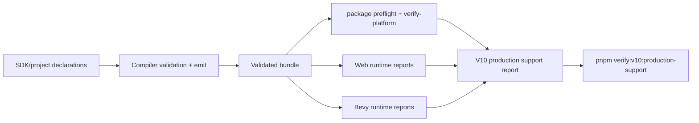
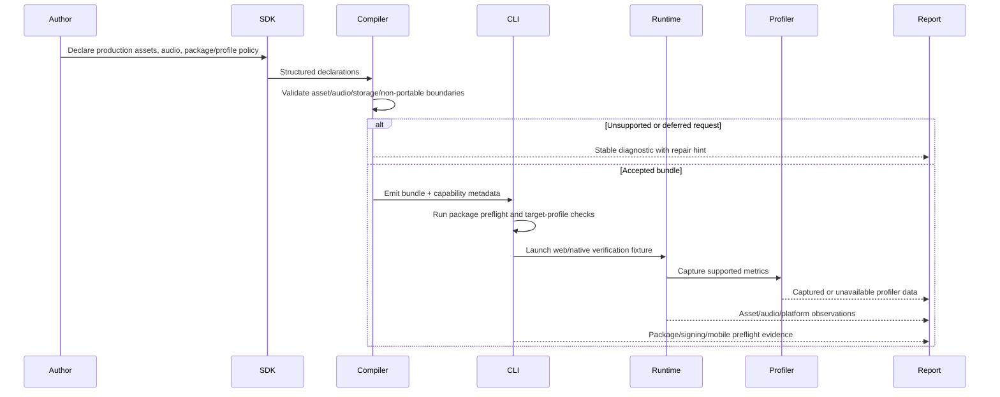

# V10-04 Production Platform, Audio, Assets, and Release Support

Complexity: 13 -> HIGH mode

## Complexity Assessment

- +3 touches 10+ implementation/test/docs files during implementation
- +2 coordinates production support policy across assets, audio, release,
  platform diagnostics, profiling, and non-portable boundaries
- +2 requires complex target-profile, streaming, packaging, and profiler
  policy decisions
- +2 spans SDK, IR, compiler, CLI, web runtime, Bevy runtime, examples,
  scripts, and docs
- +2 adds release-facing diagnostics and platform packaging evidence
- +2 adds broad conformance, budget, profiler, and unsupported-surface gates

This is a production support planning PRD. It intentionally keeps unsupported
platform escape hatches diagnostic-first unless a phase defines a narrow,
portable, evidence-backed contract.

## Context

**Problem:** V9 closes most practical parity tracks, but production release
readiness still has gaps around custom asset/audio extension boundaries,
streaming policy diagnostics, account/cloud storage deferral, signed/mobile
packaging, broader platform repair hints, native profiler integrations,
production budget tuning, and stable non-portable diagnostics for online,
plugin, and raw renderer requests.

**Files Analyzed:**

- `docs/bevy-feature-parity.md`
- `docs/STATUS.md`
- `docs/PRDs/v9/README.md`
- `docs/PRDs/v9/V9-03-assets-gltf-scene-workflow.md`
- `docs/PRDs/v9/V9-06-audio-persistence-tooling-support.md`
- `docs/PRDs/v9/V9-07-engine-quality-control-hardening.md`
- `docs/PRDs/v8/V8-18-editor-debugging-diagnostics-packaging-performance-support.md`
- `docs/PRDs/v7/V7-08-packaging-target-profiles-and-platform-diagnostics.md`
- `docs/PRDs/v7/V7-09-performance-budgets-and-profiling-evidence.md`

No `.env*` files are required for this planning PRD. Future implementation must
avoid hardcoding credentials, signing identities, app-store secrets, cloud
storage tokens, or profiler service endpoints into source.

**Current Behavior:**

- Assets support bundle-local, bounded embedded, and target-gated HTTPS network
  manifest entries, asset groups, glTF metadata, scene handles, inspection, and
  reload policy, but custom asset loaders/types and broad live asset streaming
  remain deferred.
- Audio supports local OGG/WAV, spatial attenuation, mixer routing/ducking,
  pitch/generated tones, and music transitions, but arbitrary decoders, custom
  audio sources, streaming, and network audio remain unsupported.
- Persistence covers local save/settings concepts, while cloud save,
  account-bound storage, hosted services, and collaboration remain outside the
  portable contract.
- Packaging and distribution prove npm packages, local desktop artifacts, and
  bundled native runtime builds, but signed installers, app-store/mobile
  packaging, and broader target diagnostics are not release-ready.
- Performance reports and profiler fields exist, but platform-native profiler
  integration, production budget tuning, and release-grade stress thresholds
  need a dedicated V10 evidence gate.

## Checklist Coverage

This PRD covers the remaining production support backlog as follows:

- `P3` Custom asset loaders and custom asset types: diagnostic-gated with a
  constrained metadata-only asset type declaration option; no public runtime
  loader/plugin execution is promoted.
- Live asset streaming policy diagnostics: promoted as policy validation and
  runtime/CLI diagnostics for allowed manifest network assets, rejected
  arbitrary streaming, cache hints, offline targets, and reload boundaries.
- `P3` Cloud save and account-bound storage integration: explicitly deferred
  behind stable account/cloud diagnostics and future promotion criteria.
- `P3` Custom audio source/decoder support: diagnostic-gated with accepted
  local codec policy and rejected decoder/plugin/native-handle paths.
- `P3` Streaming and network audio: diagnostic-gated with target-profile,
  latency, cache, and offline repair hints; no live stream playback parity is
  claimed.
- `P3` Signed installers and app-store/mobile packaging: promoted only as
  packaging profile schemas, preflight diagnostics, unsigned/signed artifact
  manifests, and dry-run evidence; actual store submission remains external.
- Broader platform diagnostics: promoted as target-profile repair hints for
  filesystem, audio, graphics, input, storage, network, signing, and profiler
  capabilities.
- Platform-native profiler integrations and production budget tuning: promoted
  through report schemas, profiler capture hooks where available, stress
  fixtures, and release budget thresholds.
- Networking, online services, public plugins, raw renderer, direct Bevy, raw
  Three.js, and broad runtime extension requests: stable unsupported diagnostics
  if not already covered by earlier PRDs.

## Impact

**Planned files touched by implementation:** SDK asset/audio/platform
declarations, IR schemas and diagnostics, compiler emit, CLI package/profile
commands, web runtime policy reporters, Bevy runtime diagnostics/profiler
reporters, conformance fixtures, release scripts, examples, docs, and status
updates.

**Features affected:** asset manifests, audio manifests, target profiles,
packaging, profiling, performance budgets, diagnostics taxonomy, release
artifacts, and non-portable boundary enforcement.

**Main risks:**

- A custom loader or decoder API could become a general plugin escape hatch.
  V10 must reject executable loaders/decoders unless a future PRD defines a
  sandboxed portable contract.
- Streaming policies differ sharply between web, desktop, offline packaged,
  mobile, and store targets. Diagnostics must be target-specific and actionable
  instead of pretending one policy fits every platform.
- Signing and app-store packaging can require private credentials and external
  tooling. The portable repo gate should validate manifests, preflight inputs,
  and dry-run artifacts without requiring secrets.
- Profiler integrations may be unavailable on CI or specific hosts. Reports
  must distinguish captured metrics, unsupported host capabilities, and missing
  optional tooling.
- Non-portable diagnostics must not accidentally make online services, raw
  renderer state, public plugins, or direct Bevy authoring part of the stable
  authoring contract.

## Integration Points

**How will this feature be reached?**

- [x] Entry point identified: SDK asset/audio/platform declarations,
  `tn build` validation, `tn package` target profiles, `tn package preflight`,
  `tn verify-platform`, runtime diagnostics reports, profiler/budget scripts,
  conformance fixtures, and `pnpm verify:v10:production-support`.
- [x] Caller file identified: SDK declarations, compiler emit path, IR
  validators, CLI command dispatcher, web runtime loader/reporters, Bevy runtime
  loader/reporters, package verification scripts, and docs/status gates.
- [x] Registration/wiring needed: new diagnostic codes, target-profile
  capability tables, asset/audio policy reports, package preflight reports,
  profiler report manifests, stress fixtures, release scripts, docs, and parity
  updates.

**Is this user-facing?**

- [x] YES. Game authors and release engineers reach this through SDK
  declarations, build diagnostics, package preflights, target-profile repair
  hints, profiler reports, and release verification artifacts.
- [ ] NO -> Internal/background feature.

**UI components required:**

- No new visual editor application is required by this PRD.
- Existing editor/debug panels may consume the platform, asset, audio, and
  profiler report JSON after implementation.
- CLI output is user-facing and must provide compact text plus `--json` reports
  for build, package, preflight, profiler, and unsupported-surface diagnostics.

**Full user flow:**

1. User declares production assets, audio, target profiles, package metadata,
   local saves/settings, and optional profiler/budget targets in TypeScript
   project config or SDK declarations.
2. `tn build` validates portable asset/audio/storage declarations and rejects
   custom executable loaders, arbitrary decoders, online services, raw renderer
   access, and undeclared streaming with stable diagnostics.
3. `tn package preflight --target <profile>` checks signing metadata,
   platform capabilities, mobile/app-store readiness fields, network/offline
   asset policy, audio codec policy, storage policy, profiler support, and
   production budgets.
4. Web and Bevy runtimes load the accepted bundle, emit matching diagnostics
   for unsupported target capabilities, and write profiler/performance reports
   where host support exists.
5. `pnpm verify:v10:production-support` runs focused fixtures and writes a
   release evidence report showing promoted behavior, deferred boundaries, and
   first actionable failures.

## Solution

**Approach:**

- Add a production support policy layer that validates asset streaming, custom
  asset types, audio codec/source declarations, cloud/account storage requests,
  platform profiles, signing metadata, profiler captures, and production
  budgets before runtime where possible.
- Promote metadata-only extension points for custom asset *types* when they are
  bundle-declared, schema-backed, non-executable, and consumed as data by
  portable systems. Keep custom runtime loaders and native/web decoder plugins
  rejected with stable diagnostics.
- Add target-profile-aware diagnostics for live asset streaming and
  streaming/network audio, including offline packaged targets, mobile/store
  targets, timeout/cache policy, required/optional group behavior, and repair
  hints.
- Extend packaging from local desktop proof to release preflight proof:
  signed/unsigned artifact manifests, signing identity validation hooks,
  mobile/app-store metadata checks, and explicit diagnostics for operations
  requiring external credentials or store tooling.
- Add native/web profiler report integration and production budget tuning over
  stress fixtures, while distinguishing captured, unavailable, warning, and
  release-blocking metrics.
- Normalize deferred online, networking, replication, collaboration, raw
  renderer, direct Bevy, raw Three.js, public plugin, arbitrary platform API,
  and backend-only feature requests under a stable non-portable diagnostic
  taxonomy.



**Key Decisions:**

- [x] Library/framework choices: reuse existing SDK/IR/compiler/CLI/runtime
  boundaries, Node verification scripts, conformance fixtures, package
  preflight reports, and Bevy/web observation reporters.
- [x] Error-handling strategy: every rejected production support request must
  include stable code, severity, target profile, path, suggestion, and metadata
  identifying whether it is unsupported, deferred, host-unavailable, or
  credential-required.
- [x] Reused utilities: existing diagnostic model, asset manifest validation,
  target-profile checks, package verification scripts, conformance comparison,
  profiler/performance report writers, and docs/status guard patterns.
- [x] Boundary decision: no executable public loader, decoder, renderer plugin,
  runtime plugin, direct Bevy, raw Three.js, online service, or account/cloud
  integration is promoted by this PRD.
- [x] Release decision: signing and mobile/app-store work is preflight and
  artifact-manifest oriented; real submission, notarization credentials, and
  store upload automation remain outside repository verification unless a
  future release PRD provides secure CI integration.

**Data Changes:**

- Asset policy metadata: custom asset type declarations, schema refs, declared
  consumers, streaming policy, cache policy, timeout policy, required/optional
  group behavior, offline fallback, and unsupported loader diagnostics.
- Audio policy metadata: accepted codecs, source kind, duration/size bounds,
  streaming/network policy, latency class, target support, and unsupported
  decoder/source diagnostics.
- Platform target profile metadata: filesystem, storage, network, graphics,
  audio, input, profiler, signing, installer, mobile, and store capability
  fields with repair hints.
- Package preflight report: signing identity status, unsigned/signed artifact
  manifest, mobile/store metadata checks, external credential requirements,
  target-specific diagnostics, and artifact paths.
- Profiler/budget report: captured host tools, unavailable tools, frame/load/
  draw/entity/UI/audio/asset/script/package metrics, production thresholds,
  warning thresholds, stress fixture IDs, and regression metadata.
- Non-portable diagnostics taxonomy for online, networking, replication,
  collaboration, raw renderer, direct Bevy, raw Three.js, public plugin,
  arbitrary platform API, executable loader, and decoder plugin requests.

## Sequence Flow



## Execution Phases

#### Phase 1: Asset Extension and Streaming Policy - Custom asset requests fail or validate before runtime with target-specific repair hints

**Files (max 5):**

- `packages/sdk/src/assets.ts` - add metadata-only custom asset type and
  streaming policy declarations
- `packages/ir/src/assets.ts` - validate custom asset type schemas, source
  policy, cache policy, and unsupported loader requests
- `packages/compiler/src/emit/assets.ts` - emit accepted asset policy metadata
  and stable diagnostics
- `packages/cli/src/commands/verifyPlatform.ts` - report asset streaming
  target-profile diagnostics
- `scripts/verify-v10-production-support.mjs` - add asset policy fixture step

**Implementation:**

- [ ] Allow `customAssetType` only as non-executable metadata: stable type ID,
  JSON schema ref or inline bounded schema, declared asset extensions, declared
  portable consumers, and bundle-relative source refs.
- [ ] Reject executable loaders, runtime import hooks, native/web plugin
  handles, arbitrary filesystem/network reads from scripts, and backend-only
  loader payloads with `TN_ASSET_CUSTOM_LOADER_UNSUPPORTED`.
- [ ] Validate live asset streaming policy for manifest-declared network
  assets: target profile, HTTPS requirement, timeout, cache mode, offline
  fallback, required/optional group behavior, and reload boundary.
- [ ] Emit diagnostics for streaming on offline/native/mobile profiles that do
  not allow it, including suggested bundle-local or embedded alternatives.
- [ ] Add conformance observations for accepted metadata-only custom types and
  rejected loader/streaming cases.

**Tests Required:**

| Test File | Test Name | Assertion |
| --- | --- | --- |
| `packages/ir/src/assets.test.ts` | `should accept metadata-only custom asset types when schema and consumers are portable` | Validator preserves type ID, schema ref, extension list, and consumer list. |
| `packages/ir/src/assets.test.ts` | `should reject executable custom asset loaders when loader hooks are declared` | Diagnostic code is `TN_ASSET_CUSTOM_LOADER_UNSUPPORTED`. |
| `packages/compiler/src/emit/assets.test.ts` | `should emit target-specific streaming diagnostics when offline profiles reject network assets` | Diagnostic includes target profile, asset path, and bundle-local suggestion. |
| `packages/cli/src/commands/verifyPlatform.test.ts` | `should report cache and timeout repair hints for live asset streaming policy` | JSON report includes streaming policy warning and repair hint. |

**Verification Plan:**

1. **Unit Tests:** `pnpm --filter @threenative/ir test -- --run assets`.
2. **Compiler Tests:** `pnpm --filter @threenative/compiler test -- --run assets`.
3. **CLI Tests:** `pnpm --filter @threenative/cli test -- --run verifyPlatform`.
4. **Integration Test:** `pnpm verify:v10:production-support -- --phase assets`.
5. **Evidence Required:**
   - [ ] Accepted custom asset type fixture report.
   - [ ] Rejected executable loader fixture report.
   - [ ] Target-gated streaming policy report.

**User Verification:**

- Action: run `tn build` and `tn verify-platform --json` on the V10 asset
  policy fixture.
- Expected: metadata-only custom asset types validate; executable loaders and
  disallowed streaming fail with stable diagnostics and repair hints.

#### Phase 2: Audio Source, Decoder, and Network Policy - Portable audio accepts known sources and rejects custom/streaming paths consistently

**Files (max 5):**

- `packages/sdk/src/audio.ts` - add explicit audio source policy declarations
- `packages/ir/src/audio.ts` - validate codecs, source kind, decoder, and
  streaming/network policy
- `packages/compiler/src/emit/audio.ts` - emit audio policy metadata and
  diagnostics
- `packages/runtime-web-three/src/audio.ts` - report web audio policy support
  and unsupported stream/decoder diagnostics
- `runtime-bevy/crates/threenative_runtime/src/audio.rs` - report native audio
  policy support and unsupported stream/decoder diagnostics

**Implementation:**

- [ ] Keep accepted portable audio sources limited to declared bundle-local,
  bounded embedded, and target-gated manifest network assets using supported
  codec policy.
- [ ] Reject arbitrary decoder plugins, platform-native audio handles, callback
  PCM sources, microphone/capture streams, media-device streams, and raw
  backend source handles with `TN_AUDIO_DECODER_UNSUPPORTED` or
  `TN_AUDIO_SOURCE_UNSUPPORTED`.
- [ ] Add streaming/network audio diagnostics for target profile, cacheability,
  latency class, offline fallback, CORS/native fetch limits, and required
  preload behavior.
- [ ] Ensure web and Bevy reports expose the same accepted/rejected audio policy
  observations without attempting unsupported playback.
- [ ] Document future promotion criteria for custom decoders: sandbox model,
  deterministic decode metadata, target parity, licensing, budget bounds, and
  conformance evidence.

**Tests Required:**

| Test File | Test Name | Assertion |
| --- | --- | --- |
| `packages/ir/src/audio.test.ts` | `should reject custom decoder plugins when audio policy requires portable codecs` | Diagnostic code is `TN_AUDIO_DECODER_UNSUPPORTED`. |
| `packages/ir/src/audio.test.ts` | `should reject network audio when target profile is offline packaged desktop` | Diagnostic includes target profile and offline fallback suggestion. |
| `packages/compiler/src/emit/audio.test.ts` | `should emit audio source policy metadata for bundle-local accepted audio` | `audio.ir.json` includes source kind, codec, and policy fields. |
| `runtime-bevy/crates/threenative_runtime/tests/audio_policy.rs` | `should report unsupported decoder diagnostics without spawning playback` | Native report includes the rejected source and diagnostic code. |

**Verification Plan:**

1. **Unit Tests:** `pnpm --filter @threenative/ir test -- --run audio`.
2. **Compiler Tests:** `pnpm --filter @threenative/compiler test -- --run audio`.
3. **Runtime Tests:** `pnpm --filter @threenative/runtime-web-three test -- --run audio` and `cd runtime-bevy && cargo test audio_policy`.
4. **Integration Test:** `pnpm verify:v10:production-support -- --phase audio`.
5. **Evidence Required:**
   - [ ] Web audio policy report.
   - [ ] Native audio policy report.
   - [ ] Rejected decoder and streaming/network audio fixtures.

**User Verification:**

- Action: run the V10 audio policy fixture for web and native targets.
- Expected: accepted local audio reports match; custom decoders and disallowed
  streaming/network audio produce identical diagnostic codes with target-specific
  suggestions.

#### Phase 3: Storage, Online, Plugin, and Raw Runtime Boundary - Deferred production services produce stable diagnostics instead of partial behavior

**Files (max 5):**

- `packages/sdk/src/platform.ts` - add explicit production capability request
  declarations for storage, online, plugin, and raw runtime surfaces
- `packages/ir/src/platform.ts` - validate deferred/non-portable platform
  capability requests
- `packages/compiler/src/diagnostics.ts` - register stable production boundary
  diagnostic codes and suggestions
- `packages/cli/src/commands/build.ts` - surface deferred boundary diagnostics
  in compact and JSON output
- `packages/ir/fixtures/conformance/v10-production-boundaries/game.bundle/` -
  accepted local and rejected non-portable boundary fixtures

**Implementation:**

- [ ] Add explicit diagnostics for cloud save, account-bound storage, hosted
  services, online matchmaking, multiplayer, websocket, replication,
  collaboration, public runtime plugins, renderer plugins, raw Three.js,
  direct Bevy authoring, backend-only type IDs, arbitrary platform APIs, and
  dynamic runtime plugin loading.
- [ ] Preserve V9 local save/settings support as the only promoted storage
  contract; account/cloud requests must not silently fall back to local storage.
- [ ] Ensure diagnostics include a future promotion boundary: required auth
  model, data ownership, offline conflict policy, privacy/security review,
  target parity, and conformance evidence.
- [ ] Add rejected fixture coverage so future code cannot accidentally accept a
  non-portable service request.
- [ ] Keep diagnostics path-based and tied to the author declaration that
  requested the unsupported capability.

**Tests Required:**

| Test File | Test Name | Assertion |
| --- | --- | --- |
| `packages/ir/src/platform.test.ts` | `should reject cloud save when account storage is outside the portable contract` | Diagnostic code is `TN_PLATFORM_CLOUD_SAVE_DEFERRED`. |
| `packages/ir/src/platform.test.ts` | `should reject raw renderer and public plugin requests before runtime` | Diagnostics include raw renderer and plugin codes with declaration paths. |
| `packages/compiler/src/diagnostics.test.ts` | `should preserve production boundary diagnostic metadata in compiler output` | JSON diagnostics include severity, target, path, suggestion, and metadata. |
| `packages/cli/src/commands/build.test.ts` | `should print compact deferred boundary diagnostics and preserve json detail` | CLI text and JSON both identify the unsupported capability. |

**Verification Plan:**

1. **Unit Tests:** `pnpm --filter @threenative/ir test -- --run platform`.
2. **Compiler Tests:** `pnpm --filter @threenative/compiler test -- --run diagnostics`.
3. **CLI Tests:** `pnpm --filter @threenative/cli test -- --run build`.
4. **Conformance Fixture:** `pnpm verify:conformance -- --fixture v10-production-boundaries`.
5. **Evidence Required:**
   - [ ] Rejected cloud/account storage report.
   - [ ] Rejected online/networking/replication report.
   - [ ] Rejected plugin/raw renderer/direct Bevy/raw Three.js report.

**User Verification:**

- Action: run `tn build --json` on a fixture declaring cloud saves, multiplayer,
  raw renderer access, and a public plugin hook.
- Expected: build fails before runtime with stable deferred/non-portable
  diagnostics and no generated partial behavior.

#### Phase 4: Release Packaging and Platform Preflight - Release engineers can see whether a target is package-ready without store credentials

**Files (max 5):**

- `packages/cli/src/commands/package.ts` - add release preflight modes,
  signing/mobile/store metadata validation, and report output
- `packages/ir/src/targetProfile.ts` - extend target profile capabilities for
  signing, installer, mobile, store, profiler, network, storage, graphics, and
  audio policy
- `packages/cli/src/packagePreflight.test.ts` - cover release preflight pass,
  warning, and failure cases
- `scripts/verify-v10-production-support.mjs` - add packaging preflight and
  artifact manifest checks
- `docs/release-platforms.md` - document supported, preflight-only, and
  external release steps

**Implementation:**

- [ ] Add target profiles for local desktop unsigned, desktop signed preflight,
  mobile preflight, and app-store preflight without claiming store submission.
- [ ] Validate app name, bundle identifier, version/build number, icons,
  license/credits, privacy strings, storage/network/audio declarations,
  signing identity references, entitlements/capabilities metadata, and artifact
  layout.
- [ ] Emit signed/unsigned artifact manifests that distinguish built artifacts,
  signable artifacts, missing external credentials, and external store steps.
- [ ] Add repair hints for unsupported platform combinations: network audio on
  offline packages, missing privacy strings for account/cloud requests,
  unsupported graphics/audio capability, missing icons, invalid bundle IDs, and
  absent signing identities.
- [ ] Keep secrets and real signing credentials out of verification fixtures.

**Tests Required:**

| Test File | Test Name | Assertion |
| --- | --- | --- |
| `packages/cli/src/packagePreflight.test.ts` | `should pass unsigned desktop preflight when package metadata is complete` | Report status is `pass` and artifact manifest is present. |
| `packages/cli/src/packagePreflight.test.ts` | `should warn when signed desktop preflight requires an external signing identity` | Report status is `warning` with credential-required metadata. |
| `packages/cli/src/packagePreflight.test.ts` | `should fail mobile preflight when bundle id icons or privacy metadata are missing` | Diagnostics include missing fields and repair hints. |
| `packages/ir/src/targetProfile.test.ts` | `should reject capabilities unavailable on selected release target` | Target-profile diagnostics name the unsupported capability. |

**Verification Plan:**

1. **Unit Tests:** `pnpm --filter @threenative/ir test -- --run targetProfile`.
2. **CLI Tests:** `pnpm --filter @threenative/cli test -- --run packagePreflight`.
3. **Integration Test:** `pnpm verify:v10:production-support -- --phase packaging`.
4. **Evidence Required:**
   - [ ] Unsigned desktop package preflight report.
   - [ ] Signed desktop credential-required report.
   - [ ] Mobile/app-store preflight diagnostic report.
   - [ ] Release artifact manifest with external-step classification.

**User Verification:**

- Action: run `tn package preflight --target desktop-signed --json` and
  `tn package preflight --target mobile-store --json` on the V10 release
  fixture.
- Expected: preflight reports identify package readiness, missing metadata,
  credential-required steps, external store steps, and target-specific repair
  hints without requiring secrets.

#### Phase 5: Profiler Integration, Production Budgets, and Aggregate Gate - Production support readiness is release-gated by evidence

**Files (max 5):**

- `packages/ir/src/performanceProfile.ts` - add production budget tiers,
  profiler capability metadata, and unavailable-tool report shape
- `packages/runtime-web-three/src/performance.ts` - emit web production metric
  and profiler availability reports
- `runtime-bevy/crates/threenative_runtime/src/profiling.rs` - emit native
  profiler integration, GPU timing, and unavailable-tool reports
- `scripts/verify-v10-production-support.mjs` - aggregate assets, audio,
  boundaries, packaging, profiler, stress, and budget checks
- `scripts/verify-v10-production-support.test.mjs` - test aggregate report,
  missing artifact, and budget failure behavior

**Implementation:**

- [ ] Define production budget tiers for development, release-candidate, and
  production profiles covering frame time, load time, draw/instance counts,
  entity counts, UI nodes, text nodes, audio voices, asset memory estimates,
  script time, package size, and startup latency.
- [ ] Add profiler report fields for browser performance marks, browser
  devtools trace availability, native tracing spans, Bevy schedule/system
  timing, GPU timing availability, and host/tool unavailable diagnostics.
- [ ] Add stress fixtures for production support combinations: many assets with
  streaming policy, mixed audio sources, UI/text load, dense lights/cubes/models,
  package-size pressure, and rejected non-portable declarations.
- [ ] Make the aggregate gate fail on missing required artifacts, release-blocking
  budget regressions, unexpected acceptance of deferred boundaries, and
  unsupported diagnostics without repair hints.
- [ ] Update `docs/STATUS.md` and `docs/bevy-feature-parity.md` only when the
  implementation lands and only for actually promoted checks.

**Tests Required:**

| Test File | Test Name | Assertion |
| --- | --- | --- |
| `packages/ir/src/performanceProfile.test.ts` | `should validate production budget tiers and profiler report shapes` | Invalid thresholds and missing profiler capability fields fail validation. |
| `packages/runtime-web-three/src/performance.test.ts` | `should emit unavailable profiler diagnostics when browser trace capture is not available` | Report distinguishes unavailable from failed capture. |
| `runtime-bevy/crates/threenative_runtime/tests/profiling.rs` | `should emit native profiler and gpu timing capability reports` | Native report includes captured or unavailable profiler fields. |
| `scripts/verify-v10-production-support.test.mjs` | `should fail aggregate verification when required production artifacts are missing` | Diagnostic code is `TN_VERIFY_V10_ARTIFACT_MISSING`. |
| `scripts/verify-v10-production-support.test.mjs` | `should fail when production budgets exceed release-blocking thresholds` | Report identifies metric, measured value, threshold, and fixture. |

**Verification Plan:**

1. **Unit Tests:** `pnpm --filter @threenative/ir test -- --run performanceProfile`.
2. **Runtime Tests:** `pnpm --filter @threenative/runtime-web-three test -- --run performance` and `cd runtime-bevy && cargo test profiling`.
3. **Script Tests:** `node --test scripts/verify-v10-production-support.test.mjs`.
4. **Integration Test:** `pnpm verify:v10:production-support`.
5. **Evidence Required:**
   - [ ] `artifacts/v10/production-support/verification-report.json`.
   - [ ] Web profiler/performance report.
   - [ ] Native profiler/performance report.
   - [ ] Stress fixture reports.
   - [ ] Asset/audio/boundary/package preflight reports.

**User Verification:**

- Action: run `pnpm verify:v10:production-support`.
- Expected: one aggregate PASS/FAIL report names the first failing production
  support area, command, diagnostic, metric, threshold, and artifact path.

## Verification Strategy

This PRD is complete only when implementation provides executable proof for
each promoted support slice and diagnostic proof for each deferred boundary.

**Required focused commands:**

```bash
pnpm --filter @threenative/ir test -- --run assets
pnpm --filter @threenative/ir test -- --run audio
pnpm --filter @threenative/ir test -- --run platform
pnpm --filter @threenative/ir test -- --run targetProfile
pnpm --filter @threenative/ir test -- --run performanceProfile
pnpm --filter @threenative/compiler test
pnpm --filter @threenative/cli test
pnpm --filter @threenative/runtime-web-three test
cd runtime-bevy && cargo test
pnpm verify:conformance
pnpm verify:v10:production-support
```

**Required artifacts:**

- `artifacts/v10/production-support/asset-policy-report.json`
- `artifacts/v10/production-support/audio-policy-report.json`
- `artifacts/v10/production-support/boundary-diagnostics-report.json`
- `artifacts/v10/production-support/package-preflight-report.json`
- `artifacts/v10/production-support/web-profiler-report.json`
- `artifacts/v10/production-support/native-profiler-report.json`
- `artifacts/v10/production-support/stress-budget-report.json`
- `artifacts/v10/production-support/verification-report.json`

**Docs verification:**

- `docs/STATUS.md` must name the implemented V10 production support gate only
  after it exists.
- `docs/bevy-feature-parity.md` must mark only actually promoted checklist
  items as checked.
- Deferred boundaries must remain visible in the parity table with diagnostic
  codes and future promotion criteria.

## Acceptance Criteria

- [ ] All five phases complete.
- [ ] All specified unit, integration, runtime, CLI, conformance, and verifier
  tests pass.
- [ ] `pnpm verify:v10:production-support` passes and writes every required
  artifact.
- [ ] `pnpm verify:conformance` passes or changed expectations are explicitly
  documented by this PRD implementation.
- [ ] All automated checkpoint reviews pass; manual release/preflight
  inspection for Phase 4 and profiler evidence inspection for Phase 5 also pass.
- [ ] Metadata-only custom asset types are reachable through SDK/IR/compiler
  flow, while executable custom loaders remain rejected.
- [ ] Live asset streaming policy diagnostics are target-profile aware and
  include repair hints.
- [ ] Custom audio decoders, custom audio sources, streaming/network audio, and
  platform-native audio handles are rejected unless they match the promoted
  portable source policy.
- [ ] Cloud save and account-bound storage requests fail with stable deferred
  diagnostics and do not silently fall back to local storage.
- [ ] Signed installer/mobile/app-store work has preflight reports, artifact
  manifests, and external-step diagnostics without requiring repository-held
  secrets.
- [ ] Platform diagnostics cover storage, network, graphics, audio, input,
  filesystem, signing, mobile/store metadata, profiler availability, and budget
  failures.
- [ ] Platform-native profiler reports and production budget thresholds produce
  actionable captured/unavailable/failing metric evidence.
- [ ] Online services, networking, replication, collaboration, public plugins,
  raw renderer access, direct Bevy authoring, raw Three.js authoring, arbitrary
  platform APIs, and backend-only features remain explicitly diagnostic-gated.
- [ ] `docs/STATUS.md` and `docs/bevy-feature-parity.md` are updated in the
  implementation change, with only proven behavior marked complete.
