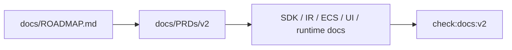

# V2-00 Roadmap and Contract Alignment

Complexity: 5 -> MEDIUM mode

## Context

**Problem:** V2 spans many docs and can easily drift from the roadmap's
playable-game proof into V3 production-platform work.

**Files Analyzed:** `docs/ROADMAP.md`, `docs/sdk.md`, `docs/ecs.md`,
`docs/ir.md`, `docs/scripting.md`, `docs/runtime-adapters.md`, `docs/ui.md`,
`docs/developer-workflow.md`, `docs/ai-workflows.md`.

**Current Behavior:**

- Roadmap V2 requires a playable arena game with R3F/JSX, ECS gameplay, assets,
  input, UI, audio, physics, and native/web parity.
- Adjacent docs mention V3 concepts such as gamepad, prefabs, changed queries,
  profiling, MCP, and mobile packaging.
- Native TypeScript system hosting is the highest-risk open area.

## Solution

**Approach:**

- Treat `docs/ROADMAP.md` as the source of truth for V2.
- Add explicit V2 deferrals in docs where V3 concepts appear early.
- Name the exact V2 schedule, input, UI, physics, asset, and scripting
  boundaries.
- Add a docs consistency check that guards V2 terminology.

**Data Changes:** None.

## Integration Points

**How will this feature be reached?**

- Entry point identified: `docs/PRDs/v2/README.md` and future
  `pnpm check:docs:v2`.
- Caller file identified: `scripts/check-docs-v2.*` if the repo adds a V2 docs
  check.
- Registration/wiring needed: package script for `check:docs:v2`.

**Is this user-facing?** Yes, documentation-facing.

**Full user flow:**

1. Developer opens the V2 PRD index.
2. They see the roadmap-controlled scope and exclusions.
3. They implement tickets without promoting V3 work into V2.
4. Docs check catches conflicting V2 claims.

## Execution Phases

#### Phase 1: Scope Vocabulary - V2 docs describe the same product boundary

**Files (max 5):**

- `docs/sdk.md` - align V2 authoring surface and defer V3 APIs.
- `docs/ecs.md` - name V2 ECS schedules and defer prefabs/changed queries.
- `docs/ir.md` - align V2 bundle files and capability sections.
- `docs/scripting.md` - document native TypeScript hosting decision.
- `docs/runtime-adapters.md` - align web/native V2 parity expectations.

**Implementation:**

- [ ] Mark gamepad, prefabs, changed queries, MCP, profiling, and mobile
  packaging as post-V2 unless non-blocking.
- [ ] Define V2 schedules as `fixedUpdate`, `update`, and `postUpdate`.
- [ ] State that R3F/JSX and SDK authoring lower to the same IR.
- [ ] State that UI portability is `ui.ir.json`, not arbitrary React DOM.

**Tests Required:**

| Test File | Test Name | Assertion |
| --- | --- | --- |
| `scripts/check-docs-v2.*` | `should reject v3-only capabilities as required v2 scope` | Mentions of gamepad, prefabs, MCP, profiling, or mobile packaging are not required V2 gates. |

**User Verification:**

- Action: Read V2 PRD index and affected docs.
- Expected: V2 scope is clear and does not require V3 production work.

#### Phase 2: V2 Docs Gate - Scope drift is machine-checkable

**Files (max 5):**

- `scripts/check-docs-v2.*` - V2 docs consistency checks.
- `package.json` - `check:docs:v2` script.
- `docs/PRDs/v2/README.md` - release gate command reference.

**Implementation:**

- [ ] Add checks for required V2 ticket links.
- [ ] Add checks for excluded capability wording.
- [ ] Add checks that `ui.ir.json`, `input.ir.json`, and asset manifest names
  are consistent.

**Tests Required:**

| Test File | Test Name | Assertion |
| --- | --- | --- |
| `scripts/check-docs-v2.*` | `should list every v2 ticket` | Every `V2-*.md` is linked from the README. |

**User Verification:**

- Action: Run `pnpm check:docs:v2`.
- Expected: Docs pass or report exact conflicting files.

## Verification Strategy

- `pnpm check:docs:v2`
- `rg 'gamepad|prefab|changed query|MCP|profiling|mobile packaging' docs`
- Manual review against `docs/ROADMAP.md`.

## Acceptance Criteria

- [ ] V2 docs use roadmap-controlled scope.
- [ ] V3-only capabilities are not required by V2 PRDs.
- [ ] Native TypeScript system hosting decision is explicit.
- [ ] V2 docs check is wired into the release gate.

