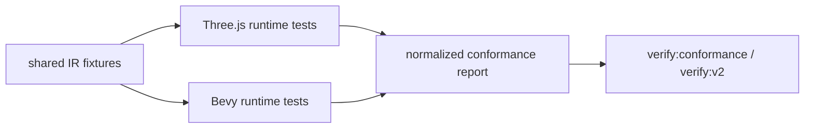

# V2-01 Cross-Runtime Conformance and Regression Harness

Complexity: 8 -> HIGH mode

## Context

**Problem:** ThreeNative's core product claim depends on the same IR behaving
consistently in the Three.js web runtime and the Bevy native runtime, but
runtime regression coverage should exist before V2 features accumulate.

**Files Analyzed:** `docs/ROADMAP.md`, `docs/runtime-adapters.md`,
`docs/developer-workflow.md`, `docs/ai-workflows.md`, `AGENTS.md`,
`packages/ir`, `packages/runtime-web-three`, `runtime-bevy`, `scripts`.

**Current Behavior:**

- V1 and V2 tickets include per-feature tests and release-gate smoke checks.
- Existing docs call for cross-runtime golden/conformance tests.
- There is no early standalone V2 PRD that defines the shared regression
  harness for both Three.js and Bevy runtime adapters.
- `AGENTS.md` already says to test changes, but V2 should make tests part of
  self-verification and regression prevention for every feature.

## Solution

**Approach:**

- Add a shared fixture catalog that both runtimes consume.
- Define semantic conformance expectations instead of pixel-perfect parity.
- Add test adapters that normalize web Three.js and Bevy runtime observations
  into comparable JSON reports.
- Add `verify:conformance` and fold it into `verify:v2`.
- Update `AGENTS.md` to tell coding agents to use testing as feature
  validation, self-verification, and regression protection.

**Data Changes:** Adds shared conformance fixtures and machine-readable
conformance reports.

## Integration Points

**How will this feature be reached?**

- Entry point identified: `pnpm verify:conformance`, `pnpm verify:v2`, and
  per-runtime package tests.
- Caller file identified: top-level verification scripts and runtime test
  suites.
- Registration/wiring needed: package scripts, fixture catalog, web runtime test
  runner, Bevy runtime test runner, normalized report writer.

**Is this user-facing?** No, this is internal verification infrastructure that
protects user-facing runtime behavior.

**Full user flow:**

1. Developer adds or changes an IR capability.
2. They add or update a shared conformance fixture before claiming support.
3. Web and Bevy runtime tests consume the same fixture.
4. `verify:conformance` reports whether both runtimes preserve the expected
   semantics.
5. `verify:v2` fails if a supported capability regresses.

## Execution Phases

#### Phase 1: Testing Contract - Agents and docs require regression tests early

**Files (max 5):**

- `AGENTS.md` - state that tests are part of feature validation,
  self-verification, and avoiding regressions.
- `docs/developer-workflow.md` - document conformance test workflow.
- `docs/runtime-adapters.md` - define semantic parity expectations.
- `docs/PRDs/v2/README.md` - place this PRD before feature implementation.
- `docs/PRDs/v2/V2-01-cross-runtime-conformance-and-regression-harness.md` -
  scope record.

**Implementation:**

- [ ] Update `AGENTS.md` so agents must prefer tests that prove feature behavior
  and guard regressions, especially for shared IR/runtime behavior.
- [ ] Document semantic parity: same entities, components, transforms, events,
  inputs, UI state, audio triggers, and physics events where applicable.
- [ ] State that pixel-perfect visual parity is not the V2 goal.
- [ ] Require every new V2 IR capability to add at least one conformance fixture
  before it is considered supported.

**Tests Required:**

| Test File | Test Name | Assertion |
| --- | --- | --- |
| `scripts/check-docs-v2.*` | `should require conformance guidance` | Docs mention `verify:conformance` and AGENTS testing guidance. |

**User Verification:**

- Action: Read `AGENTS.md` and V2 PRD index.
- Expected: Testing is explicitly framed as self-verification and regression
  prevention.

#### Phase 2: Fixture Catalog - Both runtimes consume the same IR examples

**Files (max 5):**

- `packages/ir/fixtures/conformance/README.md` - fixture catalog and naming.
- `packages/ir/fixtures/conformance/basic-scene/game.bundle/manifest.json` -
  baseline fixture.
- `packages/ir/fixtures/conformance/basic-scene/game.bundle/world.ir.json` -
  baseline world.
- `packages/ir/src/conformance.ts` - fixture manifest loader if needed.
- `packages/ir/src/conformance.test.ts` - fixture validation tests.

**Implementation:**

- [ ] Define fixture naming, expected report paths, and capability tags.
- [ ] Add baseline fixture for transform hierarchy, mesh, material, camera, and
  light.
- [ ] Validate every conformance fixture with the IR validator.
- [ ] Keep generated runtime artifacts out of fixture source directories.

**Tests Required:**

| Test File | Test Name | Assertion |
| --- | --- | --- |
| `packages/ir/src/conformance.test.ts` | `should validate every conformance fixture` | All fixture bundles pass schema and semantic validation. |
| `packages/ir/src/conformance.test.ts` | `should include capability tags for each fixture` | Fixture catalog lists required capability coverage. |

**User Verification:**

- Action: Run IR conformance fixture tests.
- Expected: Fixture catalog validates before runtime tests run.

#### Phase 3: Runtime Observation Reports - Web and Bevy expose comparable facts

**Files (max 5):**

- `packages/runtime-web-three/src/conformance.ts` - web observation reporter.
- `packages/runtime-web-three/src/conformance.test.ts` - web fixture tests.
- `runtime-bevy/src/conformance.rs` - native observation reporter.
- `runtime-bevy/tests/conformance.rs` - Bevy fixture tests.
- `packages/ir/src/conformanceReport.ts` - shared report shape.

**Implementation:**

- [ ] Normalize observations to JSON: entities, stable IDs, component presence,
  transforms, camera/light/material mappings, and diagnostics.
- [ ] Keep runtime-specific handles out of reports.
- [ ] Compare semantic fields, not renderer internals.
- [ ] Make report differences readable for agents and maintainers.

**Tests Required:**

| Test File | Test Name | Assertion |
| --- | --- | --- |
| `packages/runtime-web-three/src/conformance.test.ts` | `should report basic scene semantics` | Web report includes expected entity IDs and render components. |
| `runtime-bevy/tests/conformance.rs` | `should report basic scene semantics` | Bevy report includes expected entity IDs and render components. |

**User Verification:**

- Action: Run web and Bevy conformance tests for `basic-scene`.
- Expected: Both reports contain matching semantic observations.

#### Phase 4: Conformance Gate - Regression checks run before V2 features pass

**Files (max 5):**

- `scripts/verify-conformance.*` - cross-runtime conformance gate.
- `scripts/verify-v2.*` - include conformance gate.
- `package.json` - `verify:conformance` script.
- `packages/cli/src/verify/conformance.ts` - optional CLI report integration.
- `packages/cli/src/verify/conformance.test.ts` - gate tests.

**Implementation:**

- [ ] Add `pnpm verify:conformance`.
- [ ] Run IR fixture validation before runtime checks.
- [ ] Run web and Bevy conformance checks for all tagged V2 fixtures.
- [ ] Fail with a report that names fixture, capability, runtime, and observed
  mismatch.
- [ ] Require `verify:v2` to run or call the conformance gate.

**Tests Required:**

| Test File | Test Name | Assertion |
| --- | --- | --- |
| `packages/cli/src/verify/conformance.test.ts` | `should fail when runtime reports differ` | Gate exits nonzero and names mismatched semantic field. |
| `packages/cli/src/verify/conformance.test.ts` | `should pass matching reports` | Gate exits zero and saves report path. |

**User Verification:**

- Action: Run `pnpm verify:conformance`.
- Expected: Shared fixture reports pass, or mismatches identify the runtime and
  capability.

## Verification Strategy

- `pnpm --filter @threenative/ir test -- --run conformance`
- `pnpm --filter @threenative/runtime-web-three test -- --run conformance`
- `cd runtime-bevy && cargo test conformance`
- `pnpm verify:conformance`
- `pnpm verify:v2`

## Acceptance Criteria

- [ ] `AGENTS.md` tells agents to use tests for feature validation,
  self-verification, and regression prevention.
- [ ] Shared conformance fixtures exist before V2 runtime feature work expands.
- [ ] Web and Bevy runtimes emit normalized semantic observation reports.
- [ ] Cross-runtime mismatches fail a deterministic gate.
- [ ] Every new V2 IR/runtime capability has a conformance fixture before it is
  considered supported.

