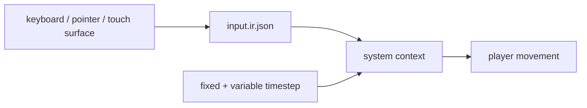

# V2-04 Input and Time

Complexity: 7 -> HIGH mode

## Context

**Problem:** The arena demo needs portable player control and deterministic
timing across web and native runtimes.

**Files Analyzed:** `docs/ROADMAP.md`, `docs/sdk.md`, `docs/ir.md`,
`docs/runtime-adapters.md`, `packages/sdk`, `packages/ir`,
`packages/runtime-web-three`, `runtime-bevy`.

**Current Behavior:**

- V1 may include basic keyboard input if feasible.
- V2 requires keyboard, pointer/mouse, touch-ready actions and axes, fixed and
  variable timestep resources, window/resolution settings, and pause/play hooks.
- Gamepad is V3 scope.

## Solution

**Approach:**

- Add `input.ir.json` with action and axis maps independent of device backend.
- Add time resources for fixed delta, variable delta, elapsed time, and pause
  state.
- Map keyboard and pointer on web and native; represent touch controls as
  logical actions/axes for UI integration.
- Feed input/time into the system context.

**Data Changes:** Adds `input.ir.json` and runtime configuration/time resources.

## Integration Points

**How will this feature be reached?**

- Entry point identified: SDK input map declarations and runtime device events.
- Caller file identified: system runner context in web and Bevy runtimes.
- Registration/wiring needed: compiler emit, IR validator, runtime input
  adapters, CLI config mapping.

**Is this user-facing?** Yes, player controls and runtime behavior.

**Full user flow:**

1. User declares `MoveX`, `MoveY`, `Attack`, and `Pause`.
2. `tn build` emits `input.ir.json`.
3. Runtime maps keyboard/pointer/touch surface events into logical values.
4. Systems read logical input and timestep resources.

## Execution Phases

#### Phase 1: Input IR - Logical actions and axes validate

**Files (max 5):**

- `packages/sdk/src/input.ts` - input map declarations.
- `packages/ir/src/input.ts` - input IR types and schemas.
- `packages/compiler/src/emit/input.ts` - input emit.
- `packages/ir/src/input.test.ts` - validation tests.
- `packages/compiler/src/emit/input.test.ts` - emit tests.

**Implementation:**

- [ ] Support action and axis IDs.
- [ ] Support keyboard keys, pointer buttons, pointer position/delta, and
  touch-ready virtual controls.
- [ ] Reject gamepad as unsupported V2 required input.
- [ ] Emit stable diagnostics for duplicate bindings.

**Tests Required:**

| Test File | Test Name | Assertion |
| --- | --- | --- |
| `packages/compiler/src/emit/input.test.ts` | `should emit arena input map` | Input IR contains move axes, attack, and pause. |
| `packages/ir/src/input.test.ts` | `should reject required gamepad binding in v2` | Validator reports unsupported capability. |

**User Verification:**

- Action: Build an arena-input fixture.
- Expected: `input.ir.json` validates.

#### Phase 2: Runtime Input Mapping - Controls feed systems

**Files (max 5):**

- `packages/runtime-web-three/src/input.ts` - browser input adapter.
- `packages/runtime-web-three/src/systems/context.ts` - input context.
- `runtime-bevy/src/input.rs` - Bevy input adapter.
- `runtime-bevy/tests/input.rs` - native input tests.
- `packages/runtime-web-three/src/input.test.ts` - web input tests.

**Implementation:**

- [ ] Map keyboard and pointer events to logical actions/axes.
- [ ] Expose current, pressed, released, and axis values in system context.
- [ ] Normalize coordinate values for pointer/touch-ready controls.
- [ ] Keep web and native names consistent.

**Tests Required:**

| Test File | Test Name | Assertion |
| --- | --- | --- |
| `packages/runtime-web-three/src/input.test.ts` | `should map wasd to move axis` | Pressing keys updates logical axis. |
| `runtime-bevy/tests/input.rs` | `should map keyboard event to action` | Native adapter returns same action ID. |

**User Verification:**

- Action: Run movement fixture and press WASD.
- Expected: Player moves through logical input, not raw device checks.

#### Phase 3: Time and Pause - Systems receive deterministic timestep resources

**Files (max 5):**

- `packages/sdk/src/time.ts` - runtime config declarations.
- `packages/ir/src/runtimeConfig.ts` - timestep/window config types.
- `packages/runtime-web-three/src/gameLoop.ts` - fixed/variable loop.
- `runtime-bevy/src/time.rs` - Bevy timing resources.
- `packages/runtime-web-three/src/gameLoop.test.ts` - timestep tests.

**Implementation:**

- [ ] Add fixed timestep resource.
- [ ] Add variable delta and elapsed time resource.
- [ ] Add pause/play state hook.
- [ ] Add window/resolution settings needed by the demo.

**Tests Required:**

| Test File | Test Name | Assertion |
| --- | --- | --- |
| `packages/runtime-web-three/src/gameLoop.test.ts` | `should run fixed update at configured timestep` | Accumulator produces deterministic fixed ticks. |
| `packages/runtime-web-three/src/gameLoop.test.ts` | `should skip gameplay schedules while paused` | Paused loop does not run movement system. |

**User Verification:**

- Action: Toggle pause in a fixture.
- Expected: Rendering continues but gameplay systems stop.

## Verification Strategy

- `pnpm --filter @threenative/ir test -- --run input`
- `pnpm --filter @threenative/runtime-web-three test -- --run input`
- `cd runtime-bevy && cargo test input`

## Acceptance Criteria

- [ ] Input maps are portable and validated.
- [ ] Keyboard and pointer mappings work on web and native.
- [ ] Touch-ready logical controls exist without requiring mobile packaging.
- [ ] Fixed timestep, variable timestep, and pause state feed systems.
