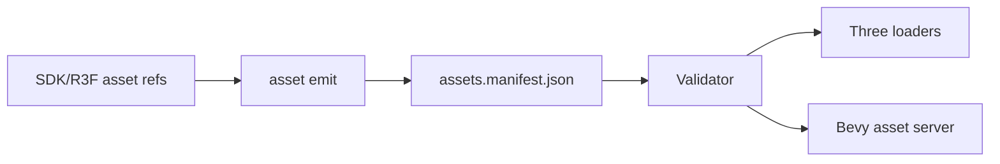

# V2-06 Asset Pipeline

Complexity: 7 -> HIGH mode

## Context

**Problem:** The arena demo needs portable static models, textures, material
texture slots, and audio references that validate before web or native runtime
startup.

**Files Analyzed:** `docs/ROADMAP.md`, `docs/sdk.md`, `docs/ir.md`,
`docs/runtime-adapters.md`, `packages/ir`, `packages/compiler`,
`packages/runtime-web-three`, `runtime-bevy`.

**Current Behavior:**

- V1 can rely mostly on generated primitive geometry.
- V2 requires static glTF/GLB, texture references, standard material texture
  slots, audio references, asset manifest validation, and import diagnostics.
- V3 stronger preprocessing, budgets, and caching are out of scope.

## Solution

**Approach:**

- Add asset declarations and manifest entries for static models, textures, and
  audio files.
- Validate bundle-relative paths, supported extensions, required capabilities,
  and referenced material/audio IDs.
- Load the same manifest in web and native runtimes.
- Keep preprocessing optional and outside the V2 gate unless needed for the
  arena fixture.

**Data Changes:** Extends `assets.manifest.json`, `materials.ir.json`, and
audio asset references.

## Integration Points

**How will this feature be reached?**

- Entry point identified: SDK/R3F asset reference APIs and material texture
  slots.
- Caller file identified: compiler bundle emit and runtime bundle loaders.
- Registration/wiring needed: asset schema validation, web/native loaders,
  template asset layout.

**Is this user-facing?** Yes, content authoring and diagnostics.

**Full user flow:**

1. User references a GLB player model, texture, and sound file.
2. `tn build` emits asset manifest entries.
3. Validator rejects missing or unsupported files.
4. Web and native runtimes load the validated assets.

## Execution Phases

#### Phase 1: Asset Manifest - Static asset references validate

**Files (max 5):**

- `packages/sdk/src/assets.ts` - asset reference declarations.
- `packages/ir/src/assets.ts` - asset manifest schema.
- `packages/compiler/src/emit/assets.ts` - asset manifest emit.
- `packages/ir/src/assets.test.ts` - validation tests.
- `packages/compiler/src/emit/assets.test.ts` - emit tests.

**Implementation:**

- [ ] Support `model/gltf`, `image/png`, `image/jpeg`, and common V2 audio
  formats selected by runtime support.
- [ ] Use bundle-relative paths.
- [ ] Reject missing files and unsupported extensions.
- [ ] Emit required capabilities for model, texture, and audio assets.

**Tests Required:**

| Test File | Test Name | Assertion |
| --- | --- | --- |
| `packages/compiler/src/emit/assets.test.ts` | `should emit glb texture and audio assets` | Manifest contains deterministic asset entries. |
| `packages/ir/src/assets.test.ts` | `should reject missing asset path` | Validator diagnostic includes asset ID and path. |

**User Verification:**

- Action: Build an asset fixture with a missing texture.
- Expected: Build fails before runtime with path diagnostic.

#### Phase 2: Material Texture Slots - PBR textures reach runtimes

**Files (max 5):**

- `packages/sdk/src/materials/MeshStandardMaterial.ts` - texture slot refs.
- `packages/ir/src/materials.ts` - material texture slot schema.
- `packages/compiler/src/emit/materials.ts` - material emit.
- `packages/runtime-web-three/src/materials.ts` - Three material loader.
- `packages/compiler/src/emit/materials.test.ts` - material tests.

**Implementation:**

- [ ] Support base color, normal, metallic-roughness, emissive, and occlusion
  texture references.
- [ ] Validate referenced asset IDs and supported texture types.
- [ ] Preserve existing color/PBR fields.
- [ ] Fail unsupported material fields explicitly.

**Tests Required:**

| Test File | Test Name | Assertion |
| --- | --- | --- |
| `packages/compiler/src/emit/materials.test.ts` | `should emit standard material texture slots` | Material IR references declared texture asset IDs. |
| `packages/ir/src/materials.test.ts` | `should reject unknown texture asset` | Validator reports missing asset reference. |

**User Verification:**

- Action: Preview a textured arena prop.
- Expected: Texture renders in web preview and validates for native.

#### Phase 3: Runtime Asset Loading - Models and audio assets load from manifest

**Files (max 5):**

- `packages/runtime-web-three/src/assets.ts` - web asset loaders.
- `packages/runtime-web-three/src/assets.test.ts` - loader tests.
- `runtime-bevy/src/assets.rs` - Bevy asset manifest loader.
- `runtime-bevy/tests/assets.rs` - native asset tests.
- `examples/v2-arena/assets/README.md` - fixture asset notes.

**Implementation:**

- [ ] Load GLB/GLTF static meshes.
- [ ] Load texture assets for standard materials.
- [ ] Register audio references for V2-10 playback.
- [ ] Report runtime diagnostics if a validated asset still fails to load.

**Tests Required:**

| Test File | Test Name | Assertion |
| --- | --- | --- |
| `packages/runtime-web-three/src/assets.test.ts` | `should resolve glb asset from manifest` | Loader requests manifest path and returns scene asset. |
| `runtime-bevy/tests/assets.rs` | `should load asset manifest entries` | Native loader maps asset IDs to Bevy handles. |

**User Verification:**

- Action: Run web and native asset fixture.
- Expected: Model appears and missing runtime loads report asset ID.

## Verification Strategy

- `pnpm --filter @threenative/ir test -- --run assets`
- `pnpm --filter @threenative/runtime-web-three test -- --run assets`
- `cd runtime-bevy && cargo test assets`

## Acceptance Criteria

- [ ] Static models, textures, and audio references emit into asset manifest.
- [ ] Missing and unsupported assets fail validation before runtime.
- [ ] Material texture slots validate asset references.
- [ ] Web and native runtimes load the same manifest IDs.
