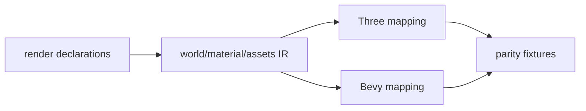

# V2-07 Rendering Parity Extensions

Complexity: 6 -> MEDIUM mode

## Context

**Problem:** The arena demo needs a few rendering features beyond V1 without
turning V2 into broad Three.js compatibility.

**Files Analyzed:** `docs/ROADMAP.md`, `docs/sdk.md`, `docs/ir.md`,
`docs/runtime-adapters.md`, `packages/sdk`, `packages/ir`,
`packages/runtime-web-three`, `runtime-bevy`.

**Current Behavior:**

- V1 renders the minimal primitive scene subset.
- V2 may need capsule/cylinder placeholders, point and spot lights,
  orthographic camera support, and consistent visibility handling.
- Advanced material graphs, shaders, postprocessing, and custom renderers are
  excluded.

## Solution

**Approach:**

- Add only demo-needed render primitives and light/camera fields.
- Validate unsupported render features before runtime.
- Add conformance fixtures for web and Bevy mapping.

**Data Changes:** Extends geometry, camera, light, and visibility IR fields.

## Integration Points

**How will this feature be reached?**

- Entry point identified: SDK/R3F render declarations used by arena scene.
- Caller file identified: compiler render emit and runtime world mappers.
- Registration/wiring needed: IR schema, validator, web/native mapping tests.

**Is this user-facing?** Yes, visible game rendering.

**Full user flow:**

1. User adds cylinder/capsule placeholder, point light, and orthographic UI
   camera if needed.
2. `tn build` emits validated render IR.
3. Web and native runtimes render comparable scene elements.

## Execution Phases

#### Phase 1: Demo Render IR - Needed primitives and lights validate

**Files (max 5):**

- `packages/sdk/src/geometry/primitives.ts` - capsule/cylinder if used.
- `packages/sdk/src/scene/Light.ts` - point/spot light fields.
- `packages/sdk/src/scene/Camera.ts` - orthographic camera support.
- `packages/ir/src/rendering.ts` - validation schema.
- `packages/ir/src/rendering.test.ts` - validation tests.

**Implementation:**

- [ ] Add cylinder and capsule only if the arena fixtures use them.
- [ ] Add point and spot light fields required by the demo.
- [ ] Add orthographic camera fields for UI/overlay usage if needed.
- [ ] Add `visible` handling for entities and render components.

**Tests Required:**

| Test File | Test Name | Assertion |
| --- | --- | --- |
| `packages/ir/src/rendering.test.ts` | `should validate v2 point light fixture` | Light fields pass schema. |
| `packages/ir/src/rendering.test.ts` | `should reject unsupported shader material` | Validator reports unsupported material capability. |

**User Verification:**

- Action: Build rendering parity fixture.
- Expected: Bundle validates and rejects excluded shader features.

#### Phase 2: Web and Native Mapping - Render fixtures match capabilities

**Files (max 5):**

- `packages/runtime-web-three/src/mapWorld.ts` - render mapping.
- `packages/runtime-web-three/src/mapWorld.test.ts` - web mapping tests.
- `runtime-bevy/src/rendering.rs` - Bevy render mapping.
- `runtime-bevy/tests/rendering.rs` - native mapping tests.
- `examples/fixtures/v2-rendering/README.md` - fixture notes.

**Implementation:**

- [ ] Map V2 primitive placeholders to runtime primitives.
- [ ] Map point/spot lights and orthographic cameras.
- [ ] Respect visibility consistently.
- [ ] Emit runtime diagnostics for validated-but-unavailable target features.

**Tests Required:**

| Test File | Test Name | Assertion |
| --- | --- | --- |
| `packages/runtime-web-three/src/mapWorld.test.ts` | `should map v2 render fixture` | Three scene contains expected camera, lights, and meshes. |
| `runtime-bevy/tests/rendering.rs` | `should map visibility and v2 lights` | Bevy world contains expected render components. |

**User Verification:**

- Action: Run web and native rendering fixture.
- Expected: Main placeholders, lights, and visibility behave consistently.

## Verification Strategy

- `pnpm --filter @threenative/ir test -- --run rendering`
- `pnpm --filter @threenative/runtime-web-three test -- --run mapWorld`
- `cd runtime-bevy && cargo test rendering`

## Acceptance Criteria

- [ ] Demo-needed primitives, lights, cameras, and visibility validate.
- [ ] Web and Bevy mappings consume the same IR.
- [ ] V2 does not add advanced shaders, material graphs, postprocessing, or
  broad Three.js parity.
