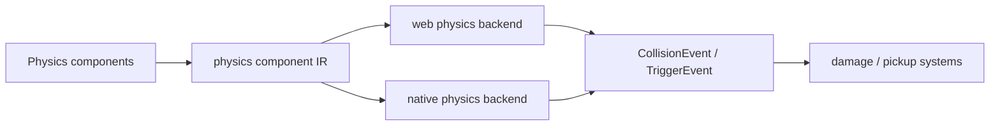

# V2-08 Physics Foundation

Complexity: 8 -> HIGH mode

## Context

**Problem:** The arena demo needs collisions, triggers, and movement constraints
that behave consistently enough on web and native while keeping physics APIs
portable.

**Files Analyzed:** `docs/ROADMAP.md`, `docs/ecs.md`, `docs/ir.md`,
`docs/runtime-adapters.md`, `packages/sdk`, `packages/ir`,
`packages/runtime-web-three`, `runtime-bevy`.

**Current Behavior:**

- V1 does not require physics.
- V2 requires colliders, static/kinematic/dynamic rigid bodies,
  triggers/sensors, collision events, and simple collision hooks.
- Rapier is a leading backend candidate, but must not leak into SDK or IR.

## Solution

**Approach:**

- Add portable physics components and event schemas.
- Support only arena-needed collider shapes and body kinds.
- Use runtime-specific backends behind IR mapping.
- Feed collision events into ECS systems through the same event model.

**Data Changes:** Adds physics component schemas and collision/trigger event
payloads to world/schema IR.

## Integration Points

**How will this feature be reached?**

- Entry point identified: SDK/R3F physics component declarations.
- Caller file identified: runtime physics step before/within fixed update.
- Registration/wiring needed: compiler emit, IR validation, web/native physics
  adapters, ECS event integration.

**Is this user-facing?** Yes, gameplay behavior.

**Full user flow:**

1. User adds colliders and rigid bodies to player, enemies, and arena walls.
2. Runtime steps physics during fixed update.
3. Collision events feed gameplay systems.
4. Health/damage systems respond to collision events.

## Execution Phases

#### Phase 1: Physics IR - Colliders and bodies validate

**Files (max 5):**

- `packages/sdk/src/physics.ts` - portable physics declarations.
- `packages/ir/src/physics.ts` - physics schema.
- `packages/compiler/src/emit/physics.ts` - physics emit.
- `packages/ir/src/physics.test.ts` - validation tests.
- `packages/compiler/src/emit/physics.test.ts` - emit tests.

**Implementation:**

- [ ] Support box, sphere, capsule/cylinder only if used, and mesh collider only
  if static arena geometry requires it.
- [ ] Support static, kinematic, and dynamic body kinds.
- [ ] Support trigger/sensor flag.
- [ ] Validate scale restrictions and unsupported shape/body combinations.

**Tests Required:**

| Test File | Test Name | Assertion |
| --- | --- | --- |
| `packages/compiler/src/emit/physics.test.ts` | `should emit player collider and kinematic body` | Entity has portable physics components. |
| `packages/ir/src/physics.test.ts` | `should reject unsupported dynamic mesh collider` | Validator reports unsupported V2 physics feature. |

**User Verification:**

- Action: Build physics fixture with unsupported body/shape combination.
- Expected: Validation fails before runtime.

#### Phase 2: Runtime Physics Step - Collisions are generated

**Files (max 5):**

- `packages/runtime-web-three/src/physics.ts` - web physics adapter.
- `packages/runtime-web-three/src/physics.test.ts` - web physics tests.
- `runtime-bevy/src/physics.rs` - native physics adapter.
- `runtime-bevy/tests/physics.rs` - native physics tests.
- `runtime-bevy/Cargo.toml` - backend dependency if selected.

**Implementation:**

- [ ] Select and wire V2 physics backend(s).
- [ ] Step physics in fixed update.
- [ ] Sync transforms for kinematic/dynamic bodies.
- [ ] Keep backend handles out of IR and SDK.

**Tests Required:**

| Test File | Test Name | Assertion |
| --- | --- | --- |
| `packages/runtime-web-three/src/physics.test.ts` | `should detect trigger overlap` | Web adapter emits trigger event IDs. |
| `runtime-bevy/tests/physics.rs` | `should detect collision fixture` | Native adapter emits equivalent event IDs. |

**User Verification:**

- Action: Run collision fixture on web and native.
- Expected: Collision events appear in runtime diagnostics.

#### Phase 3: Gameplay Collision Events - Damage can be driven by physics

**Files (max 5):**

- `packages/ir/src/events.ts` - collision event payload validation.
- `packages/runtime-web-three/src/systems/context.ts` - collision event access.
- `runtime-bevy/src/events.rs` - native event bridge.
- `examples/fixtures/v2-physics/src/game.ts` - damage fixture.
- `packages/runtime-web-three/src/physics-events.test.ts` - event tests.

**Implementation:**

- [ ] Define collision and trigger event payloads with stable entity IDs.
- [ ] Deliver events to systems in deterministic schedule order.
- [ ] Support simple damage-on-contact fixture.
- [ ] Report missing entity references.

**Tests Required:**

| Test File | Test Name | Assertion |
| --- | --- | --- |
| `packages/runtime-web-three/src/physics-events.test.ts` | `should damage entity on collision event` | Health component decreases after event. |

**User Verification:**

- Action: Run damage fixture and collide player/enemy.
- Expected: Health decreases through collision event, not direct runtime code.

## Verification Strategy

- `pnpm --filter @threenative/ir test -- --run physics`
- `pnpm --filter @threenative/runtime-web-three test -- --run physics`
- `cd runtime-bevy && cargo test physics`

## Acceptance Criteria

- [ ] Physics SDK/IR exposes portable components only.
- [ ] Unsupported physics features fail validation.
- [ ] Web and native generate equivalent collision/trigger events for fixtures.
- [ ] Collision events can drive ECS gameplay systems.
