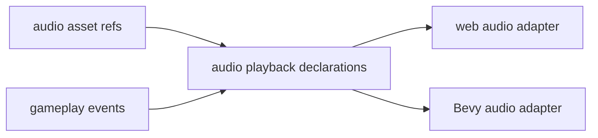

# V2-10 Audio Runtime

Complexity: 6 -> MEDIUM mode

## Context

**Problem:** The arena demo needs basic audio feedback through one-shot sounds
and looping music driven by portable assets and gameplay events.

**Files Analyzed:** `docs/ROADMAP.md`, `docs/ir.md`, `docs/runtime-adapters.md`,
`packages/sdk`, `packages/ir`, `packages/runtime-web-three`, `runtime-bevy`.

**Current Behavior:**

- V1 has no required audio.
- V2 requires one-shot sound playback from gameplay events and looping music.
- Spatial audio and mixing are V3 scope.

## Solution

**Approach:**

- Add audio asset references and simple playback declarations.
- Support event-triggered one-shots and looping music resources.
- Implement web and Bevy playback adapters with comparable diagnostics.

**Data Changes:** Extends asset manifest and adds audio playback metadata.

## Integration Points

**How will this feature be reached?**

- Entry point identified: SDK audio declarations and gameplay event mappings.
- Caller file identified: runtime event processing loop.
- Registration/wiring needed: compiler emit, validator, web/native audio
  adapters, asset manifest integration.

**Is this user-facing?** Yes, audible gameplay feedback.

**Full user flow:**

1. User declares `hit.sound` and `arena.music` assets.
2. User maps `DamageEvent` to one-shot playback and music to loop on start.
3. Runtime plays sounds from validated assets.

## Execution Phases

#### Phase 1: Audio Declarations - Sounds validate through asset manifest

**Files (max 5):**

- `packages/sdk/src/audio.ts` - audio declarations.
- `packages/ir/src/audio.ts` - audio schema.
- `packages/compiler/src/emit/audio.ts` - audio emit.
- `packages/ir/src/audio.test.ts` - validation tests.
- `packages/compiler/src/emit/audio.test.ts` - emit tests.

**Implementation:**

- [ ] Support one-shot event mappings.
- [ ] Support looping music declaration.
- [ ] Validate referenced audio asset IDs.
- [ ] Reject spatial audio and mixer graphs in V2.

**Tests Required:**

| Test File | Test Name | Assertion |
| --- | --- | --- |
| `packages/compiler/src/emit/audio.test.ts` | `should emit hit sound and looping music` | Audio IR references declared asset IDs. |
| `packages/ir/src/audio.test.ts` | `should reject unknown audio asset` | Validator reports missing asset reference. |

**User Verification:**

- Action: Build audio fixture with missing sound asset.
- Expected: Validation fails before runtime.

#### Phase 2: Runtime Playback - Events trigger sound on web and native

**Files (max 5):**

- `packages/runtime-web-three/src/audio.ts` - web audio adapter.
- `packages/runtime-web-three/src/audio.test.ts` - web tests.
- `runtime-bevy/src/audio.rs` - native audio adapter.
- `runtime-bevy/tests/audio.rs` - native tests.
- `examples/fixtures/v2-audio/README.md` - fixture docs.

**Implementation:**

- [ ] Start looping music when configured.
- [ ] Play one-shot sound on matching gameplay event.
- [ ] Avoid exposing backend audio handles to SDK/IR.
- [ ] Report blocked/unavailable playback diagnostics.

**Tests Required:**

| Test File | Test Name | Assertion |
| --- | --- | --- |
| `packages/runtime-web-three/src/audio.test.ts` | `should play one shot on damage event` | Audio adapter receives expected asset ID. |
| `runtime-bevy/tests/audio.rs` | `should start looping music from audio ir` | Native adapter queues looped music asset. |

**User Verification:**

- Action: Run audio fixture and trigger damage.
- Expected: Hit sound plays and music loops where audio output is available.

## Verification Strategy

- `pnpm --filter @threenative/ir test -- --run audio`
- `pnpm --filter @threenative/runtime-web-three test -- --run audio`
- `cd runtime-bevy && cargo test audio`

## Acceptance Criteria

- [ ] Audio declarations validate asset references.
- [ ] One-shot sounds can be driven by gameplay events.
- [ ] Looping music works on web and native runtime paths.
- [ ] Spatial audio and mixer features remain out of V2.
