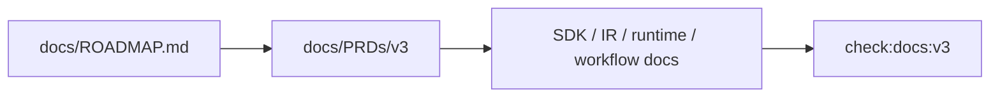

# V3-00 Roadmap and Contract Alignment

Complexity: 6 -> MEDIUM mode

## Context

**Problem:** V3 can easily drift back into broad production-platform work unless
the docs and gates consistently define the first-person forest scene proof.

**Files Analyzed:** `docs/ROADMAP.md`, `docs/sdk.md`, `docs/ecs.md`,
`docs/ir.md`, `docs/runtime-adapters.md`, `docs/developer-workflow.md`,
`docs/ai-workflows.md`, `docs/PRDs/v2/README.md`.

**Current Behavior:**

- The roadmap defines V3 as the `Preview_2.jpg` first-person environment scene.
- V2 PRDs defer prefabs, instancing, budgets, profiling, and production content
  pipeline work into V3.
- Existing docs may still describe V3 as broad production hardening or mention
  mobile, MCP, editor, and template catalog work too early.

## Solution

**Approach:**

- Treat `docs/ROADMAP.md` as the source of truth for V3.
- Align docs around one proof scene, one asset pack, one web-first performance
  gate, and one native load smoke.
- Add a V3 docs check that rejects broad production-platform requirements as V3
  blockers unless they directly support the scene.
- Preserve the SDK-to-IR-to-runtime product boundary and keep Bevy out of public
  authoring APIs.

**Key Decisions:**

- [ ] V3 scope is one dense environment scene, not general production hardening.
- [ ] Three.js web performance is the stricter runtime gate.
- [ ] Bevy remains an internal adapter that consumes the same bundle.
- [ ] Out-of-scope production features are explicitly deferred.

**Data Changes:** None.

## Integration Points

**How will this feature be reached?**

- Entry point identified: `docs/PRDs/v3/README.md` and future
  `pnpm check:docs:v3`.
- Caller file identified: `scripts/check-docs-v3.*` if the repo adds a V3 docs
  check.
- Registration/wiring needed: package script for `check:docs:v3`.

**Is this user-facing?** Yes, documentation-facing.

**Full user flow:**

1. Developer opens the V3 PRD index.
2. They see the scene target, performance gate, dependencies, and exclusions.
3. They implement tickets without promoting broad V4/platform work into V3.
4. Docs check catches conflicting V3 claims.

## Execution Phases

#### Phase 1: Scope Vocabulary - V3 docs describe the same scene proof

**Files (max 5):**

- `docs/sdk.md` - align V3 authoring APIs and defer broad editor/mobile work.
- `docs/ir.md` - align V3 bundle, budget, instancing, and atmosphere terms.
- `docs/runtime-adapters.md` - align web-first performance and Bevy smoke scope.
- `docs/developer-workflow.md` - document the V3 scene iteration loop.
- `docs/PRDs/v3/README.md` - ticket order and acceptance criteria.

**Implementation:**

- [ ] State that V3 targets `assets-source/environment/Preview_2.jpg`.
- [ ] Name Three.js performance metrics as release-gate requirements.
- [ ] Mark mobile app-store packaging, MCP, editor, multiplayer, broad terrain
  editor, and advanced material graph work as post-V3.
- [ ] State that environment scene features still lower to portable IR.

**Tests Required:**

| Test File | Test Name | Assertion |
| --- | --- | --- |
| `scripts/check-docs-v3.*` | `should reject broad production platform as v3 goal` | Required V3 wording remains scene-focused. |

**User Verification:**

- Action: Read V3 PRD index and affected docs.
- Expected: V3 scope is clearly the first-person forest scene, with performance
  as a gate.

#### Phase 2: V3 Docs Gate - Scope drift is machine-checkable

**Files (max 5):**

- `scripts/check-docs-v3.*` - V3 docs consistency checks.
- `package.json` - `check:docs:v3` script.
- `docs/PRDs/v3/README.md` - release gate command reference.

**Implementation:**

- [ ] Check every V3 PRD is linked from the README.
- [ ] Check that `Preview_2.jpg`, Three.js performance, and native Bevy smoke
  are named in V3 scope docs.
- [ ] Check that excluded platform features are not required V3 gates.
- [ ] Check that `verify:v3` and `check:docs:v3` are documented.

**Tests Required:**

| Test File | Test Name | Assertion |
| --- | --- | --- |
| `scripts/check-docs-v3.*` | `should list every v3 ticket` | Every `V3-*.md` is linked from the README. |

**User Verification:**

- Action: Run `pnpm check:docs:v3`.
- Expected: Docs pass or report exact conflicting files.

## Verification Strategy

- `pnpm check:docs:v3`
- `rg 'V3|Preview_2|performance|MCP|mobile|editor' docs`
- Manual review against `docs/ROADMAP.md`.

## Acceptance Criteria

- [ ] V3 docs use roadmap-controlled scope.
- [ ] V3-only implementation tickets are linked and ordered.
- [ ] Broad production-platform capabilities are not required by V3 PRDs.
- [ ] Web performance and native load smoke are named as release gates.
- [ ] V3 docs check is wired into the release gate.
