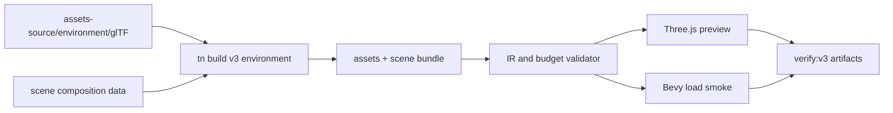
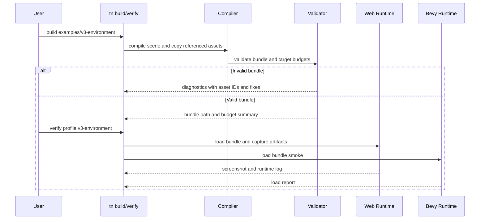

# V3-01 Scene Asset Bundling and Budgets

Complexity: 9 -> HIGH mode

## Context

**Problem:** V3 needs one deterministic, validated environment bundle from
`assets-source/environment` that can compose the `Preview_2.jpg` first-person
forest scene without relying on ad hoc asset copying or runtime-only failures.

**Files Analyzed:** `docs/ROADMAP.md`, `docs/PRDs/v2/V2-01-cross-runtime-conformance-and-regression-harness.md`,
`docs/PRDs/v2/V2-06-asset-pipeline.md`,
`docs/PRDs/v2/V2-07-rendering-parity-extensions.md`,
`docs/PRDs/v2/V2-11-arena-demo-template.md`,
`docs/PRDs/v2/V2-12-dev-loop-and-release-gate.md`,
`assets-source/environment`, `packages/sdk`, `packages/ir`,
`packages/compiler`, `packages/cli`, `packages/runtime-web-three`,
`runtime-bevy`.

**Current Behavior:**

- V2 plans static asset references, material texture slots, and runtime asset
  loading for a small arena fixture.
- The environment pack already includes glTF, `.bin`, texture, FBX, OBJ, and
  preview files, but no V3 bundle contract exists.
- There is no terrain/path composition model, deterministic scatter data, or
  source asset versus repeated instance distinction.
- Runtime asset failures and over-budget content are not yet tied to the V3
  forest-scene release gate.

## Solution

**Approach:**

- Treat `assets-source/environment/glTF` as the canonical V3 input and copy only
  required glTF, `.bin`, texture, and preview files into deterministic bundle
  paths.
- Add V3 scene composition IR for source assets, repeated instances, authored
  hero placements, deterministic scatter zones, walkable path data, and camera
  bookmarks.
- Add target budget validation that can reject missing files, unsupported
  formats, unsupported glTF material/extensions, over-budget copied assets, and
  malformed placement data before runtime.
- Add a V3 environment example as the only required consumer; avoid general
  terrain editors, arbitrary asset conversion, and broad Three.js compatibility.
- Wire web and Bevy loaders to consume the same manifest IDs while leaving
  Three.js-first runtime performance work to V3-02.

**Key Decisions:**

- Use existing V2 asset manifest direction and extend it only for V3
  environment needs.
- glTF is the accepted source format for V3; FBX and OBJ remain source
  fallbacks outside the release gate unless a specific asset is missing from
  glTF.
- Scene placement data is deterministic input, not runtime random generation.
- Budgets belong in target profiles and validation reports, not scattered
  hardcoded runtime constants.
- Unsupported material or asset features must produce stable diagnostics with
  code, severity, file path, asset ID, and suggested fix.

**Data Changes:** Extends asset manifest, target profile, world/scene IR, and
verification report shapes for the V3 environment bundle.

## Integration Points

**How will this feature be reached?**

- [x] Entry point identified: `pnpm tn -- build --project examples/v3-environment`,
  `pnpm tn -- verify --project examples/v3-environment --profile v3-environment`,
  `pnpm verify:v3`, and `pnpm check:docs:v3`.
- [x] Caller file identified: CLI build/verify commands, compiler bundle emit,
  IR validator, web runtime bundle loader, Bevy runtime bundle loader.
- [x] Registration/wiring needed: V3 example config, V3 target profile, asset
  manifest schema, scene composition schema, verify profile, docs gate.

**Is this user-facing?** Yes. Users should be able to build and inspect the V3
forest scene as a portable bundle with actionable diagnostics.

**Full user flow:**

1. User opens `examples/v3-environment`.
2. User runs `pnpm tn -- build --project examples/v3-environment`.
3. Compiler copies only referenced environment assets and emits deterministic
   manifest, scene, path, scatter, bookmark, and budget data.
4. Validator rejects missing files, unsupported formats, unsupported material
   features, and over-budget assets with stable diagnostics.
5. User runs `pnpm verify:v3`.
6. Web preview and Bevy load smoke consume the same bundle and save artifacts.

## Sequence Flow

## Execution Phases

#### Phase 1: Environment Asset Manifest - Required forest assets copy deterministically

**User-visible outcome:** Building the V3 environment example emits a bundle
with stable asset paths for the glTF forest pack.

**Files (max 5):**

- `packages/ir/src/assets.ts` - V3 asset dependency and source-format fields.
- `packages/compiler/src/assets/environment.ts` - copy and dependency resolver.
- `packages/compiler/src/assets/environment.test.ts` - resolver tests.
- `examples/v3-environment/threenative.config.json` - project asset roots and
  V3 target profile reference.
- `examples/v3-environment/src/assets.ts` - explicit forest asset catalog.

**Implementation:**

- [ ] Accept `assets-source/environment/glTF` as the canonical asset root.
- [ ] Emit one stable asset ID per source model or texture; do not create one
  asset entry per scene instance.
- [ ] Parse glTF JSON and copy referenced `.bin` and texture dependencies into
  deterministic bundle paths.
- [ ] Reject missing dependency files and source paths outside configured asset
  roots.
- [ ] Ignore FBX/OBJ files unless the example explicitly opts into fallback
  conversion in a later PRD.

**Tests Required:**

| Test File | Test Name | Assertion |
| --- | --- | --- |
| `packages/compiler/src/assets/environment.test.ts` | `should copy gltf bin and texture dependencies when building the v3 forest bundle` | Bundle contains deterministic model, bin, and texture paths for a representative tree, grass, rock, and mushroom. |
| `packages/compiler/src/assets/environment.test.ts` | `should reject a gltf file that references a missing bin dependency` | Diagnostic includes code, severity, source file, asset ID, missing path, and suggested fix. |
| `packages/compiler/src/assets/environment.test.ts` | `should keep source asset ids separate from scene instance ids` | Manifest asset count is stable when scatter instance count changes. |

**Verification Plan:**

- Unit tests: `pnpm --filter @threenative/compiler test -- --run environment`
- Integration proof: `pnpm tn -- build --project examples/v3-environment`
- Evidence required: emitted bundle contains copied glTF dependencies and a
  JSON manifest sorted deterministically.

**User Verification:**

- Action: Temporarily remove one copied texture reference in a fixture and run
  the V3 build.
- Expected: Build fails before runtime with a stable diagnostic naming the
  missing texture and referencing the source glTF.

**Checkpoint:**

- Automated: run `prd-work-reviewer` for Phase 1 of this PRD and continue only
  after PASS.
- Manual: inspect the emitted bundle tree and confirm no FBX/OBJ files are
  copied for the default V3 scene.

#### Phase 2: Scene Composition IR - Path, hero placements, and scatter validate

**User-visible outcome:** The V3 scene can describe the central walkable path,
foreground hero objects, and deterministic dense vegetation placement.

**Files (max 5):**

- `packages/sdk/src/environment.ts` - authoring helpers for path, placement,
  scatter, and bookmarks.
- `packages/ir/src/environment.ts` - scene composition schema and types.
- `packages/compiler/src/environment.ts` - SDK capture and emit.
- `packages/ir/src/environment.test.ts` - validation tests.
- `examples/v3-environment/src/scene.ts` - `Preview_2.jpg` composition data.

**Implementation:**

- [ ] Add a ground/path surface sufficient for the forest path: width,
  centerline points, material asset ID, walkable bounds, and exclusion margin.
- [ ] Add authored hero placements for foreground trees, large rocks, focal
  bushes, and visible path anchors.
- [ ] Add deterministic scatter zones with seed, bounds, density, asset set,
  scale range, rotation range, slope/path exclusions, and max instances.
- [ ] Add camera bookmarks for visual verification: entry path, mid path, and
  dense side vegetation.
- [ ] Validate duplicate IDs, missing asset references, invalid bounds, invalid
  density, and scatter zones that exceed their declared max instances.

**Tests Required:**

| Test File | Test Name | Assertion |
| --- | --- | --- |
| `packages/ir/src/environment.test.ts` | `should validate the v3 forest path and scatter fixture` | Fixture passes with path, hero placements, scatter zones, and bookmarks. |
| `packages/ir/src/environment.test.ts` | `should reject scatter zones that reference unknown asset ids` | Diagnostic names the scatter zone and missing asset ID. |
| `packages/compiler/src/environment.test.ts` | `should emit deterministic scatter placement data when seed is unchanged` | Two builds emit byte-stable placement JSON. |

**Verification Plan:**

- Unit tests: `pnpm --filter @threenative/ir test -- --run environment`
- Compiler tests: `pnpm --filter @threenative/compiler test -- --run environment`
- Integration proof: build `examples/v3-environment` twice and compare emitted
  scene composition JSON.
- Evidence required: deterministic placements, validated bookmarks, and path
  metadata in the bundle.

**User Verification:**

- Action: Change the scatter seed and rebuild.
- Expected: Placement output changes deterministically while asset manifest IDs
  remain stable.

**Checkpoint:**

- Automated: run `prd-work-reviewer` for Phase 2 of this PRD and continue only
  after PASS.
- Manual: load the bookmark metadata from the emitted bundle and confirm the
  default bookmark points down the central path.

#### Phase 3: Target Budgets and Diagnostics - Over-budget bundles fail before runtime

**User-visible outcome:** The V3 build reports copied asset size, texture
budget, source model counts, instance counts, and target capability violations.

**Files (max 5):**

- `packages/ir/src/targetProfile.ts` - V3 budget fields and diagnostics.
- `packages/compiler/src/budgets.ts` - asset and scene budget computation.
- `packages/compiler/src/budgets.test.ts` - budget tests.
- `examples/v3-environment/v3.target.json` - Three.js-first V3 budget profile.
- `docs/developer-workflow.md` - V3 build and budget workflow.

**Implementation:**

- [ ] Add budget fields for copied bundle bytes, texture bytes, texture max
  dimension, model asset count, total scene instances, scatter instances per
  zone, and required target capabilities.
- [ ] Compute budgets from emitted assets and scene composition data.
- [ ] Treat web Three.js as the stricter V3 target; Bevy can load the same
  bundle but cannot relax the web gate.
- [ ] Emit warnings for near-budget content and errors for exceeded hard limits.
- [ ] Keep numeric defaults in `examples/v3-environment/v3.target.json` so later
  tuning is data-only.

**Tests Required:**

| Test File | Test Name | Assertion |
| --- | --- | --- |
| `packages/compiler/src/budgets.test.ts` | `should report v3 environment budget totals` | Report includes bundle bytes, texture bytes, model count, and instance count. |
| `packages/compiler/src/budgets.test.ts` | `should reject a forest bundle that exceeds max texture bytes` | Build fails with a stable budget diagnostic and suggested fix. |
| `packages/compiler/src/budgets.test.ts` | `should warn when bundle size is near the v3 web limit` | Warning severity appears below the hard error threshold. |

**Verification Plan:**

- Unit tests: `pnpm --filter @threenative/compiler test -- --run budgets`
- Integration proof: `pnpm tn -- build --project examples/v3-environment --json`
- Evidence required: machine-readable budget report saved next to the bundle.

**User Verification:**

- Action: Temporarily lower `maxTextureBytes` in the V3 target profile and
  rebuild.
- Expected: Build fails with the expected budget diagnostic before web preview
  starts.

**Checkpoint:**

- Automated: run `prd-work-reviewer` for Phase 3 of this PRD and continue only
  after PASS.
- Manual: inspect the JSON budget report and confirm the reported counts match
  the emitted asset manifest and scene composition file.

#### Phase 4: Runtime Loading and First-Person Reachability - The same bundle opens in web and Bevy

**User-visible outcome:** The validated V3 bundle reaches a first-person camera
view in the web preview and loads in the native runtime.

**Files (max 5):**

- `packages/runtime-web-three/src/environment.ts` - path, placement, bookmark,
  and first-person bootstrap mapping.
- `packages/runtime-web-three/src/environment.test.ts` - web mapping tests.
- `runtime-bevy/src/environment.rs` - native load mapping for V3 environment
  data.
- `runtime-bevy/tests/environment.rs` - native load smoke tests.
- `examples/v3-environment/README.md` - build, preview, and verification steps.

**Implementation:**

- [ ] Map source asset IDs to loaded runtime assets once and instantiate
  repeated placements from scene composition data.
- [ ] Start the web preview at the default camera bookmark with pointer lock
  available but not required for automated verification.
- [ ] Add first-person movement configuration fields for speed, acceleration,
  camera height, and walkable bounds.
- [ ] Load the same bundle in Bevy far enough to confirm asset manifest,
  placement data, path data, and camera bookmark parsing.
- [ ] Report runtime diagnostics if a validated asset still fails to load.

**Tests Required:**

| Test File | Test Name | Assertion |
| --- | --- | --- |
| `packages/runtime-web-three/src/environment.test.ts` | `should instantiate v3 forest placements from shared asset ids` | Runtime uses source asset IDs once and creates expected placement objects. |
| `packages/runtime-web-three/src/environment.test.ts` | `should start the preview camera at the default forest bookmark` | Camera transform matches bookmark data. |
| `runtime-bevy/tests/environment.rs` | `should load v3 environment bundle metadata` | Native loader reads asset manifest, path, placements, and bookmark without runtime panic. |

**Verification Plan:**

- Web runtime tests:
  `pnpm --filter @threenative/runtime-web-three test -- --run environment`
- Native tests: `cd runtime-bevy && cargo test environment`
- Integration proof:
  `pnpm tn -- verify --project examples/v3-environment --profile v3-environment`
- Evidence required: web runtime log, native load log, and default bookmark
  screenshot artifact.

**User Verification:**

- Action: Run the web preview and enter pointer lock.
- Expected: User can move along the central path without leaving walkable bounds;
  the scene is populated with trees, rocks, grasses, mushrooms, flowers, and
  bushes from the environment pack.

**Checkpoint:**

- Automated: run `prd-work-reviewer` for Phase 4 of this PRD and continue only
  after PASS.
- Manual: verify the first-person view resembles the `Preview_2.jpg` product
  target at a broad level: central path, layered woodland density, warm
  sunlight, rocks, and vegetation classes present.

#### Phase 5: V3 Release Gate - Bundle, docs, and artifacts prove the scene

**User-visible outcome:** `pnpm verify:v3` builds the environment bundle, runs
web/native smoke checks, and saves diagnostics, screenshots, and manifest
artifacts.

**Files (max 5):**

- `packages/cli/src/verify/v3Environment.ts` - V3 verification profile.
- `packages/cli/src/verify/v3Environment.test.ts` - report and failure tests.
- `scripts/verify-v3.*` - top-level V3 gate.
- `scripts/check-docs-v3.*` - V3 docs and PRD link gate.
- `package.json` - `verify:v3` and `check:docs:v3` scripts.

**Implementation:**

- [ ] Run V3 bundle build and schema validation before runtime checks.
- [ ] Save manifest, scene composition, budget report, diagnostics, runtime
  logs, and screenshot paths under a deterministic artifact directory.
- [ ] Run web nonblank screenshot and default bookmark framing checks.
- [ ] Run Bevy load smoke for the same bundle.
- [ ] Fail if required artifacts are missing or if the docs gate does not link
  V3 commands and PRDs.

**Tests Required:**

| Test File | Test Name | Assertion |
| --- | --- | --- |
| `packages/cli/src/verify/v3Environment.test.ts` | `should emit v3 environment verification report` | Report includes build, budget, web, native, screenshot, and artifact statuses. |
| `packages/cli/src/verify/v3Environment.test.ts` | `should fail v3 verification when budget report has hard errors` | Gate exits nonzero and names the budget diagnostic. |
| `scripts/check-docs-v3.*` | `should require v3 prd and command links` | Docs gate fails when V3 PRDs or commands are unlinked. |

**Verification Plan:**

- CLI tests: `pnpm --filter @threenative/cli test -- --run v3Environment`
- Docs gate: `pnpm check:docs:v3`
- Release gate: `pnpm verify:v3`
- Evidence required: one saved report that points to manifest, budget, logs,
  and screenshots.

**User Verification:**

- Action: Run `pnpm check:docs:v3 && pnpm verify:v3`.
- Expected: The V3 release gate passes from a clean checkout or fails with a
  named phase, command, artifact, and diagnostic.

**Checkpoint:**

- Automated: run `prd-work-reviewer` for Phase 5 of this PRD and continue only
  after PASS.
- Manual: open the saved default bookmark screenshot and confirm the image is
  nonblank, correctly framed, and populated with representative environment
  assets.

## Checkpoint Protocol

After each phase:

- Automated checkpoint is required. Use the `prd-work-reviewer` agent with:
  `Review checkpoint for phase N of PRD at docs/PRDs/v3/V3-01-scene-asset-bundling-and-budgets.md`.
- Continue only when the reviewer reports PASS.
- Manual checkpoint is also required because this PRD includes visual,
  performance-sensitive, and cross-runtime release behavior.
- Record changed files, test commands, pass/fail status, and artifact paths in
  the implementation notes before starting the next phase.

## Release Protocol

V3-01 can be marked complete only when:

- `pnpm --filter @threenative/compiler test -- --run environment`
- `pnpm --filter @threenative/compiler test -- --run budgets`
- `pnpm --filter @threenative/ir test -- --run environment`
- `pnpm --filter @threenative/runtime-web-three test -- --run environment`
- `cd runtime-bevy && cargo test environment`
- `pnpm check:docs:v3`
- `pnpm verify:v3`

All commands must pass, or the final report must list the exact blocker and the
artifact or diagnostic that proves it.

## Acceptance Criteria

- [ ] V3 environment assets are copied into deterministic bundle paths from the
  canonical glTF source tree.
- [ ] Missing files, unsupported formats, unsupported glTF features, invalid
  scene composition, and over-budget assets fail before runtime where practical.
- [ ] Source asset IDs are separate from repeated scene instances.
- [ ] Path, hero placement, scatter, first-person camera, walkable bounds, and
  camera bookmark data validate and emit deterministically.
- [ ] Web and Bevy runtimes load the same V3 bundle metadata.
- [ ] `pnpm verify:v3` saves machine-readable reports and user-inspectable
  artifacts for the `Preview_2.jpg` forest scene.
- [ ] Scope remains limited to enabling the V3 first-person forest scene.
