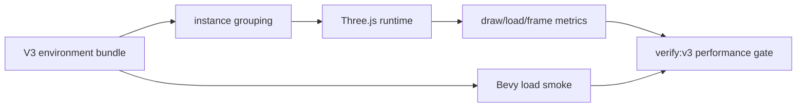
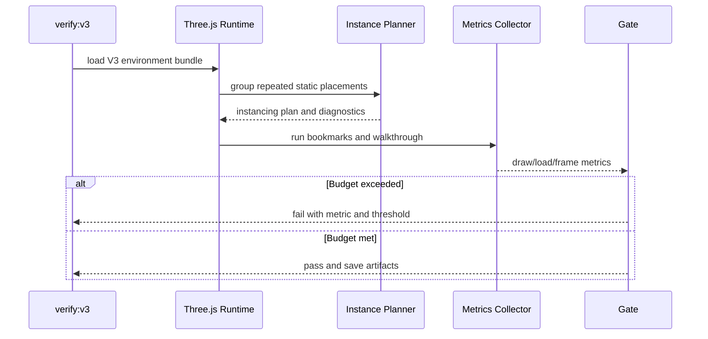

# V3-02 Three.js Performance and Instancing

Complexity: 9 -> HIGH mode

## Context

**Problem:** The `Preview_2.jpg` forest scene is dense enough that V3 must make
Three.js performance a first-class product gate, not an afterthought measured
after the scene is visually assembled.

**Files Analyzed:** `docs/ROADMAP.md`, `docs/PRDs/v2/V2-01-cross-runtime-conformance-and-regression-harness.md`,
`docs/PRDs/v2/V2-06-asset-pipeline.md`,
`docs/PRDs/v2/V2-07-rendering-parity-extensions.md`,
`docs/PRDs/v2/V2-11-arena-demo-template.md`,
`docs/PRDs/v2/V2-12-dev-loop-and-release-gate.md`,
`docs/PRDs/v3/V3-01-scene-asset-bundling-and-budgets.md`,
`assets-source/environment`, `packages/ir`, `packages/compiler`,
`packages/runtime-web-three`, `packages/cli`, `runtime-bevy`.

**Current Behavior:**

- V2 plans runtime parity and basic asset loading, but not dense vegetation
  instancing or web performance budgets.
- The V3 roadmap requires budgets for draw calls, instance counts, triangle
  count, texture memory, bundle size, load time, and frame pacing.
- Runtime-web Three.js is the strict V3 performance target because the
  reference scene is vegetation-heavy.
- There is no fixed camera walkthrough or repeatable measurement artifact for
  the environment preview.

## Solution

**Approach:**

- Add explicit render performance budget fields to the V3 target profile and
  verification report.
- Add source-asset grouping and runtime instancing for repeated vegetation,
  rocks, mushrooms, flowers, pebbles, and grass clusters in the Three.js
  runtime.
- Measure draw calls, instance groups, approximate triangle counts, asset load
  timing, and frame timing over fixed camera bookmarks and a short walkthrough.
- Fail `verify:v3` on hard budget violations and save performance artifacts for
  review.
- Keep Bevy behavior aligned at the IR contract level, but do not make Bevy the
  stricter performance gate for V3.

**Key Decisions:**

- Use Three.js `InstancedMesh` or equivalent runtime batching for repeated
  static props that share geometry and material.
- Keep semantic scene instances in IR; instancing is a runtime optimization
  selected from validated grouping metadata.
- Use fixed, deterministic camera bookmarks and a scripted walkthrough for
  measurements so regressions are comparable.
- Treat performance budgets as product acceptance criteria, not optional
  telemetry.
- Exclude custom shaders, postprocessing chains, broad material graph work, and
  general renderer abstractions.

**Data Changes:** Extends target profile, scene optimization hints, runtime
metric reports, and V3 verification artifacts.

## Integration Points

**How will this feature be reached?**

- [x] Entry point identified: `pnpm tn -- verify --project examples/v3-environment --profile v3-environment`
  and `pnpm verify:v3`.
- [x] Caller file identified: Three.js runtime environment loader, CLI V3
  verification profile, compiler/validator budget report.
- [x] Registration/wiring needed: V3 target performance profile, runtime metrics
  collector, scripted camera walkthrough, verify report fields.

**Is this user-facing?** Yes. The web preview must remain interactive and the
release report must explain why content is accepted or rejected.

**Full user flow:**

1. User builds the V3 environment bundle.
2. User runs `pnpm verify:v3`.
3. Web runtime loads the bundle, groups repeated static props into instancing
   buckets, and runs a fixed camera walkthrough.
4. Metrics are written to the V3 report.
5. The gate passes only if draw, load, frame, and asset budgets stay within the
   Three.js target profile.

## Sequence Flow

## Execution Phases

#### Phase 1: Performance Budget Contract - V3 reports measurable web limits

**User-visible outcome:** The V3 build and verify reports include named
Three.js performance budgets before runtime optimization work starts.

**Files (max 5):**

- `packages/ir/src/performanceProfile.ts` - V3 performance budget types.
- `packages/ir/src/performanceProfile.test.ts` - schema and validation tests.
- `examples/v3-environment/v3.target.json` - initial Three.js budget values.
- `packages/compiler/src/budgets.ts` - include render budget thresholds in
  build report.
- `docs/developer-workflow.md` - document V3 performance gate commands.

**Implementation:**

- [ ] Add hard and warning thresholds for draw calls, instanced groups,
  uninstanced repeated props, approximate triangles, texture bytes, bundle
  bytes, asset load time, average frame time, p95 frame time, and worst frame
  time.
- [ ] Validate thresholds as positive finite numbers with warning thresholds at
  or below hard thresholds.
- [ ] Mark the web target as required for V3 release; Bevy load smoke remains a
  compatibility check.
- [ ] Include budget thresholds in build output even before runtime metrics are
  available.
- [ ] Keep budget values in the example target profile so they can be tuned with
  evidence.

**Tests Required:**

| Test File | Test Name | Assertion |
| --- | --- | --- |
| `packages/ir/src/performanceProfile.test.ts` | `should validate the v3 threejs performance profile` | Initial V3 target profile passes schema validation. |
| `packages/ir/src/performanceProfile.test.ts` | `should reject warning thresholds above hard thresholds` | Validator reports the invalid metric name. |
| `packages/compiler/src/budgets.test.ts` | `should include v3 performance thresholds in the budget report` | Build report exposes draw, load, frame, and triangle thresholds. |

**Verification Plan:**

- Unit tests: `pnpm --filter @threenative/ir test -- --run performanceProfile`
- Compiler tests: `pnpm --filter @threenative/compiler test -- --run budgets`
- Integration proof: `pnpm tn -- build --project examples/v3-environment --json`
- Evidence required: JSON report includes both content budgets and runtime
  performance thresholds.

**User Verification:**

- Action: Set an invalid `p95FrameMs.warn` above `p95FrameMs.max` and build.
- Expected: Validation fails with a stable performance profile diagnostic.

**Checkpoint:**

- Automated: run `prd-work-reviewer` for Phase 1 of this PRD and continue only
  after PASS.
- Manual: inspect the target profile and confirm every metric used by the V3
  roadmap has a named threshold.

#### Phase 2: Instance Planning - Repeated forest props batch by asset and material

**User-visible outcome:** The web runtime can load dense repeated vegetation
without creating one draw call per placed prop.

**Files (max 5):**

- `packages/runtime-web-three/src/instancing.ts` - instancing plan builder.
- `packages/runtime-web-three/src/instancing.test.ts` - grouping tests.
- `packages/runtime-web-three/src/environment.ts` - apply instancing plan to
  V3 placements.
- `packages/ir/src/environment.ts` - optional optimization hints and validation.
- `examples/v3-environment/src/scene.ts` - mark repeated static prop classes.

**Implementation:**

- [ ] Group static placements by source asset ID, geometry identity, material
  identity, and compatible render flags.
- [ ] Use Three.js `InstancedMesh` for repeated grasses, clover, ferns, flowers,
  mushrooms, pebbles, rocks, bushes, and repeated tree variants when geometry
  and material compatibility allow it.
- [ ] Leave authored hero placements unbatched when they need unique transforms,
  material overrides, collision roles, or diagnostics.
- [ ] Emit runtime diagnostics for placements that were expected to instance but
  were left uninstanced.
- [ ] Preserve semantic entity IDs or debug metadata so verification can still
  relate visible instances back to scene composition data.

**Tests Required:**

| Test File | Test Name | Assertion |
| --- | --- | --- |
| `packages/runtime-web-three/src/instancing.test.ts` | `should group compatible repeated grass placements into one instanced mesh` | Plan contains one instanced group with expected count. |
| `packages/runtime-web-three/src/instancing.test.ts` | `should keep material override placements out of instanced groups` | Incompatible placement remains a standalone mesh with diagnostic context. |
| `packages/runtime-web-three/src/environment.test.ts` | `should apply the v3 instancing plan during forest load` | Runtime creates instanced groups for repeated vegetation and rocks. |

**Verification Plan:**

- Unit tests:
  `pnpm --filter @threenative/runtime-web-three test -- --run instancing`
- Runtime tests:
  `pnpm --filter @threenative/runtime-web-three test -- --run environment`
- Integration proof:
  `pnpm tn -- verify --project examples/v3-environment --profile v3-environment`
- Evidence required: runtime report lists instanced group count, instance count,
  and uninstanced repeated prop count.

**User Verification:**

- Action: Run V3 web preview with metrics overlay or JSON report enabled.
- Expected: Repeated vegetation and rocks appear as instanced groups, while hero
  trees and unique focal objects remain individually inspectable.

**Checkpoint:**

- Automated: run `prd-work-reviewer` for Phase 2 of this PRD and continue only
  after PASS.
- Manual: inspect runtime metrics and confirm repeated prop classes are batched
  rather than emitted as hundreds of standalone meshes.

#### Phase 3: Web Metrics Collector - Load and frame timing are repeatable

**User-visible outcome:** The V3 web preview saves draw-call, load-time, and
frame-timing artifacts from fixed bookmarks and a short first-person
walkthrough.

**Files (max 5):**

- `packages/runtime-web-three/src/performanceMetrics.ts` - metrics collector.
- `packages/runtime-web-three/src/performanceMetrics.test.ts` - collector tests.
- `packages/runtime-web-three/src/verifyWalkthrough.ts` - deterministic camera
  walkthrough runner.
- `packages/cli/src/verify/v3Environment.ts` - collect and save web metrics.
- `packages/cli/src/verify/v3Environment.test.ts` - metrics report tests.

**Implementation:**

- [ ] Capture asset load timing from bundle load start to first rendered
  bookmarked frame.
- [ ] Capture renderer info for draw calls, triangles, geometries, textures, and
  program counts where Three.js exposes stable values.
- [ ] Capture frame timing over fixed camera bookmarks and a short scripted path
  walkthrough.
- [ ] Save raw samples and summarized average, p95, and worst frame times.
- [ ] Make tests deterministic with fake timers and mocked renderer info where
  browser timing is not stable.

**Tests Required:**

| Test File | Test Name | Assertion |
| --- | --- | --- |
| `packages/runtime-web-three/src/performanceMetrics.test.ts` | `should summarize frame timing samples with average p95 and worst frame` | Summary values match deterministic sample input. |
| `packages/runtime-web-three/src/performanceMetrics.test.ts` | `should include renderer draw and texture metrics` | Metrics include calls, triangles, geometries, and textures from renderer info. |
| `packages/cli/src/verify/v3Environment.test.ts` | `should save v3 web performance artifacts` | Verify report links raw samples and summary JSON paths. |

**Verification Plan:**

- Runtime tests:
  `pnpm --filter @threenative/runtime-web-three test -- --run performanceMetrics`
- CLI tests: `pnpm --filter @threenative/cli test -- --run v3Environment`
- Integration proof:
  `pnpm tn -- verify --project examples/v3-environment --profile v3-environment`
- Evidence required: saved raw samples, summary metrics JSON, and screenshots
  for the fixed bookmarks.

**User Verification:**

- Action: Run V3 verification twice without changing the scene.
- Expected: Metric summaries are comparable and artifact paths are stable,
  allowing regressions to be reviewed.

**Checkpoint:**

- Automated: run `prd-work-reviewer` for Phase 3 of this PRD and continue only
  after PASS.
- Manual: inspect the saved metrics summary and confirm it includes load timing,
  renderer counts, and frame timing for the walkthrough.

#### Phase 4: Performance Gate - `verify:v3` fails actionable budget regressions

**User-visible outcome:** Over-budget V3 scenes fail with exact metric values,
thresholds, and suggested content/runtime fixes.

**Files (max 5):**

- `packages/cli/src/verify/performanceGate.ts` - budget comparison logic.
- `packages/cli/src/verify/performanceGate.test.ts` - pass/fail tests.
- `packages/cli/src/verify/v3Environment.ts` - wire gate into V3 profile.
- `scripts/verify-v3.*` - ensure performance gate runs in top-level command.
- `docs/PRDs/v3/V3-02-threejs-performance-and-instancing.md` - update
  evidence section after implementation.

**Implementation:**

- [ ] Compare measured metrics against the V3 target profile.
- [ ] Fail hard budget violations and record warnings separately.
- [ ] Include metric name, actual value, threshold, phase, artifact path, and
  suggested fix in diagnostics.
- [ ] Require instancing coverage for repeated static classes that exceed their
  standalone count threshold.
- [ ] Keep the gate deterministic enough for CI by using fixed viewport,
  bookmark order, and walkthrough duration.

**Tests Required:**

| Test File | Test Name | Assertion |
| --- | --- | --- |
| `packages/cli/src/verify/performanceGate.test.ts` | `should pass when v3 web metrics are within budget` | Gate returns pass with no hard diagnostics. |
| `packages/cli/src/verify/performanceGate.test.ts` | `should fail when p95 frame time exceeds the v3 threshold` | Diagnostic includes metric, actual value, threshold, and artifact path. |
| `packages/cli/src/verify/performanceGate.test.ts` | `should fail when repeated vegetation is not instanced` | Diagnostic names repeated asset class and expected instancing fix. |

**Verification Plan:**

- CLI tests:
  `pnpm --filter @threenative/cli test -- --run performanceGate`
- Full gate: `pnpm verify:v3`
- Negative proof: lower `maxDrawCalls` or `p95FrameMs.max` in a fixture target
  and confirm `verify:v3` fails.
- Evidence required: passing report for the real scene and failing fixture
  report for a deliberate budget violation.

**User Verification:**

- Action: Temporarily set `p95FrameMs.max` below the measured value and run
  `pnpm verify:v3`.
- Expected: Gate fails with the measured p95 frame time, configured threshold,
  and a link to the metrics artifact.

**Checkpoint:**

- Automated: run `prd-work-reviewer` for Phase 4 of this PRD and continue only
  after PASS.
- Manual: review the failure output from the deliberate budget violation and
  confirm it is understandable without inspecting source code.

#### Phase 5: Visual and Performance Release Evidence - The forest scene remains fast and recognizable

**User-visible outcome:** The final V3 report proves the forest scene is
nonblank, populated, framed from bookmarks, and inside the Three.js performance
budget.

**Files (max 5):**

- `packages/cli/src/verify/v3VisualPerformance.ts` - combined visual and
  performance report checks.
- `packages/cli/src/verify/v3VisualPerformance.test.ts` - artifact tests.
- `examples/v3-environment/README.md` - explain expected artifacts.
- `scripts/check-docs-v3.*` - require performance artifact docs.
- `docs/developer-workflow.md` - release checklist for V3 measurements.

**Implementation:**

- [ ] Capture screenshots for entry path, mid path, and dense side vegetation
  bookmarks.
- [ ] Assert screenshots are nonblank and include expected population markers
  from representative asset classes.
- [ ] Attach performance metrics to each bookmark and the walkthrough summary.
- [ ] Link visual and performance artifacts from one V3 report.
- [ ] Document that rough composition against `Preview_2.jpg` is product-level
  verification, not pixel-perfect comparison.

**Tests Required:**

| Test File | Test Name | Assertion |
| --- | --- | --- |
| `packages/cli/src/verify/v3VisualPerformance.test.ts` | `should require screenshots for all v3 camera bookmarks` | Report fails when one bookmark screenshot is missing. |
| `packages/cli/src/verify/v3VisualPerformance.test.ts` | `should include performance summary beside visual artifacts` | Report links screenshot paths and metric summary paths. |
| `scripts/check-docs-v3.*` | `should require v3 performance artifact docs` | Docs gate fails if V3 artifact workflow is undocumented. |

**Verification Plan:**

- CLI tests:
  `pnpm --filter @threenative/cli test -- --run v3VisualPerformance`
- Docs gate: `pnpm check:docs:v3`
- Release gate: `pnpm verify:v3`
- Evidence required: report links screenshots, raw metrics, summary metrics,
  budget comparison, runtime logs, and source bundle paths.

**User Verification:**

- Action: Open the saved V3 screenshots and metrics summary after `pnpm verify:v3`.
- Expected: Screenshots show a dense first-person forest path similar in product
  intent to `Preview_2.jpg`, and metrics are under the configured Three.js
  thresholds.

**Checkpoint:**

- Automated: run `prd-work-reviewer` for Phase 5 of this PRD and continue only
  after PASS.
- Manual: perform the final artifact review before declaring V3 performance
  complete.

## Checkpoint Protocol

After each phase:

- Automated checkpoint is required. Use the `prd-work-reviewer` agent with:
  `Review checkpoint for phase N of PRD at docs/PRDs/v3/V3-02-threejs-performance-and-instancing.md`.
- Continue only when the reviewer reports PASS.
- Manual checkpoint is required because the work is performance-sensitive and
  includes visual artifacts that automated tests cannot fully judge.
- Record changed files, metric artifacts, test commands, and pass/fail status
  before starting the next phase.

## Release Protocol

V3-02 can be marked complete only when:

- `pnpm --filter @threenative/ir test -- --run performanceProfile`
- `pnpm --filter @threenative/runtime-web-three test -- --run instancing`
- `pnpm --filter @threenative/runtime-web-three test -- --run performanceMetrics`
- `pnpm --filter @threenative/cli test -- --run performanceGate`
- `pnpm --filter @threenative/cli test -- --run v3VisualPerformance`
- `pnpm check:docs:v3`
- `pnpm verify:v3`

All commands must pass, and the final V3 verification report must include
instancing, draw-call, load-time, frame-time, screenshot, and budget-comparison
artifacts.

## Acceptance Criteria

- [ ] V3 target profiles define Three.js-first budgets for draw calls,
  instances, triangles, texture memory, bundle size, load time, and frame
  pacing.
- [ ] Repeated forest props use runtime instancing or produce actionable
  diagnostics explaining why they did not.
- [ ] Web performance metrics are captured over fixed bookmarks and a short
  first-person walkthrough.
- [ ] `verify:v3` fails hard budget violations with metric values, thresholds,
  artifact paths, and suggested fixes.
- [ ] Visual verification artifacts and performance metrics are linked from one
  release report.
- [ ] Scope remains limited to making the `Preview_2.jpg` first-person forest
  scene performant in the Three.js web preview while preserving portable bundle
  semantics.
