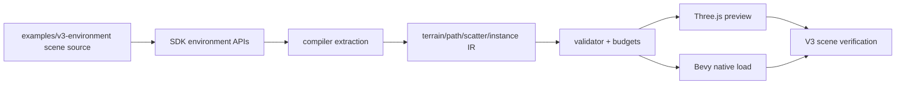

# V3-03 Environment Scene Authoring

Complexity: 9 -> HIGH mode

## Context

**Problem:** V3 needs a deterministic authoring path for the
`Preview_2.jpg` forest scene so dense terrain, path, scatter, and hero
placements can compile into one portable bundle instead of hand-authored entity
lists.

**Files Analyzed:** `docs/ROADMAP.md`, `docs/ir.md`,
`docs/runtime-adapters.md`, `docs/PRDs/v2/V2-01-cross-runtime-conformance-and-regression-harness.md`,
`docs/PRDs/v2/V2-06-asset-pipeline.md`,
`docs/PRDs/v2/V2-07-rendering-parity-extensions.md`,
`docs/PRDs/v2/V2-11-arena-demo-template.md`,
`docs/PRDs/v2/V2-12-dev-loop-and-release-gate.md`,
`assets-source/environment`.

**Current Behavior:**

- V2 can represent small gameplay scenes and static assets, but V3 needs
  hundreds of repeated environment instances.
- The roadmap calls out missing terrain/path representation, deterministic
  scattering, prefab/scene instancing, and author-controlled hero placements.
- The source pack already contains the required forest, rock, grass, flower,
  mushroom, and path props; the gap is composition, validation, and repeatable
  bundle output.
- V3 must stay scoped to the `Preview_2` forest path proof instead of becoming
  a general terrain editor.

## Solution

**Approach:**

- Add a V3 environment authoring layer for one forest path scene: walkable
  terrain, path ribbon/clearing data, deterministic scatter zones, exclusion
  zones, and hand-authored hero placements.
- Lower authoring data into portable IR with stable IDs, deterministic instance
  order, and explicit required capabilities.
- Validate asset references, scatter seeds, bounds, density limits, collision
  flags, and path/walkable constraints before runtime.
- Map the same bundle into the Three.js web runtime and Bevy native runtime,
  preserving instance semantics and camera verification bookmarks.
- Treat `examples/v3-environment` as the canonical proof, not a reusable level
  editor.

**Data Changes:** Extends world/environment IR with terrain/path data,
scatter specs, prefab or source asset instance references, hero placements,
walkable/collision metadata, and camera bookmarks.

## Integration Points

**How will this feature be reached?**

- [x] Entry point identified: `examples/v3-environment` source, `tn build`,
  `tn dev --target web`, `tn dev --target desktop`, `tn verify --profile v3`,
  and `pnpm verify:v3`.
- [x] Caller file identified: SDK environment authoring APIs, compiler bundle
  emit, IR validator, runtime bundle loaders, and V3 verify profile.
- [x] Registration/wiring needed: SDK exports, compiler extractors, IR schema
  registration, runtime mappers, example package scripts, and top-level
  `verify:v3`.

**Is this user-facing?** Yes, this is the user-visible environment scene
authoring workflow for the V3 proof.

**Full user flow:**

1. User opens `examples/v3-environment` and edits the forest path scene source.
2. Scene source declares terrain, a winding path, scatter zones, exclusion
   zones, hero placements, and camera bookmarks.
3. `tn build --project examples/v3-environment` emits a deterministic V3 bundle.
4. `tn dev --target web --project examples/v3-environment` renders the
   authored scene in the Three.js preview.
5. `pnpm verify:v3` validates the bundle, runs web visual checks, and runs a
   native Bevy load smoke check.

## Execution Phases

#### Phase 1: Terrain and Path Slice - The forest path validates and renders as walkable ground

**Files (max 5):**

- `packages/sdk/src/environment.ts` - terrain, path, and walkable surface APIs.
- `packages/ir/src/environment.ts` - V3 environment IR schemas.
- `packages/compiler/src/emit/environment.ts` - compiler lowering for terrain
  and path data.
- `packages/ir/src/environment.test.ts` - schema and validation tests.
- `examples/v3-environment/src/scene.ts` - first terrain/path scene source.

**Implementation:**

- [ ] Add a minimal `EnvironmentTerrain` authoring API for the V3 scene with a
  bounded rectangular terrain, height mode limited to flat or authored control
  points, and material slot references.
- [ ] Add `EnvironmentPath` data for the central walkable route: ordered
  control points, width, edge falloff, path material ID, and clearing radius.
- [ ] Emit deterministic IR IDs for terrain, path segments, and path metadata.
- [ ] Validate that path control points stay inside terrain bounds and that
  path width, falloff, and clearing radius are positive finite numbers.
- [ ] Reject arbitrary terrain editors, runtime terrain mutation, navmesh
  generation, and shader-based terrain blending in V3.

**Tests Required:**

| Test File | Test Name | Assertion |
| --- | --- | --- |
| `packages/ir/src/environment.test.ts` | `should validate v3 forest path terrain when path stays in bounds` | Terrain and path IR pass validation and preserve control point order. |
| `packages/ir/src/environment.test.ts` | `should reject environment path when control point leaves terrain bounds` | Diagnostic names the path ID and offending point index. |
| `packages/compiler/src/emit/environment.test.ts` | `should emit deterministic terrain and path ids when source order is stable` | Repeated emits produce byte-identical environment IR. |

**User Verification:**

- Action: Run `pnpm tn -- build --project examples/v3-environment` and then
  `pnpm tn -- dev --target web --project examples/v3-environment`.
- Expected: The preview shows a readable central path on ground, and invalid
  path bounds fail at build time with an actionable diagnostic.

**Checkpoint Protocol:**

- Automated: spawn `prd-work-reviewer` with
  `Review checkpoint for phase 1 of PRD at docs/PRDs/v3/V3-03-environment-scene-authoring.md`.
- Manual: capture a web screenshot from the start bookmark and confirm the
  path is visible, centered enough for first-person entry, and not covered by
  scatter because scatter is not enabled yet.

#### Phase 2: Deterministic Scatter - Repeated forest props are generated from stable specs

**Files (max 5):**

- `packages/sdk/src/environment.ts` - scatter zone and exclusion zone APIs.
- `packages/ir/src/environment.ts` - scatter and exclusion schemas.
- `packages/compiler/src/emit/environment.ts` - scatter expansion or serialized
  scatter spec emit.
- `packages/compiler/src/emit/environment.test.ts` - deterministic scatter
  tests.
- `examples/v3-environment/src/scatter.ts` - forest prop scatter specs.

**Implementation:**

- [ ] Add scatter specs with `seed`, `assetIds`, `bounds`, `density`,
  `minScale`, `maxScale`, `rotation`, `slopeLimit`, `tags`, and
  `collisionMode`.
- [ ] Add exclusion zones for the path, hero placements, camera start area, and
  walkable clearings.
- [ ] Choose one deterministic lowering strategy and document it in code:
  either compiler-expanded instances or serialized specs expanded by runtimes
  with the same PRNG algorithm. Prefer compiler-expanded instances if that is
  simpler to verify across runtimes.
- [ ] Generate stable instance IDs that include scatter ID, asset ID, and
  deterministic index.
- [ ] Validate density and count budgets before runtime and reject scatter specs
  that exceed the V3 target profile.

**Tests Required:**

| Test File | Test Name | Assertion |
| --- | --- | --- |
| `packages/compiler/src/emit/environment.test.ts` | `should emit identical scatter instances when seed and bounds are unchanged` | Two compiler runs produce identical IDs, transforms, and asset refs. |
| `packages/compiler/src/emit/environment.test.ts` | `should avoid path exclusion zones when scattering forest props` | No emitted instance center falls inside the path clearing. |
| `packages/ir/src/environment.test.ts` | `should reject scatter spec when density exceeds v3 budget` | Validator reports scatter ID, count estimate, and configured limit. |

**User Verification:**

- Action: Build the V3 example twice, diff the emitted environment/world IR,
  and open the web preview.
- Expected: Bundle output is deterministic, the path remains clear, and trees,
  bushes, grass, flowers, mushrooms, pebbles, and rocks populate both sides of
  the route.

**Checkpoint Protocol:**

- Automated: spawn `prd-work-reviewer` with
  `Review checkpoint for phase 2 of PRD at docs/PRDs/v3/V3-03-environment-scene-authoring.md`.
- Manual: capture start, mid-path, and bend bookmarks; confirm each image is
  nonblank, dense, and still walkable.

#### Phase 3: Hero Placements and Camera Bookmarks - The scene has authored focal objects

**Files (max 5):**

- `packages/sdk/src/environment.ts` - hero placement and bookmark APIs.
- `packages/ir/src/environment.ts` - hero placement and bookmark schemas.
- `packages/compiler/src/emit/environment.ts` - hero placement and bookmark
  lowering.
- `packages/compiler/src/emit/environment.test.ts` - hero placement tests.
- `examples/v3-environment/src/heroPlacements.ts` - authored foreground and
  focal placements.

**Implementation:**

- [ ] Add hero placements for foreground trees, major rocks, path-edge
  mushrooms, flowers, and distant focal objects visible from `Preview_2`
  bookmarks.
- [ ] Allow per-placement transform, asset ID, collision mode, render group,
  and scatter exclusion radius.
- [ ] Add camera bookmarks with stable IDs, position, yaw/pitch, expected
  visible asset tags, and optional reference image notes.
- [ ] Validate unique placement IDs, valid asset IDs, finite transforms, and
  nonoverlap with walkable path clearances.
- [ ] Keep hero placements data-only; do not allow runtime scripts or
  renderer-specific overrides in placement records.

**Tests Required:**

| Test File | Test Name | Assertion |
| --- | --- | --- |
| `packages/compiler/src/emit/environment.test.ts` | `should emit hero placements before scatter instances for stable visual priority` | Output order groups terrain, hero placements, then scatter. |
| `packages/ir/src/environment.test.ts` | `should reject hero placement when referenced asset is missing` | Diagnostic includes placement ID and missing asset ID. |
| `packages/ir/src/environment.test.ts` | `should validate camera bookmarks with expected asset tags` | Bookmark data accepts position, orientation, and expected tags. |

**User Verification:**

- Action: Run `pnpm tn -- verify --project examples/v3-environment --profile v3-scene`.
- Expected: Verification reports all bookmarks and confirms representative
  asset tags are visible from each bookmark.

**Checkpoint Protocol:**

- Automated: spawn `prd-work-reviewer` with
  `Review checkpoint for phase 3 of PRD at docs/PRDs/v3/V3-03-environment-scene-authoring.md`.
- Manual: compare bookmark screenshots against `assets-source/environment/Preview_2.jpg`
  for product-level composition: central path, foreground framing trees, rocks,
  low vegetation, and background depth.

#### Phase 4: Runtime Instance Mapping - Web and Bevy load the same authored composition

**Files (max 5):**

- `packages/runtime-web-three/src/environment.ts` - Three.js terrain, path,
  placement, and instance mapping.
- `packages/runtime-web-three/src/environment.test.ts` - web mapping tests.
- `runtime-bevy/src/environment.rs` - Bevy environment mapping.
- `runtime-bevy/tests/environment.rs` - native mapping tests.
- `packages/ir/fixtures/conformance/v3-environment-authoring` - shared fixture
  bundle for environment authoring semantics.

**Implementation:**

- [ ] Map terrain/path to renderable ground in Three.js and Bevy with matching
  semantic dimensions.
- [ ] Map repeated vegetation and props as instances or runtime entities
  without changing stable source instance IDs.
- [ ] Preserve collision metadata for first-person movement work, even if
  collision enforcement lands in a separate V3 PRD.
- [ ] Emit runtime diagnostics if an adapter cannot represent a supported V3
  environment field.
- [ ] Add normalized conformance observations for terrain bounds, path points,
  hero placement IDs, scatter counts by tag, and bookmark transforms.

**Tests Required:**

| Test File | Test Name | Assertion |
| --- | --- | --- |
| `packages/runtime-web-three/src/environment.test.ts` | `should map v3 environment fixture to terrain path and instances` | Web observation includes terrain, path, hero IDs, and scatter counts. |
| `runtime-bevy/tests/environment.rs` | `should map v3 environment fixture to terrain path and instances` | Bevy observation includes matching semantic fields. |
| `packages/ir/src/conformance.test.ts` | `should validate v3 environment authoring fixture` | Shared fixture validates and carries V3 capability tags. |

**User Verification:**

- Action: Run `pnpm verify:conformance` and load
  `examples/v3-environment` on web and native.
- Expected: Both runtimes consume the same bundle; web renders the dense scene,
  and native reaches a first-person bookmark without unsupported-field
  diagnostics.

**Checkpoint Protocol:**

- Automated: spawn `prd-work-reviewer` with
  `Review checkpoint for phase 4 of PRD at docs/PRDs/v3/V3-03-environment-scene-authoring.md`.
- Manual: inspect web screenshots and native load logs to confirm both use the
  same bundle path and stable scene IDs.

#### Phase 5: V3 Scene Gate - Environment authoring is part of the release proof

**Files (max 5):**

- `packages/cli/src/verify/v3Scene.ts` - environment scene verification
  profile.
- `packages/cli/src/verify/report.ts` - V3 scene report fields.
- `scripts/verify-v3.*` - top-level V3 gate.
- `package.json` - `verify:v3` script.
- `docs/PRDs/v3/README.md` - V3 PRD index and release notes.

**Implementation:**

- [ ] Build the V3 example from source before every scene verification run.
- [ ] Save deterministic bundle hash, environment IR path, scatter counts,
  hero placement counts, bookmark screenshot paths, validator diagnostics, and
  runtime logs.
- [ ] Fail if the path is missing, required asset classes are absent, bookmark
  screenshots are blank, scatter exceeds budget, or the Bevy runtime cannot
  load the bundle.
- [ ] Keep the profile scoped to `Preview_2` and the tracked V3 example.
- [ ] Document the command sequence for developers and AI agents.

**Tests Required:**

| Test File | Test Name | Assertion |
| --- | --- | --- |
| `packages/cli/src/verify/v3Scene.test.ts` | `should report v3 scene authoring artifacts when verification passes` | Report includes bundle hash, counts, screenshots, and log paths. |
| `packages/cli/src/verify/v3Scene.test.ts` | `should fail v3 scene verification when required asset tag is absent` | Verification exits nonzero and names the missing tag/bookmark. |
| `scripts/verify-v3.*` | `should run v3 scene verification profile` | Script exits nonzero when the scene report fails. |

**User Verification:**

- Action: Run `pnpm verify:v3`.
- Expected: V3 report proves the authored forest path scene builds, validates,
  renders on web from bookmarks, and loads in Bevy.

**Checkpoint Protocol:**

- Automated: spawn `prd-work-reviewer` with
  `Review checkpoint for phase 5 of PRD at docs/PRDs/v3/V3-03-environment-scene-authoring.md`.
- Manual: review the saved verification report and bookmark screenshots before
  marking V3 scene authoring complete.

## Verification Strategy

- `pnpm --filter @threenative/ir test -- --run environment`
- `pnpm --filter @threenative/compiler test -- --run environment`
- `pnpm --filter @threenative/runtime-web-three test -- --run environment`
- `cd runtime-bevy && cargo test environment`
- `pnpm verify:conformance`
- `pnpm tn -- build --project examples/v3-environment`
- `pnpm tn -- verify --project examples/v3-environment --profile v3-scene`
- `pnpm verify:v3`

## Release and Checkpoint Protocol

- Complete phases in order; do not begin the next phase until the automated
  checkpoint for the current phase reports PASS.
- Every phase requires a `prd-work-reviewer` checkpoint against this PRD.
- Every phase also requires manual screenshot/log review because V3 scene
  authoring is visual and content-density sensitive.
- The release gate must archive bundle hashes, environment IR, validator
  output, web screenshots, web runtime logs, Bevy load logs, and verification
  JSON under deterministic artifact paths.
- V3 scene authoring is releasable only when `pnpm verify:v3` includes this
  scene profile and passes from a clean checkout.

## Acceptance Criteria

- [ ] `examples/v3-environment` defines the `Preview_2` forest path scene with
  terrain, central path, scatter, exclusion zones, hero placements, and camera
  bookmarks.
- [ ] Scene authoring emits deterministic portable IR and stable source
  instance IDs.
- [ ] Validator rejects missing assets, invalid path data, over-budget scatter,
  duplicate IDs, and unsupported V3 environment fields.
- [ ] Web and Bevy runtimes load the same environment composition semantics.
- [ ] Visual verification proves a nonblank, dense, walkable forest path scene
  from required bookmarks.
- [ ] `pnpm verify:v3` includes the environment scene authoring gate and passes.
