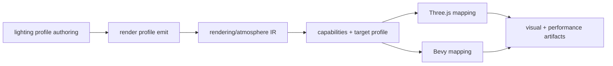

# V3-04 Rendering Atmosphere Parity

Complexity: 8 -> HIGH mode

## Context

**Problem:** The V3 `Preview_2` forest scene needs portable rendering and
atmosphere fields so the same bundle carries warm sun, ambient fill, fog/sky,
shadows, and color-management intent across Three.js web and Bevy native
runtimes.

**Files Analyzed:** `docs/ROADMAP.md`, `docs/ir.md`,
`docs/runtime-adapters.md`, `docs/PRDs/v2/V2-01-cross-runtime-conformance-and-regression-harness.md`,
`docs/PRDs/v2/V2-06-asset-pipeline.md`,
`docs/PRDs/v2/V2-07-rendering-parity-extensions.md`,
`docs/PRDs/v2/V2-11-arena-demo-template.md`,
`docs/PRDs/v2/V2-12-dev-loop-and-release-gate.md`,
`assets-source/environment`.

**Current Behavior:**

- V2 rendering parity covers demo-needed primitives, lights, cameras, and
  visibility, but not a full environment lighting profile.
- The V3 roadmap requires sun direction, ambient fill, fog or haze, sky color,
  shadows, color management, target diagnostics, and material parity for the
  forest pack.
- Pixel-perfect parity is not the goal, but both runtimes must preserve the
  same authored atmosphere semantics and fail explicitly on unsupported fields.
- The Three.js web preview is the strict performance and visual verification
  target for the dense forest path scene.

## Solution

**Approach:**

- Add a portable V3 `EnvironmentLightingProfile` that covers directional sun,
  ambient fill, fog/haze, sky color, shadow policy, tone mapping, output color
  space, exposure, and material color interpretation.
- Map the profile into Three.js and Bevy with documented approximations and
  diagnostics for unsupported or downgraded fields.
- Add conformance fixtures that compare semantic runtime observations, not
  pixel-perfect screenshots.
- Add visual verification focused on product-level composition for
  `Preview_2`: warm sunlight, readable depth, visible path, shaped shadows, and
  non-flat vegetation materials.
- Keep custom shaders, postprocessing chains, advanced material graphs, and
  broad renderer compatibility out of V3.

**Data Changes:** Extends rendering/environment IR with atmosphere resources,
shadow settings, color-management settings, material texture interpretation
metadata, target capability flags, and verification observations.

## Integration Points

**How will this feature be reached?**

- [x] Entry point identified: V3 scene source lighting profile,
  `tn build`, `tn dev --target web`, `tn dev --target desktop`,
  `tn verify --profile v3-atmosphere`, and `pnpm verify:v3`.
- [x] Caller file identified: SDK rendering/environment APIs, compiler render
  emit, IR validator, web and Bevy render mappers, and V3 verify profile.
- [x] Registration/wiring needed: SDK exports, IR schemas, manifest required
  capabilities, target-profile checks, runtime mappings, conformance fixture,
  and release-gate scripts.

**Is this user-facing?** Yes, users see the atmosphere directly in the V3 web
preview and native load proof.

**Full user flow:**

1. User edits the V3 environment lighting profile in
   `examples/v3-environment`.
2. `tn build --project examples/v3-environment` emits the profile into the
   portable bundle.
3. Validator checks the selected web and native target profiles before runtime.
4. Web and Bevy runtimes map the same profile to their renderer backends.
5. `pnpm verify:v3` captures screenshots, runtime observations, and
   performance measurements for the atmosphere profile.

## Execution Phases

#### Phase 1: Lighting Profile IR - Sun and ambient intent validate before runtime

**Files (max 5):**

- `packages/sdk/src/rendering/atmosphere.ts` - V3 lighting profile authoring
  API.
- `packages/ir/src/rendering.ts` - lighting profile schema and validation.
- `packages/compiler/src/emit/rendering.ts` - lighting profile emit.
- `packages/ir/src/rendering.test.ts` - lighting profile validation tests.
- `examples/v3-environment/src/lighting.ts` - `Preview_2` sun and ambient
  profile.

**Implementation:**

- [ ] Add one active V3 lighting profile resource per scene.
- [ ] Represent directional sun with direction or azimuth/elevation, color,
  intensity, optional shadow casting, and stable ID.
- [ ] Represent ambient fill with color, intensity, and mode limited to
  constant/hemisphere if both target runtimes can map it.
- [ ] Validate finite numeric values, supported color formats, positive
  intensities, one active profile, and required target capabilities.
- [ ] Reject multiple competing active atmosphere profiles and unsupported
  renderer-specific light fields.

**Tests Required:**

| Test File | Test Name | Assertion |
| --- | --- | --- |
| `packages/ir/src/rendering.test.ts` | `should validate v3 sun and ambient profile when fields are supported` | Profile passes schema and required capabilities include V3 lighting. |
| `packages/ir/src/rendering.test.ts` | `should reject v3 lighting profile when sun intensity is negative` | Diagnostic includes profile ID and field path. |
| `packages/compiler/src/emit/rendering.test.ts` | `should emit deterministic v3 lighting profile` | Repeated emits preserve JSON order and capability IDs. |

**User Verification:**

- Action: Build and preview `examples/v3-environment` with the V3 lighting
  profile enabled.
- Expected: The forest path has warm directional light and ambient fill instead
  of flat unlit assets, and invalid profile values fail during build.

**Checkpoint Protocol:**

- Automated: spawn `prd-work-reviewer` with
  `Review checkpoint for phase 1 of PRD at docs/PRDs/v3/V3-04-rendering-atmosphere-parity.md`.
- Manual: capture the start bookmark and confirm warm sun direction and readable
  shadow/highlight separation on foreground trees and rocks.

#### Phase 2: Fog, Sky, and Color Management - Atmosphere depth is portable

**Files (max 5):**

- `packages/sdk/src/rendering/atmosphere.ts` - fog, sky, and color-management
  fields.
- `packages/ir/src/rendering.ts` - fog, sky, tone-mapping, and color-space
  schemas.
- `packages/compiler/src/emit/rendering.ts` - atmosphere field emit.
- `packages/ir/src/rendering.test.ts` - atmosphere validation tests.
- `examples/v3-environment/src/lighting.ts` - `Preview_2` fog, sky, and color
  settings.

**Implementation:**

- [ ] Add fog or haze with mode limited to `linear` or `exponential`, color,
  near/far or density, and enabled flag.
- [ ] Add sky color or simple gradient fields that both runtimes can approximate
  without custom shaders.
- [ ] Add output color space, texture color space defaults, tone mapping mode,
  and exposure fields with explicit supported enum values.
- [ ] Validate that fog parameters are coherent for the selected mode and that
  color-management defaults are target supported.
- [ ] Emit target diagnostics for downgraded tone mapping or sky approximation.

**Tests Required:**

| Test File | Test Name | Assertion |
| --- | --- | --- |
| `packages/ir/src/rendering.test.ts` | `should validate v3 exponential fog and sky color profile` | Fog, sky, tone mapping, and color-space fields pass validation. |
| `packages/ir/src/rendering.test.ts` | `should reject fog profile when required distance fields are missing` | Diagnostic identifies fog mode and missing fields. |
| `packages/compiler/src/emit/rendering.test.ts` | `should emit texture color space defaults for v3 environment materials` | Material/rendering IR includes deterministic color-space metadata. |

**User Verification:**

- Action: Run V3 web preview at start, mid-path, and far-path bookmarks.
- Expected: The path remains readable, distant props fade with atmospheric
  depth, sky/background color is stable, and textures do not appear washed out
  or incorrectly gamma-shifted.

**Checkpoint Protocol:**

- Automated: spawn `prd-work-reviewer` with
  `Review checkpoint for phase 2 of PRD at docs/PRDs/v3/V3-04-rendering-atmosphere-parity.md`.
- Manual: review bookmark screenshots for visible depth cues and absence of
  obvious color-space regression.

#### Phase 3: Shadows and Material Interpretation - Forest props gain grounded depth

**Files (max 5):**

- `packages/sdk/src/rendering/atmosphere.ts` - shadow policy fields.
- `packages/ir/src/materials.ts` - V3 material interpretation metadata if
  needed.
- `packages/ir/src/rendering.ts` - shadow profile schema.
- `packages/compiler/src/emit/rendering.ts` - shadow and material metadata emit.
- `packages/ir/src/rendering.test.ts` - shadow validation tests.

**Implementation:**

- [ ] Add shadow settings for enabled state, map size tier, max distance,
  cascade count limited to portable values, bias, normal bias, and receiver
  policy.
- [ ] Mark V3 terrain/path as shadow receivers and selected tree/rock hero
  placements as shadow casters.
- [ ] Define material interpretation rules for source-pack textures: base color
  color space, normal map linear data, roughness/metallic assumptions, alpha
  mode for foliage if supported, and fallback diagnostics.
- [ ] Validate target profile limits for shadow map size, cascade count, and
  alpha handling.
- [ ] Reject custom shadow shaders, screen-space effects, and renderer-specific
  material nodes.

**Tests Required:**

| Test File | Test Name | Assertion |
| --- | --- | --- |
| `packages/ir/src/rendering.test.ts` | `should validate v3 shadow profile within web budget` | Shadow profile passes and required capabilities are emitted. |
| `packages/ir/src/rendering.test.ts` | `should reject shadow profile when map size exceeds target budget` | Diagnostic names requested and maximum map size. |
| `packages/compiler/src/emit/rendering.test.ts` | `should mark terrain as receiver and hero trees as casters` | Emitted IR includes expected shadow roles. |

**User Verification:**

- Action: Open web preview and inspect the start and bend bookmarks.
- Expected: Trees and rocks feel grounded through shadows, path readability is
  preserved, and foliage/materials are textured rather than flat placeholders.

**Checkpoint Protocol:**

- Automated: spawn `prd-work-reviewer` with
  `Review checkpoint for phase 3 of PRD at docs/PRDs/v3/V3-04-rendering-atmosphere-parity.md`.
- Manual: review screenshots and web performance counters; reject changes that
  improve shadows by exceeding V3 frame or draw-call budgets.

#### Phase 4: Runtime Mapping and Diagnostics - Three.js and Bevy preserve atmosphere semantics

**Files (max 5):**

- `packages/runtime-web-three/src/rendering.ts` - Three.js atmosphere, shadow,
  and color-management mapping.
- `packages/runtime-web-three/src/rendering.test.ts` - web mapping tests.
- `runtime-bevy/src/rendering.rs` - Bevy atmosphere, shadow, and color mapping.
- `runtime-bevy/tests/rendering.rs` - native mapping tests.
- `packages/ir/fixtures/conformance/v3-atmosphere` - shared atmosphere fixture.

**Implementation:**

- [ ] Map directional sun, ambient fill, fog, sky color, shadow policy, tone
  mapping, output color space, exposure, and texture color-space metadata in
  Three.js.
- [ ] Map the same semantic fields in Bevy or emit explicit diagnostics when a
  field is approximated or unsupported.
- [ ] Add normalized conformance observations for light direction/color,
  ambient settings, fog mode, sky color, shadow settings, color-management
  settings, and downgrade diagnostics.
- [ ] Ensure runtime diagnostics include code, severity, field path, target,
  and suggested fix.
- [ ] Keep runtime-specific handles and renderer internals out of portable IR
  and conformance reports.

**Tests Required:**

| Test File | Test Name | Assertion |
| --- | --- | --- |
| `packages/runtime-web-three/src/rendering.test.ts` | `should map v3 atmosphere fixture to three renderer settings` | Web observation reports expected atmosphere semantic values. |
| `runtime-bevy/tests/rendering.rs` | `should map v3 atmosphere fixture to bevy renderer settings` | Bevy observation reports matching semantic values or explicit downgrades. |
| `packages/ir/src/conformance.test.ts` | `should validate v3 atmosphere conformance fixture` | Fixture validates and includes V3 atmosphere capability tags. |

**User Verification:**

- Action: Run `pnpm verify:conformance`, then launch web and native V3
  previews with the same bundle.
- Expected: Conformance passes for shared semantics, and any native
  approximation is documented as a warning rather than a silent visual drift.

**Checkpoint Protocol:**

- Automated: spawn `prd-work-reviewer` with
  `Review checkpoint for phase 4 of PRD at docs/PRDs/v3/V3-04-rendering-atmosphere-parity.md`.
- Manual: inspect web screenshots and native logs for matching atmosphere
  profile IDs, capability IDs, and absence of silent unsupported-field drops.

#### Phase 5: Atmosphere Verification Gate - V3 release proves visual and runtime parity

**Files (max 5):**

- `packages/cli/src/verify/v3Atmosphere.ts` - atmosphere verification profile.
- `packages/cli/src/verify/report.ts` - V3 atmosphere report fields.
- `scripts/verify-v3.*` - include atmosphere gate.
- `package.json` - `verify:v3` script registration if needed.
- `docs/PRDs/v3/README.md` - V3 release/checkpoint documentation.

**Implementation:**

- [ ] Capture web screenshots at required camera bookmarks for start, mid-path,
  bend, and distant focal view.
- [ ] Record renderer settings, atmosphere profile values, shadow counters,
  texture color-space settings, draw calls, instance counts, load timing, and
  frame timing over a fixed camera walkthrough.
- [ ] Fail when screenshots are blank, path/foreground/background regions are
  not visible, required atmosphere fields are missing, unsupported fields are
  silently dropped, or measured web budgets are exceeded.
- [ ] Run a Bevy native smoke load and require atmosphere diagnostics to be
  explicit and nonfatal only for documented approximations.
- [ ] Save all report JSON, screenshots, logs, and performance artifacts under
  deterministic V3 artifact paths.

**Tests Required:**

| Test File | Test Name | Assertion |
| --- | --- | --- |
| `packages/cli/src/verify/v3Atmosphere.test.ts` | `should report v3 atmosphere screenshot and renderer artifacts` | Report includes screenshots, renderer settings, timings, and diagnostics. |
| `packages/cli/src/verify/v3Atmosphere.test.ts` | `should fail when atmosphere field is unsupported without diagnostic` | Verification exits nonzero and names the missing diagnostic. |
| `scripts/verify-v3.*` | `should fail when v3 atmosphere report fails` | Top-level gate propagates nonzero status. |

**User Verification:**

- Action: Run `pnpm verify:v3` from a clean checkout.
- Expected: Report proves the `Preview_2` scene has warm sun, ambient fill,
  fog/sky depth, shadows, correct color handling, web performance artifacts,
  and native load diagnostics.

**Checkpoint Protocol:**

- Automated: spawn `prd-work-reviewer` with
  `Review checkpoint for phase 5 of PRD at docs/PRDs/v3/V3-04-rendering-atmosphere-parity.md`.
- Manual: compare the saved web screenshots to
  `assets-source/environment/Preview_2.jpg` for product-level atmosphere:
  warm light, readable path, visible depth, grounded shadows, and stylized
  textured foliage.

## Verification Strategy

- `pnpm --filter @threenative/ir test -- --run rendering`
- `pnpm --filter @threenative/compiler test -- --run rendering`
- `pnpm --filter @threenative/runtime-web-three test -- --run rendering`
- `cd runtime-bevy && cargo test rendering`
- `pnpm verify:conformance`
- `pnpm tn -- build --project examples/v3-environment`
- `pnpm tn -- verify --project examples/v3-environment --profile v3-atmosphere`
- `pnpm verify:v3`

## Release and Checkpoint Protocol

- Complete phases in order; each phase must pass automated
  `prd-work-reviewer` review before the next phase starts.
- Every phase requires manual visual review because lighting, fog, shadows, and
  color management can pass schema tests while producing unacceptable output.
- The release gate must archive web screenshots, renderer observations,
  atmosphere IR, target capability diagnostics, performance counters, native
  load logs, and verification JSON.
- The release gate must treat the Three.js web preview as the stricter visual
  and performance target for V3.
- V3 atmosphere parity is releasable only when `pnpm verify:v3` includes the
  atmosphere profile and passes from a clean checkout.

## Acceptance Criteria

- [ ] V3 has one portable atmosphere profile for the `Preview_2` forest path
  scene covering sun, ambient fill, fog/sky, shadows, and color management.
- [ ] Validator rejects invalid values, unsupported target capabilities,
  over-budget shadow settings, and silent renderer-specific fields.
- [ ] Three.js and Bevy runtimes map the same semantic atmosphere fields or
  report explicit documented approximations.
- [ ] Web verification artifacts prove warm sunlight, atmospheric depth,
  grounded shadows, readable path composition, and correct color handling.
- [ ] Performance artifacts cover draw calls, instance counts, load timing, and
  frame timing for the fixed V3 walkthrough.
- [ ] `pnpm verify:v3` includes the atmosphere parity gate and passes.
