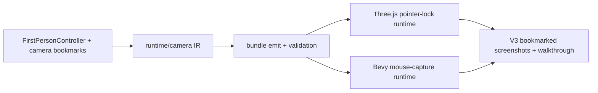

# V3-05 First-Person Camera and Controls

Complexity: 9 -> HIGH mode

## Context

**Problem:** The V3 forest scene needs portable first-person movement that feels
usable on web and native and can be replayed from stable camera bookmarks.

**Files Analyzed:** `docs/ROADMAP.md`,
`docs/PRDs/v2/V2-04-input-and-time.md`,
`docs/PRDs/v2/V2-08-physics-foundation.md`,
`docs/PRDs/v2/V2-11-arena-demo-template.md`,
`docs/PRDs/v2/V2-12-dev-loop-and-release-gate.md`, `packages/sdk`,
`packages/ir`, `packages/compiler`, `packages/runtime-web-three`,
`runtime-bevy`, `examples`, `assets-source/environment`.

**Current Behavior:**

- V2 defines keyboard and pointer input as logical actions and axes.
- V2 physics supports portable collision primitives and runtime physics events.
- V3 requires pointer-lock mouse look on web, equivalent native mouse capture,
  keyboard movement, camera height, collision, and camera bookmarks.
- No V3 first-person controller or bookmarked forest walkthrough exists yet.

## Solution

**Approach:**

- Add a portable first-person controller declaration that binds existing input
  actions/axes to yaw, pitch, movement, height, speed, acceleration, and
  collision profile settings.
- Map browser pointer lock and keyboard events in the web runtime without
  exposing DOM APIs through SDK or IR.
- Map native mouse capture and keyboard events in Bevy with the same logical
  movement semantics.
- Add camera bookmarks to the bundle so verification can render repeatable V3
  forest views and walkthrough segments.
- Keep collision resolution delegated to the V3-06 walkability contract; this
  PRD owns the controller and its integration points.



**Data Changes:** Extends portable runtime/camera IR with first-person
controller configuration, active camera mode, and bookmark metadata. No database
changes.

## Integration Points

**How will this feature be reached?**

- Entry point identified: SDK/R3F camera declarations in the V3 forest example
  and `tn dev --target web` / native runtime launch.
- Caller file identified: web runtime input/render loop and Bevy runtime input
  systems consume emitted controller IR.
- Registration/wiring needed: SDK exports, R3F capture support, compiler emit,
  IR validation, web runtime controller, Bevy runtime controller, V3 verify
  profile.

**Is this user-facing?** Yes, player navigation and visual verification.

**Full user flow:**

1. User opens `examples/v3-forest` in web preview.
2. User clicks the canvas to request pointer lock.
3. Web runtime maps keyboard and mouse deltas into the first-person controller.
4. Camera moves through the forest while V3-06 collision keeps it on the
   walkable path.
5. User presses bookmark keys or the verifier selects bookmark IDs to render
   repeatable views.

## Execution Phases

#### Phase 1: Controller Contract - First-person settings validate

**Files (max 5):**

- `packages/sdk/src/scene/Camera.ts` - first-person controller and bookmark
  declarations.
- `packages/ir/src/runtimeConfig.ts` - controller and bookmark schemas.
- `packages/compiler/src/emit/scene-to-world.ts` - emit camera controller data.
- `packages/ir/src/runtimeConfig.test.ts` - validation tests.
- `packages/compiler/src/emit/scene-to-world.test.ts` - emit tests.

**Implementation:**

- [ ] Add `firstPerson` camera/controller configuration with action IDs for
  forward/back/left/right, sprint if used, pointer-look axes, speed,
  acceleration, camera height, pitch clamp, and collision profile reference.
- [ ] Add named camera bookmarks with position, yaw, pitch, optional FOV, and
  purpose (`start`, `screenshot`, `walkthrough`).
- [ ] Validate duplicate bookmark IDs, missing input action references,
  impossible pitch clamps, negative speeds, and unsupported camera modes.
- [ ] Emit stable diagnostics with code, severity, file reference, and suggested
  fix.

**Tests Required:**

| Test File | Test Name | Assertion |
| --- | --- | --- |
| `packages/compiler/src/emit/scene-to-world.test.ts` | `should emit first-person controller and bookmarks` | Bundle contains controller config and ordered bookmark IDs. |
| `packages/ir/src/runtimeConfig.test.ts` | `should reject first-person controller with missing input action` | Validator reports a stable missing-action diagnostic. |
| `packages/ir/src/runtimeConfig.test.ts` | `should reject duplicate camera bookmark ids` | Validator reports duplicate bookmark IDs before runtime. |

**User Verification:**

- Action: Build a small fixture with one first-person camera and two bookmarks.
- Expected: `tn build` emits valid controller/bookmark IR and rejects invalid
  references with actionable diagnostics.

**Verification Plan:**

1. Unit tests: `packages/ir/src/runtimeConfig.test.ts` for accepted and rejected
   controller/bookmark data.
2. Compiler tests: `packages/compiler/src/emit/scene-to-world.test.ts` for
   deterministic bundle output.
3. Evidence required: package tests pass and emitted JSON order is stable.

#### Phase 2: Web Pointer-Lock Runtime - User can look and move in preview

**Files (max 5):**

- `packages/runtime-web-three/src/firstPerson.ts` - controller update logic.
- `packages/runtime-web-three/src/input.ts` - pointer-lock mouse delta and lock
  state mapping.
- `packages/runtime-web-three/src/gameLoop.ts` - per-frame controller update.
- `packages/runtime-web-three/src/firstPerson.test.ts` - controller tests.
- `packages/runtime-web-three/src/input.test.ts` - pointer-lock input tests.

**Implementation:**

- [ ] Request pointer lock only from a user gesture on the canvas.
- [ ] Track lock acquired, lock denied, lock lost, and escape/unlock states in
  runtime diagnostics.
- [ ] Apply keyboard movement in camera-local X/Z space with acceleration and
  fixed maximum speed.
- [ ] Apply mouse deltas to yaw/pitch with configured sensitivity and pitch
  clamp.
- [ ] Call the V3-06 movement resolver when a collision profile is present;
  otherwise move freely for isolated controller tests.

**Tests Required:**

| Test File | Test Name | Assertion |
| --- | --- | --- |
| `packages/runtime-web-three/src/firstPerson.test.ts` | `should move camera forward when forward action is pressed` | Camera position advances along current yaw. |
| `packages/runtime-web-three/src/firstPerson.test.ts` | `should clamp pitch when mouse delta exceeds limits` | Pitch remains within configured min/max. |
| `packages/runtime-web-three/src/input.test.ts` | `should report pointer lock denied when browser rejects request` | Diagnostic includes code and lock state. |

**User Verification:**

- Action: Run `tn dev --target web --project examples/v3-forest`, click the
  canvas, press WASD, and move the mouse.
- Expected: Pointer lock engages, the camera moves smoothly, Escape releases
  lock, and diagnostics name lock failures.

**Verification Plan:**

1. Unit tests: web controller movement, acceleration, pitch clamp, and pointer
   lock state transitions.
2. Playwright: click canvas, verify pointer-lock request path, simulate keyboard
   movement, and assert camera matrix changes.
3. Evidence required: `pnpm --filter @threenative/runtime-web-three test -- --run firstPerson`
   and a saved web preview diagnostic artifact.

#### Phase 3: Native Mouse Capture - Same bundle supports desktop navigation

**Files (max 5):**

- `runtime-bevy/crates/threenative_runtime/src/input.rs` - mouse capture state
  and keyboard mapping.
- `runtime-bevy/crates/threenative_runtime/src/first_person.rs` - native
  controller update.
- `runtime-bevy/crates/threenative_runtime/src/lib.rs` - register controller
  systems.
- `runtime-bevy/crates/threenative_runtime/tests/first_person.rs` - native
  controller tests.
- `runtime-bevy/crates/threenative_runtime/tests/input.rs` - capture input
  tests.

**Implementation:**

- [ ] Add native mouse capture mode that hides/confines cursor where supported
  and reports downgrade diagnostics where unsupported.
- [ ] Reuse the same controller config fields as the web runtime.
- [ ] Apply movement and look updates in the same schedule position as web.
- [ ] Preserve portable semantics; do not expose Bevy-specific capture APIs in
  SDK or IR.

**Tests Required:**

| Test File | Test Name | Assertion |
| --- | --- | --- |
| `runtime-bevy/crates/threenative_runtime/tests/first_person.rs` | `should move camera forward when forward action is pressed` | Native camera transform changes like the web fixture. |
| `runtime-bevy/crates/threenative_runtime/tests/input.rs` | `should report mouse capture downgrade when unsupported` | Runtime diagnostic is stable and nonfatal. |

**User Verification:**

- Action: Run the V3 forest bundle through the native runtime.
- Expected: Mouse capture enables desktop first-person look, keyboard movement
  works, and unsupported capture environments produce explicit diagnostics.

**Verification Plan:**

1. Rust tests: controller movement and capture state mapping.
2. Native smoke: load the V3 forest bundle and verify the active camera reaches
   the configured start bookmark.
3. Evidence required: `cd runtime-bevy && cargo test first_person input`.

#### Phase 4: Bookmarked Forest Walkthrough - Verification can replay views

**Files (max 5):**

- `examples/v3-forest/src/scene.tsx` - first-person camera and bookmark
  authoring.
- `examples/v3-forest/src/input.ts` - keyboard and pointer-look bindings.
- `packages/cli/src/verify/v3Forest.ts` - bookmarked screenshot/walkthrough
  checks.
- `packages/cli/src/verify/v3Forest.test.ts` - verify profile tests.
- `scripts/verify-v3.mjs` - top-level V3 gate entrypoint.

**Implementation:**

- [ ] Add at least `start`, `path-mid`, and `clearing-view` bookmarks for the
  forest scene.
- [ ] Make the verify profile load the V3 bundle, jump to bookmarks, capture
  screenshots, and run a short fixed-input walkthrough.
- [ ] Assert nonblank canvas, camera movement, bookmark framing, and no
  controller diagnostics above warning severity.
- [ ] Save screenshots, runtime diagnostics, and walkthrough trace artifacts in
  a predictable output directory.

**Tests Required:**

| Test File | Test Name | Assertion |
| --- | --- | --- |
| `packages/cli/src/verify/v3Forest.test.ts` | `should include first-person bookmark checks in v3 report` | Report lists each bookmark and artifact path. |
| `packages/cli/src/verify/v3Forest.test.ts` | `should fail when camera does not move during walkthrough` | Nonmoving camera yields nonzero verification status. |

**User Verification:**

- Action: Run `pnpm verify:v3`.
- Expected: The report includes bookmarked screenshots and a walkthrough result
  for the V3 forest scene.

**Verification Plan:**

1. CLI tests: verify report structure, failure behavior, and artifact paths.
2. Playwright: render each bookmark and fixed walkthrough segment.
3. Native smoke: load bundle and confirm active camera starts at the bookmark.
4. Evidence required: `pnpm verify:v3` saves screenshots, diagnostics, and JSON
   report.

## Checkpoint Protocol

After each phase:

- [ ] Run the narrow tests named in that phase.
- [ ] Spawn `prd-work-reviewer` with: `Review checkpoint for phase N of PRD at
  docs/PRDs/v3/V3-05-first-person-camera-and-controls.md`.
- [ ] Continue only after the reviewer reports PASS or after corrections are
  made and the phase is reviewed again.
- [ ] For phases 2, 3, and 4, perform manual verification because camera control
  and capture behavior are user-visible.
- [ ] Record verification evidence in the implementation PR or release issue,
  including commands, artifacts, and any downgraded native capture behavior.

Manual checkpoint template:

```txt
## PHASE N COMPLETE - CHECKPOINT

Files changed: [list]
Tests passing: [yes/no]
verify command: [pass/fail]

Manual verification needed:
1. [ ] [Specific camera/control action -> expected result]

Reply "continue" to proceed to Phase N+1, or report issues.
```

## Release Protocol

- `pnpm --filter @threenative/ir test -- --run runtimeConfig`
- `pnpm --filter @threenative/compiler test -- --run scene-to-world`
- `pnpm --filter @threenative/runtime-web-three test -- --run firstPerson`
- `cd runtime-bevy && cargo test first_person input`
- `pnpm verify:conformance`
- `pnpm verify:v3`
- Review saved V3 artifacts: bookmark screenshots, walkthrough trace, runtime
  diagnostics, native smoke log, and JSON report.
- Release checkpoint may pass only when web pointer lock, native mouse capture
  or explicit downgrade diagnostics, keyboard movement, camera bookmarks, and
  V3-06 collision integration all pass.

## Acceptance Criteria

- [ ] First-person controller config validates through SDK, compiler, and IR.
- [ ] Web preview supports keyboard movement and pointer-lock mouse look.
- [ ] Native runtime supports equivalent keyboard movement and mouse capture or
  emits an explicit downgrade diagnostic.
- [ ] Camera bookmarks are emitted, validated, and used by V3 verification.
- [ ] Walkthrough verification proves the camera moves and renders nonblank,
  correctly framed forest views.
- [ ] All automated checkpoint reviews pass, with manual verification completed
  for user-visible phases.
