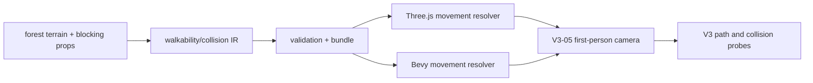

# V3-06 Walkability and Scene Collision

Complexity: 9 -> HIGH mode

## Context

**Problem:** The V3 forest first-person camera needs bounded movement on the
path, terrain following, and collision against blocking props without leaking
runtime-specific physics APIs.

**Files Analyzed:** `docs/ROADMAP.md`,
`docs/PRDs/v2/V2-04-input-and-time.md`,
`docs/PRDs/v2/V2-08-physics-foundation.md`,
`docs/PRDs/v2/V2-11-arena-demo-template.md`,
`docs/PRDs/v2/V2-12-dev-loop-and-release-gate.md`, `packages/sdk`,
`packages/ir`, `packages/compiler`, `packages/runtime-web-three`,
`runtime-bevy`, `examples`, `assets-source/environment`.

**Current Behavior:**

- V2 physics covers basic portable colliders, bodies, and collision events.
- V3 requires a forest path with terrain or ground-plane support, central
  walkable route data, and collision against terrain and blocking props.
- First-person movement from V3-05 needs a movement resolver but should not own
  terrain/path authoring or prop collision data.
- No V3 forest walkable bounds, terrain surface, or blocking prop collision
  fixture exists yet.

## Solution

**Approach:**

- Add portable walkability data for the V3 forest: walkable polygons or path
  bands, camera/player capsule dimensions, step/slope limits, and boundary
  behavior.
- Add terrain surface sampling sufficient for the forest path, using authored
  height samples or a constrained ground mesh instead of a general terrain
  editor.
- Mark selected rocks, trunks, dead trees, large mushrooms, and other props as
  blocking collision instances.
- Implement matching web and native movement resolution for first-person
  camera/player capsules.
- Verify the same bundle with deterministic probe paths, edge tests, and visual
  walkthrough artifacts.



**Data Changes:** Extends world/runtime IR with V3 walkable regions, terrain
surface references, blocking collision instances, and movement profile metadata.
No database changes.

## Integration Points

**How will this feature be reached?**

- Entry point identified: forest scene authoring in `examples/v3-forest` and
  first-person controller movement from V3-05.
- Caller file identified: web and Bevy first-person controller systems call the
  walkability resolver before committing camera/player transforms.
- Registration/wiring needed: SDK exports, R3F capture support, compiler emit,
  IR validation, web resolver, native resolver, V3 verify profile.

**Is this user-facing?** Yes, scene navigation and collision behavior.

**Full user flow:**

1. User opens the V3 forest scene.
2. User walks along the central path with keyboard and mouse controls.
3. Runtime samples terrain height and resolves the camera/player capsule within
   walkable bounds.
4. Blocking props stop movement instead of allowing the camera through trunks,
   rocks, and dense set dressing.
5. Verification probes path edges and blocking props in web and native smoke
   runs.

## Execution Phases

#### Phase 1: Walkability IR - Path bounds and terrain references validate

**Files (max 5):**

- `packages/sdk/src/walkability.ts` - portable walkable surface and movement
  profile declarations.
- `packages/ir/src/walkability.ts` - walkability and blocking schema.
- `packages/compiler/src/emit/walkability.ts` - emit walkability data.
- `packages/ir/src/walkability.test.ts` - validation tests.
- `packages/compiler/src/emit/walkability.test.ts` - emit tests.

**Implementation:**

- [ ] Support named walkable regions with ordered 2D path polygons or path-band
  control points in X/Z world space.
- [ ] Support terrain surface reference with height samples or constrained
  static ground mesh data sufficient for the forest path.
- [ ] Support movement profile fields: radius, height, eye height, max step,
  max slope if terrain uses heights, and boundary behavior (`block` for V3).
- [ ] Support blocking collision instances referencing scene entity IDs or
  asset instance IDs with primitive collider hints.
- [ ] Reject self-intersecting regions, duplicate IDs, missing entity
  references, unsupported dynamic terrain, and nonblocking required bounds.

**Tests Required:**

| Test File | Test Name | Assertion |
| --- | --- | --- |
| `packages/compiler/src/emit/walkability.test.ts` | `should emit forest walkable path and blocking props` | Bundle contains ordered walkable regions and blocking instance IDs. |
| `packages/ir/src/walkability.test.ts` | `should reject blocking prop with missing entity reference` | Validator reports missing reference diagnostic. |
| `packages/ir/src/walkability.test.ts` | `should reject self-intersecting walkable region` | Validator rejects invalid path bounds. |

**User Verification:**

- Action: Build a fixture with one path region, one terrain surface, and one
  blocking rock.
- Expected: Valid data emits deterministically; invalid references fail before
  runtime.

**Verification Plan:**

1. Unit tests: accepted/rejected walkable regions, terrain references, movement
   profiles, and blocking instance references.
2. Compiler tests: stable JSON emit and deterministic ordering.
3. Evidence required: `pnpm --filter @threenative/ir test -- --run walkability`
   and `pnpm --filter @threenative/compiler test -- --run walkability`.

#### Phase 2: Forest Authoring Slice - The scene contains a bounded walkable path

**Files (max 5):**

- `examples/v3-forest/src/terrain.ts` - forest path terrain or ground surface.
- `examples/v3-forest/src/walkability.ts` - walkable bounds and movement
  profile.
- `examples/v3-forest/src/scene.tsx` - connect terrain, blocking props, and
  camera profile.
- `examples/v3-forest/src/walkability.test.ts` - authored data tests.
- `examples/v3-forest/threenative.config.json` - V3 bundle profile if needed.

**Implementation:**

- [ ] Author a central walkable route matching the `Preview_2.jpg` forest path
  composition at product level.
- [ ] Place a start region, path middle, and clearing area compatible with
  V3-05 camera bookmarks.
- [ ] Mark major trunks, path rocks, medium rocks, dead trees, and selected
  foreground set dressing as blocking.
- [ ] Keep grasses, flowers, clover, petals, and small decorative vegetation
  nonblocking unless specifically needed for a probe.
- [ ] Add fixture assertions that every blocking prop reference exists and every
  bookmark starts inside a walkable region.

**Tests Required:**

| Test File | Test Name | Assertion |
| --- | --- | --- |
| `examples/v3-forest/src/walkability.test.ts` | `should keep all camera bookmarks inside walkable bounds` | Start, path-mid, and clearing-view bookmarks are walkable. |
| `examples/v3-forest/src/walkability.test.ts` | `should reference existing blocking prop ids` | Every blocking ID resolves to an authored scene instance. |

**User Verification:**

- Action: Run `pnpm tn -- build --project examples/v3-forest`.
- Expected: The forest bundle validates with walkability data and no missing
  blocking prop references.

**Verification Plan:**

1. Example unit tests: bookmark containment and blocking reference integrity.
2. Build proof: `tn build` emits a V3 bundle with walkability data.
3. Evidence required: bundle manifest lists walkable regions, terrain surface,
   and blocking prop counts.

#### Phase 3: Web Movement Resolver - Camera stays on path and hits blockers

**Files (max 5):**

- `packages/runtime-web-three/src/walkability.ts` - movement resolver and terrain
  sampling.
- `packages/runtime-web-three/src/firstPerson.ts` - call resolver before
  committing movement.
- `packages/runtime-web-three/src/walkability.test.ts` - resolver tests.
- `packages/runtime-web-three/src/firstPerson.test.ts` - integration tests.
- `packages/runtime-web-three/src/runtimeDiagnostics.ts` - collision diagnostics
  if a local diagnostics module is introduced; otherwise extend existing
  diagnostics.

**Implementation:**

- [ ] Resolve desired X/Z movement against walkable bounds with boundary
  blocking rather than teleporting.
- [ ] Sample terrain/ground height and set camera/player eye position from the
  movement profile.
- [ ] Resolve capsule or cylinder movement against blocking prop primitives.
- [ ] Keep decorative nonblocking assets ignored by the collision resolver.
- [ ] Report diagnostics for missing terrain, missing collider reference, and
  unresolved movement profile.

**Tests Required:**

| Test File | Test Name | Assertion |
| --- | --- | --- |
| `packages/runtime-web-three/src/walkability.test.ts` | `should block movement outside walkable bounds` | Resolved position remains inside the path region. |
| `packages/runtime-web-three/src/walkability.test.ts` | `should slide or stop against blocking prop` | Desired movement through a blocking rock does not pass through. |
| `packages/runtime-web-three/src/firstPerson.test.ts` | `should keep first-person camera at terrain eye height` | Camera Y equals sampled terrain plus eye height. |

**User Verification:**

- Action: Run web preview, walk into path edge, a tree trunk, and a rock.
- Expected: Camera remains on the path, cannot pass through blocking props, and
  follows terrain height without visible popping.

**Verification Plan:**

1. Unit tests: bounds containment, terrain sampling, and prop collision.
2. Playwright: fixed input probes for edge, trunk, and rock collision.
3. Evidence required: web V3 verification report includes collision probe
   results and no unresolved collision diagnostics.

#### Phase 4: Native Movement Resolver - Desktop uses the same collision contract

**Files (max 5):**

- `runtime-bevy/crates/threenative_runtime/src/walkability.rs` - native resolver.
- `runtime-bevy/crates/threenative_runtime/src/first_person.rs` - call resolver.
- `runtime-bevy/crates/threenative_runtime/src/map_world.rs` - map walkability
  IR into runtime resources.
- `runtime-bevy/crates/threenative_runtime/tests/walkability.rs` - resolver
  tests.
- `runtime-bevy/crates/threenative_runtime/tests/first_person.rs` - integration
  tests.

**Implementation:**

- [ ] Load the same walkability IR used by web.
- [ ] Match web behavior for bounds blocking, terrain eye height, and blocking
  prop collision within documented tolerances.
- [ ] Keep Bevy physics details internal to the runtime.
- [ ] Emit stable native diagnostics for unsupported terrain or collider data.

**Tests Required:**

| Test File | Test Name | Assertion |
| --- | --- | --- |
| `runtime-bevy/crates/threenative_runtime/tests/walkability.rs` | `should block movement outside walkable bounds` | Native resolved position remains inside the same fixture region. |
| `runtime-bevy/crates/threenative_runtime/tests/walkability.rs` | `should stop at blocking prop` | Native movement cannot cross the prop collider. |
| `runtime-bevy/crates/threenative_runtime/tests/first_person.rs` | `should apply terrain eye height to camera` | Camera Y matches terrain plus eye height. |

**User Verification:**

- Action: Run the V3 forest bundle through the native runtime and use the same
  edge/prop probe inputs as web.
- Expected: Native movement remains within the path and blocks against the same
  prop classes.

**Verification Plan:**

1. Rust unit tests: resolver parity fixture.
2. Native smoke: replay fixed input probes and capture final camera positions.
3. Evidence required: `cd runtime-bevy && cargo test walkability first_person`
   and a native V3 smoke log.

#### Phase 5: Collision Verification Gate - Release proves path traversal

**Files (max 5):**

- `packages/cli/src/verify/v3Forest.ts` - path and collision probe checks.
- `packages/cli/src/verify/v3Forest.test.ts` - report and failure tests.
- `scripts/verify-v3.mjs` - V3 gate orchestration.
- `scripts/verify-v3.test.mjs` - gate tests.
- `docs/PRDs/v3/README.md` - V3 PRD index if the repo adds one with the gate.

**Implementation:**

- [ ] Add deterministic web probe paths: stay on path center, push into left
  edge, push into right edge, push into tree, push into rock.
- [ ] Record expected pass/fail per probe with final position, collision
  target, and diagnostic status.
- [ ] Run native smoke probes against the same bundle and compare final
  positions within a documented tolerance.
- [ ] Save JSON report, screenshots from V3-05 bookmarks, web runtime logs, and
  native smoke logs.
- [ ] Fail the gate on missing walkability data, unresolved blocking references,
  path escape, terrain height failure, or blocker penetration.

**Tests Required:**

| Test File | Test Name | Assertion |
| --- | --- | --- |
| `packages/cli/src/verify/v3Forest.test.ts` | `should report walkability probes for v3 forest` | Report includes path edge, terrain, and blocker probe results. |
| `packages/cli/src/verify/v3Forest.test.ts` | `should fail when probe exits walkable bounds` | Verification status is nonzero and names the failed probe. |
| `scripts/verify-v3.test.mjs` | `should run v3 forest collision gate` | Script invokes build, web probes, and native smoke checks. |

**User Verification:**

- Action: Run `pnpm verify:v3`.
- Expected: Report proves the forest path is walkable, blocking props collide,
  terrain height is applied, and native smoke reaches equivalent final states.

**Verification Plan:**

1. CLI tests: report structure, failure behavior, and artifact paths.
2. Playwright: fixed web probe paths and bookmarked screenshots.
3. Native smoke: fixed probe replay and final-position comparison.
4. Evidence required: `pnpm verify:v3` saves a machine-readable report and
   artifacts for path traversal, edge blocking, prop collision, and terrain
   height.

## Checkpoint Protocol

After each phase:

- [ ] Run the narrow tests named in that phase.
- [ ] Spawn `prd-work-reviewer` with: `Review checkpoint for phase N of PRD at
  docs/PRDs/v3/V3-06-walkability-and-scene-collision.md`.
- [ ] Continue only after the reviewer reports PASS or after corrections are
  made and the phase is reviewed again.
- [ ] For phases 2, 3, 4, and 5, perform manual verification because collision
  and walkability are user-visible and visual.
- [ ] Record verification evidence in the implementation PR or release issue,
  including probe inputs, final positions, screenshots, diagnostics, and native
  smoke logs.

Manual checkpoint template:

```txt
## PHASE N COMPLETE - CHECKPOINT

Files changed: [list]
Tests passing: [yes/no]
verify command: [pass/fail]

Manual verification needed:
1. [ ] [Specific walk/collision action -> expected result]

Reply "continue" to proceed to Phase N+1, or report issues.
```

## Release Protocol

- `pnpm --filter @threenative/ir test -- --run walkability`
- `pnpm --filter @threenative/compiler test -- --run walkability`
- `pnpm --filter @threenative/runtime-web-three test -- --run walkability`
- `cd runtime-bevy && cargo test walkability first_person`
- `pnpm verify:conformance`
- `pnpm verify:v3`
- Review saved V3 artifacts: walkability report, probe traces, bookmarked
  screenshots, web runtime logs, native smoke logs, and bundle manifest.
- Release checkpoint may pass only when all camera bookmarks start inside
  walkable bounds, web and native probes stay on path, terrain height applies,
  and blocking props prevent penetration.

## Acceptance Criteria

- [ ] Walkable bounds, terrain surface data, and movement profile validate
  through SDK, compiler, and IR.
- [ ] Forest scene authoring includes the central walkable path and blocking
  prop references for terrain, rocks, trunks, and other major blockers.
- [ ] Web runtime keeps the first-person camera on the path, follows terrain
  height, and blocks against configured props.
- [ ] Native runtime consumes the same bundle and matches web collision behavior
  within documented tolerances.
- [ ] V3 verification fails on path escape, unresolved blockers, terrain height
  errors, and blocker penetration.
- [ ] All automated checkpoint reviews pass, with manual verification completed
  for user-visible phases.
