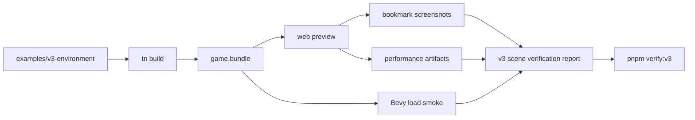
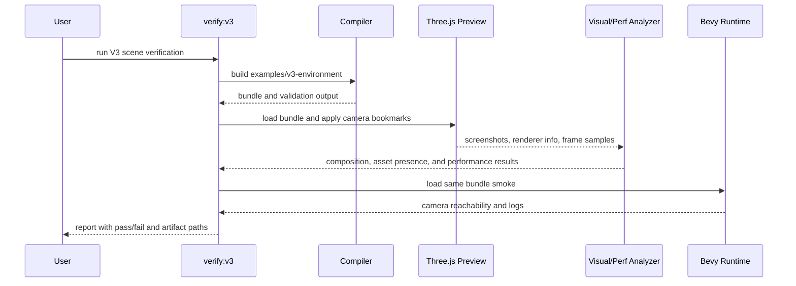

# V3-07 Scene Visual Verification

Complexity: 8 -> HIGH mode

## Context

**Problem:** The V3 forest scene can validate and load while still failing the
product proof if it is blank, sparsely populated, badly framed, visually far
from `Preview_2.jpg`, or too slow in the web preview.

**Files Analyzed:** `docs/ROADMAP.md`,
`docs/PRDs/v2/V2-01-cross-runtime-conformance-and-regression-harness.md`,
`docs/PRDs/v2/V2-06-asset-pipeline.md`,
`docs/PRDs/v2/V2-11-arena-demo-template.md`,
`docs/PRDs/v2/V2-12-dev-loop-and-release-gate.md`,
`docs/PRDs/v2/README.md`, `assets-source/environment`, `examples`,
`templates`, `packages/cli`, `packages/runtime-web-three`, `runtime-bevy`,
`scripts`.

**Current Behavior:**

- V1 and V2 verification prove nonblank/simple gameplay smoke, not a dense
  target-aware environment scene.
- V3 roadmap requires the `assets-source/environment/Preview_2.jpg` forest-path
  scene, camera bookmarks, rough composition checks, performance artifacts, and
  native load smoke.
- The source art includes trees, bushes, grasses, clover, ferns, flowers,
  mushrooms, pebbles, path rocks, medium rocks, textures, and preview images.
- There is no V3 verification profile that proves representative forest assets
  are visible from bookmarked cameras or records web draw/load/frame metrics.

## Solution

**Approach:**

- Add a V3 verification profile focused on making the bundled scene a close
  practical match for the `Preview_2` forest composition, while avoiding brittle
  pixel-perfect visual regression.
- Capture deterministic screenshot bookmarks from the web preview and assert
  nonblank output, path framing, depth bands, and representative asset presence.
- Record web performance artifacts for load timing, frame timing, draw-call or
  renderer info, instance counts, texture memory where available, and bundle
  size.
- Add a Bevy native load smoke that opens the same bundle and reaches the first
  camera bookmark without asserting renderer parity.
- Save machine-readable reports and artifact paths so agents can diagnose
  failures without manual image inspection.



**Data Changes:** Writes generated V3 verification artifacts under a
deterministic output directory, such as
`examples/v3-environment/.threenative/verify/v3/`.

**Key Decisions:**

- [ ] Visual checks are a hard release gate for close practical scene matching:
  automated composition and scene-presence checks plus recorded manual review,
  not pixel-perfect comparison against `Preview_2.jpg`.
- [ ] Web Three.js is the strict performance target for V3 verification.
- [ ] Native smoke proves same-bundle load and camera reachability, not visual
  parity with the web screenshots.
- [ ] Every failure includes artifact paths and actionable diagnostics.
- [ ] Generated screenshots, logs, and performance artifacts stay out of source
  control unless a later fixture policy explicitly tracks them.

## Integration Points

**How will this feature be reached?**

- [x] Entry point identified: `pnpm verify:v3`, `pnpm tn -- verify --project
  examples/v3-environment --profile v3-environment`, and the V3 release gate.
- [x] Caller file identified: top-level `scripts/verify-v3.*`, CLI verify
  command, web preview verification runner, and Bevy smoke test runner.
- [x] Registration/wiring needed: CLI verify profile, package scripts, artifact
  writer, Playwright web harness, native smoke command, and docs links from the
  V3 PRD index or release docs.

**Is this user-facing?** Yes, for developers and AI agents validating the final
V3 forest scene.

**Full user flow:**

1. Developer builds or modifies `examples/v3-environment`.
2. They run `pnpm verify:v3`.
3. The gate builds the bundle, starts the web preview, captures bookmarked
   screenshots, measures performance, and runs native load smoke.
4. The developer reads the JSON report and screenshot/log paths to see whether
   the bundled scene matches the `Preview_2` product target as closely as
   practical.

## Sequence Flow



## Execution Phases

#### Phase 1: Bookmark Contract - The forest scene exposes stable verification views

**Files (max 5):**

- `examples/v3-environment/src/bookmarks.ts` - named camera bookmarks for
  `entry_path`, `mid_path`, `canopy_depth`, and `asset_cluster`.
- `examples/v3-environment/src/scene.tsx` - attach bookmark metadata to the
  authored first-person scene.
- `packages/ir/src/sceneVerification.ts` - schema for bookmark metadata if no
  existing metadata channel fits.
- `packages/compiler/src/emit/sceneVerification.ts` - emit bookmark metadata
  into the bundle.
- `packages/ir/src/sceneVerification.test.ts` - validation tests.

**Implementation:**

- [ ] Define bookmark IDs, camera position, look target or yaw/pitch, field of
  view, and expected composition tags.
- [ ] Require at least one bookmark that frames the central path and one that
  frames dense foreground vegetation.
- [ ] Validate duplicate bookmark IDs, invalid camera values, and missing
  composition tags.
- [ ] Keep bookmark data deterministic and bundle-relative.

**Tests Required:**

| Test File | Test Name | Assertion |
| --- | --- | --- |
| `packages/ir/src/sceneVerification.test.ts` | `should accept valid forest camera bookmarks` | Validator accepts four bookmarks with stable IDs and composition tags. |
| `packages/ir/src/sceneVerification.test.ts` | `should reject duplicate scene bookmark ids` | Diagnostic names the duplicate bookmark ID. |
| `packages/compiler/src/emit/sceneVerification.test.ts` | `should emit bookmark metadata deterministically` | Emitted bookmark order and numeric values are stable. |

**Verification Plan:**

1. **Unit Tests:** Run IR and compiler bookmark tests listed above.
2. **Integration Test:** Build `examples/v3-environment` and confirm the bundle
   contains the bookmark metadata file or manifest entry.
3. **Evidence Required:** Saved bundle manifest references all bookmark IDs.

**User Verification:**

- Action: Run `pnpm tn -- build --project examples/v3-environment` and inspect
  the emitted verification metadata.
- Expected: The bundle names the four forest bookmarks and their expected
  composition tags.

#### Phase 2: Web Screenshot Checks - Bookmarks prove nonblank forest composition

**Files (max 5):**

- `packages/cli/src/verify/v3Scene.ts` - V3 scene verification profile.
- `packages/cli/src/verify/visualComposition.ts` - screenshot analysis helpers.
- `packages/cli/src/verify/v3Scene.test.ts` - report and failure tests.
- `scripts/verify-v3.mjs` - top-level V3 gate entry point.
- `package.json` - `verify:v3` script.

**Implementation:**

- [ ] Start the web preview from the V3 bundle and navigate each bookmark.
- [ ] Save screenshots with stable names:
  `entry_path.png`, `mid_path.png`, `canopy_depth.png`, and
  `asset_cluster.png`.
- [ ] Assert each screenshot is nonblank and not dominated by a single flat
  color.
- [ ] Check close practical composition for `Preview_2`: a readable central
  path band, darker vertical side masses for trees, foreground vegetation
  density, rock and mushroom/flower clusters, warm sunlight, and atmospheric
  depth from foreground to background.
- [ ] Fail with report fields for bookmark ID, screenshot path, failed check,
  observed values, and suggested next action.

**Tests Required:**

| Test File | Test Name | Assertion |
| --- | --- | --- |
| `packages/cli/src/verify/v3Scene.test.ts` | `should report passing bookmark screenshots` | Report includes all bookmark screenshot paths and pass statuses. |
| `packages/cli/src/verify/v3Scene.test.ts` | `should fail when screenshot is blank` | Report exits nonzero and names the bookmark. |
| `packages/cli/src/verify/v3Scene.test.ts` | `should fail when path composition is missing` | Report includes the missing composition tag and screenshot path. |

**Verification Plan:**

1. **Unit Tests:** Exercise screenshot helper checks with synthetic blank,
   single-color, and path-band fixtures.
2. **Playwright Verification:** Load the V3 web preview, set each bookmark, and
   capture screenshots.
3. **Evidence Required:** JSON report plus four PNG screenshots saved under the
   V3 artifact directory.

**User Verification:**

- Action: Run `pnpm verify:v3` and open the saved `entry_path.png`.
- Expected: The screenshot shows a warm stylized forest path with visible
  trees, rocks, grasses or bushes, and background depth.

#### Phase 3: Representative Asset Presence - The scene proves the forest pack is used

**Files (max 5):**

- `examples/v3-environment/src/assetClasses.ts` - canonical representative
  asset classes and expected minimum counts.
- `packages/runtime-web-three/src/inspection.ts` - web runtime scene inspection
  report, if no equivalent exists.
- `packages/cli/src/verify/v3Scene.ts` - include asset presence checks.
- `packages/cli/src/verify/v3Scene.test.ts` - asset presence tests.
- `examples/v3-environment/README.md` - document representative classes.

**Implementation:**

- [ ] Require visible or loaded representatives for trees or pines, path rocks,
  medium rocks, grasses, bushes, flowers, mushrooms, ferns or clover, and
  pebbles or petals.
- [ ] Distinguish source asset IDs from repeated scene instances in the report.
- [ ] Count instances by class and by bookmark visibility where runtime
  inspection can support it.
- [ ] Fail when a required class is absent, zero-instance, or hidden from all
  bookmarks.
- [ ] Keep checks class-based so individual prop substitutions do not make the
  PRD brittle.

**Tests Required:**

| Test File | Test Name | Assertion |
| --- | --- | --- |
| `packages/cli/src/verify/v3Scene.test.ts` | `should pass representative forest asset classes` | Report passes when every required class has loaded and visible instances. |
| `packages/cli/src/verify/v3Scene.test.ts` | `should fail when mushrooms are absent` | Report names `mushrooms` as the missing representative class. |
| `packages/runtime-web-three/src/inspection.test.ts` | `should expose scene asset class counts` | Inspection report includes source asset ID, class, and instance count. |

**Verification Plan:**

1. **Unit Tests:** Validate class-count pass and fail cases.
2. **Integration Test:** Build the V3 bundle and inspect the web runtime scene
   after assets finish loading.
3. **Evidence Required:** Report includes required asset classes, source asset
   IDs, total instances, and at least one bookmark where each required class is
   visible or intentionally present in frame.

**User Verification:**

- Action: Read the `assetPresence` section of the V3 verification report.
- Expected: Required forest classes are listed with counts and no class is
  missing.

#### Phase 4: Web Performance Artifacts - The dense scene is measurable before release

**Files (max 5):**

- `packages/runtime-web-three/src/performanceReport.ts` - renderer and load
  metrics collection.
- `packages/cli/src/verify/v3Performance.ts` - fixed walkthrough measurement.
- `packages/cli/src/verify/v3Performance.test.ts` - budget/report tests.
- `scripts/verify-v3.mjs` - include performance stage.
- `docs/developer-workflow.md` - V3 performance artifact notes.

**Implementation:**

- [ ] Record bundle size, asset count, texture count, estimated texture memory
  where available, model load timing, first rendered frame timing, draw calls,
  triangles, instance counts, and frame timing over a fixed bookmark
  walkthrough.
- [ ] Store raw samples and a summarized JSON artifact.
- [ ] Use web Three.js as the strict performance target for V3.
- [ ] Fail only on agreed V3 budgets; warn on metrics that are useful but not
  stable across CI hardware.
- [ ] Include artifact paths in the release report.

**Tests Required:**

| Test File | Test Name | Assertion |
| --- | --- | --- |
| `packages/cli/src/verify/v3Performance.test.ts` | `should emit v3 web performance artifacts` | Report contains load, renderer, instance, and frame timing fields. |
| `packages/cli/src/verify/v3Performance.test.ts` | `should fail when draw calls exceed budget` | Gate exits nonzero and names the budget and observed value. |
| `packages/runtime-web-three/src/performanceReport.test.ts` | `should collect renderer info safely` | Missing optional renderer fields become warnings, not crashes. |

**Verification Plan:**

1. **Unit Tests:** Exercise budget pass, fail, and warning behavior.
2. **Playwright Verification:** Run the fixed camera walkthrough and save raw
   frame samples.
3. **Evidence Required:** `performance.json`, raw frame samples, and summary
   fields in the V3 verification report.

**User Verification:**

- Action: Run `pnpm verify:v3` and inspect `performance.json`.
- Expected: Report includes load timing, frame timing, draw calls or renderer
  info, instance counts, and pass/warn/fail budget statuses.

#### Phase 5: Native Load Smoke - Bevy proves the same bundle reaches a camera view

**Files (max 5):**

- `runtime-bevy/src/verify_v3.rs` - native smoke harness if no existing harness
  fits.
- `runtime-bevy/tests/v3_environment.rs` - native load smoke test.
- `packages/cli/src/verify/v3Scene.ts` - invoke native smoke and collect logs.
- `scripts/verify-v3.mjs` - include native smoke stage.
- `examples/v3-environment/README.md` - native verification command.

**Implementation:**

- [ ] Load the same V3 bundle generated for web verification.
- [ ] Start Bevy long enough to resolve the main scene, first-person camera,
  lighting profile, and representative asset handles.
- [ ] Navigate or initialize the `entry_path` camera bookmark.
- [ ] Save native logs and a machine-readable smoke result.
- [ ] Treat visual parity as out of scope; fail on load, validation,
  unsupported required capability, camera initialization, or panic.

**Tests Required:**

| Test File | Test Name | Assertion |
| --- | --- | --- |
| `runtime-bevy/tests/v3_environment.rs` | `should load v3 environment bundle` | Smoke reaches the `entry_path` camera without panic. |
| `packages/cli/src/verify/v3Scene.test.ts` | `should include native smoke artifacts` | V3 report contains native status and log path. |

**Verification Plan:**

1. **Rust Test:** `cd runtime-bevy && cargo test v3_environment`.
2. **Integration Test:** `pnpm verify:v3` runs native smoke after web checks.
3. **Evidence Required:** Native log path and smoke status in the V3 report.

**User Verification:**

- Action: Run `pnpm verify:v3` on a machine with the native runtime toolchain.
- Expected: Native smoke status is pass or a clear unsupported-capability
  diagnostic names the missing required V3 feature.

## Checkpoint Protocol

After each phase:

1. Run the narrow tests listed for the phase.
2. Spawn the automated PRD reviewer:

```txt
subagent_type: prd-work-reviewer
prompt: Review checkpoint for phase N of PRD at docs/PRDs/v3/V3-07-scene-visual-verification.md
```

3. Continue only when the reviewer reports PASS.
4. Because this PRD includes visual and performance-sensitive work, add a manual
   checkpoint for Phases 2, 4, and 5:

```txt
## PHASE N COMPLETE - CHECKPOINT

Files changed: [list]
Tests passing: [yes/no]
pnpm verify:v3: [pass/fail or not yet applicable]

Manual verification needed:
1. [ ] Open listed screenshot or performance/native artifact -> expected V3
       forest proof is visible and readable.
```

## Verification Strategy

- `pnpm --filter @threenative/ir test -- --run sceneVerification`
- `pnpm --filter @threenative/compiler test -- --run sceneVerification`
- `pnpm --filter @threenative/runtime-web-three test -- --run inspection`
- `pnpm --filter @threenative/runtime-web-three test -- --run performanceReport`
- `pnpm --filter @threenative/cli test -- --run v3Scene`
- `pnpm --filter @threenative/cli test -- --run v3Performance`
- `cd runtime-bevy && cargo test v3_environment`
- `pnpm tn -- verify --project examples/v3-environment --profile v3-environment`
- `pnpm verify:v3`

## Release Protocol

- [ ] Build `examples/v3-environment` from source before verification.
- [ ] Save web screenshots for every required bookmark.
- [ ] Save asset presence, composition, and performance JSON artifacts.
- [ ] Save native smoke logs.
- [ ] Include artifact paths in the release report.
- [ ] Fail the V3 release gate when screenshots are blank, required asset
  classes are absent, required web budgets fail, or native load smoke fails.
- [ ] Record manual review outcome for the `entry_path` and `mid_path`
  screenshots before marking V3 scene verification complete.
- [ ] Fail the final V3 gate when manual review says the bundled scene is not a
  close practical match for `assets-source/environment/Preview_2.jpg`.

## Acceptance Criteria

- [ ] V3 bundle includes stable camera bookmarks for repeatable scene checks.
- [ ] Web verification captures nonblank screenshots at required bookmarks.
- [ ] Composition checks and manual review prove the bundled scene is as close
  as practical to the `Preview_2` target, including central path, side tree
  masses, foreground vegetation, rock and mushroom/flower detail, warm
  sunlight, and background depth.
- [ ] Representative forest asset classes are loaded and visible or accounted
  for in verification artifacts.
- [ ] Web performance artifacts include load, renderer, instance, and frame
  timing measurements.
- [ ] Native smoke loads the same bundle and reaches a first-person camera view.
- [ ] `pnpm verify:v3` fails with actionable diagnostics and saved artifacts
  when the scene proof regresses.
