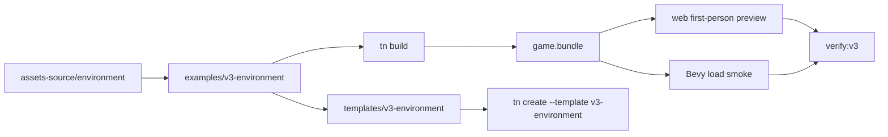

# V3-08 Environment Demo Template

Complexity: 9 -> HIGH mode

## Context

**Problem:** V3 is only complete when the forest environment proof is available
as a canonical example and final template that bundles a close practical match
for `Preview_2.jpg`, can be visually verified, and can be built, previewed, and
run natively without assembling the scene by hand.

**Files Analyzed:** `docs/ROADMAP.md`,
`docs/PRDs/v2/V2-06-asset-pipeline.md`,
`docs/PRDs/v2/V2-11-arena-demo-template.md`,
`docs/PRDs/v2/V2-12-dev-loop-and-release-gate.md`,
`docs/PRDs/v3/V3-07-scene-visual-verification.md`,
`assets-source/environment`, `examples/v2-arena`, `templates/v2-arena`,
`packages/cli`, `packages/compiler`, `packages/runtime-web-three`,
`runtime-bevy`, `scripts`.

**Current Behavior:**

- V2 has a playable arena example and template, but V3 requires a richer
  first-person environment scene.
- The roadmap identifies `assets-source/environment/Preview_2.jpg` as the V3
  visual target and the existing environment asset pack as sufficient source
  art.
- V3 still needs a final example/template that exercises environment bundling,
  deterministic composition, first-person controls, web performance
  measurement, visual verification, and native load smoke.

## Solution

**Approach:**

- Add `examples/v3-environment` as the canonical forest-path scene based on
  `Preview_2`, with the explicit goal of matching the reference image as
  closely as practical using the available asset pack and supported V3 runtime
  features.
- Add `templates/v3-environment` after the example is stable, keeping template
  source copied from the canonical example rather than diverging.
- Use deterministic scene data for terrain/path, hero placements, and seeded
  scatter so bundle output and verification screenshots are repeatable.
- Register the template in the CLI and include it in `verify:v3`.
- Keep the demo focused on the forest environment proof; gameplay remains
  limited to first-person navigation and collision/walkable bounds.



**Data Changes:** Adds tracked V3 example/template source and curated copied
asset outputs. Generated bundles and verification artifacts stay out of source
control unless the repo already tracks equivalent fixtures.

**Key Decisions:**

- [ ] `examples/v3-environment` is the canonical source; the template is copied
  from it after the example is stable.
- [ ] The demo proves first-person environment navigation, not broader gameplay
  systems beyond walkability and scene collision.
- [ ] Scene density comes from deterministic composition data, not runtime
  randomness.
- [ ] Template asset paths must remain relative after scaffolding.
- [ ] The final release gate must build both the canonical example and a
  freshly scaffolded template project.
- [ ] V3 is not complete until saved screenshots from the bundled example pass
  automated visual checks and recorded manual review against
  `assets-source/environment/Preview_2.jpg`.

## Integration Points

**How will this feature be reached?**

- [x] Entry point identified: `examples/v3-environment`, `tn create --template
  v3-environment`, `pnpm tn -- build --project examples/v3-environment`,
  `pnpm tn -- dev --project examples/v3-environment --target web`, and
  `pnpm verify:v3`.
- [x] Caller file identified: CLI create/build/dev/verify commands, example
  package scripts, top-level `scripts/verify-v3.*`, web runtime, and Bevy
  runtime.
- [x] Registration/wiring needed: template registry, package scripts, V3 release
  gate, example README, asset copy rules, and verification profile.

**Is this user-facing?** Yes, it is the final V3 developer-facing example and
project template.

**Full user flow:**

1. Developer runs `tn create my-forest --template v3-environment` or opens
   `examples/v3-environment`.
2. They run build and web preview.
3. The scene opens at the first-person `entry_path` bookmark and can be walked
   through with pointer lock and keyboard movement.
4. They run `pnpm verify:v3`.
5. The release gate saves screenshots, performance artifacts, bundle reports,
   and native load smoke logs.

## Sequence Flow

```mermaid
sequenceDiagram
  participant U as User
  participant Create as tn create
  participant Example as examples/v3-environment
  participant Build as Compiler
  participant Web as Web Preview
  participant Native as Bevy Runtime
  participant Gate as verify:v3
  U->>Example: open or edit canonical V3 scene
  U->>Create: scaffold v3-environment template
  Create-->>U: generated project with relative assets
  U->>Build: build example or scaffolded project
  Build-->>U: validated bundle
  U->>Web: preview first-person forest scene
  U->>Gate: run V3 release verification
  Gate->>Web: screenshots and performance checks
  Gate->>Native: same-bundle load smoke
  Gate-->>U: release report with artifact paths
```

## Execution Phases

#### Phase 1: Example Skeleton - The V3 project builds one forest bundle

**Files (max 5):**

- `examples/v3-environment/package.json` - example scripts for build, dev, and
  verify.
- `examples/v3-environment/threenative.config.json` - V3 project config and
  asset roots.
- `examples/v3-environment/tsconfig.json` - TypeScript config matching repo
  patterns.
- `examples/v3-environment/src/scene.tsx` - initial forest scene entry point.
- `examples/v3-environment/README.md` - setup and verification workflow.

**Implementation:**

- [ ] Create the example using supported SDK or R3F/JSX authoring APIs only.
- [ ] Configure the project to copy curated environment glTF, `.bin`, and
  texture assets into the deterministic bundle layout.
- [ ] Add an initial path ground, camera, sun/ambient light, fog or haze, and
  placeholder hero placements sufficient for the first build.
- [ ] Document commands for build, web preview, native smoke, and V3 verify.
- [ ] Avoid direct Three.js, Bevy, DOM, or renderer internals in example source.

**Tests Required:**

| Test File | Test Name | Assertion |
| --- | --- | --- |
| `packages/compiler/src/examples.test.ts` | `should build v3 environment example` | Example emits a valid bundle with world, assets, materials, and scene metadata. |
| `examples/v3-environment/src/scene.test.ts` | `should declare required v3 scene roots` | Scene source includes camera, lighting profile, terrain/path, and asset classes. |

**Verification Plan:**

1. **Unit Tests:** Run example source tests for required scene declarations.
2. **Integration Test:** Build `examples/v3-environment` and validate emitted
   IR and asset manifest.
3. **Evidence Required:** Bundle manifest path and validation output.

**User Verification:**

- Action: Run `pnpm tn -- build --project examples/v3-environment`.
- Expected: Build succeeds and emits one valid V3 environment bundle.

#### Phase 2: Deterministic Forest Composition - The scene resembles `Preview_2`

**Files (max 5):**

- `examples/v3-environment/src/composition.ts` - path curve, clearing bands,
  exclusion zones, and hero placements.
- `examples/v3-environment/src/assetClasses.ts` - asset class catalog for
  trees, rocks, grasses, bushes, flowers, mushrooms, ferns/clover, and pebbles.
- `examples/v3-environment/src/scatter.ts` - seeded scatter rules.
- `examples/v3-environment/src/scene.tsx` - compose terrain, hero placements,
  and scatter output.
- `examples/v3-environment/src/composition.test.ts` - deterministic
  composition tests.

**Implementation:**

- [ ] Define a winding central path with walkable width, side vegetation bands,
  and depth layers.
- [ ] Place foreground trees, major rocks, and distant focal objects by hand so
  the first bookmark reads like `Preview_2`.
- [ ] Scatter repeated vegetation and small rocks with seed, bounds, density,
  scale, rotation, and path exclusion zones.
- [ ] Use source asset classes rather than hardcoding one model for every prop.
- [ ] Keep output deterministic for stable bundle diffs and screenshot checks.

**Tests Required:**

| Test File | Test Name | Assertion |
| --- | --- | --- |
| `examples/v3-environment/src/composition.test.ts` | `should produce deterministic scatter for the same seed` | Two runs produce identical instance IDs and transforms. |
| `examples/v3-environment/src/composition.test.ts` | `should keep scatter out of the walkable path` | Instances do not overlap path exclusion zones. |
| `examples/v3-environment/src/composition.test.ts` | `should include representative forest asset classes` | Required classes each have minimum instance counts. |

**Verification Plan:**

1. **Unit Tests:** Prove deterministic scatter, path exclusion, and required
   class counts.
2. **Integration Test:** Build the example and inspect the emitted instance
   counts by class.
3. **Evidence Required:** Composition summary in the emitted bundle or verify
   report.

**User Verification:**

- Action: Run web preview and open the `entry_path` bookmark.
- Expected: View shows a central path, trees framing both sides, rocks,
  foreground vegetation, flowers or mushrooms, and visible background depth.

#### Phase 3: First-Person Walkthrough - Users can navigate the forest path

**Files (max 5):**

- `examples/v3-environment/src/player.ts` - first-person camera, input, height,
  speed, and collision/walkable bounds.
- `examples/v3-environment/src/bookmarks.ts` - V3 verification bookmark data.
- `examples/v3-environment/src/scene.tsx` - register player and bookmarks.
- `examples/v3-environment/src/player.test.ts` - movement and bounds tests.
- `examples/v3-environment/README.md` - control and bookmark notes.

**Implementation:**

- [ ] Add a first-person camera that starts at `entry_path`.
- [ ] Configure pointer-lock mouse look and keyboard movement through supported
  portable input APIs.
- [ ] Add walkable path bounds and blocking props sufficient to keep the user
  inside the authored forest route.
- [ ] Add bookmarks required by V3-07: `entry_path`, `mid_path`,
  `canopy_depth`, and `asset_cluster`.
- [ ] Keep controls optional for automated verification so screenshots can set
  bookmarks without manual pointer lock.

**Tests Required:**

| Test File | Test Name | Assertion |
| --- | --- | --- |
| `examples/v3-environment/src/player.test.ts` | `should move camera forward when input action is active` | Camera position advances along the path. |
| `examples/v3-environment/src/player.test.ts` | `should keep player inside walkable bounds` | Movement into blocking zones is clamped or rejected. |
| `examples/v3-environment/src/player.test.ts` | `should expose required verification bookmarks` | Bookmark IDs match V3-07 contract. |

**Verification Plan:**

1. **Unit Tests:** Validate movement, bounds, and bookmark declarations.
2. **Playwright Verification:** Load web preview, set bookmark, simulate forward
   movement, and observe camera position change.
3. **Evidence Required:** Verification report includes movement smoke and
   bookmark IDs.

**User Verification:**

- Action: Run `pnpm tn -- dev --project examples/v3-environment --target web`,
  click into the preview, and move forward.
- Expected: The camera moves along the forest path without leaving the authored
  walkable route.

#### Phase 4: Template Registration - Users can scaffold the forest demo

**Files (max 5):**

- `templates/v3-environment` - template copy of the final example source.
- `packages/cli/src/commands/create.ts` - register `v3-environment`.
- `packages/cli/src/commands/create.test.ts` - template creation tests.
- `docs/developer-workflow.md` - V3 template workflow.
- `examples/v3-environment/README.md` - note template parity.

**Implementation:**

- [ ] Copy the stable example into `templates/v3-environment` without generated
  bundles or verification artifacts.
- [ ] Register `v3-environment` in CLI template selection.
- [ ] Ensure scaffolded project includes scripts for build, web dev, native
  smoke, and verify.
- [ ] Keep asset references portable and relative after scaffolding.
- [ ] Document that the template is the final V3 forest proof, not a general
  world editor.

**Tests Required:**

| Test File | Test Name | Assertion |
| --- | --- | --- |
| `packages/cli/src/commands/create.test.ts` | `should create v3 environment template` | Generated project contains scene, composition, player, bookmarks, config, and scripts. |
| `packages/cli/src/commands/create.test.ts` | `should keep v3 template asset paths relative` | Generated config and manifest inputs do not point at the original repo path. |

**Verification Plan:**

1. **Unit Tests:** Run CLI create tests.
2. **Integration Test:** Scaffold a temporary project, build it, and verify its
   bundle.
3. **Evidence Required:** Created project path, build output, and no absolute
   source asset paths.

**User Verification:**

- Action: Run `tn create my-forest --template v3-environment` and then build
  the generated project.
- Expected: The scaffolded project builds without manual edits.

#### Phase 5: Final V3 Release Gate - Example, template, web, and native prove the release

**Files (max 5):**

- `scripts/verify-v3.mjs` - final V3 gate orchestration.
- `scripts/verify-v3.test.mjs` - gate tests.
- `package.json` - `verify:v3` and any docs check script.
- `docs/PRDs/v3/README.md` - V3 PRD index and release order, if present or
  added.
- `docs/ROADMAP.md` - completion note only if the repo tracks roadmap status
  there.

**Implementation:**

- [ ] Build `examples/v3-environment`.
- [ ] Validate bundle, asset manifest, material references, scene composition,
  first-person controller data, and bookmarks.
- [ ] Run V3-07 visual verification, close-match manual review,
  representative asset checks, web performance artifacts, and native load
  smoke.
- [ ] Scaffold `templates/v3-environment` into a temporary directory and build
  the scaffolded project.
- [ ] Save release artifacts with paths to bundle manifest, screenshots,
  performance JSON, validation diagnostics, web logs, native logs, and template
  scaffold report.

**Tests Required:**

| Test File | Test Name | Assertion |
| --- | --- | --- |
| `scripts/verify-v3.test.mjs` | `should fail when v3 example build fails` | Gate exits nonzero and names the build stage. |
| `scripts/verify-v3.test.mjs` | `should include visual and performance artifact paths` | Report contains screenshots and performance JSON paths. |
| `scripts/verify-v3.test.mjs` | `should build scaffolded v3 template` | Temporary project build status is included in the report. |

**Verification Plan:**

1. **Unit Tests:** Run `scripts/verify-v3.test.mjs`.
2. **Integration Test:** Run `pnpm verify:v3` from a clean checkout.
3. **Manual Verification:** Open the `entry_path` and `mid_path` screenshots
   saved by the gate.
4. **Evidence Required:** Final V3 report includes example build, template
   build, visual checks, asset presence, web performance, and native smoke.

**User Verification:**

- Action: Run `pnpm verify:v3`.
- Expected: The V3 report passes or identifies a single failing stage with
  actionable artifact paths.

## Checkpoint Protocol

After each phase:

1. Run the narrow tests listed for the phase.
2. Spawn the automated PRD reviewer:

```txt
subagent_type: prd-work-reviewer
prompt: Review checkpoint for phase N of PRD at docs/PRDs/v3/V3-08-environment-demo-template.md
```

3. Continue only when the reviewer reports PASS.
4. Add manual checkpoints for Phases 2, 3, and 5 because they involve visual,
   interaction, and release-gate behavior:

```txt
## PHASE N COMPLETE - CHECKPOINT

Files changed: [list]
Tests passing: [yes/no]
pnpm verify:v3: [pass/fail or not yet applicable]

Manual verification needed:
1. [ ] Open the web preview or listed screenshots -> expected forest path,
       dense asset classes, first-person camera, and V3 artifact report are
       present.
```

## Verification Strategy

- `pnpm --filter examples/v3-environment test`
- `pnpm --filter @threenative/compiler test -- --run examples`
- `pnpm --filter @threenative/cli test -- --run create`
- `node scripts/verify-v3.test.mjs`
- `pnpm check:docs:v3`
- `pnpm tn -- build --project examples/v3-environment`
- `pnpm tn -- dev --project examples/v3-environment --target web`
- `tn create my-forest --template v3-environment`
- `pnpm tn -- build --project <generated-my-forest>`
- `cd runtime-bevy && cargo test v3_environment`
- `pnpm verify:v3`

## Release Protocol

- [ ] Start from a clean checkout or explicitly record unrelated local changes.
- [ ] Build the canonical example from source.
- [ ] Build one scaffolded project from `templates/v3-environment`.
- [ ] Run V3 visual verification from V3-07 against the canonical example.
- [ ] Confirm web performance artifacts are saved and within required V3
  budgets.
- [ ] Confirm native load smoke reaches the first-person camera view.
- [ ] Confirm generated bundles and verification artifacts are not committed
  unless the repo explicitly tracks those outputs.
- [ ] Include final artifact paths in the release notes or checkpoint summary.

## Acceptance Criteria

- [ ] `examples/v3-environment` builds one portable bundle from the environment
  asset pack and deterministic composition data.
- [ ] The bundled example is a close practical visual match for
  `assets-source/environment/Preview_2.jpg`: central path, framed trees,
  layered vegetation, rocks, mushrooms or flowers, warm light, and atmospheric
  depth.
- [ ] A user can walk the scene with first-person controls in the web preview.
- [ ] The same bundle loads through native Bevy smoke.
- [ ] `templates/v3-environment` scaffolds a project that builds without manual
  edits.
- [ ] `pnpm verify:v3` proves example build, template build, screenshot
  bookmarks, close-match visual review, representative asset presence, web
  performance artifacts, and native load smoke.
- [ ] Unsupported capabilities or over-budget content fail with explicit
  diagnostics before a confusing runtime failure where practical.
