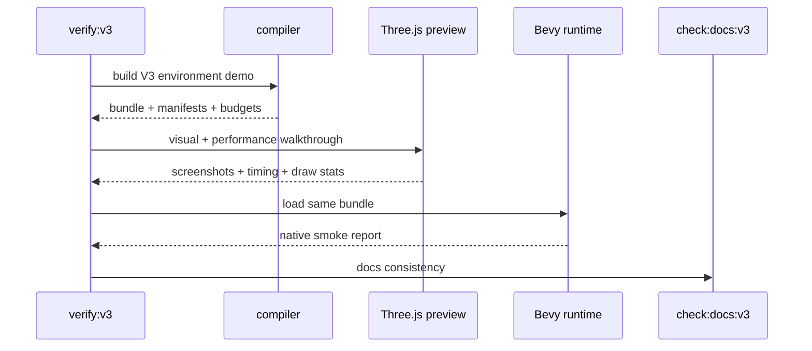

# V3-09 Release Gate and Docs Consistency

Complexity: 8 -> HIGH mode

## Context

**Problem:** V3 needs a release gate that proves the full forest scene bundles
into a close practical match for the reference image and works as one portable,
performant, visually verified product slice.

**Files Analyzed:** `docs/ROADMAP.md`, `docs/PRDs/v3/README.md`,
`docs/developer-workflow.md`, `docs/ai-workflows.md`, `packages/cli`,
`scripts`, `examples`, `templates`, `runtime-bevy`.

**Current Behavior:**

- V2 gates prove the playable arena workflow, conformance, and docs consistency.
- V3 requires a denser scene with asset budgets, instancing, first-person
  camera, atmosphere, visual checks, and web performance measurements.
- There is no `verify:v3` or `check:docs:v3` gate yet.

## Solution

**Approach:**

- Add a V3 verification profile that builds the environment demo from source.
- Validate world, assets, budgets, instancing, atmosphere, input, and collision
  bundle files before runtime.
- Run web visual and performance checks over bookmarked first-person views, and
  require recorded manual review that the bundled scene is as close as practical
  to `assets-source/environment/Preview_2.jpg`.
- Run Bevy native load smoke against the same bundle.
- Add docs consistency checks so V3 remains scoped to the forest scene proof.

**Key Decisions:**

- [ ] `verify:v3` fails on web budget violations.
- [ ] Visual verification is a hard release gate based on close practical
  matching, automated composition and asset-presence checks, and recorded manual
  review, not pixel-perfect image matching.
- [ ] Native smoke proves same-bundle load and camera view, not full parity for
  every web measurement.
- [ ] Release artifacts are machine-readable for AI repair loops.

**Data Changes:** Writes V3 verification reports, screenshots, runtime logs, and
performance measurements under deterministic artifact paths.

## Integration Points

**How will this feature be reached?**

- Entry point identified: `pnpm verify:v3`, `pnpm check:docs:v3`, and CLI
  verification profile.
- Caller file identified: `scripts/verify-v3.*`, `scripts/check-docs-v3.*`, and
  CLI verify command.
- Registration/wiring needed: package scripts, V3 verify profile, artifact
  paths, docs gate.

**Is this user-facing?** Yes, developer and AI release workflow.

**Full user flow:**

1. Developer changes V3 scene, SDK, compiler, runtime, or docs code.
2. Developer runs `pnpm verify:v3`.
3. Gate builds the environment bundle, validates budgets, launches web preview,
   captures visual/performance artifacts, records manual visual review, and
   runs native smoke.
4. Developer reads pass/fail report with file references and suggested fixes.

## Execution Phases

#### Phase 1: Docs Gate - V3 ticket scope is machine-checkable

**Files (max 5):**

- `scripts/check-docs-v3.*` - V3 docs consistency checks.
- `package.json` - `check:docs:v3` script.
- `docs/PRDs/v3/README.md` - gate documentation.
- `docs/ROADMAP.md` - release command references if tracked there.

**Implementation:**

- [ ] Ensure every V3 PRD file is linked from the index.
- [ ] Check required V3 scope terms: `Preview_2.jpg`, `Three.js`, `performance`,
  `first-person`, `Bevy`, and `verify:v3`.
- [ ] Check excluded features are not listed as V3 acceptance gates.
- [ ] Print exact file and missing/conflicting term diagnostics.

**Tests Required:**

| Test File | Test Name | Assertion |
| --- | --- | --- |
| `scripts/check-docs-v3.*` | `should validate v3 prd index links` | Every V3 ticket link resolves. |

**User Verification:**

- Action: Run `pnpm check:docs:v3`.
- Expected: Docs pass or report exact conflicting files.

#### Phase 2: V3 Verify Profile - Bundle and budget validation is gated

**Files (max 5):**

- `packages/cli/src/verify/v3.ts` - V3 verification profile.
- `packages/cli/src/verify/report.ts` - report fields for budgets/performance.
- `packages/cli/src/verify/v3.test.ts` - profile tests.
- `scripts/verify-v3.*` - top-level script.
- `package.json` - `verify:v3` script.

**Implementation:**

- [ ] Build the V3 environment demo from source.
- [ ] Validate all emitted IR files, asset manifests, budget manifests, and
  target capability declarations.
- [ ] Fail when required artifacts are missing.
- [ ] Save machine-readable report with artifact paths and diagnostics.

**Tests Required:**

| Test File | Test Name | Assertion |
| --- | --- | --- |
| `packages/cli/src/verify/v3.test.ts` | `should fail v3 profile on budget violation` | Verification exits nonzero with budget diagnostic. |

**User Verification:**

- Action: Run `pnpm verify:v3` against an intentionally over-budget fixture.
- Expected: Gate fails before runtime with budget and target profile details.

#### Phase 3: Web and Native Gate - Scene output is verified end to end

**Files (max 5):**

- `packages/cli/src/verify/v3-web.ts` - web visual/performance checks.
- `packages/cli/src/verify/v3-native.ts` - Bevy load smoke.
- `packages/cli/src/verify/v3-artifacts.ts` - artifact paths and serializers.
- `packages/cli/src/verify/v3-web.test.ts` - web report tests.
- `runtime-bevy/tests/v3_environment.rs` - native smoke test.

**Implementation:**

- [ ] Launch web preview for the V3 bundle.
- [ ] Capture bookmarked screenshots and performance measurements.
- [ ] Verify nonblank output, representative asset classes, camera framing, and
  close practical composition signals against `Preview_2.jpg`.
- [ ] Require recorded manual review for the final `entry_path` and `mid_path`
  screenshots before the gate can pass.
- [ ] Run Bevy native load smoke against the same bundle.
- [ ] Include screenshots, timing, draw stats, logs, and native report paths in
  the final report.

**Tests Required:**

| Test File | Test Name | Assertion |
| --- | --- | --- |
| `packages/cli/src/verify/v3-web.test.ts` | `should include web performance artifacts` | Report contains frame timing, draw stats, and screenshot paths. |
| `runtime-bevy/tests/v3_environment.rs` | `should load v3 environment bundle` | Native runtime accepts the bundle and reaches a camera view. |

**User Verification:**

- Action: Run `pnpm verify:v3`.
- Expected: Gate passes only when web visuals, recorded close-match review, web
  performance, and native load smoke all pass.

## Verification Strategy

- `pnpm check:docs:v3`
- `pnpm verify:v3`
- `pnpm verify:conformance`
- `pnpm test`
- `cd runtime-bevy && cargo test`

## Acceptance Criteria

- [ ] `check:docs:v3` validates V3 scope and ticket links.
- [ ] `verify:v3` builds the V3 environment demo from source.
- [ ] V3 bundle validation fails on missing assets, unsupported capabilities,
  and budget violations.
- [ ] Web visual verification captures bookmarked scene screenshots.
- [ ] Final screenshots pass recorded manual review as a close practical match
  for `assets-source/environment/Preview_2.jpg`.
- [ ] Web performance verification reports draw stats, load timing, and frame
  timing.
- [ ] Native Bevy smoke loads the same bundle and reaches a camera view.
- [ ] Release artifacts are deterministic and machine-readable.
