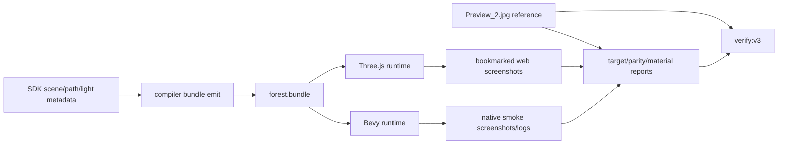
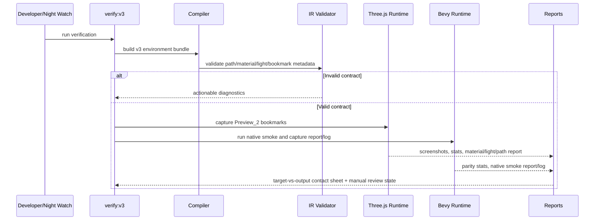

# V3-10 Preview_2 Visual Fidelity and Runtime Parity

Complexity: 12 -> HIGH mode

## Context

**Problem:** V3 verification can pass without proving that the emitted web and
native forest scene visually matches `assets-source/environment/Preview_2.jpg`
or that the two runtimes interpret the same environment metadata consistently.

**Files Analyzed:** `assets-source/environment/Preview_2.jpg`,
`examples/v3-environment/src/game.ts`,
`templates/v3-environment/src/game.ts`,
`examples/v3-environment/dist/forest.bundle/assets/environment/reference/Preview_2.jpg`,
`tools/verify/artifacts/milestones/v3/verification-report.json`, `packages/sdk`,
`packages/ir`, `packages/compiler`, `packages/cli`,
`packages/runtime-web-three`, `runtime-bevy`,
`docs/PRDs/v3/V3-07*`, `docs/PRDs/v3/V3-08*`,
`docs/PRDs/v3/V3-09-release-gate-and-docs-consistency.md`.

**Current Behavior:**

- `pnpm verify:v3` can pass technically while `v3Scene.nativeSmoke.visualParity`
  is not asserted and no target-vs-output Preview_2 comparison is required.
- Existing side-by-side artifacts compare Three.js and Bevy output, not either
  runtime against `Preview_2.jpg`.
- Path authoring includes `forest.path.main`, width `3.2`, edge falloff `0.55`,
  clearing radius `2.2`, material `forest.path.soil`, and five points, but
  runtime path rendering still uses hardcoded colors, flat overlays, and partial
  metadata consumption.
- Three.js and Bevy lighting, tone mapping, shadow, material, GLTF
  normalization, fog, and atmosphere behavior are inconsistent or silently
  unsupported in places.
- Docs and gates reference outdated bookmark names and fixed performance
  samples instead of real visual/performance/native release artifacts.

## Solution

**Approach:**

- Add a hard V3 visual-fidelity gate that includes Preview_2 as a first-class
  reference artifact in reports, contact sheets, manual review, and machine
  diagnostics.
- Make path material, edge falloff, clearing radius, width, and points a shared
  runtime contract with validation for missing materials, adjacent zero-length
  segments, and semantic inconsistencies.
- Establish one source of truth for V3 environment lighting and material policy,
  with explicit diagnostics for unsupported Bevy fields instead of silent drift.
- Tune scene composition using existing asset catalog and scene metadata only;
  do not paste the reference image as a backdrop or shortcut.
- Promote final Preview_2 target-vs-output review, Three.js-vs-Bevy parity
  stats, native smoke logs, and material/light/path reports into `verify:v3`.



**Key Decisions:**

- [ ] `Preview_2.jpg` is the visual target and must appear in target-vs-output
  artifacts, not only in source assets.
- [ ] Runtime parity means both runtimes consume the same bundle metadata or
  emit explicit unsupported-field diagnostics.
- [ ] Path fidelity work may choose real terrain blending or overlay rendering
  with diagnostics, but must document the choice and eliminate undocumented
  hardcoded colors/heights.
- [ ] Manual visual review is a hard gate for product-level visual acceptance.
- [ ] If another AI/agent is working in the repo, the executor must check
  `git status` and active build/test processes before editing and avoid
  stomping in-flight artifact writes.

**Data Changes:** Extends V3 verification report artifacts with
`preview2-target-vs-bookmarks` contact sheets, `manual-visual-review.json`,
`v3-native-smoke-report` and log paths, material/light/path metadata reports,
bookmark contract data, and target-vs-output visual stats.

## Integration Points

**How will this feature be reached?**

- [x] Entry point identified: `pnpm verify:v3`, `pnpm check:docs:v3`, V3
  environment build/verify profile, runtime web screenshot capture, and Bevy
  native smoke tests.
- [x] Caller file identified: CLI V3 verify profile, compiler bundle emitter,
  IR validator, Three.js environment renderer, Bevy loader/runtime, docs gate.
- [x] Registration/wiring needed: V3 report schema, artifact paths, manual
  review requirement, bookmark names, native smoke report/log collection.

**Is this user-facing?** Yes. The user-visible outcome is a V3 forest scene
that looks like the Preview_2 reference and fails verification when visual,
runtime, material, or native parity evidence is missing.

**Full user flow:**

1. Developer or Night Watch checks `git status` and running build/test
   processes before editing or writing artifacts.
2. Developer changes V3 scene, IR, compiler, web runtime, Bevy runtime, or gate
   code.
3. Developer runs targeted package tests for the touched area.
4. Developer runs `pnpm verify:v3`.
5. Gate builds the environment bundle, validates metadata, captures web and
   native bookmarks, compares output against Preview_2, saves reports, and
   requires manual review.
6. Developer reads a machine-readable failure pointing to the mismatched
   material, light, path, bookmark, asset density, runtime, or artifact.

## Sequence Flow



## Execution Phases

#### Phase 1: Baseline and Reference Artifact Gate - Preview_2 comparison is visible and required

**Files (max 5):**

- `packages/cli/src/verify/v3-artifacts.ts` - deterministic Preview_2 artifact
  paths and serializers.
- `packages/cli/src/verify/v3-web.ts` - target-vs-bookmark capture and report
  fields.
- `packages/cli/src/verify/v3.test.ts` - missing reference/manual review gate
  tests.
- `scripts/check-docs-v3.*` - required artifact/docs consistency checks.
- `docs/developer-workflow.md` - verification artifact workflow.

**Implementation:**

- [ ] Include `assets-source/environment/Preview_2.jpg` and copied bundle
  reference image in V3 reports.
- [ ] Archive current baseline with commit, bundle hash, screenshot dimensions,
  image stats, and bookmark names.
- [ ] Generate `preview2-target-vs-bookmarks` contact sheet comparing Preview_2
  with entry, mid, bend/detail, and native smoke views.
- [ ] Require `manual-visual-review.json` before final gate pass.
- [ ] Fail `check:docs:v3` when required V3 visual artifacts are undocumented.

**Tests Required:**

| Test File | Test Name | Assertion |
| --- | --- | --- |
| `packages/cli/src/verify/v3.test.ts` | `should fail v3 verification when preview2 reference artifact is missing` | Report exits nonzero and names `Preview_2.jpg`. |
| `packages/cli/src/verify/v3.test.ts` | `should require manual visual review for preview2 gate` | Passing visual stats without review remains a failed gate. |

**Verification Plan:**

- `pnpm check:docs:v3`
- `pnpm verify:v3`

**User Verification:**

- Action: Open the generated target-vs-bookmarks contact sheet.
- Expected: Preview_2 appears beside captured entry/mid/detail/native views with
  baseline metadata in the JSON report.

#### Phase 2: Path Metadata and Material Fidelity - Path rendering follows bundle metadata

**Files (max 5):**

- `packages/ir/src/environment.ts` - path material, segment, and semantic
  validation.
- `packages/compiler/src/environment.ts` - path metadata emission and scatter
  exclusion semantics.
- `packages/runtime-web-three/src/environment.ts` - Three.js path material,
  width, edge falloff, and clearing semantics.
- `runtime-bevy/crates/threenative_loader/src/environment.rs` - deserialize
  material and edge falloff.
- `runtime-bevy/crates/threenative_runtime/src/environment.rs` - Bevy path
  material/fallback rendering and diagnostics.

**Implementation:**

- [ ] Validate path material existence, positive width, valid edge falloff,
  valid clearing radius, bounded points, and no zero-length adjacent segments.
- [ ] Use a shared fallback path material only when authored material is missing
  and emit a diagnostic.
- [ ] Apply or explicitly diagnose `edgeFalloff` and `clearingRadius` in both
  runtimes.
- [ ] Avoid undocumented hardcoded path colors and overlay heights.
- [ ] Decide real blending versus overlay-with-diagnostic and record the choice
  in material/path report output.

**Tests Required:**

| Test File | Test Name | Assertion |
| --- | --- | --- |
| `packages/ir/src/environment.test.ts` | `should reject a path that references an unknown material` | Diagnostic names `forest.path.main` and missing material ID. |
| `packages/ir/src/environment.test.ts` | `should reject zero length adjacent path segments` | Diagnostic includes offending point indexes. |
| `packages/compiler/src/environment.test.ts` | `should emit path material edge falloff clearing radius width and points` | Bundle JSON preserves all authored path metadata. |
| `runtime-bevy/tests/v3_environment.rs` | `should deserialize v3 path material and edge falloff` | Native report includes material and edge falloff values. |

**Verification Plan:**

- `pnpm --filter @threenative/ir test -- environment`
- `pnpm --filter @threenative/compiler test -- bundle`
- `pnpm --filter @threenative/runtime-web-three test -- environment`
- `cd runtime-bevy && cargo test -p threenative_loader load_bundle`
- `cd runtime-bevy && cargo test -p threenative_runtime --test v3_environment`

**User Verification:**

- Action: Inspect entry/mid path screenshots and material/path metadata report.
- Expected: The path is central, light-brown, stone-scattered, grounded on
  terrain, and no runtime reports ignored path metadata.

#### Phase 3: Lighting and Material Parity - Runtimes share one visual lighting contract

**Files (max 5):**

- `packages/ir/src/environment.ts` - atmosphere/light/material capability
  validation.
- `packages/runtime-web-three/src/renderBundle.ts` - renderer color space, ACES
  tone mapping, exposure, and shadow settings.
- `packages/runtime-web-three/src/environment.ts` - duplicate light detection
  and material inspection report.
- `runtime-bevy/crates/threenative_runtime/src/atmosphere.rs` - Bevy mappings
  or unsupported-field diagnostics.
- `runtime-bevy/tests/rendering_atmosphere.rs` - parity tests for atmosphere
  mappings and diagnostics.

**Implementation:**

- [ ] Define a single V3 lighting source of truth and remove or diagnose SDK,
  scene-level, and group-level duplicate lights.
- [ ] Apply Three.js renderer `outputColorSpace`, ACES tone mapping,
  `toneMappingExposure`, and shadow settings from bundle metadata.
- [ ] Map Bevy fog, horizon, tone mapping, exposure, and shadows where
  practical; otherwise emit stable unsupported-field diagnostics.
- [ ] Replace broad hardcoded Bevy intensity conversion with documented,
  test-covered conversion or explicit parity exception.
- [ ] Align lit/unlit policy for terrain/path and GLTF material normalization,
  including category scale/origin behavior.

**Tests Required:**

| Test File | Test Name | Assertion |
| --- | --- | --- |
| `packages/runtime-web-three/src/environment.test.ts` | `should report duplicate v3 environment lights` | Report names duplicate light sources and selected source of truth. |
| `packages/runtime-web-three/src/renderBundle.test.ts` | `should apply renderer color space tone mapping exposure and shadows` | Renderer settings match bundle metadata. |
| `runtime-bevy/tests/rendering_atmosphere.rs` | `should emit diagnostics for unsupported atmosphere fields` | Unsupported fog/tone/shadow fields are reported, not ignored. |

**Verification Plan:**

- `pnpm --filter @threenative/runtime-web-three test -- environment`
- `cd runtime-bevy && cargo test -p threenative_runtime --test rendering_atmosphere`
- `pnpm verify:v3`

**User Verification:**

- Action: Compare Three.js and Bevy entry/mid bookmarks.
- Expected: Both show warm stylized daylight, blue sky/cloud mood, readable
  foreground detail, and no unexplained duplicate-light diagnostics.

#### Phase 4: Scene Composition Fidelity - The scene closes the visible Preview_2 gaps

**Files (max 5):**

- `examples/v3-environment/src/game.ts` - asset density, bookmarks, camera, and
  composition metadata.
- `templates/v3-environment/src/game.ts` - template parity with example
  metadata.
- `packages/compiler/src/environment.ts` - bookmark contract and asset-class
  visibility report.
- `packages/cli/src/verify/v3-web.ts` - composition checks against Preview_2
  expectations.
- `docs/PRDs/v3/README.md` - bookmark/artifact contract alignment.

**Implementation:**

- [ ] Align bookmark names with current bundle contract:
  `bookmark.entry`, `bookmark.midPath`, `bookmark.bend`, or migrate all docs
  and tests consistently if names change.
- [ ] Ensure required visible asset classes: dense side woodland, foreground
  vegetation, rocks, mushrooms, flowers, scattered grey stones, layered
  background depth, path edges, sky/cloud atmosphere.
- [ ] Adjust first-person camera framing to eye-level down the central winding
  path.
- [ ] Use existing asset catalog and structured scene metadata only; do not use
  pasted Preview_2 backdrops, billboards, or screenshot shortcuts.
- [ ] Add composition diagnostics for missing or under-dense required asset
  classes at bookmarked views.

**Tests Required:**

| Test File | Test Name | Assertion |
| --- | --- | --- |
| `packages/cli/src/verify/v3-web.test.ts` | `should fail when required preview2 asset classes are absent` | Missing rocks/mushrooms/flowers/stones/tree density fail with named diagnostics. |
| `packages/compiler/src/environment.test.ts` | `should emit current v3 bookmark contract` | Bundle contains the documented bookmark IDs and camera metadata. |
| `packages/cli/src/verify/v3-web.test.ts` | `should reject undocumented bookmark ids in v3 reports` | Report and docs stay aligned. |

**Verification Plan:**

- `pnpm --filter @threenative/cli test -- v3Scene`
- `pnpm --filter @threenative/compiler test -- bundle`
- `pnpm check:docs:v3`
- `pnpm verify:v3`

**User Verification:**

- Action: Review Preview_2 against entry, midPath, bend, and detail crops.
- Expected: The scene reads as the same first-person stylized forest path:
  central light-brown dirt path, grey stones, dense woodland on both sides,
  foreground plants/rocks/mushrooms/flowers, layered depth, warm god-ray feel,
  and blue sky/cloud mood.

#### Phase 5: Real Visual, Performance, and Native Release Gate - V3 fails without product-level evidence

**Files (max 5):**

- `packages/cli/src/verify/v3.ts` - final gate orchestration and pass/fail
  policy.
- `packages/cli/src/verify/v3-web.ts` - real browser metrics and visual stats.
- `packages/cli/src/verify/v3-native.ts` - native smoke report/log collection.
- `runtime-bevy/tests/v3_environment.rs` - same-bundle native smoke assertions.
- `scripts/verify-v3.*` - top-level gate command wiring.

**Implementation:**

- [ ] Capture real browser load/frame/draw metrics when practical; otherwise
  fail unless the report explicitly marks metrics unavailable with reason.
- [ ] Add visual stats beyond nonblank for Three.js-vs-Bevy and target-vs-web
  comparisons.
- [ ] Require target-vs-output contact sheet and `manual-visual-review.json` as
  hard gates.
- [ ] Require native smoke report and log in `tools/verify/artifacts/milestones/v3`.
- [ ] Make `pnpm verify:v3` the final release gate for Preview_2 visual
  fidelity and runtime parity.

**Tests Required:**

| Test File | Test Name | Assertion |
| --- | --- | --- |
| `packages/cli/src/verify/v3.test.ts` | `should fail final v3 gate when native smoke report is missing` | Missing report/log blocks pass. |
| `packages/cli/src/verify/v3-web.test.ts` | `should include browser metrics or explicit unavailable reason` | Fixed estimated samples cannot masquerade as real measurements. |
| `runtime-bevy/tests/v3_environment.rs` | `should load the v3 environment bundle and report visual parity inputs` | Native smoke writes bundle, camera, material, and screenshot/log evidence. |

**Verification Plan:**

- `pnpm check:docs:v3`
- `pnpm verify:v3`
- `pnpm --filter @threenative/cli test -- v3Scene`
- `cd runtime-bevy && cargo test -p threenative_runtime --test v3_environment`

**User Verification:**

- Action: Run final gate and perform screenshot/manual review of Preview_2
  versus entry, mid, detail, and native bookmarks.
- Expected: Gate passes only when automated reports and manual review agree
  that the product-level visual target is met.

## Checkpoint Protocol

After each phase:

- Run the phase-specific tests and required verification commands.
- Spawn `prd-work-reviewer` with: `Review checkpoint for phase N of PRD at
  docs/PRDs/v3/V3-10-preview2-visual-fidelity-and-runtime-parity.md`.
- Continue only after automated checkpoint PASS.
- Because this is HIGH mode and visual fidelity is product-level, complete
  manual checkpoint review for every phase that changes visuals, screenshots,
  browser metrics, native artifacts, or manual review policy.
- Before writing artifacts or editing files, check `git status --short` and
  active build/test processes. If another AI/agent is working, do not overwrite
  in-flight artifacts, reports, screenshots, package files, or source edits.

## Verification Strategy

Run narrow tests after each phase, then the final gate:

```bash
pnpm check:docs:v3
pnpm verify:v3
pnpm --filter @threenative/cli test -- v3Scene
pnpm --filter @threenative/runtime-web-three test -- environment
pnpm --filter @threenative/ir test -- environment
pnpm --filter @threenative/compiler test -- bundle
cd runtime-bevy && cargo test -p threenative_loader load_bundle
cd runtime-bevy && cargo test -p threenative_runtime --test rendering_atmosphere
cd runtime-bevy && cargo test -p threenative_runtime --test v3_environment
```

Manual verification:

- Screenshot/manual review of `Preview_2.jpg` versus entry, mid, and detail
  bookmarks.
- Inspect `preview2-target-vs-bookmarks` contact sheet.
- Inspect `manual-visual-review.json`.
- Inspect `v3-native-smoke-report` and native log.
- Inspect material/light/path metadata report for ignored or unsupported fields.

## Acceptance Criteria

**Technical pass:**

- [ ] `pnpm check:docs:v3` passes and docs reference current bookmark/artifact
  names.
- [ ] `pnpm verify:v3` fails when Preview_2 reference, target-vs-output contact
  sheet, manual review, native smoke report/log, or material/light/path report
  is missing.
- [ ] Path validation rejects unknown materials, zero-length adjacent segments,
  invalid width, invalid edge falloff, invalid clearing radius, and out-of-bounds
  points.
- [ ] Three.js applies renderer color, tone mapping, exposure, and shadow
  settings from metadata.
- [ ] Bevy deserializes path material and edge falloff, and reports unsupported
  atmosphere/material fields instead of silently ignoring them.
- [ ] Performance samples are real browser measurements when practical, or the
  report fails with an explicit unavailable reason.

**Cross-runtime parity pass:**

- [ ] Three.js and Bevy consume the same bundle path, material, lighting,
  atmosphere, bookmark, and camera metadata.
- [ ] Duplicate lights are removed or diagnosed with a single selected source of
  truth.
- [ ] Terrain/path lit versus unlit policy is aligned or documented as a
  gate-visible parity exception.
- [ ] GLTF scale/origin normalization differences are resolved or reported.
- [ ] Three.js-vs-Bevy visual stats go beyond nonblank checks and include
  bookmarked scene evidence.
- [ ] Native smoke writes report and log artifacts consumed by the final gate.

**Preview_2 product-level visual pass:**

- [ ] Entry camera shows an eye-level first-person view down a central winding
  light-brown dirt path.
- [ ] Path includes scattered grey stones and visually grounded path edges.
- [ ] Dense stylized woodland appears on both sides with layered background
  depth.
- [ ] Foreground vegetation, rocks, mushrooms, and flowers are visible at
  relevant bookmarks.
- [ ] Lighting reads as warm stylized daylight with god-ray feel and blue
  sky/cloud mood.
- [ ] Target-vs-output contact sheet and manual review record that the scene is
  a close practical match to `assets-source/environment/Preview_2.jpg`.

## Non-Goals

- Pixel-perfect matching against `Preview_2.jpg`.
- New asset generation, new external asset packs, or reference-image backdrops.
- A general terrain editor or arbitrary path editing UI.
- Full Bevy feature parity for every Three.js renderer setting beyond the V3
  environment contract.
- Rewriting unrelated V3 docs, source modules, package metadata, generated
  artifacts, screenshots, or git history while executing this PRD.

## Risks and Mitigations

- **Risk:** Visual matching becomes subjective. **Mitigation:** require
  target-vs-output contact sheets, asset-class diagnostics, visual stats, and
  structured manual review.
- **Risk:** Runtime parity work expands beyond Preview_2. **Mitigation:** scope
  acceptance to the V3 environment bundle and documented contract fields.
- **Risk:** Path blending is expensive or unstable. **Mitigation:** choose
  overlay-with-diagnostic as an allowed interim only if it is report-visible and
  visually grounded.
- **Risk:** Bevy cannot support a metadata field immediately. **Mitigation:**
  emit stable unsupported-field diagnostics and fail only when the field is
  required for the V3 gate.
- **Risk:** Concurrent AI/agent runs overwrite artifacts. **Mitigation:** every
  executor must check git status and active processes before writing and must
  avoid stomping in-flight artifact writes.
