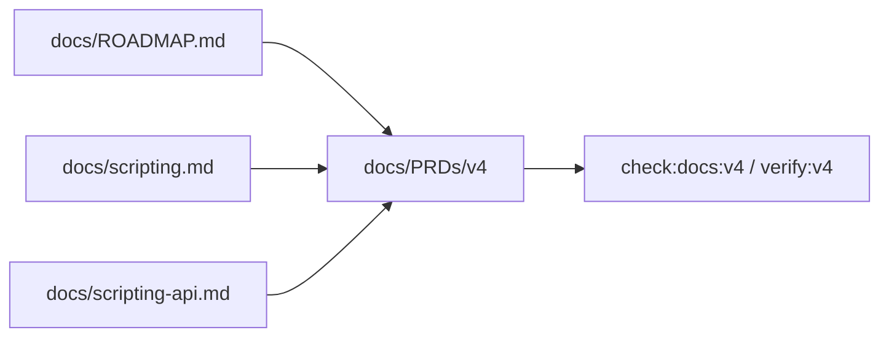

# V4-00 Roadmap and Contract Alignment

Complexity: 7 -> HIGH mode

## Context

**Problem:** V4 can easily drift into broad gameplay/physics/animation work
unless the docs define it as a narrow native scripting proof.

**Files Analyzed:** `docs/ROADMAP.md`, `docs/scripting.md`,
`docs/scripting-api.md`, `docs/STATUS.md`, `docs/feature-maturity.md`,
`docs/diagnostics.md`, `docs/PRDs/v2/V2-03-typescript-systems-and-runtime-host.md`,
`docs/PRDs/v3/README.md`.

**Current Behavior:**

- V2/V3 native scripting is gated or static-only.
- The roadmap defines V4 as embedded JavaScript native scripting.
- `docs/scripting-api.md` defines a V4 MVP API surface and missing/post-V4 API
  inventory.
- No V4 PRD index, docs check, or release gate exists yet.

## Solution

**Approach:**

- Treat V4 as one primitive scripting proof, not a general game platform.
- Align docs around TypeScript authoring, `scripts.bundle.js`, embedded
  QuickJS, patch-log parity, and a primitive demo scene.
- Add docs checks that reject claims that V4 includes full physics, animation,
  UI, arbitrary npm, async, or public Lua/Luau.
- Keep `docs/scripting-api.md` as the source of truth for V4 MVP APIs and
  missing/post-V4 APIs.

**Key Decisions:**

- [ ] QuickJS-ng-style embedding is the first native backend.
- [ ] Patch/event/command/service-call log parity is the V4 proof.
- [ ] V4 demo uses primitive entities, not the V3 forest.
- [ ] Missing APIs stay documented instead of becoming accidental scope.

**Data Changes:** None.

## Integration Points

**How will this feature be reached?**

- Entry point identified: `docs/PRDs/v4/README.md`, `pnpm check:docs:v4`, and
  `pnpm verify:v4`.
- Caller file identified: future `scripts/check-docs-v4.mjs` and
  `scripts/verify-v4.mjs`.
- Registration/wiring needed: package scripts and V4 docs check.

**Is this user-facing?** Yes, documentation-facing for developers and AI agents.

**Full user flow:**

1. Developer opens V4 PRD index.
2. Developer sees the primitive scripting proof, ticket order, exclusions, and
   release gate.
3. Developer implements tickets without promoting full physics, UI, async, or
   arbitrary npm into V4.
4. Docs check catches conflicting scope claims.

## Execution Phases

#### Phase 1: V4 Front Door - Scripting scope is explicit

**Files (max 5):**

- `docs/PRDs/v4/README.md` - ticket order and V4 acceptance criteria.
- `docs/ROADMAP.md` - V4 summary and exclusions if drift exists.
- `docs/scripting.md` - native scripting model.
- `docs/scripting-api.md` - V4 MVP API surface and missing APIs.
- `docs/feature-maturity.md` - V4 status rows.

**Implementation:**

- [ ] State that V4 proves `scripts.bundle.js` running in web and QuickJS.
- [ ] State that primitive scene patch-log parity is the proof.
- [ ] Mark full physics, animation graphs, UI, async, arbitrary npm, and Lua as
  post-V4 or unsupported.
- [ ] Keep missing/post-V4 API inventory current.

**Tests Required:**

| Test File | Test Name | Assertion |
| --- | --- | --- |
| `scripts/check-docs-v4.test.mjs` | `should require v4 quickjs scope terms` | V4 docs name QuickJS, scripts bundle, primitive demo, and patch logs. |

**User Verification:**

- Action: Read `docs/PRDs/v4/README.md`.
- Expected: V4 scope is clearly native scripting parity for a primitive demo.

#### Phase 2: V4 Docs Gate - Scope drift is machine-checkable

**Files (max 5):**

- `scripts/check-docs-v4.mjs` - V4 docs consistency checks.
- `scripts/check-docs-v4.test.mjs` - docs check tests.
- `package.json` - `check:docs:v4` script.
- `docs/PRDs/v4/README.md` - release gate reference.

**Implementation:**

- [ ] Check every V4 PRD is linked from the index.
- [ ] Check required terms: `QuickJS`, `scripts.bundle.js`, `patch`, `event`,
  `command`, `primitive`.
- [ ] Check excluded terms are not acceptance criteria: public Lua/Luau,
  arbitrary npm, async systems, full physics, full UI runtime.
- [ ] Report exact file and missing/conflicting term diagnostics.

**Tests Required:**

| Test File | Test Name | Assertion |
| --- | --- | --- |
| `scripts/check-docs-v4.test.mjs` | `should validate v4 prd index links` | Every `V4-*.md` is linked from the README. |

**User Verification:**

- Action: Run `pnpm check:docs:v4`.
- Expected: Docs pass or report exact conflicting V4 files.

## Verification Strategy

- `pnpm check:docs:v4`
- `rg 'QuickJS|scripts.bundle.js|patch-log|Lua|async|npm' docs/PRDs/v4 docs/scripting*.md`
- Manual review against `docs/ROADMAP.md`.

## Acceptance Criteria

- [ ] V4 docs use roadmap-controlled scope.
- [ ] V4 PRD files are linked and ordered.
- [ ] Broad gameplay-platform features are not required by V4.
- [ ] V4 MVP APIs and missing APIs are documented in `docs/scripting-api.md`.
- [ ] V4 docs check is wired into the release gate.

