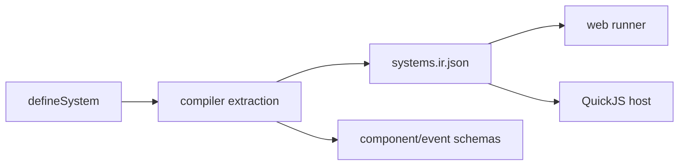

# V4-01 Script IR and API Contract

Complexity: 8 -> HIGH mode

## Context

**Problem:** Web and native cannot execute the same scripting semantics unless
`systems.ir.json`, script permissions, and the V4 API surface are precise and
validated.

**Files Analyzed:** `docs/scripting.md`, `docs/scripting-api.md`,
`docs/ecs.md`, `docs/ir.md`, `packages/ir`, `packages/sdk`,
`packages/compiler`.

**Current Behavior:**

- Systems metadata exists conceptually and V2 gates native hosted scripts.
- V4 MVP APIs are documented, but implementation contracts need exact schema and
  validator behavior.
- Missing/post-V4 APIs are listed to prevent accidental scope expansion.

## Solution

**Approach:**

- Define the V4 system metadata contract for reads, writes, queries, events,
  commands, services, and schedule stage.
- Make `docs/scripting-api.md` the API source of truth for V4 MVP.
- Validate that script code cannot use undeclared writes, events, commands, or
  services.
- Keep unsupported APIs diagnostic-driven instead of silently ignored.

**Key Decisions:**

- [ ] V4 portable stages are `fixedUpdate`, `update`, and `postUpdate`.
- [ ] Services are declared by stable string IDs such as `physics.raycast`.
- [ ] Structural mutation is command-buffer only.
- [ ] Component mutation is patch/set only and must be declared in `writes`.

**Data Changes:** `systems.ir.json` schema/validation may gain `services` and
more explicit command/event permission fields.

## Integration Points

**How will this feature be reached?**

- Entry point identified: `defineSystem` calls in user TypeScript.
- Caller file identified: compiler ECS/script extraction and bundle emitter.
- Registration/wiring needed: SDK types, IR schema, compiler emit, validator.

**Is this user-facing?** Yes, public TypeScript scripting API.

**Full user flow:**

1. User writes a V4 system with declared query/read/write/service permissions.
2. Compiler emits `systems.ir.json`.
3. Validator confirms all referenced components, events, commands, and services
   are known and permitted.
4. Web and Bevy runners use the same metadata to build context and validate
   returned effects.

## Execution Phases

#### Phase 1: Schema Contract - V4 system metadata is explicit

**Files (max 5):**

- `packages/ir/src/*systems*` - systems IR schema and types.
- `packages/ir/src/*validation*` - systems validation.
- `packages/ir/src/*test*` - schema validation tests.
- `docs/ir.md` - systems IR contract reference.
- `docs/scripting-api.md` - API contract updates if needed.

**Implementation:**

- [ ] Add or confirm `stage`, `query`, `reads`, `writes`, `events`,
  `commands`, and `services` fields.
- [ ] Validate unknown components, tags, resources, events, commands, and
  services.
- [ ] Reject unsupported stages.
- [ ] Emit stable diagnostics for invalid references.

**Tests Required:**

| Test File | Test Name | Assertion |
| --- | --- | --- |
| `packages/ir/src/*.test.ts` | `should accept v4 movement system metadata` | Valid movement/rotation system passes validation. |
| `packages/ir/src/*.test.ts` | `should reject undeclared service reference` | Unknown service emits stable diagnostic. |

**User Verification:**

- Action: Validate a fixture with one `physics.raycast` system.
- Expected: Known service passes; unknown service fails before runtime.

#### Phase 2: SDK API Types - V4 authoring surface is typed

**Files (max 5):**

- `packages/sdk/src/*system*` - `defineSystem` and context types.
- `packages/sdk/src/*components*` - minimal component helpers as needed.
- `packages/sdk/src/*events*` - event declarations as needed.
- `packages/sdk/src/*.test.ts` - type/runtime authoring tests.
- `docs/scripting-api.md` - any final naming updates.

**Implementation:**

- [ ] Type `defineSystem(config, run)` for V4 metadata.
- [ ] Type `ctx.query`, `ctx.time`, `ctx.input`, `ctx.events`,
  `ctx.commands`, `ctx.animation`, and `ctx.physics`.
- [ ] Keep service APIs as facades returning plain data.
- [ ] Keep public types free of Bevy, Three.js, DOM, and QuickJS names.

**Tests Required:**

| Test File | Test Name | Assertion |
| --- | --- | --- |
| `packages/sdk/src/*.test.ts` | `should capture v4 primitive system declarations` | SDK emits expected system metadata. |
| `packages/sdk/src/*.test.ts` | `should expose stable entity context API` | Entity getters/patches/commands are available through context types. |

**User Verification:**

- Action: Author the primitive demo systems.
- Expected: TypeScript accepts V4 MVP APIs and rejects obvious unsupported
  direct runtime access.

#### Phase 3: Compiler Access Validation - Unsupported script behavior fails

**Files (max 5):**

- `packages/compiler/src/scripts/diagnostics.ts` - unsupported API diagnostics.
- `packages/compiler/src/scripts/bundle.ts` - system metadata extraction.
- `packages/compiler/src/emit/ecs.ts` - systems emit integration.
- `packages/compiler/src/scripts/*.test.ts` - diagnostics and emit tests.
- `packages/cli/src/commands/build.test.ts` - CLI diagnostic coverage.

**Implementation:**

- [ ] Reject undeclared component writes.
- [ ] Reject undeclared commands, events, and services.
- [ ] Reject DOM, Node, filesystem, network, workers, direct Three.js/Bevy, and
  arbitrary npm dependencies in portable systems.
- [ ] Emit code, severity, file/path, system ID, and suggested fix when
  available.

**Tests Required:**

| Test File | Test Name | Assertion |
| --- | --- | --- |
| `packages/compiler/src/scripts/diagnostics.test.ts` | `should reject direct DOM access in v4 system` | Diagnostic uses `TN_SCRIPT_*` code. |
| `packages/compiler/src/scripts/diagnostics.test.ts` | `should reject undeclared transform write` | Diagnostic identifies system and component. |

**User Verification:**

- Action: Build a fixture with undeclared `Transform` mutation.
- Expected: Build fails with actionable diagnostic before runtime.

## Verification Strategy

- `pnpm --filter @threenative/ir test`
- `pnpm --filter @threenative/sdk test`
- `pnpm --filter @threenative/compiler test`
- `pnpm tn -- build --project examples/v4-scripting --json`

## Acceptance Criteria

- [ ] V4 MVP system metadata is schema-validated.
- [ ] Public TypeScript API covers V4 MVP needs.
- [ ] Missing/post-V4 APIs remain documented and unsupported.
- [ ] Unsupported script behavior fails before runtime.
- [ ] Web and native runners can rely on identical metadata.

