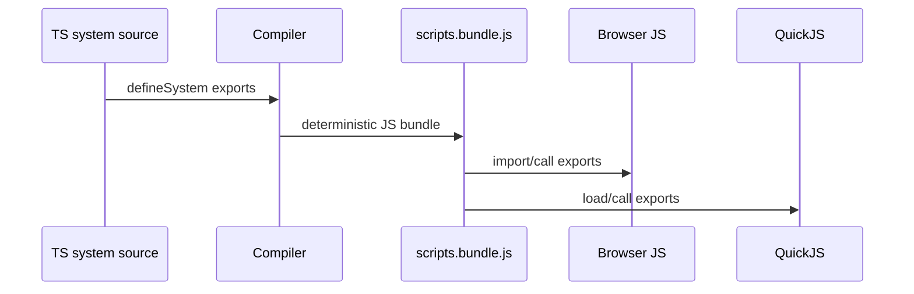

# V4-02 Script Bundling and Portable Diagnostics

Complexity: 8 -> HIGH mode

## Context

**Problem:** V4 needs deterministic `scripts.bundle.js` output that can run in
both browser JavaScript and embedded QuickJS without leaking unsupported host
APIs.

**Files Analyzed:** `docs/scripting.md`, `docs/scripting-api.md`,
`packages/compiler`, `packages/cli`, `templates`, `examples`.

**Current Behavior:**

- V2 introduced `scripts.bundle.js` as the web script artifact.
- Native execution is gated until V4.
- Existing diagnostics reject some unsupported script APIs, but V4 needs the
  bundle contract to be strict enough for QuickJS.

## Solution

**Approach:**

- Emit deterministic ESM-compatible JavaScript system exports.
- Keep the native QuickJS host free of Node, DOM, timers, workers, and QuickJS
  standard library dependencies.
- Produce manifest and schema references that both runtimes can load.
- Make diagnostics stable for unsupported portable-system code.

**Key Decisions:**

- [ ] Use one JavaScript bundle artifact for web and native.
- [ ] Bundle output must be byte-stable for identical inputs.
- [ ] The bundle must not require Node or browser globals.
- [ ] Source/system ID mapping must be preserved for diagnostics.

**Data Changes:** Manifest `entry.scripts` continues to point at
`scripts.bundle.js`.

## Integration Points

**How will this feature be reached?**

- Entry point identified: `tn build`.
- Caller file identified: compiler bundle emission and CLI build command.
- Registration/wiring needed: script bundler, manifest emit, diagnostics.

**Is this user-facing?** Yes, through build output and diagnostics.

**Full user flow:**

1. User writes V4 TypeScript systems.
2. `tn build` emits `scripts.bundle.js` and `systems.ir.json`.
3. Web imports the bundle.
4. Bevy loads the same bundle into QuickJS.
5. Unsupported code fails during build or native load with stable diagnostics.

## Execution Phases

#### Phase 1: Deterministic Bundle Emit - One script artifact feeds both runtimes

**Files (max 5):**

- `packages/compiler/src/scripts/bundle.ts` - deterministic script bundling.
- `packages/compiler/src/emit/bundle.ts` - manifest and file emission.
- `packages/compiler/src/scripts/bundle.test.ts` - byte stability tests.
- `packages/compiler/src/emit/bundle.test.ts` - manifest entry tests.
- `docs/scripting.md` - artifact contract update if needed.

**Implementation:**

- [ ] Emit `scripts.bundle.js` only when systems exist.
- [ ] Preserve stable export names and system IDs.
- [ ] Ensure two equivalent builds produce byte-identical output.
- [ ] Ensure manifest references `entry.scripts`.

**Tests Required:**

| Test File | Test Name | Assertion |
| --- | --- | --- |
| `packages/compiler/src/scripts/bundle.test.ts` | `should emit deterministic scripts bundle` | Repeated builds produce identical bytes. |
| `packages/compiler/src/emit/bundle.test.ts` | `should reference scripts bundle in manifest` | Manifest includes `entry.scripts`. |

**User Verification:**

- Action: Build V4 primitive fixture twice.
- Expected: `scripts.bundle.js` and `systems.ir.json` are stable.

#### Phase 2: Portable JS Diagnostics - Unsupported globals fail early

**Files (max 5):**

- `packages/compiler/src/scripts/diagnostics.ts` - portable API checks.
- `packages/compiler/src/scripts/diagnostics.test.ts` - rejection tests.
- `packages/cli/src/commands/build.test.ts` - CLI structured diagnostic tests.
- `docs/diagnostics.md` - script diagnostic namespace if needed.

**Implementation:**

- [ ] Reject DOM/browser globals such as `document`, `window`, and canvas
  access.
- [ ] Reject Node/file/network/process imports.
- [ ] Reject worker/timer APIs until deterministic scheduling is specified.
- [ ] Reject unresolved npm dependencies that are not explicitly allowed.
- [ ] Suggest portable context alternatives where possible.

**Tests Required:**

| Test File | Test Name | Assertion |
| --- | --- | --- |
| `packages/compiler/src/scripts/diagnostics.test.ts` | `should reject node fs import` | Diagnostic uses stable `TN_SCRIPT_*` code. |
| `packages/cli/src/commands/build.test.ts` | `should emit structured portable script diagnostic` | CLI stderr/stdout contains code, severity, suggestion. |

**User Verification:**

- Action: Build a fixture importing `fs`.
- Expected: Build fails before runtime with actionable script diagnostic.

#### Phase 3: QuickJS Loadability Probe - Bundle can be parsed outside browser

**Files (max 5):**

- `packages/compiler/src/scripts/quickjsProbe.ts` or test helper - optional
  syntax/load probe.
- `packages/compiler/src/scripts/quickjsProbe.test.ts` - loadability tests.
- `packages/compiler/package.json` - test dependency/script if needed.
- `docs/tech-stack.md` - chosen QuickJS binding note if selected.

**Implementation:**

- [ ] Add a narrow loadability check if a JS engine binding is available in TS
  tests; otherwise document that native V4-04 owns runtime parse/load proof.
- [ ] Ensure emitted bundle does not rely on browser-only module loading.
- [ ] Record limitations in diagnostics if syntax unsupported by the selected
  QuickJS binding.

**Tests Required:**

| Test File | Test Name | Assertion |
| --- | --- | --- |
| `packages/compiler/src/scripts/quickjsProbe.test.ts` | `should parse primitive system bundle` | Bundle parses or native-owned proof is explicitly skipped. |

**User Verification:**

- Action: Run compiler script tests.
- Expected: Bundle is browser-safe and native-host-ready.

## Verification Strategy

- `pnpm --filter @threenative/compiler test -- --run scripts`
- `pnpm --filter @threenative/cli test -- --run build`
- `pnpm tn -- build --project examples/v4-scripting --json`

## Acceptance Criteria

- [ ] `scripts.bundle.js` is deterministic.
- [ ] Manifest references scripts only when systems exist.
- [ ] Unsupported globals/imports fail before runtime.
- [ ] Diagnostic payloads are stable and actionable.
- [ ] Bundle is ready for both web import and native QuickJS loading.

