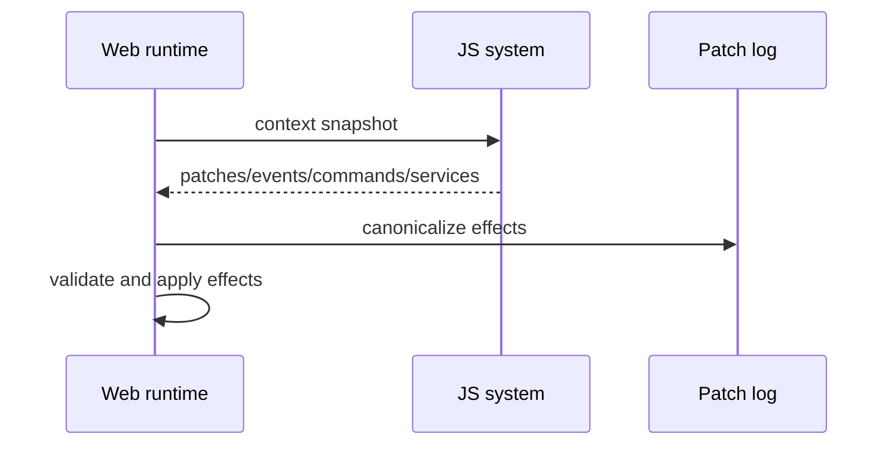

# V4-03 Web System Runner and Patch Logs

Complexity: 9 -> HIGH mode

## Context

**Problem:** Web must execute V4 systems through the same portable context and
produce canonical effect logs before native QuickJS parity can be proven.

**Files Analyzed:** `docs/scripting.md`, `docs/scripting-api.md`,
`packages/runtime-web-three`, `packages/cli/src/verify`, `examples`.

**Current Behavior:**

- Web preview is the fastest iteration path.
- V2 planned web system execution, but V4 needs canonical patch/event/command
  logs for parity.
- No `verify:v4` patch-log comparison exists yet.

## Solution

**Approach:**

- Load `scripts.bundle.js` in the web runtime.
- Build a portable context from ECS snapshots, resources, events, commands, and
  declared services.
- Run systems by stage against batch query snapshots.
- Emit canonical patch/event/command/service-call logs before applying effects.

**Key Decisions:**

- [ ] Web and native compare effect logs, not JS object identities.
- [ ] Runtime applies effects only after validation.
- [ ] Query snapshots are batched per system, not per entity host calls.
- [ ] Logs use stable entity IDs and sorted deterministic ordering.

**Data Changes:** Adds V4 verification patch-log artifact format.

## Integration Points

**How will this feature be reached?**

- Entry point identified: web runtime game loop and `verify:v4`.
- Caller file identified: `packages/runtime-web-three` system runner and CLI V4
  verifier.
- Registration/wiring needed: stage loop, scripts bundle loading, patch-log
  serializer.

**Is this user-facing?** Yes, visible through web preview and V4 verification.

**Full user flow:**

1. User builds primitive scripting demo.
2. Web runtime loads world IR, systems IR, and script bundle.
3. Web runner executes systems for a fixed input trace.
4. Web runner writes canonical patch/event/command/service-call log.
5. `verify:v4` compares the log against native QuickJS output.

## Execution Phases

#### Phase 1: Context Runtime - Web systems receive portable snapshots

**Files (max 5):**

- `packages/runtime-web-three/src/systems/context.ts` - web context builder.
- `packages/runtime-web-three/src/systems/runner.ts` - stage runner.
- `packages/runtime-web-three/src/systems/types.ts` - effect log types.
- `packages/runtime-web-three/src/systems/runner.test.ts` - context tests.
- `packages/runtime-web-three/src/index.ts` - exports.

**Implementation:**

- [ ] Build `ctx.query()` from declared query filters.
- [ ] Provide `ctx.time`, `ctx.input`, `ctx.events`, `ctx.commands`,
  `ctx.animation`, and `ctx.physics` facades.
- [ ] Return entity snapshots with stable IDs.
- [ ] Prevent mutation outside patch/set/commands.

**Tests Required:**

| Test File | Test Name | Assertion |
| --- | --- | --- |
| `packages/runtime-web-three/src/systems/runner.test.ts` | `should provide declared query snapshots` | System sees only matching entities/components. |
| `packages/runtime-web-three/src/systems/runner.test.ts` | `should reject undeclared component patch` | Runner reports validation diagnostic. |

**User Verification:**

- Action: Run web primitive fixture.
- Expected: Rotator system receives cubes and patches `Transform.rotation`.

#### Phase 2: Effect Application - Patches, events, and commands mutate web state

**Files (max 5):**

- `packages/runtime-web-three/src/systems/effects.ts` - effect validation/apply.
- `packages/runtime-web-three/src/mapWorld.ts` - transform sync.
- `packages/runtime-web-three/src/systems/runner.ts` - stage flush.
- `packages/runtime-web-three/src/systems/effects.test.ts` - effect tests.
- `packages/runtime-web-three/src/gameLoop.ts` - schedule integration if
  present.

**Implementation:**

- [ ] Apply component patches to ECS/runtime state.
- [ ] Sync changed transforms to Three.js objects.
- [ ] Queue/read events by declared event type.
- [ ] Apply spawn/despawn/add/remove at stage boundaries.
- [ ] Reject effects outside declared permissions.

**Tests Required:**

| Test File | Test Name | Assertion |
| --- | --- | --- |
| `packages/runtime-web-three/src/systems/effects.test.ts` | `should apply transform patch after system` | Runtime state and Three.js object update. |
| `packages/runtime-web-three/src/systems/effects.test.ts` | `should flush spawn command after stage` | Spawned marker appears after command flush. |

**User Verification:**

- Action: Run primitive demo in web preview.
- Expected: Cubes rotate, one target moves, and spawned marker appears.

#### Phase 3: Canonical Logs - Web output is comparable to native

**Files (max 5):**

- `packages/runtime-web-three/src/systems/log.ts` - canonical log serializer.
- `packages/runtime-web-three/src/systems/log.test.ts` - deterministic log tests.
- `packages/cli/src/verify/v4Scripting.ts` - web log collection hook.
- `packages/cli/src/verify/v4Scripting.test.ts` - report tests.
- `docs/verify-v4.md` - artifact contract if added.

**Implementation:**

- [ ] Serialize patch/event/command/service calls in stable order.
- [ ] Include stage, system ID, frame/tick, entity ID, component/event/service
  IDs, and payload.
- [ ] Normalize numeric precision where needed.
- [ ] Write web log artifact for `verify:v4`.

**Tests Required:**

| Test File | Test Name | Assertion |
| --- | --- | --- |
| `packages/runtime-web-three/src/systems/log.test.ts` | `should produce deterministic patch log` | Same inputs produce byte-identical JSON. |
| `packages/cli/src/verify/v4Scripting.test.ts` | `should include web patch log path` | Report links web effect log artifact. |

**User Verification:**

- Action: Run V4 verifier on primitive demo.
- Expected: Web patch log contains rotation, movement, spawn, event, and service
  entries.

## Verification Strategy

- `pnpm --filter @threenative/runtime-web-three test -- --run systems`
- `pnpm --filter @threenative/cli test -- --run v4`
- `pnpm verify:v4` once wired.

## Acceptance Criteria

- [ ] Web executes V4 systems from `scripts.bundle.js`.
- [ ] Web context exposes only portable APIs.
- [ ] Web applies validated patches/events/commands.
- [ ] Web logs canonical effects for parity comparison.
- [ ] Primitive demo visibly changes in web preview.

