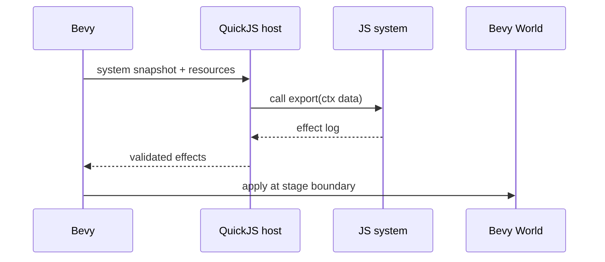

# V4-04 Bevy QuickJS Host

Complexity: 10 -> HIGH mode

## Context

**Problem:** Native gameplay scripting needs to run the same `scripts.bundle.js`
inside Bevy without exposing Bevy internals or embedding an unrestricted JS
environment.

**Files Analyzed:** `docs/scripting.md`, `docs/scripting-api.md`,
`runtime-bevy`, `packages/ir`, `packages/compiler`, `packages/cli`.

**Current Behavior:**

- Bevy loads static bundle data and explicitly gates hosted scripts.
- `TN_BEVY_SYSTEM_HOST_UNSUPPORTED` is the current native scripting behavior.
- V4 requires an embedded QuickJS-ng-style host with the same portable context
  and effect validation semantics as web.

## Solution

**Approach:**

- Add a Bevy script-host crate/module for QuickJS integration.
- Load `scripts.bundle.js` and system exports.
- Marshal batch ECS snapshots into QuickJS as plain data.
- Collect returned patches, events, commands, and service calls.
- Validate effects against `systems.ir.json` before mutating Bevy world.

**Key Decisions:**

- [ ] QuickJS host exposes only ThreeNative host functions/data.
- [ ] No QuickJS standard library, Node, DOM, timers, workers, filesystem, or
  network.
- [ ] Bevy entity handles never cross the host boundary.
- [ ] JS calls are per system/stage batch, not per entity.

**Data Changes:** Native script-host artifacts may add a native patch-log report
for `verify:v4`.

## Integration Points

**How will this feature be reached?**

- Entry point identified: `tn dev --target desktop` and `verify:v4`.
- Caller file identified: Bevy runtime startup/schedule and systems host module.
- Registration/wiring needed: QuickJS dependency, host initialization, schedule
  stage integration, effect apply.

**Is this user-facing?** Yes, native execution of TypeScript gameplay.

**Full user flow:**

1. User builds primitive scripting demo.
2. Bevy loads bundle and sees `entry.scripts`.
3. Bevy initializes QuickJS host and validates exports against `systems.ir.json`.
4. Bevy runs systems for a fixed input trace.
5. Bevy writes native effect log and applies validated mutations.

## Execution Phases

#### Phase 1: QuickJS Runtime Spike - Native can load and call one export

**Files (max 5):**

- `runtime-bevy/crates/threenative_runtime/Cargo.toml` - QuickJS dependency.
- `runtime-bevy/crates/threenative_runtime/src/systems_host.rs` - host entry.
- `runtime-bevy/crates/threenative_runtime/src/lib.rs` - module export.
- `runtime-bevy/crates/threenative_runtime/tests/systems_host.rs` - host tests.
- `docs/tech-stack.md` - exact binding note if chosen.

**Implementation:**

- [ ] Choose and pin a QuickJS-ng-compatible Rust binding or wrapper.
- [ ] Load a simple JS source string.
- [ ] Call an exported function.
- [ ] Convert plain JS return data to Rust structures.
- [ ] Keep existing unsupported diagnostic for unsupported builds if feature is
  not compiled.

**Tests Required:**

| Test File | Test Name | Assertion |
| --- | --- | --- |
| `runtime-bevy/crates/threenative_runtime/tests/systems_host.rs` | `should call quickjs system export` | Rust receives expected plain return data. |
| `runtime-bevy/crates/threenative_runtime/tests/systems_host.rs` | `should reject missing export` | Diagnostic includes system ID and export name. |

**User Verification:**

- Action: Run `cd runtime-bevy && cargo test systems_host`.
- Expected: QuickJS host loads and calls one test export.

#### Phase 2: Snapshot Marshalling - Bevy sends portable ECS data to JS

**Files (max 5):**

- `runtime-bevy/crates/threenative_runtime/src/systems_context.rs` - snapshot
  builder.
- `runtime-bevy/crates/threenative_runtime/src/systems_host.rs` - context call.
- `runtime-bevy/crates/threenative_runtime/src/components.rs` or mapping module
  - component serialization.
- `runtime-bevy/crates/threenative_runtime/tests/systems_context.rs` - snapshot
  tests.
- `runtime-bevy/crates/threenative_runtime/tests/systems_host.rs` - integration
  tests.

**Implementation:**

- [ ] Resolve stable SDK entity IDs from Bevy entities.
- [ ] Collect only declared query components.
- [ ] Include time/input resources as plain data.
- [ ] Represent events and command buffers as plain data.
- [ ] Avoid raw handles, pointers, or Bevy-specific names.

**Tests Required:**

| Test File | Test Name | Assertion |
| --- | --- | --- |
| `runtime-bevy/crates/threenative_runtime/tests/systems_context.rs` | `should build declared query snapshot` | Snapshot includes matching entity and excludes undeclared components. |
| `runtime-bevy/crates/threenative_runtime/tests/systems_host.rs` | `should pass time resource to quickjs system` | JS export observes expected fixed dt. |

**User Verification:**

- Action: Run native primitive fixture for one tick.
- Expected: JS sees the expected entity IDs and component snapshots.

#### Phase 3: Effect Validation And Apply - Bevy mutates only through contract

**Files (max 5):**

- `runtime-bevy/crates/threenative_runtime/src/systems_effects.rs` - effect
  validation/apply.
- `runtime-bevy/crates/threenative_runtime/src/systems_host.rs` - host output
  handling.
- `runtime-bevy/crates/threenative_runtime/tests/systems_effects.rs` - effect
  tests.
- `runtime-bevy/crates/threenative_runtime/tests/systems_host.rs` - integration
  tests.
- `packages/ir/fixtures/conformance/*` - shared fixture if needed.

**Implementation:**

- [ ] Parse patches, events, commands, and service calls from JS output.
- [ ] Validate writes against `systems.ir.json`.
- [ ] Apply transform/component patches.
- [ ] Apply spawn/despawn/add/remove at schedule boundaries.
- [ ] Emit stable diagnostics for invalid effects.
- [ ] Serialize native effect log in the same canonical shape as web.

**Tests Required:**

| Test File | Test Name | Assertion |
| --- | --- | --- |
| `runtime-bevy/crates/threenative_runtime/tests/systems_effects.rs` | `should apply declared transform patch` | Bevy transform changes after stage flush. |
| `runtime-bevy/crates/threenative_runtime/tests/systems_effects.rs` | `should reject undeclared write` | Error includes system ID and component name. |

**User Verification:**

- Action: Run native primitive fixture.
- Expected: Rotating cube transform updates and native patch log is written.

## Verification Strategy

- `cd runtime-bevy && cargo test systems_host systems_context systems_effects`
- `pnpm verify:conformance`
- `pnpm verify:v4` once wired.

## Acceptance Criteria

- [ ] Bevy can load and call `scripts.bundle.js` through QuickJS.
- [ ] QuickJS receives only portable context data.
- [ ] Bevy validates every returned effect before mutation.
- [ ] Native patch logs match the web canonical shape.
- [ ] Existing unsupported-host diagnostic remains for unavailable host builds.

