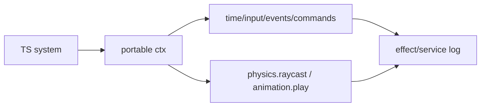

# V4-05 Host Service Facades

Complexity: 8 -> HIGH mode

## Context

**Problem:** V4 must prove engine-like APIs without exposing real Three.js,
Bevy, Rapier, animation mixer, or renderer handles to scripts.

**Files Analyzed:** `docs/scripting-api.md`, `docs/scripting.md`,
`packages/runtime-web-three`, `runtime-bevy`, `packages/ir`, `packages/sdk`.

**Current Behavior:**

- `docs/scripting-api.md` lists `ctx.time`, `ctx.input`, `ctx.events`,
  `ctx.commands`, `ctx.physics.raycast`, and `ctx.animation.play` as V4 MVP or
  proof APIs.
- Full physics and animation are explicitly post-V4.
- No shared service-call log format exists yet.

## Solution

**Approach:**

- Implement narrow service facades as declared capabilities, not direct engine
  handles.
- Treat `ctx.time`, `ctx.input`, events, and commands as required V4 services.
- Treat `ctx.physics.raycast` and `ctx.animation.play` as narrow proof services
  that may be stubbed or minimal as long as logs and validation are real.
- Include service calls in cross-runtime effect logs.

**Key Decisions:**

- [ ] `ctx.physics.raycast` returns plain hit data.
- [ ] `ctx.animation.play` emits a command/service call; it does not require a
  full animation graph.
- [ ] Service calls must be listed in `systems.ir.json`.
- [ ] Unsupported services fail with diagnostics.

**Data Changes:** Adds service-call entries to the canonical effect log and
`services` permission checks if not already present.

## Integration Points

**How will this feature be reached?**

- Entry point identified: scripts calling `ctx.time`, `ctx.input`,
  `ctx.events`, `ctx.commands`, `ctx.physics`, and `ctx.animation`.
- Caller file identified: web and Bevy context builders.
- Registration/wiring needed: SDK types, runtime facades, service validation,
  effect log serialization.

**Is this user-facing?** Yes, TypeScript scripting APIs.

**Full user flow:**

1. User declares `services: ["physics.raycast", "animation.play"]`.
2. User calls `ctx.physics.raycast` and `ctx.animation.play`.
3. Runtime validates service permission.
4. Runtime returns plain raycast data or logs animation command.
5. `verify:v4` compares service-call logs across web and native.

## Execution Phases

#### Phase 1: Required Runtime Services - Time, input, events, and commands work

**Files (max 5):**

- `packages/sdk/src/*context*` - service API types.
- `packages/runtime-web-three/src/systems/context.ts` - web service context.
- `runtime-bevy/crates/threenative_runtime/src/systems_context.rs` - native
  service context.
- `packages/runtime-web-three/src/systems/context.test.ts` - web tests.
- `runtime-bevy/crates/threenative_runtime/tests/systems_context.rs` - native
  tests.

**Implementation:**

- [ ] Provide deterministic `dt` and `fixedDt`.
- [ ] Provide logical input axis/action values from a fixed trace.
- [ ] Implement typed event read/emit queues.
- [ ] Implement command buffer APIs.

**Tests Required:**

| Test File | Test Name | Assertion |
| --- | --- | --- |
| `packages/runtime-web-three/src/systems/context.test.ts` | `should expose fixed input trace` | System reads expected axis/action values. |
| `runtime-bevy/crates/threenative_runtime/tests/systems_context.rs` | `should expose fixed input trace` | Native context matches web fixture values. |

**User Verification:**

- Action: Run primitive demo with fixed trace.
- Expected: Same movement and spawn command appear in both logs.

#### Phase 2: Physics Raycast Proof - Scripts can query a controlled service

**Files (max 5):**

- `packages/runtime-web-three/src/systems/services/physics.ts` - web raycast
  facade.
- `runtime-bevy/crates/threenative_runtime/src/systems_services.rs` - native
  raycast facade.
- `packages/runtime-web-three/src/systems/services/physics.test.ts` - web tests.
- `runtime-bevy/crates/threenative_runtime/tests/systems_services.rs` - native
  tests.
- `docs/scripting-api.md` - limitations if needed.

**Implementation:**

- [ ] Accept raycast origin, direction, max distance, layers, and ignore list.
- [ ] Return `{ hit: false }` or plain hit object with stable entity ID.
- [ ] Support primitive floor/target fixture only.
- [ ] Log service call and result in canonical effect log.
- [ ] Reject undeclared `physics.raycast` use.

**Tests Required:**

| Test File | Test Name | Assertion |
| --- | --- | --- |
| `packages/runtime-web-three/src/systems/services/physics.test.ts` | `should raycast primitive floor` | Hit result contains stable target entity ID. |
| `runtime-bevy/crates/threenative_runtime/tests/systems_services.rs` | `should raycast primitive floor` | Native hit result matches web fixture. |

**User Verification:**

- Action: Run primitive demo raycast system.
- Expected: `HitEvent` is emitted from the raycast result on both runtimes.

#### Phase 3: Animation Command Proof - Scripts can request engine-owned actions

**Files (max 5):**

- `packages/runtime-web-three/src/systems/services/animation.ts` - web
  animation facade.
- `runtime-bevy/crates/threenative_runtime/src/systems_services.rs` - native
  animation facade.
- `packages/runtime-web-three/src/systems/services/animation.test.ts` - web
  tests.
- `runtime-bevy/crates/threenative_runtime/tests/systems_services.rs` - native
  tests.
- `packages/ir/src/*systems*` - service permission update if needed.

**Implementation:**

- [ ] Implement `ctx.animation.play(entity, clip, options)` as service call.
- [ ] Validate entity ID and service permission.
- [ ] Log clip ID, entity ID, and options.
- [ ] Do not require full animation playback for V4 unless already available.

**Tests Required:**

| Test File | Test Name | Assertion |
| --- | --- | --- |
| `packages/runtime-web-three/src/systems/services/animation.test.ts` | `should log animation play service call` | Log contains entity, clip, and options. |
| `runtime-bevy/crates/threenative_runtime/tests/systems_services.rs` | `should log animation play service call` | Native log matches canonical shape. |

**User Verification:**

- Action: Trigger animation service in primitive demo.
- Expected: Both logs include identical `animation.play` call.

## Verification Strategy

- `pnpm --filter @threenative/runtime-web-three test -- --run systems`
- `cd runtime-bevy && cargo test systems_services systems_context`
- `pnpm verify:v4` once wired.

## Acceptance Criteria

- [ ] Required services work in web and native contexts.
- [ ] `physics.raycast` proof returns comparable plain data.
- [ ] `animation.play` proof logs comparable service command.
- [ ] Services are denied unless declared in `systems.ir.json`.
- [ ] Service calls appear in canonical logs.

