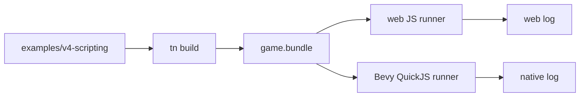

# V4-06 Primitive Scripting Demo

Complexity: 8 -> HIGH mode

## Context

**Problem:** V4 needs a small, deterministic scene that proves scripting APIs
work across web JavaScript and Bevy QuickJS without dragging in V3 content or
broad gameplay systems.

**Files Analyzed:** `docs/scripting-api.md`, `docs/scripting.md`,
`docs/ROADMAP.md`, `examples`, `templates`, `packages/sdk`,
`packages/compiler`, `packages/runtime-web-three`, `runtime-bevy`.

**Current Behavior:**

- V3 environment scene is too content-heavy for scripting parity proof.
- V2 arena work is broader than needed for native QuickJS proof.
- `docs/scripting-api.md` defines the primitive V4 proof scene requirements.

## Solution

**Approach:**

- Add `examples/v4-scripting` and optionally `templates/v4-scripting`.
- Use primitive cubes, planes, and simple materials only.
- Implement systems for rotation, movement, spawn/despawn, event handoff,
  raycast proof, and animation service proof.
- Verify deterministic patch/event/command/service-call logs, not visual polish.

**Key Decisions:**

- [ ] Demo uses primitive geometry only.
- [ ] Fixed input trace drives deterministic behavior.
- [ ] Visual output is useful but patch-log parity is authoritative.
- [ ] The demo exercises every V4 MVP API at least once.

**Data Changes:** Adds a V4 example/template project and V4 verification
artifacts.

## Integration Points

**How will this feature be reached?**

- Entry point identified: `pnpm tn -- build --project examples/v4-scripting`,
  `pnpm verify:v4`, and `tn create --template v4-scripting` if template added.
- Caller file identified: CLI build/create/verify scripts.
- Registration/wiring needed: example package, config, template registry,
  verify script.

**Is this user-facing?** Yes, canonical V4 demo and template.

**Full user flow:**

1. User opens or scaffolds V4 scripting demo.
2. User runs build/verify.
3. Demo shows primitive scene in web preview.
4. `verify:v4` confirms web/native effect logs match.

## Execution Phases

#### Phase 1: Example Source - Primitive scene builds and emits script artifacts

**Files (max 5):**

- `examples/v4-scripting/package.json` - example scripts/dependencies.
- `examples/v4-scripting/threenative.config.json` - build config.
- `examples/v4-scripting/src/game.ts` - scene and system declarations.
- `examples/v4-scripting/src/gameplay.test.ts` - pure logic tests if useful.
- `examples/v4-scripting/README.md` - commands and proof description.

**Implementation:**

- [ ] Create scene with floor, rotating cubes, target cube, and camera/light.
- [ ] Add `Rotator`, `Velocity`, `Lifetime`, marker tags, and `HitEvent`.
- [ ] Add systems for rotation, platform movement, projectile spawn, lifetime
  despawn, event handoff, raycast, and animation service call.
- [ ] Ensure build emits `systems.ir.json` and `scripts.bundle.js`.

**Tests Required:**

| Test File | Test Name | Assertion |
| --- | --- | --- |
| `examples/v4-scripting/src/gameplay.test.ts` | `should reduce lifetime deterministically` | Lifetime helper reaches despawn threshold. |
| `packages/compiler/src/*.test.ts` | `should build v4 scripting example` | Bundle contains world, systems, and script artifacts. |

**User Verification:**

- Action: Run `pnpm tn -- build --project examples/v4-scripting --json`.
- Expected: Build succeeds and emits `systems.ir.json` plus
  `scripts.bundle.js`.

#### Phase 2: Template - Users can scaffold the V4 scripting proof

**Files (max 5):**

- `templates/v4-scripting/package.json` - template package.
- `templates/v4-scripting/threenative.config.json` - template config.
- `templates/v4-scripting/src/game.ts` - template scene/systems.
- `templates/v4-scripting/README.md` - user commands.
- `packages/cli/src/commands/create.ts` - template registration.

**Implementation:**

- [ ] Copy or simplify the example into a template.
- [ ] Register `--template v4-scripting`.
- [ ] Ensure scaffolded project builds from clean output.
- [ ] Keep assets self-contained; no V3 forest dependency.

**Tests Required:**

| Test File | Test Name | Assertion |
| --- | --- | --- |
| `packages/cli/src/commands/create.test.ts` | `should create v4 scripting template` | Scaffold contains config, source, package scripts, and dependencies. |

**User Verification:**

- Action: Run `pnpm tn -- create tmp-v4 --template v4-scripting --json`.
- Expected: Project scaffolds and builds.

#### Phase 3: Demo Visual Smoke - Primitive scene visibly changes on web

**Files (max 5):**

- `examples/v4-scripting/README.md` - visual smoke commands.
- `packages/cli/src/verify/v4ScriptingVisual.ts` - optional web visual smoke.
- `packages/cli/src/verify/v4ScriptingVisual.test.ts` - visual report tests.
- `scripts/verify-v4.mjs` - calls visual smoke if implemented.

**Implementation:**

- [ ] Capture two web frames.
- [ ] Assert nonblank output.
- [ ] Assert visible frame diff from rotating/moving primitives.
- [ ] Save screenshots under `tools/verify/artifacts/milestones/v4`.

**Tests Required:**

| Test File | Test Name | Assertion |
| --- | --- | --- |
| `packages/cli/src/verify/v4ScriptingVisual.test.ts` | `should report v4 visual motion artifacts` | Report includes two screenshots and motion diff. |

**User Verification:**

- Action: Run `pnpm verify:v4`.
- Expected: Visual smoke confirms nonblank changing primitive scene.

## Verification Strategy

- `pnpm tn -- build --project examples/v4-scripting --json`
- `pnpm tn -- dev --target web --project examples/v4-scripting --json`
- `pnpm verify:v4`
- `pnpm test`

## Acceptance Criteria

- [ ] V4 example builds from source.
- [ ] V4 example emits systems and scripts artifacts.
- [ ] Demo exercises every V4 MVP API.
- [ ] Optional template scaffolds and builds.
- [ ] Web visual smoke shows nonblank, changing primitive scene.

