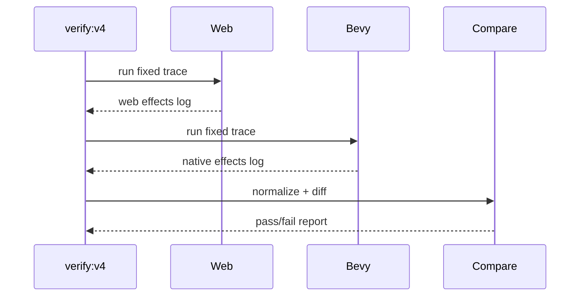

# V4-07 Cross-Runtime Scripting Verification

Complexity: 9 -> HIGH mode

## Context

**Problem:** Running scripts on both runtimes is not enough; V4 must prove they
produce equivalent ECS effects for the same input trace.

**Files Analyzed:** `docs/scripting.md`, `docs/scripting-api.md`,
`docs/verify-v3.md`, `packages/cli/src/verify`, `scripts`, `examples/v4-scripting`,
`runtime-bevy`.

**Current Behavior:**

- V3 verification focuses on environment visuals and performance.
- V4 needs canonical effect logs and comparison for scripting.
- No `verify:v4` script exists.

## Solution

**Approach:**

- Add a V4 verifier that builds the primitive demo.
- Run web JS systems and native QuickJS systems over the same fixed input/time
  trace.
- Capture canonical effect logs from both runtimes.
- Compare logs after stable normalization.
- Save machine-readable pass/fail reports and artifacts.

**Key Decisions:**

- [ ] Patch-log parity is the V4 release proof.
- [ ] Logs compare effects before runtime-specific visual differences matter.
- [ ] Numeric fields may use documented precision normalization.
- [ ] Any ignored field must be explicitly listed in the report.

**Data Changes:** Adds V4 verification reports under `tools/verify/artifacts/milestones/v4`.

## Integration Points

**How will this feature be reached?**

- Entry point identified: `pnpm verify:v4`.
- Caller file identified: `scripts/verify-v4.mjs` and CLI verifier modules.
- Registration/wiring needed: package script, web log runner, native log runner,
  log comparator.

**Is this user-facing?** Yes, V4 release gate.

**Full user flow:**

1. Developer changes scripting APIs, compiler, web runner, or native host.
2. Developer runs `pnpm verify:v4`.
3. Gate builds demo, runs both runtimes, compares logs, and reports drift.
4. Developer opens diff artifact to see stage/system/effect mismatch.

## Execution Phases

#### Phase 1: Log Comparator - Effect logs diff deterministically

**Files (max 5):**

- `packages/cli/src/verify/v4LogCompare.ts` - comparator.
- `packages/cli/src/verify/v4LogCompare.test.ts` - diff tests.
- `packages/cli/src/verify/report.ts` - report type additions if needed.
- `docs/diagnostics.md` - V4 diagnostic codes if needed.

**Implementation:**

- [ ] Normalize numeric precision.
- [ ] Compare stages, system IDs, entity IDs, components, commands, events,
  services, and payloads.
- [ ] Report first mismatch and aggregate summary.
- [ ] Produce stable diagnostic codes for mismatch types.

**Tests Required:**

| Test File | Test Name | Assertion |
| --- | --- | --- |
| `packages/cli/src/verify/v4LogCompare.test.ts` | `should pass identical logs` | Comparator reports pass. |
| `packages/cli/src/verify/v4LogCompare.test.ts` | `should report first mismatched command` | Diagnostic includes system ID and command kind. |

**User Verification:**

- Action: Compare two hand-written fixture logs.
- Expected: Identical logs pass; mismatch reports actionable location.

#### Phase 2: V4 Verify Script - Web and native runs are orchestrated

**Files (max 5):**

- `scripts/verify-v4.mjs` - top-level gate.
- `scripts/verify-v4.test.mjs` - orchestration tests.
- `package.json` - `verify:v4` script.
- `packages/cli/src/verify/v4Scripting.ts` - V4 verifier module.
- `packages/cli/src/verify/v4Scripting.test.ts` - report tests.

**Implementation:**

- [ ] Build `examples/v4-scripting`.
- [ ] Validate emitted bundle.
- [ ] Run web system runner with fixed input/time trace.
- [ ] Run Bevy QuickJS host with same trace.
- [ ] Compare logs and write final report.

**Tests Required:**

| Test File | Test Name | Assertion |
| --- | --- | --- |
| `scripts/verify-v4.test.mjs` | `should fail when native log differs` | Gate exits fail and points at diff report. |
| `packages/cli/src/verify/v4Scripting.test.ts` | `should write v4 artifact paths` | Report includes web/native/diff logs. |

**User Verification:**

- Action: Run `pnpm verify:v4`.
- Expected: Gate passes only when web and native logs match.

#### Phase 3: Drift Artifacts - Mismatches are easy to repair

**Files (max 5):**

- `packages/cli/src/verify/v4Artifacts.ts` - artifact layout.
- `packages/cli/src/verify/v4LogCompare.ts` - diff serialization.
- `examples/v4-scripting/README.md` - artifact documentation.
- `docs/verify-v4.md` - command and artifact docs if added.

**Implementation:**

- [ ] Write `tools/verify/artifacts/milestones/v4/web-effects.json`.
- [ ] Write `tools/verify/artifacts/milestones/v4/native-effects.json`.
- [ ] Write `tools/verify/artifacts/milestones/v4/effects-diff.json`.
- [ ] Write `tools/verify/artifacts/milestones/v4/verification-report.json`.
- [ ] Include bundle path, input trace, runtime versions, and skipped fields.

**Tests Required:**

| Test File | Test Name | Assertion |
| --- | --- | --- |
| `packages/cli/src/verify/v4Scripting.test.ts` | `should save effect diff artifact` | Diff JSON exists and contains mismatch metadata. |

**User Verification:**

- Action: Intentionally change native transform application.
- Expected: `verify:v4` fails and diff artifact identifies transform mismatch.

## Verification Strategy

- `pnpm verify:v4`
- `pnpm verify:conformance`
- `pnpm --filter @threenative/cli test -- --run v4`
- `cd runtime-bevy && cargo test systems_host`

## Acceptance Criteria

- [ ] `verify:v4` builds and validates primitive scripting demo.
- [ ] Web and native run same fixed input/time trace.
- [ ] Canonical logs compare deterministically.
- [ ] Mismatches produce actionable diagnostics and diff artifacts.
- [ ] Gate passes only when logs are equivalent.

