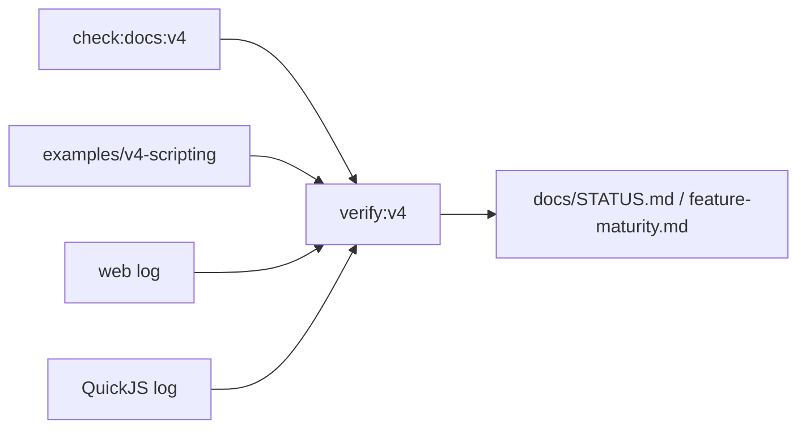

# V4-08 Release Gate and Docs Consistency

Complexity: 8 -> HIGH mode

## Context

**Problem:** V4 needs a release gate that proves the native scripting path and
keeps docs honest about what is supported versus future.

**Files Analyzed:** `docs/PRDs/v4/README.md`, `docs/STATUS.md`,
`docs/feature-maturity.md`, `docs/scripting.md`, `docs/scripting-api.md`,
`docs/diagnostics.md`, `scripts`, `package.json`.

**Current Behavior:**

- V3 has `verify:v3` and `check:docs:v3`.
- V4 has no release gate, status update, or docs check yet.
- `docs/scripting-api.md` now contains V4 MVP and missing/post-V4 API lists.

## Solution

**Approach:**

- Add `check:docs:v4` and `verify:v4`.
- Require V4 PRD links, QuickJS scope terms, and unsupported API boundaries.
- Update status/maturity docs when V4 is completed.
- Ensure release artifacts are machine-readable and stable.

**Key Decisions:**

- [ ] V4 completion requires log parity, not just native host smoke.
- [ ] Docs must explicitly list unsupported APIs.
- [ ] `docs/STATUS.md` is updated when V4 becomes active/completed.
- [ ] `docs/feature-maturity.md` separates V4-supported APIs from post-V4.

**Data Changes:** Adds V4 aggregate verification report.

## Integration Points

**How will this feature be reached?**

- Entry point identified: `pnpm verify:v4`, `pnpm check:docs:v4`.
- Caller file identified: `scripts/verify-v4.mjs`,
  `scripts/check-docs-v4.mjs`, and package scripts.
- Registration/wiring needed: package scripts, docs links, status/maturity
  updates.

**Is this user-facing?** Yes, release workflow and documentation.

**Full user flow:**

1. Developer implements V4 tickets.
2. Developer runs `pnpm verify:v4`.
3. Gate runs docs, build, web, native, and log comparison checks.
4. Developer reads report artifacts or updates docs/status when complete.

## Execution Phases

#### Phase 1: Docs Gate - V4 scope remains machine-checkable

**Files (max 5):**

- `scripts/check-docs-v4.mjs` - docs checks.
- `scripts/check-docs-v4.test.mjs` - docs check tests.
- `package.json` - `check:docs:v4`.
- `docs/README.md` - V4 PRD link if desired.
- `docs/PRDs/v4/README.md` - gate command references.

**Implementation:**

- [ ] Check V4 PRD links.
- [ ] Check required terms: QuickJS, `scripts.bundle.js`, primitive demo,
  patch/event/command log, `verify:v4`.
- [ ] Check unsupported claims are not listed as V4 acceptance requirements.
- [ ] Check `docs/scripting-api.md` contains missing/post-V4 inventory.

**Tests Required:**

| Test File | Test Name | Assertion |
| --- | --- | --- |
| `scripts/check-docs-v4.test.mjs` | `should require missing api inventory` | Docs check fails if `Missing Or Post-V4 API Inventory` is absent. |

**User Verification:**

- Action: Run `pnpm check:docs:v4`.
- Expected: Docs pass or report exact V4 scope drift.

#### Phase 2: Release Gate - V4 verification is one command

**Files (max 5):**

- `scripts/verify-v4.mjs` - aggregate gate.
- `scripts/verify-v4.test.mjs` - gate tests.
- `package.json` - `verify:v4`.
- `docs/verify-v4.md` - command/artifact docs.
- `docs/PRDs/v4/README.md` - release gate docs.

**Implementation:**

- [ ] Run `check:docs:v4`.
- [ ] Build and validate primitive demo.
- [ ] Run web and native effect-log capture.
- [ ] Compare logs and fail on drift.
- [ ] Save aggregate report with artifact paths.

**Tests Required:**

| Test File | Test Name | Assertion |
| --- | --- | --- |
| `scripts/verify-v4.test.mjs` | `should report failing step` | Gate returns first failing step and report path. |

**User Verification:**

- Action: Run `pnpm verify:v4`.
- Expected: Gate passes only when scripting demo and log parity pass.

#### Phase 3: Status And Maturity - Completed V4 updates front-door docs

**Files (max 5):**

- `docs/STATUS.md` - active/completed gate update.
- `docs/feature-maturity.md` - V4 API maturity rows.
- `docs/bevy-feature-parity.md` - native scripting status if relevant.
- `docs/scripting-api.md` - missing API inventory updates.
- `docs/diagnostics.md` - script diagnostic code updates.

**Implementation:**

- [ ] Mark V4-supported APIs as supported only after gates pass.
- [ ] Keep post-V4 APIs listed as missing/unsupported.
- [ ] Update `docs/STATUS.md` according to AGENTS.md guidance.
- [ ] Update diagnostic namespace examples with emitted V4 codes.

**Tests Required:**

| Test File | Test Name | Assertion |
| --- | --- | --- |
| `scripts/check-docs-v4.test.mjs` | `should reject supported claim missing from maturity matrix` | Docs cannot claim unsupported APIs are V4-supported. |

**User Verification:**

- Action: Read `docs/STATUS.md` and `docs/feature-maturity.md`.
- Expected: V4 status and supported scripting APIs are unambiguous.

## Verification Strategy

- `pnpm check:docs:v4`
- `pnpm verify:v4`
- `pnpm verify:conformance`
- `pnpm test`
- `cd runtime-bevy && cargo test`

## Acceptance Criteria

- [ ] `check:docs:v4` validates V4 docs and scope.
- [ ] `verify:v4` runs the complete scripting parity gate.
- [ ] V4 artifacts are deterministic and machine-readable.
- [ ] `docs/STATUS.md` and `docs/feature-maturity.md` reflect V4 completion.
- [ ] Unsupported/post-V4 APIs remain clearly documented.

