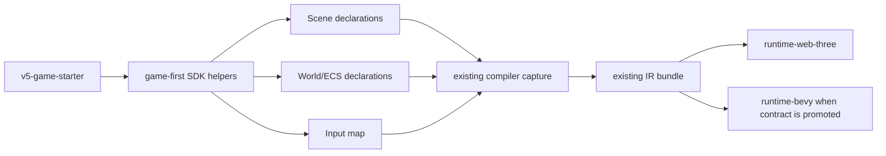
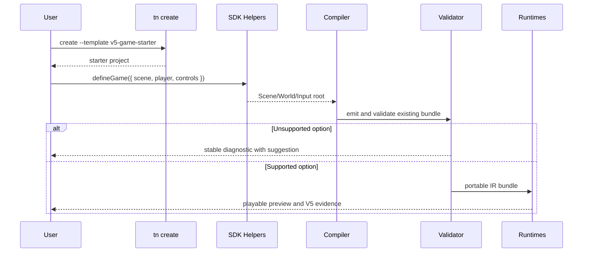

# V5-11 Game Authoring Ergonomics Refactor

Complexity: 8 -> HIGH mode

## Fit Assessment

This PRD is required V5 scope. It fits V5 because the roadmap already judges
the product by whether a TypeScript developer or AI agent can build a small
playable 3D game faster here than with raw Three.js. It must be implemented as
an additive refactor over existing SDK, compiler, CLI, fixture, diagnostic, and
template flows. It conflicts with V5 if it becomes a broad new game framework,
editor workflow, raw Three.js compatibility layer, runtime plugin system, or
unverified gameplay feature expansion.

Required placement:

- Implement after V5-04 if it depends on fixture builders.
- Implement after V5-09 if it reuses the maintained visual-quality scene as
  evidence.
- Complete before V5-10 so the final release gate includes SDK ergonomics,
  starter-template, diagnostics, and docs evidence.

## Context

**Problem:** The SDK is currently easier to validate and port than vanilla
Three.js, but not obviously easier for a developer or AI agent to create a
small playable 3D game.

**Files Analyzed:** `docs/STATUS.md`, `docs/ROADMAP.md`, `docs/sdk.md`,
`docs/scripting-api.md`, `docs/bevy-feature-parity.md`,
`docs/PRDs/v5/README.md`, `docs/PRDs/v5/V5-00-scope-and-contract-alignment.md`,
`docs/PRDs/v5/V5-04-fixture-builder-and-test-harness-refactor.md`,
`docs/PRDs/v5/V5-09-functional-visual-quality-scene.md`,
`docs/PRDs/v5/V5-10-release-gate-and-docs-consistency.md`,
`packages/sdk/src/index.ts`, `packages/sdk/src/ecs/World.ts`,
`packages/sdk/src/assets.ts`, `packages/sdk/src/input.ts`,
`packages/sdk/src/ecs/schema.ts`, `packages/compiler/src/capture.ts`,
`packages/cli/src/commands/create.ts`, and `templates/v4-scripting/src/game.ts`.

**Current Behavior:**

- Authors assemble scenes, input maps, ECS schemas, worlds, systems, and
  templates through separate low-level SDK entry points.
- `tn create` exposes version-scoped templates through a hard-coded template
  allowlist.
- Compiler capture already accepts `Scene`, `World`, or a bundle-like root and
  rejects raw Three.js, DOM, Node, runtime adapter, and unsupported R3F imports.
- V5 scope is hardening plus selected visual quality, not a broad new product
  surface.
- The roadmap already says the product should be judged by whether developers
  and AI agents can build a small playable 3D game faster than raw Three.js.

## Integration Points

**How will this feature be reached?**

- [x] Entry point identified: `@threenative/sdk` exports and
  `tn create --template v5-game-starter`.
- [x] Caller file identified: user entry files such as
  `templates/v5-game-starter/src/game.ts`.
- [x] Registration/wiring needed: export the new helpers from
  `packages/sdk/src/index.ts`, accept the template in
  `packages/cli/src/commands/create.ts`, and keep compiler capture rooted in the
  existing `Scene`/`World`/bundle root path.

**Is this user-facing?**

- [x] YES. User-facing pieces are SDK helper APIs, one maintained starter
  template, docs recipes, CLI template creation, diagnostics, and V5 verification
  evidence.

**Full user flow:**

1. User runs `tn create my-game --template v5-game-starter`.
2. CLI copies the template and rewrites workspace dependencies.
3. User edits `src/game.ts`, using game-first helpers that lower to existing
   portable `Scene`, `World`, input, asset, and system declarations.
4. User runs `pnpm run validate`, `pnpm run build`, or `pnpm run verify`.
5. Compiler capture reaches the same existing IR emitters and diagnostics.
6. Result is visible in the web preview and, for promoted contracts, connected
   to Bevy evidence through V5 fixtures or the V5 scene.

## Solution

Add a small game-authoring convenience layer that makes common game setup
shorter without changing the portable contract.

**Approach:**

- Add SDK helpers for project-shaped composition, such as `defineGame`,
  `definePrefab`, `defineControls`, and curated component factories that produce
  existing `Scene`, `World`, input, asset, and system declarations.
- Keep helpers declarative and serializable. They must not expose renderer,
  DOM, filesystem, raw Three.js, Bevy, or platform handles.
- Provide one starter template that demonstrates a playable vertical slice:
  camera, light, player-like entity, movement input, collision/raycast service
  only if already promoted, and a visible objective or collectible.
- Convert authoring convenience into existing IR through existing compiler
  paths; avoid introducing a parallel bundle format.
- Use stable diagnostics when helpers are misused, including explicit codes,
  path context, and suggested fixes where the local diagnostic model supports
  them.

**Key Decisions:**

- [x] Prefer additive wrappers over replacing `Scene`, `World`, or R3F
  authoring.
- [x] Keep all emitted data deterministic and compatible with existing
  validators.
- [x] Treat game-first helpers as authoring sugar unless a V5 PRD explicitly
  promotes a new IR/runtime contract.
- [x] Add diagnostics for unsupported helper options instead of silently
  dropping them.
- [x] Use existing templates and `tn create` conventions.

**Data Changes:** None required for Phase 1. Later phases may add IR fields only
when tied to an existing V5 visual/scripting PRD and covered by validation,
web/runtime mapping, Bevy evidence, conformance, and release-gate artifacts.

## Sequence Flow

## Execution Phases

#### Phase 1: Additive Game Root Helper - Users can define one playable root with fewer low-level calls.

**Files (max 5):**

- `packages/sdk/src/game.ts` - new `defineGame` and narrow root composition
  types.
- `packages/sdk/src/game.test.ts` - serialization and misuse tests.
- `packages/sdk/src/index.ts` - public exports.
- `packages/compiler/src/capture.test.ts` - capture acceptance for the helper
  root and rejection of unsupported imports.
- `docs/sdk.md` - document the supported helper shape.

**Implementation:**

- [x] Add `defineGame({ scene, world, input, runtimeConfig })` that returns an
  object compatible with existing bundle-root capture.
- [x] Validate duplicate or missing root pieces with `TN_SDK_GAME_*` errors.
- [x] Ensure `defineGame` does not create new IR concepts.
- [x] Add docs showing the equivalent low-level `Scene`/`World` shape.

**Tests Required:**

| Test File | Test Name | Assertion |
| --- | --- | --- |
| `packages/sdk/src/game.test.ts` | `should serialize game root when scene and world are provided` | Snapshot contains existing scene/world/input-compatible shape. |
| `packages/sdk/src/game.test.ts` | `should reject empty game root when no portable declarations are provided` | Throws `TN_SDK_GAME_ROOT_EMPTY`. |
| `packages/compiler/src/capture.test.ts` | `should capture defineGame root through existing bundle path` | Capture summary and emitted bundle match existing root behavior. |

**User Verification:**

- Action: Replace a template's manual exported root with `defineGame`.
- Expected: `pnpm tn -- build --project <project>` emits the same bundle shape.

#### Phase 2: Prefab and Controls Recipes - Users can express common game pieces without hand-writing every component.

**Files (max 5):**

- `packages/sdk/src/prefab.ts` - `definePrefab`, primitive/model prefab helpers,
  and deterministic expansion.
- `packages/sdk/src/controls.ts` - `defineControls` recipes for keyboard and
  gamepad-friendly input maps.
- `packages/sdk/src/prefab.test.ts` - prefab expansion tests.
- `packages/sdk/src/controls.test.ts` - input recipe tests.
- `packages/sdk/src/index.ts` - public exports.

**Implementation:**

- [x] Add helpers that expand into existing `World.spawn`, `Mesh`, asset, and
  input declarations.
- [x] Start with narrow recipes: primitive actor, model actor metadata, WASD
  movement axes, optional gamepad axis bindings, and action buttons.
- [x] Reject helper options that imply unsupported runtime behavior, such as
  arbitrary physics controllers, runtime asset loading, or raw renderer hooks.
- [x] Keep IDs stable and deterministic for conformance fixtures.

**Tests Required:**

| Test File | Test Name | Assertion |
| --- | --- | --- |
| `packages/sdk/src/prefab.test.ts` | `should expand primitive actor prefab into deterministic declarations` | Entity IDs, components, and scene objects are stable. |
| `packages/sdk/src/prefab.test.ts` | `should reject unsupported prefab behavior when runtime contract is missing` | Throws stable `TN_SDK_PREFAB_UNSUPPORTED_*` code. |
| `packages/sdk/src/controls.test.ts` | `should create keyboard and gamepad movement controls` | Input map contains sorted axes/actions. |

**User Verification:**

- Action: Define a player prefab and controls recipe in the starter template.
- Expected: The generated bundle still validates through existing IR schemas.

#### Phase 3: Starter Template and CLI Wiring - Users can create a small playable game faster than raw Three.js setup.

**Files (max 5):**

- `templates/v5-game-starter/*` - maintained starter project.
- `packages/cli/src/commands/create.ts` - allowlist and usage text.
- `packages/cli/src/commands/create.test.ts` - template creation test.
- `packages/compiler/src/examples.test.ts` - example/template build smoke.
- `docs/developer-workflow.md` - add the starter command and expected loop.

**Implementation:**

- [x] Add a starter with one scene, player-like entity, camera, lights, input,
  visible objective, and one portable system using already-supported V4/V5 APIs.
- [x] Keep assets local to the template or generated bundle.
- [x] Add `--template v5-game-starter` to CLI support and diagnostics.
- [x] Ensure scripts include validate, build, verify, and test where practical.

**Tests Required:**

| Test File | Test Name | Assertion |
| --- | --- | --- |
| `packages/cli/src/commands/create.test.ts` | `should create v5 game starter template` | JSON payload reports `v5-game-starter` and config points at the starter bundle. |
| `packages/compiler/src/examples.test.ts` | `should build v5 game starter template` | Compiler emits a valid bundle. |
| `templates/v5-game-starter/src/gameplay.test.ts` | `should update player state when movement input is applied` | Pure gameplay helper produces deterministic state. |

**User Verification:**

- Action: `tn create starter --template v5-game-starter && pnpm install &&
  pnpm run verify`.
- Expected: The project builds, validates, and produces nonblank playable web
  evidence without raw Three.js setup.

#### Phase 4: V5 Evidence and Scope Guardrails - The ergonomic layer is release-gated without expanding V5 beyond its contract.

**Files (max 5):**

- `scripts/verify-v5.mjs` - starter smoke and ergonomics evidence in the V5
  gate.
- `scripts/check-docs-v5.mjs` - require index links and reject broad claims.
- `scripts/check-docs-v5.test.mjs` - docs gate tests.
- `docs/PRDs/v5/README.md` - required V5 scope and ordering.
- `docs/verify-v5.md` - document starter and ergonomics artifacts.

**Implementation:**

- [x] Add starter build/verify evidence to `pnpm verify:v5`.
- [x] Make V5 completion depend on this PRD without reducing existing V5
  hardening, visual-quality, native, conformance, or diagnostic requirements.
- [x] Gate docs against claims that this is a scene editor, networking layer,
  arbitrary Three.js compiler, public plugin API, or custom renderer.
- [x] Link any starter evidence to existing V5 conformance, diagnostics, and
  runtime artifacts.

**Tests Required:**

| Test File | Test Name | Assertion |
| --- | --- | --- |
| `scripts/check-docs-v5.test.mjs` | `should allow v5 game starter as authoring sugar` | Docs gate accepts narrow helper/template language. |
| `scripts/check-docs-v5.test.mjs` | `should reject broad game framework claims` | Docs gate rejects editor/networking/raw Three.js claims. |
| `scripts/verify-v5.test.mjs` | `should include starter smoke in v5 gate` | Report lists starter evidence as required V5 behavior. |

**User Verification:**

- Action: Run `pnpm check:docs:v5` and `pnpm verify:v5`.
- Expected: V5 evidence includes the starter, and docs do not claim unsupported
  scope.

## Verification Strategy

- `pnpm --filter @threenative/sdk test`
- `pnpm --filter @threenative/compiler test`
- `pnpm --filter @threenative/cli test`
- `pnpm tn -- build --project templates/v5-game-starter`
- `pnpm verify:conformance`
- `pnpm check:docs:v5`
- `pnpm verify:v5`
- `cd runtime-bevy && cargo test` only when helper output claims native runtime
  support beyond existing contracts

## Acceptance Criteria

- [x] The new authoring layer is reachable from `@threenative/sdk` exports and
  at least one `tn create` template.
- [x] Helpers lower into existing portable `Scene`, `World`, input, asset,
  system, and bundle paths unless another V5 PRD explicitly promotes new IR.
- [x] Misuse produces stable diagnostics instead of silent no-ops.
- [x] The starter demonstrates a playable small-game loop with less setup than
  the equivalent low-level SDK/Three.js-style scene.
- [x] Existing V1-V4 examples and V5 conformance expectations remain valid.
- [x] No V5 completion claim depends on editor, online, networking,
  replication, public plugin API, raw Three.js compatibility, custom renderer
  replacement, arbitrary npm scripts, or direct Bevy access.
- [x] `docs/STATUS.md`, `docs/bevy-feature-parity.md`,
  `docs/PRDs/v5/README.md`, and `docs/verify-v5.md` describe the exact supported
  scope before V5 is marked complete.

## Implementation Evidence

- `defineGame` is exported from `@threenative/sdk` and composes existing
  `scene`, `world`, `input`, `audio`, `environment`, and `ui` roots without
  adding IR.
- `defineControls`, `primitiveActorPrefab`, `modelActorPrefab`, and
  `definePrefab` are exported from `@threenative/sdk` and expand into existing
  input maps, scene meshes, ECS component declarations, and model asset
  metadata.
- `TN_SDK_GAME_ROOT_EMPTY` and `TN_SDK_GAME_RUNTIME_CONFIG_WORLD_REQUIRED`
  guard unsupported helper usage.
- `TN_SDK_PREFAB_UNSUPPORTED_*`, `TN_SDK_PREFAB_MODEL_ASSET_KIND_INVALID`, and
  `TN_SDK_CONTROLS_UNSUPPORTED_*` guard helper options that would require
  unsupported runtime behavior.
- `templates/v5-game-starter` provides a camera, lights, player-like entity,
  visible goal, prefab helpers, controls recipe, runtime config, and one
  portable movement system.
- `tn create --template v5-game-starter` is wired and covered by CLI tests.
- `pnpm verify:v5` now creates, builds, and validates the starter under
  `tools/verify/artifacts/milestones/v5/starter-smoke`.
