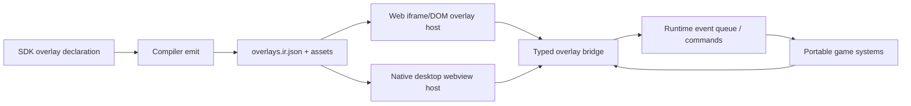
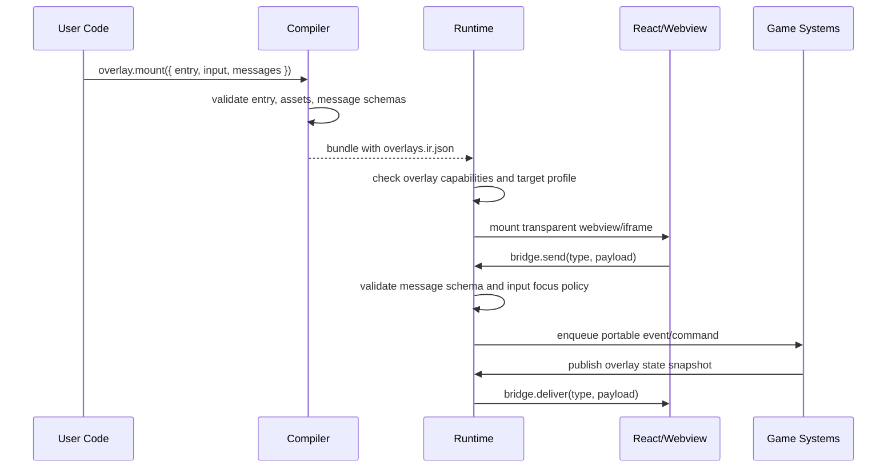

# V8-05 Optional React Webview Overlay

Complexity: 10 -> HIGH mode

## Context

**Problem:** Portable retained UI keeps web/native runtime parity, but some
projects need full CSS/React flexibility for rich menus, editor-like panels, or
app-shell flows without forcing ThreeNative to reimplement browser UI.

**Files Analyzed:**

- `docs/ui.md`
- `docs/runtime-adapters.md`
- `docs/bevy-feature-parity.md`
- `docs/PRDs/v6/V6-06-retained-ui-runtime.md`
- `docs/PRDs/v7/V7-04-rich-portable-ui-navigation-and-input-parity.md`
- `docs/PRDs/v8/README.md`
- `packages/compiler/src/emit/capabilities.ts`
- `packages/runtime-web-three/src/ui/domOverlay.ts`
- `runtime-bevy/crates/threenative_runtime/src/ui.rs`

**Current Behavior:**

- Game UI is authored through ThreeNative UI APIs and emitted as portable
  `ui.ir.json`.
- Web renders retained UI as a DOM overlay; native maps the same UI IR to Bevy
  UI entities.
- React/DOM details are adapter-private and are not the native game UI contract.
- Capability derivation already records promoted UI features in
  `manifest.requiredCapabilities.ui`.

## Integration Points

**How will this feature be reached?**

- [x] Entry point identified: SDK overlay declarations and bundle manifest
  capabilities, then `tn dev --native` / packaged desktop runtime startup.
- [x] Caller file identified: future compiler overlay emit path will derive
  `requiredCapabilities.overlay`; web and Bevy runtime startup will mount
  declared overlays after bundle load.
- [x] Registration/wiring needed: SDK export, IR schema/validation export,
  compiler bundle emit, runtime capability check, web overlay host, native
  desktop webview host, bridge event registration.

**Is this user-facing?**

- [x] YES -> SDK overlay API, React/CSS app entry, runtime overlay window/layer,
  input mode controls, diagnostics, and example scene are required.

**Full user flow:**

1. User does: declares an optional overlay in TypeScript and points it at a
   bundle-local web entry such as `overlay/index.html`.
2. Triggers: compiler emits `overlays.ir.json`, copies overlay assets, and adds
   `overlay:webview`, `overlay:bridge`, and target-specific capabilities.
3. Reaches new feature via: runtime bundle loader reads overlay IR after
   manifest validation and mounts the overlay host for supported targets.
4. Result displayed in: transparent webview layer above the game; game and
   overlay communicate through typed message events.

## Solution

**Approach:**

- Keep retained portable UI as the default and recommended game UI path.
- Add an explicit optional overlay contract for rich React/CSS surfaces.
- Gate webview overlays through manifest capabilities and target profiles.
- Use message-passing only; overlay code cannot directly mutate ECS, Bevy,
  Three.js, filesystem, or native handles.
- Ship desktop native support first, web runtime support through iframe/DOM
  host second, and explicitly defer mobile until packaging/input constraints are
  proven.

**Key Decisions:**

- [ ] Webview overlay is an optional capability, not a baseline runtime
  requirement.
- [ ] Retained UI remains the portable game UI contract.
- [ ] The game is source of truth; overlays send commands/events and receive
  published snapshots.
- [ ] Bridge messages must be schema-validated, size-limited, and observable in
  runtime diagnostics.
- [ ] Input capture is explicit per overlay: `none`, `pointer`, `keyboard`,
  `pointer-and-keyboard`, or `modal`.
- [ ] Native implementation must choose a maintained Rust webview library behind
  `runtime-bevy`; the SDK and IR cannot expose that library's API.

**Data Changes:**

- Add `overlays.ir.json` with schema `threenative.overlays`.
- Add optional `manifest.entry.overlays`.
- Add `requiredCapabilities.overlay` tags such as `webview`, `bridge`,
  `transparent`, `input.pointer`, `input.keyboard`, and `target.desktop`.
- Add optional runtime observations for mounted overlays, bridge messages, and
  rejected messages.

## Sequence Flow

## Execution Phases

#### Phase 1: Overlay Contract - Bundles can declare optional overlays without changing retained UI.

**Files (max 5):**

- `packages/ir/src/overlays.ts` - overlay IR types and validation helpers.
- `packages/ir/schemas/overlays.schema.json` - JSON schema for overlay IR.
- `packages/ir/src/overlays.test.ts` - accepted/rejected overlay fixtures.
- `packages/ir/src/index.ts` - public exports.
- `docs/ui.md` - document portable UI vs optional webview overlay boundary.

**Implementation:**

- [ ] Define `IOverlaysIr` with `overlays[]`, each containing `id`, `entry`,
  `transparent`, `zIndex`, `input`, `messages`, and `targetProfiles`.
- [ ] Require bundle-relative overlay entries and reject absolute paths, parent
  traversal, remote URLs, inline scripts, and unknown fields.
- [ ] Define message schema metadata for `overlayToGame` and `gameToOverlay`.
- [ ] Add diagnostics for unsupported input modes, duplicate overlay IDs,
  invalid message names, and invalid target profiles.
- [ ] Keep `ui.ir.json` unchanged and document that overlays are not a portable
  replacement for retained UI.

**Tests Required:**

| Test File | Test Name | Assertion |
| --- | --- | --- |
| `packages/ir/src/overlays.test.ts` | `validates desktop webview overlay declarations` | Valid overlay IR has zero diagnostics. |
| `packages/ir/src/overlays.test.ts` | `rejects unsafe overlay entries` | Absolute, parent-relative, and remote entries fail with stable diagnostics. |
| `packages/ir/src/overlays.test.ts` | `rejects invalid bridge schemas` | Invalid message names or schemas produce `TN_IR_OVERLAY_*` diagnostics. |

**User Verification:**

- Action: run IR tests against valid and invalid overlay fixtures.
- Expected: only explicitly declared local overlay entries are accepted.

#### Phase 2: SDK and Compiler Emit - Users can opt into overlays from TypeScript.

**Files (max 5):**

- `packages/sdk/src/overlay/*` - public overlay declaration API.
- `packages/compiler/src/overlay/*` - capture and emit overlay declarations.
- `packages/compiler/src/emit/capabilities.ts` - derive overlay capabilities.
- `packages/compiler/src/emit/bundle.test.ts` - bundle shape tests.
- `packages/compiler/src/index.ts` - compiler exports as needed.

**Implementation:**

- [ ] Add `overlay.mount()` or equivalent SDK API with typed options.
- [ ] Emit `overlays.ir.json` only when overlays are declared.
- [ ] Copy declared overlay assets into the bundle while preserving
  bundle-relative paths.
- [ ] Add `manifest.entry.overlays` and sorted `requiredCapabilities.overlay`.
- [ ] Reject overlay use in profiles that do not allow webview overlays.

**Tests Required:**

| Test File | Test Name | Assertion |
| --- | --- | --- |
| `packages/compiler/src/emit/bundle.test.ts` | `emits overlay ir and manifest entry` | Bundle contains `overlays.ir.json` and copied overlay entry. |
| `packages/compiler/src/emit/capabilities.test.ts` | `derives overlay capabilities` | Manifest has sorted overlay capabilities. |
| `packages/compiler/src/overlay/*.test.ts` | `rejects undeclared overlay assets` | Unsafe or missing entry emits stable compiler diagnostics. |

**User Verification:**

- Action: build an example with one overlay declaration.
- Expected: bundle includes overlay IR/assets and manifest capabilities.

#### Phase 3: Bridge Runtime - Overlay messages enter gameplay through validated events.

**Files (max 5):**

- `packages/runtime-web-three/src/overlay/*` - shared web overlay host and bridge.
- `packages/runtime-web-three/src/overlay/*.test.ts` - bridge tests.
- `runtime-bevy/crates/threenative_runtime/src/overlay.rs` - native bridge model.
- `runtime-bevy/crates/threenative_runtime/tests/overlay.rs` - native bridge tests.
- `packages/ir/fixtures/conformance/*` - overlay bridge fixture.

**Implementation:**

- [ ] Define a runtime bridge envelope with `overlayId`, `type`, `payload`,
  `sequence`, and `timestamp`.
- [ ] Validate inbound messages against declared schemas before they reach game
  systems.
- [ ] Publish game-to-overlay snapshots through a bounded queue.
- [ ] Add size limits, unknown-message rejection, and deterministic diagnostic
  observations.
- [ ] Ensure bridge events use existing event/command queues instead of direct
  ECS mutation.

**Tests Required:**

| Test File | Test Name | Assertion |
| --- | --- | --- |
| `packages/runtime-web-three/src/overlay/*.test.ts` | `queues valid overlay messages` | Valid messages become runtime events. |
| `packages/runtime-web-three/src/overlay/*.test.ts` | `rejects undeclared overlay messages` | Unknown message type produces diagnostic and no event. |
| `runtime-bevy/crates/threenative_runtime/tests/overlay.rs` | `validates native overlay bridge envelopes` | Native bridge matches web acceptance/rejection behavior. |

**User Verification:**

- Action: click a React button that sends `inventory:use-item`.
- Expected: game system receives a typed event; invalid messages are rejected
  and reported.

#### Phase 4: Runtime Hosts - Web and desktop Bevy can mount an optional overlay.

**Files (max 5):**

- `packages/runtime-web-three/src/overlay/host.ts` - iframe/DOM overlay mount.
- `packages/runtime-web-three/src/render.ts` - host wiring.
- `runtime-bevy/crates/threenative_runtime/src/overlay_host.rs` - desktop webview host.
- `runtime-bevy/crates/threenative_runtime/src/lib.rs` - plugin/module wiring.
- `runtime-bevy/crates/threenative_runtime/tests/overlay_host.rs` - capability diagnostics.

**Implementation:**

- [ ] Mount web overlays as sandboxed iframes or isolated DOM hosts above the
  canvas.
- [ ] Mount native overlays with transparent desktop webview support when the
  target profile allows it.
- [ ] Enforce input capture modes and focus handoff between game and overlay.
- [ ] Fail fast with `TN_OVERLAY_TARGET_UNSUPPORTED` when the runtime cannot
  satisfy required overlay capabilities.
- [ ] Keep native webview handles adapter-private.

**Tests Required:**

| Test File | Test Name | Assertion |
| --- | --- | --- |
| `packages/runtime-web-three/src/overlay/*.test.ts` | `mounts overlay above canvas` | Host creates stable overlay root and bridge object. |
| `runtime-bevy/crates/threenative_runtime/tests/overlay_host.rs` | `reports unsupported desktop webview capability` | Missing support yields stable diagnostic. |
| `runtime-bevy/crates/threenative_runtime/tests/overlay_host.rs` | `maps input capture modes` | Pointer/keyboard/modal modes produce expected runtime policy. |

**User Verification:**

- Action: run web preview and native desktop preview for the overlay example.
- Expected: overlay appears above the game and input policy matches declaration.

#### Phase 5: Example, Docs, and Gate Evidence - The feature is demonstrable and bounded.

**Files (max 5):**

- `examples/v8-overlay-webview/*` - React/CSS overlay example.
- `docs/PRDs/v8/README.md` - ticket index and dependency.
- `docs/STATUS.md` - implementation status once complete.
- `docs/bevy-feature-parity.md` - optional overlay capability status.
- `scripts/check-docs-v8.mjs` - docs gate updates if needed.

**Implementation:**

- [ ] Add an example with retained UI HUD plus optional React inventory/settings
  overlay.
- [ ] Demonstrate bidirectional bridge messages and explicit input capture.
- [ ] Document supported targets, unsupported mobile/runtime profiles, and
  security constraints.
- [ ] Update status and parity docs only when implementation evidence exists.
- [ ] Add release-gate artifact checks for overlay IR, web preview, native
  diagnostic behavior, and bridge trace.

**Tests Required:**

| Test File | Test Name | Assertion |
| --- | --- | --- |
| `scripts/check-docs-v8.test.mjs` | `requires overlay boundary docs` | Docs mention retained UI default and optional overlay capability. |
| `packages/compiler/src/examples.test.ts` | `builds v8 overlay example` | Example emits overlay manifest capabilities. |
| `runtime-bevy/crates/threenative_runtime/tests/overlay.rs` | `records overlay bridge trace` | Native trace matches declared bridge behavior. |

**User Verification:**

- Action: run `pnpm verify:v8` after the gate includes overlay checks.
- Expected: retained UI remains green and optional overlay evidence is present
  only for supported profiles.

## Checkpoint Protocol

After each phase:

- Run the phase-specific tests listed above.
- Run the narrowest relevant package test command.
- Run `pnpm check:docs:v8` for docs/index changes.
- Spawn the `prd-work-reviewer` checkpoint review for the completed phase when
  implementation begins.

Manual checkpoint is required for Phases 4 and 5 because visual overlay
mounting, transparency, input focus, and native webview behavior need real
runtime inspection.

## Verification Strategy

- `pnpm --filter @threenative/ir test -- --run overlay`
- `pnpm --filter @threenative/compiler test -- --run overlay`
- `pnpm --filter @threenative/runtime-web-three test -- --run overlay`
- `pnpm verify:conformance`
- `cd runtime-bevy && cargo test overlay`
- `pnpm check:docs:v8`
- Future aggregate: `pnpm verify:v8`

## Acceptance Criteria

- [ ] Retained UI remains the default portable UI path.
- [ ] Overlay declarations are explicit, local, validated, and capability-gated.
- [ ] Web and supported native desktop targets can mount an overlay without
  exposing DOM/webview handles to game systems.
- [ ] Overlay-to-game and game-to-overlay communication uses typed,
  schema-validated bridge messages.
- [ ] Input capture and focus behavior are deterministic and documented.
- [ ] Unsupported targets fail with stable diagnostics instead of silently
  ignoring overlays.
- [ ] Example evidence shows retained UI and React/CSS overlay coexisting.

## Non-Goals

- Replacing `ui.ir.json` with React DOM.
- Full CSS parity in native Bevy UI.
- Direct ECS, Bevy, Three.js, filesystem, network, or native API access from
  overlay code.
- Remote hosted overlays in shipped games.
- Mobile webview overlay support before desktop packaging and input behavior are
  proven.
- Public plugin APIs or third-party native webview extension points.
