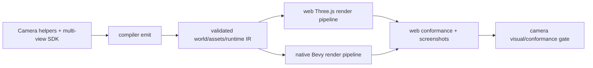
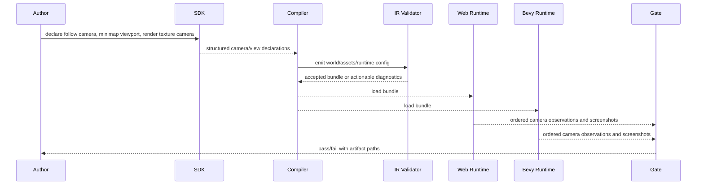

# V8-06 Camera Helpers, Multi-View Rendering, and Render Targets

Complexity: 9 -> HIGH mode

## Context

**Problem:** ThreeNative cameras currently cover perspective, orthographic, first-person metadata, active-camera selection, and projection observations, but authors still lack portable camera helpers, split-screen/multi-view rendering, render layers, render-to-texture targets, and screenshot/export workflows.

**Files Analyzed:** `docs/bevy-feature-parity.md`,
`docs/STATUS.md`, `docs/PRDs/v8/README.md`,
`docs/PRDs/v3/V3-05-first-person-camera-and-controls.md`,
`packages/sdk/src/scene/Camera.ts`,
`packages/compiler/src/emit/scene-to-world.ts`,
`packages/ir/src/types.ts`, `packages/ir/src/validate.ts`,
`packages/ir/src/conformance.ts`,
`packages/runtime-web-three/src/mapWorld.ts`,
`packages/runtime-web-three/src/render.ts`,
`runtime-bevy/crates/threenative_loader/src/lib.rs`,
`runtime-bevy/crates/threenative_runtime/src/map_world.rs`,
`packages/ir/fixtures/conformance/README.md`,
`~/.cargo/registry/src/*/bevy_render-0.14.2/src/camera/camera.rs`,
`~/.cargo/registry/src/*/bevy_render-0.14.2/src/camera/clear_color.rs`,
`~/.cargo/registry/src/*/bevy_render-0.14.2/src/view/visibility/render_layers.rs`,
`~/.cargo/registry/src/*/bevy_core_pipeline-0.14.2/src/core_3d/camera_3d.rs`.

**Current Behavior:**

- SDK camera classes expose projection clip settings only; first-person behavior
  lives in environment/controller metadata rather than reusable camera helpers.
- Compiler output emits one `ActiveCamera` resource even when multiple camera
  entities exist; `Camera.priority` exists in IR but is not promoted as ordering
  or viewport behavior.
- Web and Bevy runtimes select one active camera for final rendering, with
  Bevy now matching the selected active camera ID in conformance reports.
- No portable viewport rectangles, render layers, split-screen, render target,
  depth-only target, screenshot/export, or explicit custom-projection diagnostic
  contract exists.

## Bevy Reference Surface

This PRD targets feature parity with Bevy `=0.14.2` camera behavior first, then
adds ThreeNative SDK ergonomics where Bevy expects app code or examples:

| Bevy 0.14.2 capability | ThreeNative parity requirement |
| --- | --- |
| `Camera.viewport: Option<Viewport>` with physical position/size/depth | Normalized portable viewport rectangles that map to Bevy physical viewports and Three.js scissor/viewport calls. |
| `Camera.order` and `Camera.is_active` | Ordered active cameras, split-screen/sub-views, and compatibility with existing `ActiveCamera`. |
| `Camera.target: RenderTarget` with `Window`, `Image`, and `TextureView` variants | Backbuffer targets and portable image render targets; external/manual texture views are diagnosed as non-portable unless a future platform adapter explicitly promotes them. |
| `Camera.clear_color: ClearColorConfig` | Per-camera clear modes: default, custom color, and no-clear overlay behavior. |
| `Camera.output_mode`, `hdr`, and `msaa_writeback` | Portable output/writeback fields where web and Bevy can align; unsupported modes diagnose before runtime. |
| `RenderLayers` default layer 0 and explicit layer masks | Named portable render layers with `"default"` mapped to layer 0 and deterministic adapter layer allocation. |
| `PerspectiveProjection`, `OrthographicProjection`, and Bevy projection plugins | Existing perspective/orthographic parity plus a custom projection contract after the multi-view foundation lands. |
| `Camera3dBundle` color grading, tonemapping, exposure, and main texture usage | Continue using existing renderer/runtime config for color management and add camera-level target usage where needed for render targets. |

Follow, orbit, pan, zoom, screen shake, and view-model helpers are not Bevy
`Camera` fields. They are ThreeNative authoring helpers for common Bevy-style
game camera systems and must lower into deterministic transforms/components
that still render through the same Bevy-supported camera surface above.

## Integration Points

**How will this feature be reached?**

- [x] Entry point identified: TypeScript SDK camera declarations and helper
  components on scene entities, emitted bundle IR, web preview, native Bevy
  runtime, and conformance/visual verification fixtures.
- [x] Caller file identified: SDK camera classes/exports, compiler scene emit,
  IR validation/capabilities, web `mapWorld`/`renderBundle`, Bevy loader/runtime
  camera mapping, conformance reporters, CLI verification scripts.
- [x] Registration/wiring needed: public SDK exports, world IR camera/resource
  fields, capability tags, runtime render pipeline registration, render target
  asset wiring, shared fixtures, docs and release-gate checks.

**Is this user-facing?** Yes. Authors configure camera follow/orbit/pan/zoom,
screen shake, split-screen/sub-view cameras, layer-filtered views, minimap or
mirror render textures, and screenshot/export captures from TypeScript without
touching Three.js or Bevy APIs.

**Full user flow:**

1. User declares a main follow camera, a minimap orthographic camera with a
   viewport, and a render-to-texture camera for an in-world monitor.
2. Compiler emits portable camera helper, viewport, layer-mask, ordering, and
   target metadata into the bundle.
3. Validation rejects missing targets, invalid layer masks, overlapping
   ambiguous viewport order, unsupported backend-only projection payloads, and
   cyclic render-texture usage before runtime.
4. Web Three.js and native Bevy consume the same bundle, render ordered cameras
   into the backbuffer or texture targets, and expose matching conformance
   observations.
5. Verification captures screenshot/export artifacts and fails if web/native
   camera order, viewport bounds, layer visibility, render target contents, or
   diagnostics drift.

## Solution

**Approach:**

- Add portable camera behavior helpers as declarative SDK/IR components:
  follow, orbit, pan, zoom, screen shake, and view-model offset metadata.
- Promote multiple active cameras with deterministic camera order, normalized
  viewport rectangles, split-screen presets, clear behavior, and per-camera
  layer masks.
- Add render layer membership to renderable entities and filter them in both
  runtime adapters without changing gameplay ECS identity.
- Add render-to-texture and depth-only camera target declarations backed by
  bundle-local texture target assets that materials can reference.
- Add screenshot/export capture declarations for deterministic verification and
  user workflows.
- Add a custom projection contract after the multi-view foundation, matching
  Bevy's projection extensibility while rejecting non-portable/raw backend
  projection payloads with stable diagnostics.

**Key Decisions:**

- [ ] Camera helpers are declarative and deterministic; arbitrary runtime camera
  scripts remain available through existing portable systems but are not the
  promoted helper API.
- [ ] Viewports use normalized `[x, y, width, height]` coordinates with origin
  at the bottom-left logical render surface, then adapters convert to backend
  coordinates.
- [ ] Camera order is stable by explicit `order`, then entity ID; `priority`
  remains accepted as a compatibility alias only if no `order` is authored.
- [ ] Render layers use named layer strings, with `"default"` implied for
  entities and cameras that omit layers.
- [ ] Render-to-texture targets are portable texture assets; ping-pong,
  recursive mirrors, cubemap captures, post-processing graphs, stencil masks,
  external texture views, and raw backend projection payloads are out of scope
  for this PRD and must fail with explicit diagnostics.

**Data Changes:** Extend world/render IR with camera helper metadata, ordered
active camera views, viewport/clear/layer fields, render-layer membership,
camera target assets, screenshot/export capture declarations, custom projection
metadata, and stable unsupported diagnostics for non-portable Bevy-only or
Three.js-only camera payloads. No database changes.

## Sequence Flow

## Execution Phases

#### Phase 1: Camera Helper Contract - Authors can declare follow/orbit/pan/zoom/shake helpers

**Files (max 5):**

- `packages/sdk/src/scene/Camera.ts` - camera helper option types, validation,
  and public camera helper fields.
- `packages/sdk/src/scene/Camera.test.ts` - helper validation tests.
- `packages/compiler/src/emit/scene-to-world.ts` - emit helper metadata on
  camera components.
- `packages/compiler/src/emit/scene-to-world.test.ts` - helper emission tests.
- `docs/sdk.md` - concise authoring examples and helper boundaries.

**Implementation:**

- [ ] Add `follow`, `orbit`, `pan`, `zoom`, `screenShake`, and `viewModel`
  camera options with target entity IDs, offsets, smoothing, clamps, zoom
  ranges, shake amplitude/frequency/decay, and action/axis references where
  needed.
- [ ] Keep helper output as metadata on `Camera`; do not emit renderer-specific
  controller code.
- [ ] Validate finite numeric values, ordered min/max ranges, non-empty target
  IDs, supported shake envelopes, and deterministic helper IDs.
- [ ] Emit stable helper metadata from SDK scenes into `world.ir.json`.

**Tests Required:**

| Test File | Test Name | Assertion |
| --- | --- | --- |
| `packages/sdk/src/scene/Camera.test.ts` | `should accept orbit and zoom helper ranges when values are ordered` | Constructor stores deterministic helper metadata. |
| `packages/sdk/src/scene/Camera.test.ts` | `should reject screen shake when amplitude is negative` | Throws `TN_SDK_CAMERA_HELPER_INVALID`. |
| `packages/compiler/src/emit/scene-to-world.test.ts` | `should emit camera helper metadata` | Bundle camera component contains follow/orbit/zoom/shake fields with stable ordering. |

**Verification Plan:**

1. **Unit Tests:** `pnpm --filter @threenative/sdk test -- --run Camera`
2. **Compiler Tests:** `pnpm --filter @threenative/compiler test -- --run scene-to-world`
3. **Evidence Required:** Emitted helper JSON is deterministic and has no
   Three.js/Bevy-specific fields.

**User Verification:**

- Action: Build a fixture with one follow camera and one orbit camera.
- Expected: `tn build` emits portable camera helper metadata and rejects invalid
  helper ranges before runtime.

**Checkpoint:** Automated review after this phase:
`Review checkpoint for phase 1 of PRD at docs/PRDs/v8/V8-06-camera-helpers-multi-view-and-render-targets.md`.

#### Phase 2: Multi-Camera, Viewport, and Layer IR - Bundles validate ordered camera views

**Files (max 5):**

- `packages/ir/src/types.ts` - camera view, viewport, clear, target, and render
  layer types.
- `packages/ir/src/validate.ts` - validation for active camera views, layers,
  targets, helper references, portable custom projections, and unsupported raw
  backend projection payloads.
- `packages/ir/src/rendering.test.ts` - accepted/rejected camera view tests.
- `packages/compiler/src/emit/capabilities.ts` - camera/view/layer capability
  tags.
- `packages/compiler/src/emit/capabilities.test.ts` - capability tests.

**Implementation:**

- [ ] Add `Camera.order`, `Camera.viewport`, `Camera.clear`, `Camera.layers`,
  `Camera.target`, and `Camera.output` fields, plus `RenderLayers` on renderable
  entities.
- [ ] Add an `ActiveCameras` resource containing ordered camera entity IDs while
  preserving `ActiveCamera` as the single-camera compatibility path.
- [ ] Validate camera references, duplicate view IDs, viewport bounds, unknown
  layer names, empty layer sets, invalid clear modes, target format/depth flags,
  and render-target cycles.
- [ ] Emit `TN_IR_CAMERA_CUSTOM_PROJECTION_UNSUPPORTED` only for custom
  projection declarations that use unsupported/raw backend payloads; valid
  portable custom projection declarations are implemented in Phase 6.
- [ ] Add capability tags:
  `rendering:camera.helpers`, `rendering:camera.multiple`,
  `rendering:camera.viewport`, `rendering:render-layers`,
  `rendering:camera.render-target`, `rendering:camera.depth-target`, and
  `rendering:camera.screenshot-export`.

**Tests Required:**

| Test File | Test Name | Assertion |
| --- | --- | --- |
| `packages/ir/src/rendering.test.ts` | `should accept ordered active cameras with split-screen viewports` | Validator accepts two cameras with non-overlapping normalized viewports. |
| `packages/ir/src/rendering.test.ts` | `should reject a render target cycle when a camera samples its own texture` | Diagnostic path points to `Camera.target`. |
| `packages/ir/src/rendering.test.ts` | `should reject raw backend projection payloads with explicit unsupported diagnostic` | Diagnostic code is `TN_IR_CAMERA_CUSTOM_PROJECTION_UNSUPPORTED`. |
| `packages/compiler/src/emit/capabilities.test.ts` | `should derive multi-view camera capabilities` | Manifest contains camera, viewport, layer, and target capability tags. |

**Verification Plan:**

1. **Unit Tests:** `pnpm --filter @threenative/ir test -- --run rendering`
2. **Compiler Tests:** `pnpm --filter @threenative/compiler test -- --run capabilities`
3. **Integration Test:** Validate a fixture containing split-screen, minimap
   layers, and one render target.

**User Verification:**

- Action: Validate a bundle with two backbuffer cameras and one texture target.
- Expected: Valid data passes; invalid viewports, layers, target cycles, and
  raw backend projection payloads produce actionable diagnostics.

**Checkpoint:** Automated review after this phase:
`Review checkpoint for phase 2 of PRD at docs/PRDs/v8/V8-06-camera-helpers-multi-view-and-render-targets.md`.

#### Phase 3: Web Multi-View Runtime - Web preview renders ordered cameras, layers, and helpers

**Files (max 5):**

- `packages/runtime-web-three/src/cameras.ts` - helper update logic, camera
  view planning, layer filtering, and viewport conversion.
- `packages/runtime-web-three/src/render.ts` - ordered multi-camera render loop
  and resize behavior.
- `packages/runtime-web-three/src/mapWorld.ts` - camera/layer metadata mapping
  into object `userData` and Three.js layers.
- `packages/runtime-web-three/src/cameras.test.ts` - helper and view planning
  tests.
- `packages/runtime-web-three/src/render.test.ts` - multi-view render pipeline
  tests.

**Implementation:**

- [ ] Update camera helpers once per frame before rendering, using fixed
  smoothing math and world transforms from mapped objects.
- [ ] Render each active backbuffer camera in deterministic order with
  `setViewport`, `setScissor`, clear behavior, and aspect/projection updates.
- [ ] Map render-layer names to stable bit allocations with `"default"` as bit
  zero and report diagnostics if runtime layer capacity is exceeded.
- [ ] Preserve existing single-camera behavior for bundles that only declare
  `ActiveCamera`.
- [ ] Ensure pointer/input services still resolve rays from the primary active
  camera unless a service call specifies a camera ID.

**Tests Required:**

| Test File | Test Name | Assertion |
| --- | --- | --- |
| `packages/runtime-web-three/src/cameras.test.ts` | `should update a follow camera toward its target with smoothing` | Camera transform moves toward expected offset without overshoot. |
| `packages/runtime-web-three/src/cameras.test.ts` | `should allocate render layers deterministically` | Same layer names map to same Three.js layer bits across runs. |
| `packages/runtime-web-three/src/render.test.ts` | `should render active cameras in order with viewport scissors` | Renderer calls occur in order with expected viewport rectangles. |

**Verification Plan:**

1. **Unit Tests:** `pnpm --filter @threenative/runtime-web-three test -- --run cameras render`
2. **Playwright Proof:** Capture a web screenshot fixture with left/right
   split-screen colors and a minimap layer.
3. **Evidence Required:** Web screenshot is nonblank and contains distinct
   viewport regions.

**User Verification:**

- Action: Run the multi-view fixture in web preview.
- Expected: Main camera, minimap, and split-screen viewports render in their
  authored locations with layer-filtered content.

**Checkpoint:** Automated review after this phase:
`Review checkpoint for phase 3 of PRD at docs/PRDs/v8/V8-06-camera-helpers-multi-view-and-render-targets.md`.

#### Phase 4: Native Multi-View Runtime - Bevy renders the same camera order and layer visibility

**Files (max 5):**

- `runtime-bevy/crates/threenative_loader/src/lib.rs` - deserialize new camera
  and render-layer fields.
- `runtime-bevy/crates/threenative_runtime/src/cameras.rs` - helper systems,
  viewport mapping, layer mapping, and camera ordering.
- `runtime-bevy/crates/threenative_runtime/src/map_world.rs` - insert Bevy
  camera, viewport, order, target, and render-layer components.
- `runtime-bevy/crates/threenative_runtime/src/lib.rs` - register camera helper
  systems.
- `runtime-bevy/crates/threenative_runtime/tests/cameras.rs` - native camera
  helper, order, viewport, and layer tests.

**Implementation:**

- [ ] Deserialize the exact IR fields accepted by Phase 2.
- [ ] Map active camera order to Bevy camera order and viewport physical
  position/size while preserving single-camera active behavior.
- [ ] Map render-layer names to Bevy `RenderLayers` consistently with web
  capability constraints.
- [ ] Run follow/orbit/pan/zoom/shake helpers in a deterministic schedule slot
  before render extraction.
- [ ] Report explicit diagnostics for backend limits such as too many render
  layers or unsupported target formats.

**Tests Required:**

| Test File | Test Name | Assertion |
| --- | --- | --- |
| `runtime-bevy/crates/threenative_runtime/tests/cameras.rs` | `should map ordered cameras to Bevy camera order and viewport` | Queried cameras have expected order, active state, and viewport dimensions. |
| `runtime-bevy/crates/threenative_runtime/tests/cameras.rs` | `should apply follow helper before rendering` | Camera transform matches target offset after one update. |
| `runtime-bevy/crates/threenative_runtime/tests/cameras.rs` | `should map render layer names consistently` | Entities and cameras share expected layer bit masks. |

**Verification Plan:**

1. **Rust Tests:** `cd runtime-bevy && cargo test cameras`
2. **Native Smoke:** Run the multi-view fixture through native capture and
   verify expected viewport artifact metadata.
3. **Evidence Required:** Native observation report lists ordered cameras,
   viewport rectangles, layers, and helper state.

**User Verification:**

- Action: Run the same multi-view fixture through the native runtime.
- Expected: Native viewport order and layer visibility match the web fixture
  within documented visual tolerance.

**Checkpoint:** Automated review after this phase:
`Review checkpoint for phase 4 of PRD at docs/PRDs/v8/V8-06-camera-helpers-multi-view-and-render-targets.md`.

#### Phase 5: Render Targets and Screenshot Export - Cameras can render to textures and capture files

**Files (max 5):**

- `packages/ir/src/types.ts` - render target asset and screenshot/export
  declaration types.
- `packages/ir/src/validate.ts` - render target format, depth-only, and export
  validation.
- `packages/runtime-web-three/src/renderTargets.ts` - WebGL render target
  allocation, material texture binding, and screenshot capture.
- `runtime-bevy/crates/threenative_runtime/src/render_targets.rs` - Bevy image
  target allocation, camera target mapping, and screenshot capture hook.
- `packages/cli/src/verify/cameraViews.ts` - shared camera-view artifact
  capture helper.

**Implementation:**

- [ ] Add color render target assets with width/height, format, sample count,
  and usage metadata.
- [ ] Add depth-only target declarations for depth capture workflows while
  rejecting unsupported sampling modes.
- [ ] Allow materials to reference color render target texture IDs after
  validation proves there is no cyclic self-sampling.
- [ ] Add deterministic screenshot/export declarations with camera ID, output
  size, format, and artifact path.
- [ ] Keep mip generation, cubemap targets, recursive mirrors, and arbitrary
  post-processing graphs deferred with stable diagnostics.

**Tests Required:**

| Test File | Test Name | Assertion |
| --- | --- | --- |
| `packages/ir/src/rendering.test.ts` | `should accept a color render target referenced by a material` | Validator accepts acyclic camera target and texture material reference. |
| `packages/ir/src/rendering.test.ts` | `should reject unsupported depth target sampling` | Diagnostic names the depth target field and supported alternatives. |
| `packages/runtime-web-three/src/renderTargets.test.ts` | `should render a target camera before material sampling` | Render target pass occurs before the backbuffer pass that samples it. |
| `runtime-bevy/crates/threenative_runtime/tests/render_targets.rs` | `should map camera target to Bevy image output` | Camera target handle and image descriptor match IR metadata. |

**Verification Plan:**

1. **Unit Tests:** `pnpm --filter @threenative/ir test -- --run rendering`
2. **Web Tests:** `pnpm --filter @threenative/runtime-web-three test -- --run renderTargets`
3. **Rust Tests:** `cd runtime-bevy && cargo test render_targets`
4. **Integration Proof:** CLI helper captures a web and native screenshot/export
   artifact from the same camera ID.

**User Verification:**

- Action: Run a fixture with a security-monitor mesh sampling a render texture
  and a declared screenshot export.
- Expected: The monitor material shows the target camera output and export
  artifacts are written with deterministic names.

**Checkpoint:** Automated review after this phase:
`Review checkpoint for phase 5 of PRD at docs/PRDs/v8/V8-06-camera-helpers-multi-view-and-render-targets.md`.

#### Phase 6: Custom Projection Contract - Portable custom projections map to Bevy and web

**Files (max 5):**

- `packages/sdk/src/scene/Camera.ts` - portable custom projection options and
  validation helpers.
- `packages/ir/src/types.ts` - custom projection metadata types.
- `packages/ir/src/validate.ts` - accepted projection families and unsupported
  payload diagnostics.
- `packages/runtime-web-three/src/cameras.ts` - projection matrix application
  for supported custom projection families.
- `runtime-bevy/crates/threenative_runtime/src/cameras.rs` - Bevy projection
  component/plugin mapping for supported custom projection families.

**Implementation:**

- [ ] Add a portable custom projection contract for finite explicit clip-space
  matrix values plus named projection families that can be implemented
  identically in web and Bevy.
- [ ] Validate matrix length, finite values, handedness declaration, near/far
  compatibility, and deterministic projection IDs.
- [ ] Map supported projections to Three.js camera projection matrices and Bevy
  projection components/systems without exposing raw renderer handles.
- [ ] Reject backend-specific payloads such as arbitrary Rust projection types,
  raw Three.js camera subclasses, external texture-view-only projections, and
  platform XR projections until a dedicated adapter contract promotes them.
- [ ] Add conformance observations for authored projection kind, matrix hash,
  near/far planes, and runtime-applied projection kind.

**Tests Required:**

| Test File | Test Name | Assertion |
| --- | --- | --- |
| `packages/ir/src/rendering.test.ts` | `should accept a finite portable custom projection matrix` | Validator accepts a supported matrix projection and records projection metadata. |
| `packages/ir/src/rendering.test.ts` | `should reject non-finite custom projection matrix values` | Diagnostic points to the invalid matrix entry. |
| `packages/runtime-web-three/src/cameras.test.ts` | `should apply a custom projection matrix to a web camera` | Camera projection matrix equals the authored finite matrix. |
| `runtime-bevy/crates/threenative_runtime/tests/cameras.rs` | `should apply a custom projection matrix to a native camera` | Native projection observation reports the expected matrix hash. |

**Verification Plan:**

1. **Unit Tests:** `pnpm --filter @threenative/ir test -- --run rendering`
2. **Web Tests:** `pnpm --filter @threenative/runtime-web-three test -- --run cameras`
3. **Rust Tests:** `cd runtime-bevy && cargo test cameras`
4. **Conformance:** Custom projection fixture appears in web/native reports
   with matching matrix hash and runtime projection kind.

**User Verification:**

- Action: Build a fixture using one custom projection camera and one standard
  perspective camera for comparison.
- Expected: Both web and native reports show the custom projection applied, and
  invalid backend-specific projection declarations fail before runtime.

**Checkpoint:** Automated review after this phase:
`Review checkpoint for phase 6 of PRD at docs/PRDs/v8/V8-06-camera-helpers-multi-view-and-render-targets.md`.

#### Phase 7: Conformance, Visual Gate, and Docs - Camera parity claims are promoted with evidence

**Files (max 5):**

- `packages/ir/fixtures/conformance/camera-multi-view/game.bundle` - shared
  fixture for helpers, split-screen, minimap layers, render target, custom
  projection, and export.
- `packages/ir/fixtures/conformance/README.md` - fixture capabilities and
  expected evidence.
- `packages/runtime-web-three/src/conformance.ts` - camera view, layer, target,
  and export observations.
- `runtime-bevy/crates/threenative_runtime/src/conformance.rs` - matching
  native observations.
- `scripts/verify-v8-camera-views.mjs` - aggregate visual/conformance gate.

**Implementation:**

- [ ] Add a deterministic camera fixture with one follow main camera, one
  orthographic minimap viewport, one split-screen secondary camera, one
  layer-filtered view, one render target sampled by a mesh, one custom
  projection camera, and one screenshot export declaration.
- [ ] Extend web and Bevy conformance reports with active camera order,
  viewport rectangles, clear modes, render layers, target IDs, target formats,
  helper state, custom projection observations, and screenshot artifact paths.
- [ ] Compare web/native reports and capture visual artifacts with nonblank,
  viewport-region, and render-target-content checks.
- [ ] Wire the focused script into the V8 docs gate or documented optional gate.
- [ ] Update `docs/STATUS.md` and `docs/bevy-feature-parity.md` only when the
  implementation lands and evidence artifacts exist.

**Tests Required:**

| Test File | Test Name | Assertion |
| --- | --- | --- |
| `packages/runtime-web-three/src/conformance.test.ts` | `should report camera views and render targets` | Web report includes ordered views, layer names, target IDs, and export paths. |
| `runtime-bevy/crates/threenative_runtime/tests/conformance.rs` | `should report native camera views and render targets` | Native report shape matches web fields. |
| `scripts/verify-v8-camera-views.mjs` | `should fail when viewport regions are blank or missing` | Gate exits nonzero and writes diagnostic artifact paths. |

**Verification Plan:**

1. **Conformance:** `pnpm verify:conformance`
2. **Focused Gate:** `node scripts/verify-v8-camera-views.mjs`
3. **Native Evidence:** `cd runtime-bevy && cargo test cameras render_targets conformance`
4. **Docs Gate:** `pnpm check:docs:v8`
5. **Evidence Required:** Report JSON and screenshots under
   `tools/verify/artifacts/camera-views/`.

**User Verification:**

- Action: Open the camera multi-view report and screenshot artifacts.
- Expected: The report identifies ordered cameras, viewports, layers, render
  targets, and export outputs; screenshots show nonblank main, minimap,
  split-screen, and monitor regions.

**Checkpoint:** Automated review after this phase:
`Review checkpoint for phase 7 of PRD at docs/PRDs/v8/V8-06-camera-helpers-multi-view-and-render-targets.md`.

## Verification Strategy

- `pnpm --filter @threenative/sdk test -- --run Camera`
- `pnpm --filter @threenative/ir test -- --run rendering`
- `pnpm --filter @threenative/compiler test -- --run scene-to-world capabilities`
- `pnpm --filter @threenative/runtime-web-three test -- --run cameras render renderTargets conformance`
- `cd runtime-bevy && cargo test cameras render_targets conformance`
- `pnpm verify:conformance`
- `node scripts/verify-v8-camera-views.mjs`
- `pnpm check:docs:v8`

## Verification Evidence

Populate after implementation:

- Phase 1: SDK/compiler camera helper tests and emitted helper JSON sample.
- Phase 2: IR/capability tests for active camera views, layers, targets, and
  raw backend projection payload diagnostics.
- Phase 3: Web multi-view unit tests and nonblank split-screen/minimap
  screenshot.
- Phase 4: Bevy camera helper/order/layer tests and native observation report.
- Phase 5: Render target/depth target tests and screenshot/export artifacts.
- Phase 6: Custom projection tests and web/native matrix-hash conformance.
- Phase 7: `verify:conformance`, `verify-v8-camera-views`, native tests, docs
  gate, and artifacts under `tools/verify/artifacts/camera-views/`.

## Acceptance Criteria

- [ ] All phases complete with checkpoint reviews passed.
- [ ] Camera follow, orbit, pan, zoom, screen shake, and view-model helpers are
  declarative, validated, emitted, and mapped in web/native runtimes.
- [ ] Multiple active cameras render in deterministic order with normalized
  viewport behavior in web and Bevy.
- [ ] Render layers filter visibility consistently across web and Bevy.
- [ ] Render-to-texture and depth-only targets validate, map to both runtimes,
  and can be referenced by promoted material texture slots where acyclic.
- [ ] Screenshot/export camera workflows write deterministic artifacts.
- [ ] Portable custom projections validate and map to web/native runtimes;
  raw backend projection payloads, cubemap targets, recursive mirrors, and
  advanced post-processing graphs fail with explicit diagnostics instead of
  silent drops.
- [ ] `pnpm verify:conformance`, focused camera-view verification, package
  tests, native tests, and docs gates pass.
- [ ] `docs/STATUS.md` and `docs/bevy-feature-parity.md` are updated with
  implemented evidence, remaining gaps, and any intentionally deferred scope.
