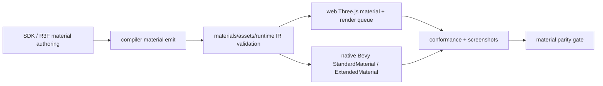
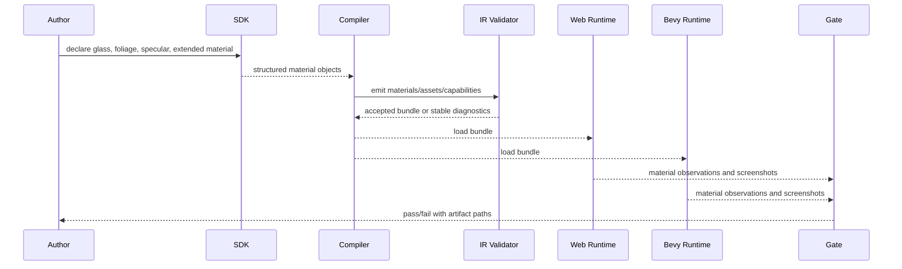

# V8-07 Material, Texture, and Shader Parity

Complexity: 10 -> HIGH mode

## Context

**Problem:** ThreeNative standard materials now carry many authored PBR fields,
but material parity remains incomplete for transparent ordering/blending,
specular texture maps, native sampler/UV application, constrained extended
materials, and eventually portable shader surfaces.

**Files Analyzed:**

- `docs/ROADMAP.md`
- `docs/bevy-feature-parity.md`
- `docs/STATUS.md`
- `docs/advanced-features-roadmap.md`
- `docs/PRDs/v5/V5-06-textured-standard-material-parity.md`
- `docs/PRDs/v8/README.md`
- `packages/sdk/src/materials/MeshStandardMaterial.ts`
- `packages/sdk/src/materials/MeshStandardMaterial.test.ts`
- `packages/r3f/src/capture.ts`
- `packages/compiler/src/emit/scene-to-world.ts`
- `packages/compiler/src/emit/capabilities.test.ts`
- `packages/ir/src/types.ts`
- `packages/ir/schemas/materials.schema.json`
- `packages/ir/src/validate.ts`
- `packages/ir/src/conformanceReport.ts`
- `packages/ir/fixtures/conformance/v5-drift-surface/game.bundle/materials.ir.json`
- `packages/runtime-web-three/src/mapWorld.ts`
- `packages/runtime-web-three/src/render.ts`
- `packages/runtime-web-three/src/conformance.ts`
- `runtime-bevy/crates/threenative_loader/src/lib.rs`
- `runtime-bevy/crates/threenative_runtime/src/map_world.rs`
- `runtime-bevy/crates/threenative_runtime/src/rendering.rs`
- `runtime-bevy/crates/threenative_runtime/src/conformance.rs`
- `runtime-bevy/crates/threenative_runtime/tests/rendering.rs`

**Current Behavior:**

- Standard materials support color, metalness, roughness, alpha mode, opacity,
  alpha cutoff, emissive color/intensity, normal/occlusion maps, metallic
  roughness maps, clearcoat maps, transmission maps, and scalar specular
  intensity.
- Web maps promoted texture slots to Three.js materials and applies texture
  wrap/filter/repeat/offset/center/rotation controls.
- Bevy maps promoted texture slots to `StandardMaterial` handles and reports
  sampler/UV metadata in conformance, but native visual sampler/UV application
  is still not claimed.
- The IR validator rejects raw shader fields such as `shader`, `vertexShader`,
  `fragmentShader`, `nodeGraph`, and `postprocess`, which is the correct
  current boundary until a narrower portable material-extension contract lands.
- `docs/bevy-feature-parity.md` still lists transparency sorting/richer blend
  parity, specular texture maps, custom/extended materials, and broad shader
  surfaces as open material-track gaps.

## Integration Points

**How will this feature be reached?**

- [x] Entry point identified: TypeScript SDK material constructors and R3F JSX
  material capture emit `materials.ir.json`, then web Three.js and native Bevy
  consume that bundle contract.
- [x] Caller file identified: SDK material classes/exports, R3F capture,
  compiler scene emit and capability derivation, IR schema/validation,
  web `mapWorld`/`renderBundle`, Bevy loader/runtime material mapping,
  conformance reporters, visual verification scripts.
- [x] Registration/wiring needed: public SDK fields, JSON schema/type updates,
  texture-slot validation, manifest capability tags, runtime material mapping,
  render queue/order policy, shared conformance fixture updates, docs and gate
  scripts.

**Is this user-facing?** Yes. Authors should be able to configure glass,
foliage, decals, emissive bloom, specular maps, sampler transforms, and bounded
extended material presets from TypeScript and get consistent web/native
behavior or explicit diagnostics when a requested shader surface is not
portable.

**Full user flow:**

1. User declares a transparent glass material, a masked foliage material, a
   textured polished material with a specular map, and a constrained extended
   material preset.
2. Compiler emits deterministic material, texture, sort/blend, and capability
   metadata into `materials.ir.json`, `assets.manifest.json`, and
   `manifest.requiredCapabilities`.
3. IR validation rejects unsupported blend equations, missing texture assets,
   invalid sampler transforms, ambiguous transparency ordering, and raw shader
   payloads before runtime.
4. Web Three.js and native Bevy map the same fields into renderer materials,
   queue/order settings, texture handles, and observations.
5. Verification compares web/native conformance reports and visual artifacts for
   transparency, specular texture slots, sampler transforms, and extended
   material diagnostics.

## Solution

**Approach:**

- Close standard-material parity first: transparency ordering, richer portable
  blend modes, specular texture slots, and native sampler/UV application.
- Add observable render-order and depth-write policy as material or
  mesh-renderer metadata, using stable defaults that match existing opaque,
  masked, and blended behavior.
- Promote specular texture maps as a standard material field before adding any
  custom material abstraction.
- Introduce constrained extended materials as validated presets or declarative
  extension blocks that lower to fields both adapters can support.
- Keep broad shader surfaces behind explicit capability-gated diagnostics until
  there is a portable shader input/resource contract with web and Bevy evidence.

**Key Decisions:**

- [ ] Standard materials remain the baseline. Extended/custom materials cannot
  bypass the portable IR contract.
- [ ] Transparency sorting is deterministic by explicit `renderOrder`, then
  alpha policy, then entity ID for observations; adapters may still use their
  internal per-frame depth sort for visual rendering where required.
- [ ] Portable blend modes start narrow: `normal`, `additive`, `multiply`, and
  `premultipliedAlpha` only if both web and Bevy can map them with matching
  semantics.
- [ ] Specular maps are standard-material texture slots and must be validated
  like existing promoted slots.
- [ ] Native sampler/UV transform support is promoted only when Bevy visual
  mapping is real or explicitly backed by generated/transformed runtime texture
  assets; observation-only metadata is not enough for the promoted claim.
- [ ] Broad shader graphs, raw GLSL/WGSL snippets, storage buffers, render
  phases, bindless strategies, and custom post-processing remain out of scope
  until after constrained extended materials pass conformance and visual gates.

**Data Changes:** Extend material IR/schema/types with transparency policy,
portable blend mode, optional render order/depth write/depth test controls,
`specularTexture`, native-applicable texture coordinate transform metadata, and
constrained extended material declarations. No database changes.

## Sequence Flow

## Execution Phases

#### Phase 1: Transparency Order and Blend Policy - Authors can make predictable glass, foliage, and decals

**Files (max 5):**

- `packages/ir/src/types.ts` - material alpha/blend/render-order fields.
- `packages/ir/schemas/materials.schema.json` - schema additions.
- `packages/ir/src/validate.ts` - diagnostics for invalid transparency policy.
- `packages/ir/src/rendering.test.ts` - accepted/rejected transparency tests.
- `packages/compiler/src/emit/capabilities.ts` - blend/sort capability tags.

**Implementation:**

- [ ] Add material fields `blendMode`, `renderOrder`, `depthWrite`, and
  `depthTest` with conservative defaults.
- [ ] Keep `alphaMode: "opaque" | "mask" | "blend"` as the primary alpha
  policy; use `blendMode` only when `alphaMode` is `blend`.
- [ ] Validate finite integer render order, valid depth booleans, and supported
  blend modes.
- [ ] Reject combinations that cannot be made portable, such as additive blend
  with alpha mask or disabled depth test on opaque materials, unless a later
  adapter proof promotes them.
- [ ] Derive capability tags for transparent sorting and each promoted blend
  mode.

**Tests Required:**

| Test File | Test Name | Assertion |
| --- | --- | --- |
| `packages/ir/src/rendering.test.ts` | `should accept blended materials with explicit render order` | Validator accepts `alphaMode: "blend"`, `blendMode: "normal"`, and finite `renderOrder`. |
| `packages/ir/src/rendering.test.ts` | `should reject unsupported blend mode` | Diagnostic code is `TN_IR_MATERIAL_BLEND_MODE_UNSUPPORTED`. |
| `packages/compiler/src/emit/capabilities.test.ts` | `should derive transparent material capabilities` | Manifest contains sorted transparency/blend capabilities. |

**Verification Plan:**

1. **Unit Tests:** `pnpm --filter @threenative/ir test -- --run rendering`
2. **Compiler Tests:** `pnpm --filter @threenative/compiler test -- --run capabilities`
3. **Evidence Required:** Valid fixtures pass; invalid blend fields produce
   stable diagnostics with material paths and suggested fixes.

**User Verification:**

- Action: Build a fixture with one opaque cube, one masked foliage plane, one
  blended glass plane, and one additive decal.
- Expected: `materials.ir.json` records deterministic blend/order policy and
  unsupported combinations fail before runtime.

**Checkpoint:** Automated review after this phase:
`Review checkpoint for phase 1 of PRD at docs/PRDs/v8/V8-07-material-texture-shader-parity.md`.

#### Phase 2: Runtime Transparency Parity - Web and Bevy expose matching transparency observations

**Files (max 5):**

- `packages/runtime-web-three/src/mapWorld.ts` - map blend/depth/render order to
  Three.js materials and meshes.
- `packages/runtime-web-three/src/mapWorld.test.ts` - web material mapping tests.
- `runtime-bevy/crates/threenative_loader/src/lib.rs` - deserialize new fields.
- `runtime-bevy/crates/threenative_runtime/src/map_world.rs` - map alpha,
  blend/depth policy, and deterministic observations.
- `runtime-bevy/crates/threenative_runtime/tests/rendering.rs` - native mapping
  tests.

**Implementation:**

- [ ] Set Three.js `transparent`, `opacity`, `alphaTest`, `blending`,
  `premultipliedAlpha`, `depthWrite`, `depthTest`, and mesh `renderOrder` from
  the IR.
- [ ] Map Bevy `AlphaMode`, material depth flags available in Bevy 0.14, and
  order metadata. If Bevy cannot match a blend mode exactly, emit a stable
  native diagnostic and keep the feature unpromoted.
- [ ] Preserve existing alpha mode behavior for bundles that omit the new
  fields.
- [ ] Attach runtime-observable material user data/components for conformance.
- [ ] Ensure render-order defaults are deterministic for reports even when
  visual backend sort remains depth-based.

**Tests Required:**

| Test File | Test Name | Assertion |
| --- | --- | --- |
| `packages/runtime-web-three/src/mapWorld.test.ts` | `should map transparent render order and blend settings` | Three.js material/mesh fields match IR. |
| `runtime-bevy/crates/threenative_runtime/tests/rendering.rs` | `maps transparent material alpha and order policy` | Bevy material and native metadata match IR. |
| `runtime-bevy/crates/threenative_runtime/tests/rendering.rs` | `reports unsupported native blend policy explicitly` | Diagnostic code is stable when Bevy lacks exact support. |

**Verification Plan:**

1. **Web Tests:** `pnpm --filter @threenative/runtime-web-three test -- --run mapWorld`
2. **Native Tests:** `cargo test --manifest-path runtime-bevy/Cargo.toml rendering`
3. **Evidence Required:** Both adapters report the same accepted fields or the
   same known unsupported reason.

**User Verification:**

- Action: Run the transparency fixture in web preview and native conformance.
- Expected: Web and Bevy reports agree on alpha mode, blend mode, depth policy,
  and render order.

**Checkpoint:** Automated review after this phase:
`Review checkpoint for phase 2 of PRD at docs/PRDs/v8/V8-07-material-texture-shader-parity.md`.

#### Phase 3: Specular Texture Maps - Standard materials can reference portable specular maps

**Files (max 5):**

- `packages/sdk/src/materials/MeshStandardMaterial.ts` - add
  `specularTexture`.
- `packages/sdk/src/materials/MeshStandardMaterial.test.ts` - SDK storage tests.
- `packages/ir/src/types.ts` - material texture slot type.
- `packages/ir/schemas/materials.schema.json` - schema texture slot.
- `packages/ir/src/validate.ts` - texture reference validation slot list.

**Implementation:**

- [ ] Add `specularTexture?: TextureSlotReference` to SDK material options.
- [ ] Add `specularTexture?: string` to IR material types and schema.
- [ ] Validate `specularTexture` references against texture assets exactly like
  existing promoted material slots.
- [ ] Preserve `specularIntensity` as scalar multiplier; `specularTexture`
  supplies the texture slot.
- [ ] Update accepted/rejected asset tests for all material texture slots.

**Tests Required:**

| Test File | Test Name | Assertion |
| --- | --- | --- |
| `packages/sdk/src/materials/MeshStandardMaterial.test.ts` | `should store specular texture map` | Constructor stores the texture reference. |
| `packages/ir/src/assets.test.ts` | `assets should accept supported material texture slots` | `specularTexture` validates against a texture asset. |
| `packages/ir/src/assets.test.ts` | `assets should reject unknown specular texture asset` | Diagnostic path points to `specularTexture`. |

**Verification Plan:**

1. **SDK Tests:** `pnpm --filter @threenative/sdk test -- --run MeshStandardMaterial`
2. **IR Tests:** `pnpm --filter @threenative/ir test -- --run assets`
3. **Evidence Required:** Specular texture slots validate and fail consistently
   with other texture slots.

**User Verification:**

- Action: Build a material with `specularIntensity` and `specularTexture`.
- Expected: Bundle emits a stable texture reference and validation rejects
  missing or non-texture assets.

**Checkpoint:** Automated review after this phase:
`Review checkpoint for phase 3 of PRD at docs/PRDs/v8/V8-07-material-texture-shader-parity.md`.

#### Phase 4: Specular Runtime and Conformance - Web and Bevy map the specular texture slot

**Files (max 5):**

- `packages/runtime-web-three/src/mapWorld.ts` - map `specularTexture` to
  Three.js physical material `specularMap`.
- `packages/runtime-web-three/src/conformance.ts` - report specular texture.
- `runtime-bevy/crates/threenative_loader/src/lib.rs` - deserialize
  `specularTexture`.
- `runtime-bevy/crates/threenative_runtime/src/map_world.rs` - map Bevy
  specular texture field or emit a stable unsupported diagnostic.
- `runtime-bevy/crates/threenative_runtime/src/conformance.rs` - report
  specular texture observations.

**Implementation:**

- [ ] Treat `specularTexture` as a physical material field in web material
  selection.
- [ ] Map to Three.js `MeshPhysicalMaterial.specularMap`.
- [ ] Map to the Bevy 0.14 `StandardMaterial` field if available; otherwise
  preserve the IR observation and emit `TN_BEVY_MATERIAL_SPECULAR_TEXTURE_UNSUPPORTED`.
- [ ] Add `textures.specular` to shared conformance material reports.
- [ ] Update fixtures so web/native reports prove the same material slot.

**Tests Required:**

| Test File | Test Name | Assertion |
| --- | --- | --- |
| `packages/runtime-web-three/src/mapWorld.test.ts` | `should map specular texture to physical material` | `specularMap.userData.threenativeAssetId` matches IR. |
| `packages/runtime-web-three/src/conformance.test.ts` | `should report specular material texture` | Report includes `textures.specular`. |
| `runtime-bevy/crates/threenative_runtime/tests/rendering.rs` | `maps or diagnoses specular texture map` | Native behavior matches promoted support state. |
| `runtime-bevy/crates/threenative_runtime/tests/conformance.rs` | `reports specular material texture` | Report includes `textures.specular`. |

**Verification Plan:**

1. **Web Tests:** `pnpm --filter @threenative/runtime-web-three test -- --run "mapWorld|conformance"`
2. **Native Tests:** `cargo test --manifest-path runtime-bevy/Cargo.toml rendering conformance`
3. **Shared Conformance:** `pnpm verify:conformance`
4. **Evidence Required:** Shared reports contain the same `textures.specular`
   value or a documented native unsupported diagnostic if Bevy cannot map it.

**User Verification:**

- Action: Run the conformance fixture with a polished material.
- Expected: Web and Bevy material observations include the same specular map
  slot and scalar specular intensity.

**Checkpoint:** Automated review after this phase:
`Review checkpoint for phase 4 of PRD at docs/PRDs/v8/V8-07-material-texture-shader-parity.md`.

#### Phase 5: Native Sampler and UV Transform Application - Texture controls are visually promoted on Bevy

**Files (max 5):**

- `runtime-bevy/crates/threenative_loader/src/lib.rs` - ensure texture sampler
  fields are available for runtime mapping.
- `runtime-bevy/crates/threenative_runtime/src/assets.rs` - Bevy image/sampler
  descriptor mapping or transformed texture generation.
- `runtime-bevy/crates/threenative_runtime/src/map_world.rs` - connect material
  texture controls to loaded images/materials.
- `runtime-bevy/crates/threenative_runtime/tests/assets.rs` - sampler/UV
  mapping tests.
- `runtime-bevy/crates/threenative_runtime/tests/rendering.rs` - material
  texture transform tests.

**Implementation:**

- [ ] Apply Bevy-supported sampler modes for wrap and filtering on loaded
  texture images.
- [ ] Apply repeat/offset/center/rotation through a real native rendering path.
  Prefer material/mesh UV transform support when available; otherwise generate
  deterministic transformed UVs or texture assets for promoted cases.
- [ ] Define exact supported native texture transform bounds and reject or warn
  on unsupported combinations before claiming parity.
- [ ] Keep web behavior unchanged except for conformance report alignment.
- [ ] Add native visual evidence for repeat and offset on at least one material.

**Tests Required:**

| Test File | Test Name | Assertion |
| --- | --- | --- |
| `runtime-bevy/crates/threenative_runtime/tests/assets.rs` | `maps texture wrap and filter controls to native sampler settings` | Bevy image sampler metadata matches asset IR. |
| `runtime-bevy/crates/threenative_runtime/tests/rendering.rs` | `applies native texture repeat and offset controls` | Material or generated UV data reflects repeat/offset. |
| `runtime-bevy/crates/threenative_runtime/tests/rendering.rs` | `diagnoses unsupported native texture transform combinations` | Stable diagnostic points to the texture asset field. |

**Verification Plan:**

1. **Native Tests:** `cargo test --manifest-path runtime-bevy/Cargo.toml assets rendering`
2. **Visual Proof:** Add a focused verifier that renders a tiled texture in web
   and Bevy and stores artifacts under `tools/verify/artifacts/material-parity/`.
3. **Evidence Required:** Native output visibly changes when repeat/offset
   values change; conformance report alone is insufficient.

**User Verification:**

- Action: Run the material parity verifier.
- Expected: Web and native screenshots show the same tiled/offset texture
  intent within documented tolerances.

**Checkpoint:** Automated and manual review after this phase:
`Review checkpoint for phase 5 of PRD at docs/PRDs/v8/V8-07-material-texture-shader-parity.md`.

#### Phase 6: Constrained Extended Materials - Authors can opt into portable advanced presets

**Files (max 5):**

- `packages/sdk/src/materials/*` - extended material declaration API.
- `packages/ir/src/types.ts` - constrained extended material types.
- `packages/ir/schemas/materials.schema.json` - schema support.
- `packages/compiler/src/emit/scene-to-world.ts` - emit extended declarations.
- `packages/ir/src/validate.ts` - preset/extension validation.

**Implementation:**

- [ ] Add a constrained `kind: "extended"` or `extension` block for portable
  presets only, such as `foliage`, `waterSimple`, `toonRamp`, or `unlitMasked`
  if both adapters can support them.
- [ ] Require declared inputs, texture slots, numeric ranges, color slots, and
  fallback standard-material behavior.
- [ ] Reject undeclared uniforms, backend shader snippets, dynamic includes,
  storage buffers, render-phase changes, and arbitrary node graphs.
- [ ] Derive manifest capability tags per preset.
- [ ] Keep existing `kind: "standard"` fixtures and defaults unchanged.

**Tests Required:**

| Test File | Test Name | Assertion |
| --- | --- | --- |
| `packages/sdk/src/materials/*.test.ts` | `should declare extended material preset inputs` | SDK stores deterministic preset inputs. |
| `packages/ir/src/rendering.test.ts` | `should accept constrained extended material preset` | Validator accepts declared preset fields. |
| `packages/ir/src/rendering.test.ts` | `should reject raw shader fields on extended materials` | Diagnostic code remains explicit and actionable. |
| `packages/compiler/src/emit/scene-to-world.test.ts` | `should emit extended material declarations` | `materials.ir.json` contains sorted preset data. |

**Verification Plan:**

1. **SDK/Compiler/IR Tests:** run focused material and rendering tests.
2. **Evidence Required:** Extended material data is reachable from authoring,
   emitted to bundle IR, and rejected when it includes non-portable shader
   payloads.

**User Verification:**

- Action: Build an example using one promoted extended material preset and one
  invalid raw shader field.
- Expected: The preset emits and validates; the raw shader field fails with a
  stable diagnostic and suggested portable alternative.

**Checkpoint:** Automated review after this phase:
`Review checkpoint for phase 6 of PRD at docs/PRDs/v8/V8-07-material-texture-shader-parity.md`.

#### Phase 7: Extended Material Runtime and Visual Evidence - Presets render in web and Bevy

**Files (max 5):**

- `packages/runtime-web-three/src/mapWorld.ts` - map extended presets to
  Three.js material implementations.
- `packages/runtime-web-three/src/conformance.ts` - report extended material
  preset observations.
- `runtime-bevy/crates/threenative_loader/src/lib.rs` - deserialize extended
  material declarations.
- `runtime-bevy/crates/threenative_runtime/src/map_world.rs` - map presets to
  Bevy `StandardMaterial` or `ExtendedMaterial` implementations.
- `runtime-bevy/crates/threenative_runtime/tests/rendering.rs` - native preset
  tests.

**Implementation:**

- [ ] Implement each promoted preset in web and Bevy with documented fallback
  behavior.
- [ ] Emit stable diagnostics for presets unsupported on a target profile.
- [ ] Add conformance observations for preset kind, inputs, textures, and
  fallback.
- [ ] Add one visual fixture per promoted preset or keep the preset unpromoted.
- [ ] Ensure raw shader payloads remain rejected and cannot silently degrade.

**Tests Required:**

| Test File | Test Name | Assertion |
| --- | --- | --- |
| `packages/runtime-web-three/src/mapWorld.test.ts` | `should map extended material preset` | Runtime material fields match preset contract. |
| `runtime-bevy/crates/threenative_runtime/tests/rendering.rs` | `maps extended material preset` | Bevy material or extension component matches preset contract. |
| `packages/runtime-web-three/src/conformance.test.ts` | `should report extended material preset` | Web report includes preset observations. |
| `runtime-bevy/crates/threenative_runtime/tests/conformance.rs` | `reports extended material preset` | Native report includes preset observations. |

**Verification Plan:**

1. **Focused Tests:** web runtime and native rendering/conformance tests.
2. **Shared Conformance:** `pnpm verify:conformance`
3. **Visual Proof:** material parity verifier captures web/native screenshots
   for promoted presets.
4. **Evidence Required:** A preset is not marked complete unless it has both
   adapters, conformance, and visual evidence.

**User Verification:**

- Action: Run the material parity example in web and native modes.
- Expected: Promoted extended materials render with documented matching
  behavior and unsupported presets produce explicit diagnostics.

**Checkpoint:** Automated and manual review after this phase:
`Review checkpoint for phase 7 of PRD at docs/PRDs/v8/V8-07-material-texture-shader-parity.md`.

#### Phase 8: Shader Surface Gate - Raw shaders remain rejected until a portable contract exists

**Files (max 5):**

- `docs/advanced-features-roadmap.md` - shader surface promotion criteria.
- `docs/bevy-feature-parity.md` - material/shader status updates.
- `docs/STATUS.md` - gate/evidence status.
- `scripts/check-docs-v8.mjs` - docs guard for material PRD/status links.
- `scripts/verify-v8-material-parity.mjs` - aggregate focused verifier.

**Implementation:**

- [ ] Document the minimum future shader contract: declared inputs, texture
  slots, vertex attributes, uniform blocks, resource lifetimes, target profiles,
  portable WGSL/TSL boundary, and adapter-specific diagnostics.
- [ ] Keep `shader`, `vertexShader`, `fragmentShader`, `nodeGraph`,
  `postprocess`, storage buffers, render phases, bindless materials, and custom
  post-processing out of promoted V8 material parity unless a later PRD covers
  them end to end.
- [ ] Add a focused material parity verifier that runs type/schema checks,
  web/native runtime mapping tests, conformance, and screenshot proof.
- [ ] Update `docs/STATUS.md` and `docs/bevy-feature-parity.md` only for the
  items actually completed by earlier phases.
- [ ] Make docs guards fail if the PRD says a material feature is promoted but
  parity/status docs still list it as missing.

**Tests Required:**

| Test File | Test Name | Assertion |
| --- | --- | --- |
| `scripts/check-docs-v8.mjs` | `material parity PRD and docs stay linked` | Docs guard finds PRD, status, parity, and verifier references. |
| `scripts/verify-v8-material-parity.mjs` | `material parity verifier passes` | Aggregate report includes tests, conformance, and artifact paths. |
| `packages/ir/src/rendering.test.ts` | `should reject broad shader fields until promoted` | Raw shader fields produce explicit unsupported diagnostics. |

**Verification Plan:**

1. **Docs Guard:** `pnpm check:docs:v8`
2. **Material Gate:** `node scripts/verify-v8-material-parity.mjs`
3. **Shared Conformance:** `pnpm verify:conformance`
4. **Full Gate Before Release:** `pnpm verify`
5. **Evidence Required:** `tools/verify/artifacts/material-parity/verification-report.json`
   includes test commands, web/native screenshots, conformance report paths, and
   any target-specific unsupported diagnostics.

**User Verification:**

- Action: Inspect `tools/verify/artifacts/material-parity/verification-report.json`.
- Expected: The report names every promoted material feature, evidence artifact,
  passing command, and any still-deferred shader surface.

**Checkpoint:** Automated and manual review after this phase:
`Review checkpoint for phase 8 of PRD at docs/PRDs/v8/V8-07-material-texture-shader-parity.md`.

## Checkpoint Protocol

Use the PRD checkpoint process after every phase. This environment does not
currently expose a `prd-work-reviewer` Task tool; when it is unavailable, run
the phase verification commands directly, record the output in the
implementation notes, and do not advance on failing tests.

For phases with visual evidence, also perform manual artifact review:

- Open web/native screenshots from `tools/verify/artifacts/material-parity/`.
- Confirm transparent object order, texture transform intent, and extended
  preset output are visible.
- Confirm unsupported shader surfaces fail with stable diagnostics rather than
  silently degrading.

## Acceptance Criteria

- [ ] Transparency sorting and promoted blend modes have SDK/IR/compiler/web/
  Bevy/conformance coverage.
- [ ] Specular texture maps validate, emit, map, and report in web and Bevy.
- [ ] Native sampler and UV transform controls are visually applied or explicitly
  diagnosed as unsupported; observation-only metadata is not marked complete.
- [ ] Constrained extended material presets are reachable from authoring,
  validated, mapped in both adapters, and backed by visual evidence.
- [ ] Raw shader surfaces remain explicitly rejected until a later portable
  shader contract PRD promotes them.
- [ ] `pnpm verify:conformance`, `pnpm check:docs:v8`, and
  `node scripts/verify-v8-material-parity.mjs` pass.
- [ ] `docs/STATUS.md` and `docs/bevy-feature-parity.md` reflect only completed
  material parity claims.
- [ ] No adapter silently ignores an authored material, texture, or shader field.

## Verification Evidence

Populate this section during implementation:

- Phase 1:
- Phase 2:
- Phase 3:
- Phase 4:
- Phase 5:
- Phase 6:
- Phase 7:
- Phase 8:
