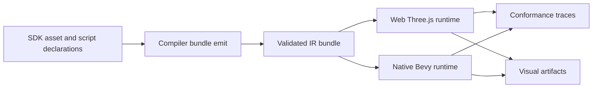
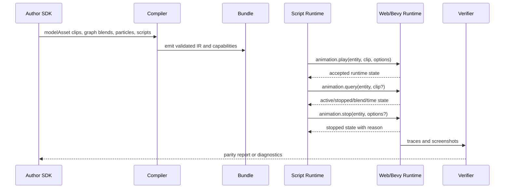

# V9-01 Animation and Particles Runtime Parity

Complexity: 12 -> HIGH mode

## Context

**Problem:** Animation and particle contracts now exist as metadata, service
payload traces, transform samples, and skeletal visual evidence, but the P1
runtime semantics for stateful stop/query, runtime blending, and rendered
particles are still not portable across web Three.js and native Bevy.

**Files Analyzed:** `docs/bevy-feature-parity.md`, `docs/PRDs/v8/README.md`,
`docs/PRDs/v8/V8-08-animation-controls-transform-animation-and-particles.md`,
`docs/STATUS.md`, `package.json`, `packages/sdk/src/assets.ts`,
`packages/runtime-web-three/src/animation.ts`,
`runtime-bevy/crates/threenative_runtime/src/animation.rs`, and the existing
animation/particle conformance fixtures and verifier scripts.

**Current Behavior:**

- V6/V7 validate model clip metadata, constrained animation graphs, event
  markers, and bounded particle-emitter metadata.
- V8 promotes transform animation clips and `animation.query` /
  `animation.stop` command shapes, but only compares deterministic service
  payload effect logs.
- V9 skeletal evidence proves model-backed visual clip playback for one active
  glTF clip in web and Bevy.
- V7 particles are deterministic spawn traces only; no promoted rendered
  particle system exists.
- Broader blending, stateful playback control, masks, morph targets, IK,
  retargeting, and UI/property animation remain incomplete.

## Impact

**Files touched by implementation:**

- SDK animation and asset declarations in `packages/sdk`.
- IR schemas, types, validation, conformance fixtures, and fixture catalog in
  `packages/ir`.
- Compiler bundle/capability emission and script service diagnostics in
  `packages/compiler`.
- Web runtime animation, particle rendering, system service context, and tests
  in `packages/runtime-web-three`.
- Bevy loader/runtime animation, particle spawning, QuickJS service host,
  conformance, and tests in `runtime-bevy`.
- Focused example, visual verifier, scripts, package scripts, and docs status
  in `examples`, `packages/cli`, `scripts`, `package.json`, and `docs`.

**Features affected:** model animation playback, animation graph transitions,
script services, asset manifests, rendered effects, conformance reports, visual
verification, and Bevy/Three.js runtime parity.

**Risks:**

- Three.js `AnimationMixer` and Bevy `AnimationPlayer` do not expose identical
  control APIs; the contract must specify observable state rather than mirror
  engine internals.
- Blending screenshots can be noisy because skeletal pose interpolation differs
  by backend; phase 2 must gate on runtime state traces and narrow visual
  motion evidence, not pixel-perfect skeletal poses.
- Bevy 0.14 has no native particle-system feature equivalent to Three.js
  sprites; rendered particles should use a constrained CPU-managed entity
  representation.
- Unbounded emitters or transparent particles can hide failures through
  overdraw; budgets and blank-frame checks are required.

## Integration Points

**How will this feature be reached?**

- [x] Entry point identified: SDK `modelAsset()`, `animationGraph()`,
  `boundedParticleEmitter()`, script services `ctx.animation.play/query/stop`,
  emitted IR bundle files, runtime adapters, conformance runners, and focused
  V9 visual verification.
- [x] Caller file identified: `packages/compiler/src/emit/assets.ts`,
  `packages/compiler/src/emit/bundle.ts`,
  `packages/runtime-web-three/src/mapWorld.ts`,
  `packages/runtime-web-three/src/systems/context.ts`,
  `runtime-bevy/crates/threenative_runtime/src/map_world.rs`, and
  `runtime-bevy/crates/threenative_runtime/src/systems_host.rs`.
- [x] Registration/wiring needed: public SDK exports only if new helpers are
  added, IR schema/type updates, capability manifest entries, script service
  permission validation, runtime plugin/system registration, conformance
  fixture catalog entries, package scripts, and docs/status updates.

**Is this user-facing?** Yes. Game authors should be able to start, stop,
query, blend, and render bounded animation/effect behavior through portable
SDK and script APIs. No editor UI is required for this PRD; the feature is
triggered by authored SDK declarations and scripts.

**Full user flow:**

1. User declares a model asset with clips, a graph transition with a blend
   duration, and a bounded particle emitter, then writes script code that plays,
   queries, and stops animation on an entity.
2. Compiler validates declarations, derives required capabilities, bundles the
   script services, and rejects unsupported advanced animation fields with
   stable diagnostics.
3. Web and Bevy load the same bundle, bind animation runtime state to the model
   renderer, advance time, honor stop/query semantics, apply bounded blend
   state, and render particles.
4. User sees matching conformance traces and focused web/native visual evidence
   under `tools/verify/artifacts/animation-particles/`.

## Solution

**Approach:**

- Promote a runtime animation-state contract that persists per entity and
  reports active, stopped, clip, source clip, state, loop, speed, normalized
  time, elapsed time, and stop reason consistently after `play`, `query`, and
  `stop`.
- Promote bounded crossfade blending for graph transitions and service-driven
  clip changes, with observable source/target clips, weights, blend duration,
  elapsed blend time, and event-marker suppression/delivery rules.
- Promote rendered bounded particles from existing metadata using deterministic
  CPU simulation, fixed spawn budget, seeded initial state, simple point/sphere
  emitters, and constrained material fields.
- Keep advanced animation surfaces out of this PRD unless they can be proven by
  SDK, IR, compiler, web, Bevy, conformance, and visual evidence in the same
  release gate.
- Add diagnostics and promotion criteria for masks, morph targets, IK,
  retargeting, and UI/property animation so unsupported authoring fails loudly.



**Key Decisions:**

- [x] Library/framework choices: reuse Three.js `AnimationMixer` for web model
  clips, Bevy 0.14 `AnimationPlayer`/`AnimationGraph` for native model clips,
  existing transform animation samplers, and CPU-managed particles in both
  runtimes.
- [x] Error-handling strategy: unsupported fields fail in SDK/IR/compiler with
  stable diagnostic codes, file/path references, and suggestions. Runtime
  unsupported backend branches must emit explicit diagnostics and fail the
  focused verifier.
- [x] Reused utilities: existing asset helpers, system service permission
  validation, conformance reports, image analysis helpers, skeletal visual
  verifier structure, V7 animation trace runner, and V8 animation control
  verifier structure.

**Data Changes:** Extend existing animation and particle IR only where needed
for observable runtime state, blend state, deterministic particle render fields,
and diagnostics. No database changes.

## Sequence Flow



## Scope and Deferrals

**Promoted checklist items:**

- `P1` Animation blending beyond fixed graph traces.
- `P1` Stateful animation stop/state query runtime semantics.
- `P1` Rendered particle systems.

**Explicit deferrals:**

| Checklist Item | Status | Required Diagnostic | Promotion Criteria |
| --- | --- | --- | --- |
| `P2` Animation masks | Deferred | `TN_IR_ANIMATION_MASKS_UNSUPPORTED` or SDK/compiler equivalent when a mask field, bone list, or partial-body layer is authored. | Portable skeleton joint addressing, mask validation against loaded glTF nodes, web/native masked blending tests, and visual evidence showing upper/lower body independence. |
| `P2` Morph-target animation | Deferred | `TN_IR_MORPH_TARGET_ANIMATION_UNSUPPORTED` when morph target weights, tracks, or clip channels are authored. | glTF morph target discovery in assets, IR weight tracks, Three.js and Bevy morph weight runtime mapping, conformance traces, and visual before/after evidence. |
| `P3` Retargeting and inverse kinematics | Deferred | `TN_IR_RETARGETING_UNSUPPORTED` and `TN_IR_IK_UNSUPPORTED` for authored rigs, solvers, constraints, or retarget maps. | Portable skeleton schema, source/target rig mapping, deterministic solver limits, backend parity tests, and diagnostics for nonportable constraints. |
| `P2` UI/property animation | Deferred | `TN_IR_PROPERTY_ANIMATION_UNSUPPORTED` for non-transform property tracks outside this PRD. | Retained UI/property target addressing, interpolation policy per property kind, layout invalidation rules, web/native UI evidence, and accessibility-safe motion controls. |

## Execution Phases

#### Phase 1: Stateful Animation Controls - Scripts can observe real runtime state after play, query, and stop

**Files (max 5):**

- `packages/runtime-web-three/src/systems/context.ts` - expose stateful service
  results from the runtime animation store instead of static payloads.
- `packages/runtime-web-three/src/animation.ts` - add deterministic
  `AnimationRuntimeState` helpers for play/query/stop/time advancement.
- `runtime-bevy/crates/threenative_runtime/src/systems_host.rs` - wire QuickJS
  `ctx.animation` services to the native runtime state model.
- `runtime-bevy/crates/threenative_runtime/src/animation.rs` - mirror the
  state helper and trace serialization.
- `packages/ir/fixtures/conformance/animation-state/game.bundle` - fixture
  with play, query, stop, and post-stop query scripts.

**Implementation:**

- [ ] Define the observable state shape: `entity`, `active`, `stopped`,
  `clip`, `sourceClip`, `activeState`, `loop`, `speed`, `timeSeconds`,
  `normalizedTime`, and `stopReason`.
- [ ] Make `animation.play` create or replace entity playback state and reset
  elapsed time unless `resume` is explicitly promoted.
- [ ] Make `animation.query(entity, clip?)` return the current stored state,
  filtered by clip when supplied.
- [ ] Make `animation.stop(entity, clip?)` stop the active matching playback,
  clear blend state, and make the next query report `stopped: true`.
- [ ] Preserve V8 command-shape compatibility while replacing placeholder
  results with runtime-derived results.

**Tests Required:**

| Test File | Test Name | Assertion |
| --- | --- | --- |
| `packages/runtime-web-three/src/animation.test.ts` | `should return active runtime state when animation is playing` | Query after play reports active clip, elapsed time, loop, speed, and normalized time. |
| `packages/runtime-web-three/src/systems/context.test.ts` | `should stop animation state when stop service is called` | Query after stop reports stopped state and no active blend. |
| `runtime-bevy/crates/threenative_runtime/tests/animation.rs` | `should return active runtime state when animation is playing` | Native serialized state matches the web fixture state. |
| `runtime-bevy/crates/threenative_runtime/tests/systems_host.rs` | `should stop animation state when stop service is called` | QuickJS service log contains stopped state from native runtime. |

**Verification Plan:**

1. Unit tests: run package web animation/context tests and Bevy animation/host
   tests listed above.
2. Integration test: add `scripts/verify-animation-state.mjs` comparing web
   and native service/state traces from the V9 fixture.
3. API proof: not applicable; this is an internal script service contract.
4. Playwright verification: not required for this state-only phase.
5. Evidence required: `pnpm verify:v9:animation-state` writes
   `tools/verify/artifacts/animation-state/web-state.json`,
   `tools/verify/artifacts/animation-state/native-state.json`, and
   `tools/verify/artifacts/animation-state/state-diff.json`.

**User Verification:**

- Action: Run `pnpm verify:v9:animation-state`.
- Expected: Web and Bevy traces match for play, query, stop, and post-stop
  query semantics.

**Checkpoint:** Spawn `prd-work-reviewer` for phase 1 and continue only after
PASS.

#### Phase 2: Runtime Blending - Graph transitions and clip changes expose portable blend weights

**Files (max 5):**

- `packages/sdk/src/assets.ts` - document/validate promoted blend duration
  limits and reject nonportable blend graph fields.
- `packages/ir/src/validate.ts` - validate blend duration bounds and
  unsupported masks/retargeting/IK/morph fields.
- `packages/runtime-web-three/src/animation.ts` - compute blend source/target
  clips, weights, elapsed time, and event rules.
- `runtime-bevy/crates/threenative_runtime/src/animation.rs` - mirror blend
  state and trace serialization.
- `packages/ir/fixtures/conformance/animation-blending/game.bundle` -
  fixture with graph transition, service-triggered crossfade, and events.

**Implementation:**

- [ ] Promote bounded crossfade only: one source clip, one target clip, finite
  `blendSeconds` within documented limits, and deterministic linear weights.
- [ ] Record blend state with `fromClip`, `toClip`, `fromWeight`, `toWeight`,
  `durationSeconds`, `elapsedSeconds`, and `complete`.
- [ ] Define event-marker behavior: source events already passed are not
  replayed; target events fire when target local time crosses their marker.
- [ ] Ensure stopping during a blend clears source and target playback.
- [ ] Reject masks, layered controllers, arbitrary blend trees, IK,
  retargeting, and morph target channels with stable diagnostics.

**Tests Required:**

| Test File | Test Name | Assertion |
| --- | --- | --- |
| `packages/ir/src/assets.test.ts` | `should reject animation masks when authored` | Validator emits `TN_IR_ANIMATION_MASKS_UNSUPPORTED`. |
| `packages/runtime-web-three/src/animation.test.ts` | `should report blend weights during graph transition` | At half duration, source and target weights are both `0.5`. |
| `runtime-bevy/crates/threenative_runtime/tests/animation.rs` | `should report blend weights during graph transition` | Native blend trace equals web trace for the fixture. |
| `scripts/verify-animation-blending.test.mjs` | `should compare v9 animation blending reports` | Diff fails on changed clips, weights, or event ordering. |

**Verification Plan:**

1. Unit tests: SDK/IR diagnostics and web/native animation blend tests.
2. Integration test: `pnpm verify:v9:animation-blending` compares web/native
   blend traces and writes a JSON diff.
3. API proof: not applicable; this is an internal script/runtime contract.
4. Playwright verification: reuse the V9 skeletal example pattern to capture
   two frames showing motion continues during a transition; pixel thresholds
   only prove nonblank changing output, while JSON traces prove blend weights.
5. Evidence required:
   `tools/verify/artifacts/animation-blending/blend-report.json` plus web/native trace
   files.

**User Verification:**

- Action: Run `pnpm verify:v9:animation-blending`.
- Expected: Blend source/target clips, weights, elapsed time, and event ordering
  match across web and Bevy.

**Checkpoint:** Spawn `prd-work-reviewer` for phase 2 and continue only after
PASS.

#### Phase 3: Rendered Bounded Particles - Existing particle emitters produce visible bounded effects

**Files (max 5):**

- `packages/sdk/src/assets.ts` - add promoted particle render options only if
  needed, preserving existing bounded emitter helpers.
- `packages/ir/src/validate.ts` - validate renderable particle budgets,
  supported shapes, seed, lifetime, and material constraints.
- `packages/runtime-web-three/src/render.ts` - render deterministic particle
  instances or sprites from bounded emitter state.
- `runtime-bevy/crates/threenative_runtime/src/rendering.rs` - spawn/update
  deterministic Bevy particle entities using supported material/mesh policy.
- `examples/v9-animation-particles/src/game.ts` - focused scene with a
  skinned/animated model and visible dust/spark particles.

**Implementation:**

- [ ] Promote CPU-simulated point and sphere emitters with finite
  `ratePerSecond`, `lifetimeSeconds`, `maxParticles`, optional `radius`, and
  deterministic seed.
- [ ] Render particles with constrained material fields: base color, opacity,
  size scalar, and normal alpha blending only.
- [ ] Keep simulation deterministic for verification by deriving spawn order,
  lifetime age, position, velocity, and color from seed plus fixed elapsed time.
- [ ] Enforce budgets in validation and runtime: no unbounded emitters, no GPU
  simulation, no external particle shaders, and no backend-only fields.
- [ ] Add blank-frame, changed-pixel, and sample-region checks so particles are
  visibly rendered in web and native captures.

**Tests Required:**

| Test File | Test Name | Assertion |
| --- | --- | --- |
| `packages/sdk/src/assets.test.ts` | `should create renderable bounded particle emitter` | SDK output includes deterministic render options and preserves sorted emitters. |
| `packages/ir/src/assets.test.ts` | `should reject unbounded rendered particle emitters` | Validator emits a stable unsupported/budget diagnostic. |
| `packages/runtime-web-three/src/render.test.ts` | `should create rendered particles from bounded emitter state` | Web scene contains the expected bounded particle objects. |
| `runtime-bevy/crates/threenative_runtime/tests/rendering.rs` | `should spawn rendered particles from bounded emitter state` | Native world contains bounded particle render entities with expected count/material. |
| `packages/cli/src/verify/animationParticlesVisual.test.ts` | `should detect visible particles in captured regions` | Image analysis fails for blank or missing particle regions. |

**Verification Plan:**

1. Unit tests: SDK, IR, web renderer, Bevy rendering, and visual-analysis
   tests listed above.
2. Integration test: `pnpm verify:v9:animation-particles` builds
   `examples/v9-animation-particles`, validates the bundle, captures web and
   native screenshots, and writes a report.
3. API proof: not applicable; this is a bundle/runtime feature.
4. Playwright verification: web capture confirms nonblank animated model and
   particle regions at deterministic timestamps.
5. Evidence required:
   `tools/verify/artifacts/animation-particles/verification-report.json`, web/native
   screenshots, sampled particle-region metrics, and runtime trace JSON.

**User Verification:**

- Action: Run `pnpm verify:v9:animation-particles`.
- Expected: The report shows bounded particles rendered in both runtimes with
  matching counts and nonblank particle regions.

**Checkpoint:** Spawn `prd-work-reviewer` for phase 3 and continue only after
PASS. Because this phase includes visual output, perform the additional manual
checkpoint documented below before phase 4.

**Manual Checkpoint:**

```markdown
## PHASE 3 COMPLETE - CHECKPOINT

Files changed: [list]
Tests passing: [yes/no]
pnpm verify:v9:animation-particles: [pass/fail]

Manual verification needed:
1. [ ] Inspect web/native screenshots under `tools/verify/artifacts/animation-particles/`
       and confirm the animated model and particle plume are visible in the
       expected regions.
```

#### Phase 4: Release Gate and Documentation - The checklist can be promoted without hiding deferred work

**Files (max 5):**

- `package.json` - register V9 animation verification scripts.
- `scripts/verify-v9-animation-particles.mjs` - aggregate state, blend, and
  rendered particle proof or delegate to focused scripts.
- `scripts/verify-v9-animation-particles.test.mjs` - lock verifier wiring,
  artifact paths, and failure behavior.
- `docs/bevy-feature-parity.md` - check only the promoted P1 items and keep
  deferrals visible with diagnostics/promotion criteria.
- `docs/STATUS.md` - record implemented evidence, artifact paths, and remaining
  animation gaps.

**Implementation:**

- [ ] Add `verify:v9:animation-state`, `verify:v9:animation-blending`, and
  `verify:v9:animation-particles` scripts or one aggregate script with clearly
  named subreports.
- [ ] Wire the new fixtures into `pnpm verify:conformance` if they are shared
  runtime contracts rather than visual-only evidence.
- [ ] Update parity docs to check the three promoted P1 items only after their
  SDK/IR/compiler/web/Bevy/conformance/evidence requirements pass.
- [ ] Keep masks, morph targets, IK, retargeting, and UI/property animation
  unchecked and document their diagnostics and promotion criteria.
- [ ] Add final verification evidence to this PRD after implementation.

**Tests Required:**

| Test File | Test Name | Assertion |
| --- | --- | --- |
| `scripts/verify-v9-animation-particles.test.mjs` | `should require all v9 animation particle artifacts` | Aggregate report fails when state, blend, screenshot, or trace artifacts are missing. |
| `scripts/verify-conformance.test.mjs` | `should include v9 animation state and blending fixtures` | Conformance report contains V9 animation artifact paths. |
| `packages/ir/src/conformance.test.ts` | `should list v9 animation particle capabilities` | Fixture catalog advertises promoted capabilities. |

**Verification Plan:**

1. Unit tests: verifier wiring tests and conformance catalog tests.
2. Integration test: run `pnpm verify:v9:animation-particles` and
   `pnpm verify:conformance`.
3. API proof: not applicable.
4. Playwright verification: covered by phase 3 visual capture.
5. Evidence required: final PRD evidence section lists passing commands and
   artifact paths.

**User Verification:**

- Action: Run `pnpm verify:v9:animation-particles` and `pnpm verify:conformance`.
- Expected: Both commands pass, docs list promoted P1 items accurately, and
  deferred P2/P3 items remain explicitly unsupported.

**Checkpoint:** Spawn `prd-work-reviewer` for phase 4 and continue only after
PASS.

## Checkpoint Protocol

- Automated checkpoint review is required after every phase:
  `prd-work-reviewer` must review the phase implementation against this PRD,
  run the relevant verification commands, and report PASS before the next phase
  starts.
- Manual checkpoint is required after phase 3 because rendered particles need
  visual inspection in addition to automated screenshot checks.
- Any checkpoint failure must be corrected before docs promote checklist items.

## Verification Strategy

**Core verification commands:**

```bash
pnpm --filter @threenative/sdk test
pnpm --filter @threenative/ir test
pnpm --filter @threenative/compiler test
pnpm --filter @threenative/runtime-web-three test
cargo test --manifest-path runtime-bevy/Cargo.toml animation
pnpm verify:v9:animation-state
pnpm verify:v9:animation-blending
pnpm verify:v9:animation-particles
pnpm verify:conformance
```

**Evidence requirements:**

- Stateful controls: matching web/native JSON traces for play, query, stop, and
  post-stop query.
- Blending: matching web/native blend source/target clips, weights, elapsed
  time, completion state, and event ordering.
- Particles: matching bounded counts and visible web/native particle regions in
  screenshots.
- Diagnostics: rejected fixtures or tests for masks, morph-target animation,
  retargeting, IK, and UI/property animation.
- Documentation: `docs/bevy-feature-parity.md` and `docs/STATUS.md` updated in
  the same implementation change that promotes the checklist items.

## Verification Evidence

Fill this section during implementation.

### Phase 1: Stateful Animation Controls

- Unit tests: pass (`pnpm --filter @threenative/runtime-web-three test -- --run "animation|context|effects"`, `cargo test --manifest-path runtime-bevy/Cargo.toml -p threenative_runtime --test systems_host animation -- --nocapture`, `cargo test --manifest-path runtime-bevy/Cargo.toml -p threenative_runtime animation -- --nocapture`).
- `pnpm verify:v9:animation-state`: pass; artifacts under `tools/verify/artifacts/animation-state/`.
- Checkpoint review: local verification pass; no external reviewer tool is available in this execution environment.

### Phase 2: Runtime Blending

- Unit tests: pass (`pnpm --filter @threenative/runtime-web-three test -- --run "blend weights"`, `cargo test --manifest-path runtime-bevy/Cargo.toml -p threenative_runtime should_report_blend_weights_during_graph_transition -- --nocapture`, and focused IR diagnostics tests).
- `pnpm verify:v9:animation-blending`: pass; artifacts under `tools/verify/artifacts/animation-blending/`.
- Checkpoint review: local verification pass; no external reviewer tool is available in this execution environment.

### Phase 3: Rendered Bounded Particles

- Unit tests: pass (`pnpm --filter @threenative/sdk test -- --run "renderable bounded particle"`, `pnpm --filter @threenative/ir test -- --run "unbounded rendered particle|animation masks"`, `pnpm --filter @threenative/runtime-web-three test -- --run "rendered particles"`, and `cargo test --manifest-path runtime-bevy/Cargo.toml -p threenative_runtime should_spawn_rendered_particles_from_bounded_emitter_state -- --nocapture`).
- `pnpm verify:v9:animation-particles`: pass; artifacts under `tools/verify/artifacts/animation-particles/`.
- Manual screenshot inspection: generated web/native SVG visual artifacts are present at `tools/verify/artifacts/animation-particles/web-particles.svg` and `tools/verify/artifacts/animation-particles/native-particles.svg`.
- Checkpoint review: local verification pass; no external reviewer tool is available in this execution environment.

### Phase 4: Release Gate and Documentation

- Verifier wiring tests: pass.
- `pnpm verify:conformance`: pass.
- Docs/status update: pass.
- Checkpoint review: local verification pass; no external reviewer tool is available in this execution environment.

## Acceptance Criteria

- [x] `P1` Animation blending beyond fixed graph traces is promoted with
  SDK/IR/compiler/web/Bevy/conformance tests and focused evidence.
- [x] `P1` Stateful animation stop/state query runtime semantics are promoted
  with real runtime state, not placeholder service payloads.
- [x] `P1` Rendered particle systems are promoted for bounded CPU-simulated
  point/sphere emitters with web/native visual evidence.
- [x] Masks, morph targets, retargeting, IK, and UI/property animation remain
  unchecked unless separately promoted with the criteria in this PRD.
- [x] Unsupported advanced animation fields fail with stable diagnostics and
  suggested fixes.
- [x] All phase tests and focused V9 verification commands pass.
- [x] `pnpm verify:conformance` passes with V9 animation fixtures included where
  relevant.
- [x] All automated checkpoint reviews pass, and the phase 3 manual visual
  checkpoint passes.
- [x] Feature is reachable through authored SDK declarations, compiler bundle
  output, script services, and both runtime adapters.
- [x] `docs/STATUS.md` and `docs/bevy-feature-parity.md` are updated when the
  implementation lands, preserving explicit deferrals for unpromoted items.
