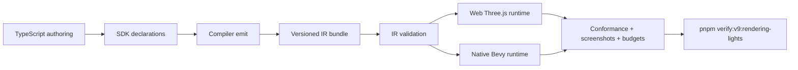
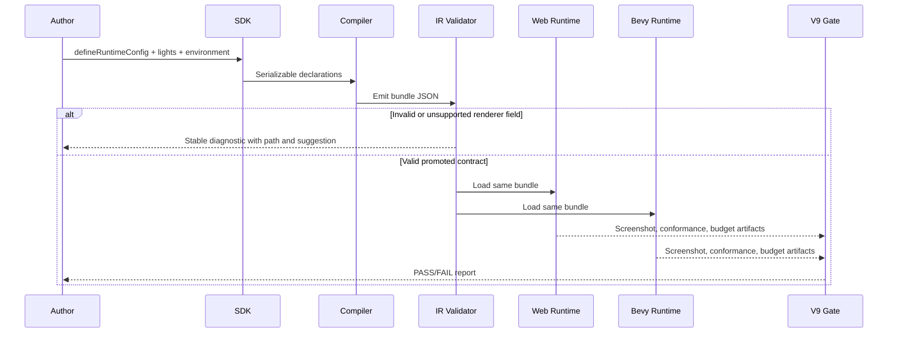

# V9-04 Rendering, Lights, and Post-Processing Parity

Complexity: 9 -> HIGH mode

Score basis: +3 touches 10+ implementation/test/docs files, +2 adds new
portable renderer/light contract surfaces, +2 spans SDK/IR/compiler/web/Bevy/CLI
packages, +2 includes complex renderer feature negotiation and visual evidence.

## Context

**Problem:** V8 proves focused fog/sky, color, bloom, MSAA, material, shadow
metadata, and report-only light/shadow evidence, but the remaining P1/P2
rendering and lighting checklist items still lack a single portable contract
that authors can rely on across web Three.js and native Bevy.

**Files Analyzed:**

- `docs/bevy-feature-parity.md`
- `docs/PRDs/v8/README.md`
- `docs/PRDs/v8/V8-11-rendering-atmosphere-post-processing-parity.md`
- `docs/PRDs/v8/V8-12-lights-shadows-environment-probes.md`
- `docs/PRDs/v8/V8-13-advanced-renderer-feature-gate.md`
- `docs/STATUS.md`
- `package.json`
- `packages/sdk/src/time.ts`
- `packages/sdk/src/scene/Light.ts`
- `packages/ir/src/runtimeConfig.ts`
- `packages/ir/src/rendering.ts`
- `packages/ir/src/types.ts`
- `packages/ir/src/validate.ts`
- `packages/ir/src/conformanceReport.ts`
- `packages/runtime-web-three/src/rendering.ts`
- `packages/runtime-web-three/src/render.ts`
- `runtime-bevy/crates/threenative_runtime/src/rendering.rs`
- `runtime-bevy/crates/threenative_runtime/src/conformance.rs`
- `packages/cli/src/verify/renderingQuality.ts`
- `packages/cli/src/verify/colorParityContract.ts`
- `scripts/verify-v8-rendering-quality.mjs`
- `scripts/verify-v8-color-parity.mjs`
- `scripts/verify-v8-material-parity.mjs`

**Current Behavior:**

- Runtime renderer config promotes `none`/`msaa2`/`msaa4`/`msaa8` and optional
  bloom, with web/native conformance observations.
- Atmosphere profiles promote sun, ambient, fog, sky, tone mapping, exposure,
  color-space, and shadow policy metadata; V8-11 adds focused fog/sky screenshot
  evidence.
- Directional, point, spot, and ambient lights are promoted with point/spot
  range, shadow bias, and per-mesh shadow flags, but shadow filtering, point
  shadow visual proof, culling budgets, probes, and gizmos remain gaps.
- Dense content has budget and repeated-instance traces, but not renderer-level
  native instancing/batching parity or visibility-range/HLOD fade behavior.
- V7/V8 explicitly reject backend-specific ad hoc post-processing/native
  instancing payloads in environment IR; advanced renderer features still need
  stable promotion or unsupported diagnostics.

## Integration Points

**How will this feature be reached?**

- [x] Entry point identified: `defineRuntimeConfig({ renderer })`,
  atmosphere/environment declarations, SDK light constructors, compiler scene
  capture, IR validation, web/Bevy render setup, conformance reports, focused
  examples, and `pnpm verify:v9:rendering-lights`.
- [x] Caller file identified: `packages/sdk/src/time.ts`,
  `packages/sdk/src/scene/Light.ts`, compiler emitters for runtime/world/
  environment data, `packages/ir/src/validate.ts`,
  `packages/ir/src/rendering.ts`, `packages/runtime-web-three/src/render.ts`,
  `packages/runtime-web-three/src/rendering.ts`,
  `runtime-bevy/crates/threenative_runtime/src/rendering.rs`, and verification
  scripts under `scripts/`.
- [x] Registration/wiring needed: runtime-config schema/type updates, manifest
  capabilities, conformance report fields, docs guard coverage, example package,
  package scripts, web composer/renderer wiring, Bevy renderer resource/camera
  component wiring, and artifact aggregation.

**Is this user-facing?**

- [x] YES -> UI components required: no in-game UI is required for the portable
  renderer settings themselves, but user-facing visual/debug output is required
  through examples, screenshots, conformance JSON, budget reports, and optional
  debug gizmo rendering.
- [ ] NO -> Internal/background feature.

**Full user flow:**

1. User authors runtime, atmosphere, light, environment-map/probe, shadow, and
   quality settings in TypeScript.
2. The SDK serializes declarations into runtime/world/environment IR and the
   compiler emits bundle JSON plus `requiredCapabilities`.
3. IR validation rejects malformed, over-budget, backend-specific, or explicitly
   unsupported renderer payloads before runtime.
4. Web Three.js and native Bevy read the same bundle and map promoted fields to
   renderer/light/camera resources.
5. The user runs `pnpm verify:v9:rendering-lights` or launches the V9 example
   and sees screenshot/conformance/budget artifacts proving the promoted visual
   behavior or explicit diagnostics for deferred features.

## Solution

**Approach:**

- Promote a compact P1/P2 renderer quality surface first: skyboxes/cubemaps,
  environment maps/probes, FXAA, color grading/filmic controls, depth of field
  policy, decals, visibility ranges/HLOD fades, native instancing/batching
  evidence, light budgets/culling, point-light shadow filtering, and light
  gizmos/debug visualization.
- Keep the runtime contract data-driven and portable: fields must live in
  runtime config, environment/atmosphere IR, world light/renderer metadata, asset
  manifests, and conformance reports, never in backend-only Three.js or Bevy
  source snippets.
- Promote only features with web and Bevy mappings plus visual/conformance
  evidence; features that cannot be aligned in V9 get stable diagnostics and
  documented promotion criteria.
- Preserve the existing V8 visual gates by extending the rendering-quality,
  color-parity, and material/light evidence patterns instead of introducing an
  unrelated verifier shape.
- Split broad renderer work into vertical slices so each phase has an authored
  example, validation, runtime mapping, and artifact proof.



**Key Decisions:**

- [x] Library/framework choices: reuse Three.js renderer/composer primitives
  already present in `packages/runtime-web-three`; use Bevy 0.14.2 renderer
  resources/components only where the same authored behavior can be observed or
  measured.
- [x] Error-handling strategy: invalid values fail IR validation with stable
  `TN_IR_RENDERER_*`, `TN_IR_LIGHT_*`, or `TN_IR_ATMOSPHERE_*` diagnostics,
  severity, JSON path, and suggestion when supported; backend-impossible fields
  fail before runtime rather than silently degrading.
- [x] Reused utilities: existing runtime config validation, atmosphere color/
  vector validators, conformance report normalization, color/fog visual sample
  helpers, dense-content budget trace patterns, and V8 screenshot aggregation.

**Data Changes:**

- Runtime config renderer extensions:
  - `antialias`: add promoted post-process modes where portable:
    `fxaa`; add `taa` and `smaa` only as validated diagnostic-only requests
    until both runtimes can provide matching output.
  - `colorGrading`: optional `toneMapping`, `exposure`, `contrast`,
    `saturation`, `temperature`, `tint`, and `lut` reference if supported by a
    bundle-local asset format.
  - `depthOfField`: optional `enabled`, `focusDistance`, `aperture`, and
    `maxBlur` fields, promoted only if both runtimes can show bounded visual
    parity; otherwise diagnostic-only in Phase 5.
  - `renderPath`: optional `forward` only in V9; `deferred` is rejected with
    promotion criteria.
- Environment/atmosphere extensions:
  - `skybox` cubemap/equirect asset refs with supported formats.
  - `environmentMap` and bounded `lightProbes` / reflection probe metadata.
  - Visibility-range/HLOD fade metadata for source assets/instances.
- World/light extensions:
  - Dynamic light budget metadata and culling observations.
  - Shadow filter policy for point/directional/spot lights with PCF mode and
    quality limits.
  - Debug-only light/probe gizmo metadata.
- Asset manifest extensions:
  - Cubemap/equirect texture classifications and bundle-local validation for
    skybox/environment map use.
- Conformance report extensions:
  - Renderer quality settings, post-processing decisions, skybox/environment
    observations, light budget/culling summaries, shadow-filter observations,
    instancing/batching observations, HLOD/fade observations, and debug gizmo
    summaries.

## Sequence Flow



## Execution Phases

#### Phase 1: Skyboxes, Cubemaps, and Environment Maps - Authors can light and frame a scene from bundle-local environment texture data.

**Files (max 5):**

- `packages/ir/src/types.ts` - add skybox/environment-map/probe contract types.
- `packages/ir/src/rendering.ts` - validate skybox, cubemap/equirect refs, and
  probe bounds.
- `packages/ir/src/assets.ts` - classify supported texture assets for skybox
  and environment use.
- `packages/sdk/src/environment.ts` or existing atmosphere/environment SDK file
  - expose authoring helpers without backend-specific payloads.
- `packages/compiler/src/emit/environment.ts` - emit the new structured fields
  and manifest capabilities.

**Implementation:**

- [ ] Add `skybox` with `mode: "cubemap" | "equirect"`, bundle-local asset refs,
  intensity/rotation controls only when both runtimes can align them.
- [ ] Add `environmentMap` and bounded `lightProbes` with required bounds,
  influence radius, asset refs, and reflection/irradiance intent.
- [ ] Validate missing assets, unsupported compressed texture formats, invalid
  probe bounds, out-of-bundle paths, and backend-only raw renderer payloads.
- [ ] Emit `rendering:skybox`, `rendering:environment-map`, and
  `rendering:light-probes` capabilities.
- [ ] Add a small fixture under `packages/ir/fixtures/conformance/` that
  validates the authored asset/probe shape without relying on screenshots.

**Tests Required:**

| Test File | Test Name | Assertion |
| --- | --- | --- |
| `packages/ir/src/rendering.test.ts` | `should accept skybox and environment probe refs when assets are bundle local` | Diagnostics are empty and capabilities are emitted. |
| `packages/ir/src/rendering.test.ts` | `should reject skybox refs when cubemap assets are missing or unsupported` | Diagnostics include stable path-specific `TN_IR_RENDERER_SKYBOX_*` codes. |
| `packages/sdk/src/environment.test.ts` | `should serialize skybox and light probe declarations when valid` | `toJSON()` matches the IR contract. |
| `packages/compiler/src/emit/environment.test.ts` | `should emit rendering environment capabilities when skybox and probes are declared` | Manifest contains the expected capabilities and paths. |

**Verification Plan:**

1. **Unit Tests:** `pnpm --filter @threenative/ir test`,
   `pnpm --filter @threenative/sdk test`, and
   `pnpm --filter @threenative/compiler test`.
2. **Integration Test:** `pnpm verify:conformance` includes the new fixture and
   proves web/native reports preserve the authored fields.
3. **Manual Verification:** not required in this phase because runtime visual
   mapping happens in Phase 2.
4. **Evidence Required:**
   - [ ] Accepted and rejected IR fixtures.
   - [ ] Manifest capability checks.
   - [ ] Conformance report fields preserved.

**User Verification:**

- Action: build the V9 skybox fixture with `pnpm tn build` once the example is
  added in Phase 2.
- Expected: invalid texture/probe payloads fail before runtime with actionable
  diagnostics; valid payloads appear in the emitted bundle.

**Checkpoint:** Spawn `prd-work-reviewer` after this phase with:

```text
Review checkpoint for phase 1 of PRD at docs/PRDs/v9/V9-04-rendering-lights-post-processing-parity.md
```

#### Phase 2: Runtime Skybox and Probe Visual Parity - Web and Bevy render the same authored environment lighting contract.

**Files (max 5):**

- `packages/runtime-web-three/src/rendering.ts` - map skybox/environment maps and
  expose observations.
- `runtime-bevy/crates/threenative_runtime/src/rendering.rs` - map supported
  skybox/environment/probe data or emit native diagnostics.
- `packages/ir/src/conformanceReport.ts` - add normalized environment-lighting
  observations.
- `examples/rendering-lights/src/game.ts` - author the focused visual scene.
- `scripts/verify-rendering-lights.mjs` - capture and aggregate web/native
  visual/conformance evidence.

**Implementation:**

- [ ] Render the same skybox/environment map in web and native for the supported
  V9 asset format set.
- [ ] Apply reflection/irradiance probe metadata only when bounded and
  deterministic; otherwise preserve observations and issue explicit diagnostics.
- [ ] Add screenshot regions that sample skybox color, reflective material
  response, and a neutral foreground reference.
- [ ] Ensure nonblank output and stable camera framing using the existing V8
  visual verifier style.
- [ ] Add `verify:v9:rendering-lights` to `package.json` after the verifier
  exists.

**Tests Required:**

| Test File | Test Name | Assertion |
| --- | --- | --- |
| `packages/runtime-web-three/src/rendering.test.ts` | `should map skybox and environment map refs to renderer observations` | Web observation contains asset IDs, mode, and applied status. |
| `runtime-bevy/crates/threenative_runtime/tests/rendering.rs` | `should report native skybox and environment map observations` | Native observation matches the fixture contract or reports a stable unsupported diagnostic. |
| `packages/cli/src/verify/renderingQuality.test.ts` | `should require skybox and reflection sample regions for V9 rendering evidence` | Verification fails when required samples are missing. |

**Verification Plan:**

1. **Unit Tests:** runtime web rendering tests and Bevy focused Rust tests.
2. **Integration Test:** `pnpm verify:conformance`.
3. **Visual Proof:** `pnpm verify:v9:rendering-lights` writes
   `examples/rendering-lights/artifacts/rendering-lights/skybox-environment/verification-report.json`
   plus web/native/diff screenshots.
4. **Manual Verification:** inspect the generated contact sheet for skybox
   orientation and reflection plausibility.
5. **Evidence Required:**
   - [ ] Web/native screenshots are nonblank and similarly framed.
   - [ ] Conformance reports preserve skybox/environment observations.
   - [ ] Unsupported formats produce diagnostics, not silent fallbacks.

**User Verification:**

- Action: run `pnpm verify:v9:rendering-lights`.
- Expected: artifacts show a visible skybox and bounded environment lighting
  response in both runtimes, or a stable unsupported diagnostic for any
  explicitly deferred native mapping.

**Checkpoint:** Spawn `prd-work-reviewer` after this phase with:

```text
Review checkpoint for phase 2 of PRD at docs/PRDs/v9/V9-04-rendering-lights-post-processing-parity.md
```

Manual checkpoint is also required because this phase depends on visual output.

#### Phase 3: Dynamic Lights, Culling Budgets, and Shadow Filtering - Authors can predict light/shadow limits before scenes drift.

**Files (max 5):**

- `packages/sdk/src/scene/Light.ts` - expose portable shadow filter and debug
  options on promoted light types.
- `packages/ir/src/validate.ts` - validate light budgets, filter modes, and
  over-budget scenes.
- `packages/runtime-web-three/src/conformance.ts` - report light budget,
  culling, and shadow filter observations.
- `runtime-bevy/crates/threenative_runtime/src/conformance.rs` - report native
  light budget, culling, and shadow filter observations.
- `packages/ir/src/conformanceReport.ts` - normalize cross-runtime fields.

**Implementation:**

- [ ] Add dynamic light budget metadata: maximum visible dynamic lights,
  maximum shadowed point lights, culling policy, and over-budget severity.
- [ ] Add shadow filter policy with portable `pcf` modes and bounded quality
  enum; reject PCSS/VSM/EVSM/backend-specific filters in V9.
- [ ] Promote point-light PCF/shadow-filtering observations before claiming
  full visual point-shadow parity.
- [ ] Include stable diagnostics for over-budget scenes and unsupported shadow
  filter combinations.
- [ ] Preserve directional/spot shadow bias and per-mesh caster/receiver
  behavior while adding the new filter/budget fields.

**Tests Required:**

| Test File | Test Name | Assertion |
| --- | --- | --- |
| `packages/sdk/src/scene/Light.test.ts` | `should serialize portable shadow filter settings when valid` | Light JSON includes filter mode and quality. |
| `packages/ir/src/validate.test.ts` | `should reject unsupported shadow filter modes when authored` | Diagnostic code/path/suggestion are stable. |
| `packages/ir/src/validate.test.ts` | `should report over-budget dynamic lights when budget policy is exceeded` | Diagnostic includes budget count and offending path. |
| `packages/runtime-web-three/src/conformance.test.ts` | `should report light culling and shadow filter observations` | Web report matches normalized expected JSON. |
| `runtime-bevy/crates/threenative_runtime/tests/conformance.rs` | `should report native light budget and shadow filter observations` | Native report matches normalized expected JSON. |

**Verification Plan:**

1. **Unit Tests:** SDK light tests, IR validation tests, web conformance tests.
2. **Integration Test:** `pnpm verify:conformance` compares web/native light
   budget and shadow-filter observations.
3. **Visual Proof:** `pnpm verify:v9:rendering-lights` includes a
   shadow-sensitive scene with point-light PCF observations and screenshots.
4. **Manual Verification:** inspect the contact sheet for obvious point-shadow
   presence and absence of over-darkened receivers.
5. **Evidence Required:**
   - [ ] Over-budget scenes fail or warn according to authored policy.
   - [ ] Point-light shadow filtering appears in both runtime reports.
   - [ ] Existing shadow bias/per-mesh shadow tests remain green.

**User Verification:**

- Action: author a scene with one shadowed point light and then exceed the
  declared dynamic-light budget.
- Expected: the valid scene reports applied PCF/filter settings; the over-budget
  scene produces a stable actionable diagnostic.

**Checkpoint:** Spawn `prd-work-reviewer` after this phase with:

```text
Review checkpoint for phase 3 of PRD at docs/PRDs/v9/V9-04-rendering-lights-post-processing-parity.md
```

Manual checkpoint is also required because shadow output is visual and
performance-sensitive.

#### Phase 4: Instancing, Batching, Visibility Ranges, HLOD Fades, and Light Gizmos - Dense scenes expose measurable rendering behavior and inspectable debug volumes.

**Files (max 5):**

- `packages/ir/src/environment.ts` - validate visibility ranges, fade bands,
  HLOD refs, instancing/batching eligibility, and debug-gizmo metadata.
- `packages/runtime-web-three/src/environment.ts` - map visibility/fade and
  emit instancing/batching/debug observations.
- `runtime-bevy/crates/threenative_runtime/src/environment.rs` - map or report
  native visibility/fade, instancing/batching, and debug observations.
- `scripts/verify-v7-environment-content-trace.mjs` or new V9 verifier module
  - extend dense-content evidence without breaking V7.
- `examples/rendering-lights/src/game.ts` - add dense content and light/probe
  debug toggle fixtures.

**Implementation:**

- [ ] Promote visibility range and fade metadata for environment instances and
  source assets, with deterministic camera-distance observations.
- [ ] Add HLOD fade behavior for already declared source-asset LOD metadata;
  avoid claiming arbitrary mesh streaming or visual LOD swapping beyond the
  authored fade contract.
- [ ] Promote renderer-level instancing/batching parity only for eligible
  repeated static meshes/models with identical material and transform payload
  constraints.
- [ ] Emit draw/instance/batch observations in web and Bevy reports with stable
  normalized counts.
- [ ] Generate debug-only gizmo geometry/observations for point/spot ranges,
  probe bounds, and shadow camera/receiver hints without making it part of game
  rendering by default.

**Tests Required:**

| Test File | Test Name | Assertion |
| --- | --- | --- |
| `packages/ir/src/environment.test.ts` | `should accept visibility range and fade metadata when ordered and finite` | Diagnostics are empty. |
| `packages/ir/src/environment.test.ts` | `should reject HLOD fade metadata when ranges overlap invalidly` | Diagnostic path identifies the invalid range. |
| `packages/runtime-web-three/src/environment.test.ts` | `should report instanced repeated content when material and mesh are eligible` | Observation includes stable instance and draw counts. |
| `runtime-bevy/crates/threenative_runtime/tests/environment.rs` | `should report native instancing and visibility fade observations` | Native observation matches normalized expected values. |

**Verification Plan:**

1. **Unit Tests:** IR environment tests, web environment tests, Bevy environment
   tests.
2. **Integration Test:** `pnpm verify:conformance` includes the V9 dense
   rendering fixture.
3. **Performance/Budget Proof:** `pnpm verify:v9:rendering-lights` writes
   `examples/rendering-lights/artifacts/rendering-lights/dense-content-budget.json` with draw,
   instance, batch, visible-count, and fade observations.
4. **Manual Verification:** inspect debug-gizmo screenshot/contact sheet with
   gizmos enabled and disabled.
5. **Evidence Required:**
   - [ ] Instancing/batching counts are normalized across runtimes.
   - [ ] Visibility/HLOD fade observations are camera-distance deterministic.
   - [ ] Debug gizmos are opt-in and absent from normal screenshots.

**User Verification:**

- Action: run the dense V9 fixture with debug gizmos off and on.
- Expected: normal screenshots stay gameplay-only; debug screenshots show light
  volumes/probe bounds, and budget JSON reports stable instancing/batching.

**Checkpoint:** Spawn `prd-work-reviewer` after this phase with:

```text
Review checkpoint for phase 4 of PRD at docs/PRDs/v9/V9-04-rendering-lights-post-processing-parity.md
```

Manual checkpoint is also required because this phase has visual debug output
and performance-sensitive renderer observations.

#### Phase 5: Post-Processing Quality Modes and Explicit Advanced Deferrals - Portable post effects work where promoted and fail loudly elsewhere.

**Files (max 5):**

- `packages/sdk/src/time.ts` - extend renderer config authoring for promoted
  quality/post fields.
- `packages/ir/src/runtimeConfig.ts` - extend runtime renderer config types.
- `packages/ir/schemas/runtime-config.schema.json` - update schema enums and
  field constraints.
- `packages/ir/src/validate.ts` - validate post-processing fields and advanced
  renderer deferrals.
- `packages/runtime-web-three/src/render.ts` - wire promoted web post-processing
  pipeline decisions and observations.

**Implementation:**

- [ ] Promote `fxaa` as the first post-process antialias mode only if web and
  Bevy can report and visually prove comparable output; otherwise keep it
  diagnostic-only and do not mark the checklist item complete.
- [ ] Add `taa` and `smaa` request handling with stable unsupported diagnostics
  unless a matching Bevy 0.14.2/web implementation lands in this phase.
- [ ] Promote color grading/filmic controls that can be represented in both
  runtimes; require screenshot sample regions that prove exposure/contrast or
  filmic response changed.
- [ ] Promote depth-of-field only if both runtime mappings and visual evidence
  are stable; otherwise define the contract and reject it with promotion
  criteria.
- [ ] Keep auto exposure, motion blur/vectors, SSR/mirrors, deferred rendering,
  volumetric fog/lighting, atmospheric scattering, virtual geometry/meshlets,
  and custom post passes explicitly unsupported in V9 unless separate evidence
  meets the acceptance criteria.

**Tests Required:**

| Test File | Test Name | Assertion |
| --- | --- | --- |
| `packages/sdk/src/time.test.ts` | `should serialize promoted renderer quality settings when valid` | Runtime config contains antialias/post/color fields with defaults. |
| `packages/ir/src/validate.test.ts` | `should reject unsupported advanced renderer requests with stable diagnostics` | Diagnostics cover volumetric fog, SSR, deferred, motion vectors, virtual geometry, and custom post passes. |
| `packages/ir/src/contractDrift.test.ts` | `runtime renderer quality fields should not drift across schema TypeScript and Rust` | Schema, TS, and Rust loader types agree. |
| `packages/runtime-web-three/src/render.test.ts` | `should report post-processing pipeline observations for promoted modes` | Web report includes applied/skipped modes and reasons. |

**Verification Plan:**

1. **Unit Tests:** SDK runtime config, IR validation/schema drift, web render
   tests.
2. **Integration Test:** `pnpm verify:conformance` compares runtime renderer
   quality observations.
3. **Visual Proof:** `pnpm verify:v9:rendering-lights` includes color grading
   and promoted antialias/depth-of-field samples when implemented.
4. **Diagnostics Proof:** invalid advanced-renderer fixture asserts stable
   diagnostic codes, paths, and suggestions.
5. **Evidence Required:**
   - [ ] Promoted post modes are observable in both runtimes.
   - [ ] Unsupported post/renderer modes fail before runtime.
   - [ ] Checklist/docs distinguish promoted, diagnostic-only, and deferred
   features.

**User Verification:**

- Action: request each advanced renderer feature in a fixture.
- Expected: promoted fields render and appear in conformance; deferred fields
  fail validation with clear alternatives and promotion criteria.

**Checkpoint:** Spawn `prd-work-reviewer` after this phase with:

```text
Review checkpoint for phase 5 of PRD at docs/PRDs/v9/V9-04-rendering-lights-post-processing-parity.md
```

Manual checkpoint is required only for any promoted visual post effect.

#### Phase 6: Aggregate V9 Gate, Docs, and Release Evidence - The promoted renderer/light surface has one repeatable proof command.

**Files (max 5):**

- `package.json` - register `verify:v9:rendering-lights`.
- `scripts/verify-rendering-lights.mjs` - aggregate build, validation,
  conformance, screenshots, budgets, and diagnostics.
- `packages/cli/src/verify/renderingQuality.ts` - share reusable visual sample
  thresholds instead of duplicating V8 logic.
- `docs/STATUS.md` - update current rendering/light status after implementation.
- `docs/bevy-feature-parity.md` - update checklist and parity rows after
  implementation.

**Implementation:**

- [ ] Build `examples/rendering-lights`.
- [ ] Validate the emitted bundle and rejected advanced-renderer fixture.
- [ ] Run conformance for the V9 fixtures and compare normalized web/native
  observations.
- [ ] Capture web/native screenshots for skybox/environment, point shadows,
  dense instancing/HLOD, debug gizmos, and promoted post-processing effects.
- [ ] Write `examples/rendering-lights/artifacts/rendering-lights/verification-report.json` with paths
  to all generated evidence and checklist coverage states.
- [ ] Update `docs/STATUS.md` and `docs/bevy-feature-parity.md` only for items
  actually proven by this gate.

**Tests Required:**

| Test File | Test Name | Assertion |
| --- | --- | --- |
| `scripts/verify-rendering-lights.test.mjs` | `should fail when required V9 rendering evidence is missing` | Verifier rejects incomplete reports. |
| `packages/cli/src/verify/renderingQuality.test.ts` | `should validate V9 rendering sample regions and thresholds` | Required screenshot samples are enforced. |
| `scripts/check-docs-v9.test.mjs` or docs guard update | `should require status and parity anchors for promoted V9 renderer items` | Docs cannot mark items complete without evidence anchors. |

**Verification Plan:**

1. **Unit Tests:** verifier tests and docs guard tests.
2. **Integration Test:** `pnpm verify:v9:rendering-lights`.
3. **Release Gate:** `pnpm verify`, `pnpm verify:conformance`, and
   `cargo test --manifest-path runtime-bevy/Cargo.toml` when renderer changes
   touch shared contracts.
4. **Manual Verification:** inspect final contact sheet and budget report before
   marking visual items complete.
5. **Evidence Required:**
   - [ ] Aggregate report exists and links all artifacts.
   - [ ] Docs status reflects only proven features.
   - [ ] Deferred features remain unchecked with diagnostics/promotional
   criteria.

**User Verification:**

- Action: run `pnpm verify:v9:rendering-lights`.
- Expected: one report proves the promoted V9 renderer/light checklist items and
  lists explicit deferrals.

**Checkpoint:** Spawn `prd-work-reviewer` after this phase with:

```text
Review checkpoint for phase 6 of PRD at docs/PRDs/v9/V9-04-rendering-lights-post-processing-parity.md
```

Manual checkpoint is required because this is the aggregate visual release
evidence phase.

## Verification Strategy

The V9 implementation is done only when each promoted feature has executable
proof across SDK/IR/compiler/web/Bevy/CLI surfaces. Do not mark a checklist item
complete from metadata alone unless the PRD explicitly scopes it as
report-only.

**Core Commands:**

- `pnpm --filter @threenative/sdk test`
- `pnpm --filter @threenative/ir test`
- `pnpm --filter @threenative/compiler test`
- `pnpm --filter @threenative/runtime-web-three test`
- `cargo test --manifest-path runtime-bevy/Cargo.toml`
- `pnpm verify:conformance`
- `pnpm verify:v9:rendering-lights`
- `pnpm verify`

**Focused Evidence:**

- Skybox/environment visual report:
  `examples/rendering-lights/artifacts/rendering-lights/skybox-environment/verification-report.json`
- Light/shadow visual and conformance report:
  `examples/rendering-lights/artifacts/rendering-lights/lights-shadows/verification-report.json`
- Dense content budget:
  `examples/rendering-lights/artifacts/rendering-lights/dense-content-budget.json`
- Post-processing report:
  `examples/rendering-lights/artifacts/rendering-lights/post-processing/verification-report.json`
- Aggregate report:
  `examples/rendering-lights/artifacts/rendering-lights/verification-report.json`

**Diagnostics Required:**

- `TN_IR_RENDERER_SKYBOX_ASSET_MISSING`
- `TN_IR_RENDERER_SKYBOX_FORMAT_UNSUPPORTED`
- `TN_IR_RENDERER_ENVIRONMENT_MAP_INVALID`
- `TN_IR_RENDERER_LIGHT_PROBE_INVALID`
- `TN_IR_LIGHT_BUDGET_EXCEEDED`
- `TN_IR_LIGHT_SHADOW_FILTER_UNSUPPORTED`
- `TN_IR_RENDERER_POST_EFFECT_UNSUPPORTED`
- `TN_IR_RENDERER_ADVANCED_FEATURE_UNSUPPORTED`
- `TN_IR_RENDERER_VISIBILITY_RANGE_INVALID`
- `TN_IR_RENDERER_INSTANCING_UNSUPPORTED`

Exact code names may change during implementation, but each class above must
have a stable diagnostic code, path, severity, and suggested fix before release.

## Checklist Coverage

**Targeted for promotion in this PRD if evidence lands:**

- `P1` Skyboxes and cubemap/compressed texture handling, limited to supported
  bundle-local cubemap/equirect formats; unsupported compressed formats remain
  diagnostic-only.
- `P2` Light probes and environment maps.
- `P2` Dynamic light limits, clustered-light behavior, and light culling budgets.
- `P2` Point-light PCF/shadow-filtering parity.
- `P2` Light gizmos/debug visualization.
- `P2` FXAA, TAA, and SMAA anti-aliasing modes, with FXAA prioritized and
  TAA/SMAA promoted only if both runtimes prove parity.
- `P2` Color grading and filmic controls.
- `P2` Depth of field, only if cross-runtime visual evidence is stable.
- `P2` Decals, only if a constrained portable decal contract can be mapped in
  both runtimes during Phase 5; otherwise diagnostic-only.
- `P2` Visibility ranges/HLOD fade behavior.
- `P1` Renderer-level native instancing and batching parity.

**Explicitly deferred unless a phase proves them without weakening quality:**

- `P3` Atmospheric scattering and atmospheric fog.
- `P3` Volumetric fog and volumetric lighting.
- `P3` Auto exposure.
- `P3` Motion blur and motion vectors.
- `P3` Screen-space reflections and mirrors.
- `P3` Deferred rendering.
- `P3` Spherical/area-light behavior.
- `P3` Lightmaps and mixed baked/dynamic lighting.
- `P3` Virtual geometry/meshlet rendering.
- `P3` Custom post-processing passes.

## Acceptance Criteria

- [ ] All six phases complete.
- [ ] Every phase has passed automated `prd-work-reviewer` checkpoint review.
- [ ] Manual visual/performance checkpoints pass for Phases 2, 3, 4, 5 when
  visual post effects are promoted, and 6.
- [ ] `pnpm verify:v9:rendering-lights` passes and writes the aggregate report.
- [ ] `pnpm verify:conformance` passes with V9 renderer/light observations.
- [ ] `cargo test --manifest-path runtime-bevy/Cargo.toml` passes for native
  renderer/light mappings.
- [ ] `pnpm verify` passes or any skipped broader gate is documented with a
  concrete reason and replacement focused evidence.
- [ ] Feature entry points are connected through SDK authoring, compiler emit,
  IR validation, runtime mapping, conformance, examples, and verification.
- [ ] Promoted checklist items are updated in `docs/bevy-feature-parity.md` and
  `docs/STATUS.md` with evidence anchors.
- [ ] Deferred checklist items remain unchecked and have stable diagnostics or
  documented promotion criteria.
- [ ] No backend-only renderer field can pass validation as a silent no-op.

## Verification Evidence

Fill this section during implementation.

### Phase 1: Skyboxes, Cubemaps, and Environment Maps

- Unit tests:
- Conformance:
- Diagnostics:
- Checkpoint:

### Phase 2: Runtime Skybox and Probe Visual Parity

- Unit tests:
- Visual artifacts:
- Manual checkpoint:
- Checkpoint:

### Phase 3: Dynamic Lights, Culling Budgets, and Shadow Filtering

- Unit tests:
- Conformance:
- Visual artifacts:
- Manual checkpoint:
- Checkpoint:

### Phase 4: Instancing, Batching, Visibility Ranges, HLOD Fades, and Light Gizmos

- Unit tests:
- Budget artifacts:
- Visual artifacts:
- Manual checkpoint:
- Checkpoint:

### Phase 5: Post-Processing Quality Modes and Explicit Advanced Deferrals

- Unit tests:
- Diagnostics:
- Visual artifacts:
- Manual checkpoint:
- Checkpoint:

### Phase 6: Aggregate V9 Gate, Docs, and Release Evidence

- `pnpm verify:v9:rendering-lights`:
- `pnpm verify:conformance`:
- `cargo test --manifest-path runtime-bevy/Cargo.toml`:
- `pnpm verify`:
- Manual checkpoint:
- Checkpoint:
