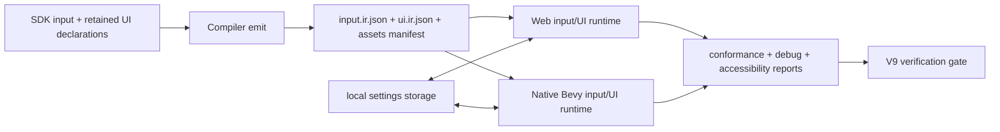
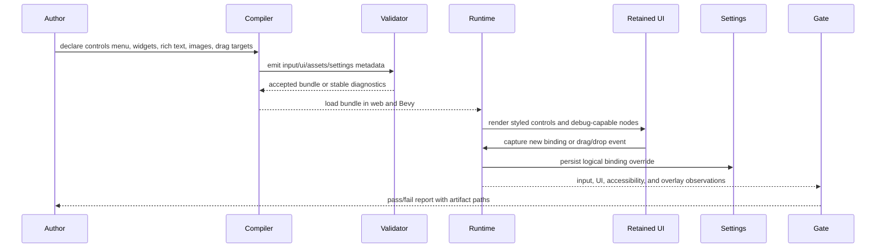

# V9-05 Input, UI, and Accessibility Parity

Complexity: 14 -> HIGH mode

## Context

**Problem:** Input customization, picking, retained UI visuals, rich text,
images, widgets, and accessibility/debug tooling are still split across
partially promoted surfaces, leaving common menu/HUD workflows incomplete across
web Three.js and native Bevy.

**Files Analyzed:**

- `docs/bevy-feature-parity.md`
- `docs/PRDs/v8/README.md`
- `docs/PRDs/v8/V8-14-input-picking-controls-hardening.md`
- `docs/PRDs/v8/V8-15-rich-ui-text-accessibility-residuals.md`
- `docs/STATUS.md`

**Current Behavior:**

- Input maps, basic rebinding helpers, device capability diagnostics, gamepad
  and touch snapshots, pointer rays, mesh picking, and basic UI picking/action
  dispatch exist.
- Interactive rebinding UI, persisted control settings, drag-and-drop picking,
  picking overlays, and repair-oriented device diagnostics are not promoted.
- Retained UI supports layout, scrolling, basic images, basic text, focus,
  roles, labels, disabled state, and web-rendered shadows/gradients/text
  decorations.
- Native UI still lacks promoted shadows/gradients/text decoration rendering;
  font assets, rich inline spans, 9-slice/atlas image handling, standard
  widgets, target-specific accessibility audits, and UI debug overlays remain
  incomplete.

## Checklist Coverage

This PRD promotes the following checklist items:

- `P1` Interactive input rebinding UI and persistence.
- `P1` Native-rendered UI shadows and gradients.
- `P1` Rich text styling: font assets, inline spans, and native-rendered
  weight/decoration.
- `P1` UI texture atlases, 9-slice scaling, flipping, and tiling.
- `P2` Drag-and-drop picking events.
- `P2` Picking debug overlay.
- `P2` Richer device diagnostics overlays and repair hints.
- `P2` Standard widgets: sliders, scrollbars, and context menus.
- `P2` UI debug overlay/gizmos.

Deferred from this PRD:

- Virtual keyboard: defer until mobile packaging/input lifecycle is promoted.
- Broad UI transforms and render-to-texture/3D-world UI: defer except for
  diagnostics proving unsupported requests fail with stable codes, because this
  crosses camera targets, layout, picking, and accessibility semantics.
- Runtime disabled-to-enabled UI updates, focus narration, spatial navigation
  heuristics, and arbitrary grid placement: defer to a later UI interaction PRD.

## Integration Points

**How will this feature be reached?**

- [x] Entry point identified: SDK input/UI declarations, retained settings UI,
  local settings persistence, pointer/picking services, bundle-local assets,
  web preview, native Bevy runtime, conformance fixtures, and V9 verification
  scripts.
- [x] Caller file identified: SDK input/UI APIs, compiler emit paths,
  IR validators and capability derivation, web input/UI renderers, Bevy
  input/UI renderers, AccessKit/ARIA mapping, conformance reporters, and CLI
  verification gates.
- [x] Registration/wiring needed: settings schema registration, retained UI
  widget/action registration, drag event dispatch, font/image asset manifest
  entries, debug overlay capability tags, accessibility report emitters, docs,
  fixtures, and gates.

**Is this user-facing?**

- [x] YES -> retained controls/settings screens, HUD/menu widgets, visual UI
  styling, text rendering, drag interactions, debug overlays, and repair hints
  are required. These features must be reachable from TypeScript authoring and
  visible in web and native runtimes.

**Full user flow:**

1. User does: authors a settings menu with a rebind row, slider, scrollable
   list, styled rich text, 9-slice panel, and draggable inventory item.
2. Triggers: `tn build` emits validated `input.ir.json`, `ui.ir.json`,
   settings/local-data metadata, font/image asset references, and capability
   tags.
3. Reaches new feature via: runtime bundle load wires retained UI controls to
   input rebinding, local settings persistence, UI/picking dispatch, debug
   overlays, and accessibility reporters.
4. Result displayed in: web DOM overlay, native Bevy UI, debug overlay panels,
   conformance reports, local settings files/storage, and generated V9 evidence
   artifacts.

## Solution

**Approach:**

- Promote a portable controls settings contract that reuses existing input maps
  and rebinding helpers, adds retained UI capture states, and persists resolved
  bindings through the local settings/key-value layer.
- Add deterministic drag-picking phases shared by 3D mesh targets and retained
  UI nodes, plus a debug overlay that visualizes pointer rays, bounds, current
  capture, hovered target, and device state.
- Extend retained UI with bundle-local font assets, rich inline text spans,
  native-rendered text weight/decoration, native shadows/gradients, and
  validated image atlas/9-slice/flip/tile metadata.
- Promote a narrow standard widget set of slider, scrollbar, and context menu
  backed by existing focus/action/input queues, with target-specific
  accessibility diagnostics and debug gizmos.
- Keep optional React/CSS overlays separate; this PRD improves retained
  portable UI and must not require webview support.



**Key Decisions:**

- [ ] Retained UI remains the portable game UI contract; optional webview
  overlays are not used to satisfy this PRD.
- [ ] Rebinding persistence stores logical action/axis overrides, not raw
  backend event objects.
- [ ] Drag-picking events use deterministic phases:
  `dragStart`, `dragMove`, `dragEnter`, `dragLeave`, `drop`, `dragCancel`, and
  `dragEnd`.
- [ ] Debug overlays are runtime/debug capabilities and must be disabled by
  default in release profiles unless explicitly requested.
- [ ] Font and image assets must be bundle-relative and validated through the
  existing asset manifest path rules.
- [ ] Accessibility diagnostics are stable build/runtime reports with repair
  hints; they are not a promise of identical screen-reader output across
  platforms.

**Data Changes:** Add local control-settings records, retained UI rebind state
metadata, drag-picking event payloads, debug overlay observations, font asset
refs, rich text spans, native text style fields, image atlas/9-slice/flip/tile
fields, widget declarations, widget/accessibility diagnostics, and manifest
capability tags. No database changes.

## Sequence Flow



## Execution Phases

#### Phase 1: Controls Settings UI - Players can rebind controls and keep them after restart

**Files (max 5):**

- `packages/sdk/src/input/*` - public controls settings and rebind UI
  declaration helpers.
- `packages/ir/src/input.ts` - persisted binding override schema,
  diagnostics, and capability metadata.
- `packages/compiler/src/emit/input.ts` - emit controls settings metadata and
  default binding records.
- `packages/runtime-web-three/src/input/*` - web rebind capture, apply, and
  local settings persistence.
- `runtime-bevy/crates/threenative_runtime/src/input.rs` - native rebind
  capture, apply, and local settings persistence.

**Implementation:**

- [ ] Add a `controlsSettings` declaration that references existing input
  actions/axes and optional retained UI node IDs for each rebind row.
- [ ] Store overrides as `{ profileId, actionOrAxisId, device, control,
  modifiers, scale?, deadzone?, updatedAt }` with deterministic sorting.
- [ ] Add a retained UI capture state: idle, waiting for input, conflict
  confirmation, applied, rejected, and reset-to-default.
- [ ] Reuse existing duplicate-binding, missing-target, unknown-control, and
  required-gamepad diagnostics; add repair hints for each.
- [ ] Persist overrides through the portable local settings/key-value contract;
  web uses browser/local project storage and Bevy uses the native local data
  path already selected by the runtime.
- [ ] Apply persisted overrides before the first gameplay input snapshot and
  expose the resolved binding table to conformance.

**Tests Required:**

| Test File | Test Name | Assertion |
| --- | --- | --- |
| `packages/ir/src/input.test.ts` | `should validate persisted binding override records when controls are declared` | Valid overrides produce no diagnostics and sort deterministically. |
| `packages/ir/src/input.test.ts` | `should reject persisted binding override when action is missing` | Validator reports a stable missing-action diagnostic with a suggested fix. |
| `packages/compiler/src/emit/input.test.ts` | `should emit controls settings metadata for retained ui rebind rows` | Emitted bundle links action IDs to UI node IDs and default bindings. |
| `packages/runtime-web-three/src/input/rebinding.test.ts` | `should apply persisted keyboard override before first snapshot` | Web input snapshot uses the persisted binding instead of the default. |
| `runtime-bevy/crates/threenative_runtime/tests/input_rebinding.rs` | `should persist and reload native control binding overrides` | Native runtime reloads the same logical override after restart. |

**Verification Plan:**

1. **Unit Tests:**
   - `pnpm --filter @threenative/ir test -- --run input`
   - `pnpm --filter @threenative/compiler test -- --run input`
2. **Integration Tests:**
   - `pnpm --filter @threenative/runtime-web-three test -- --run rebinding`
   - `cd runtime-bevy && cargo test input_rebinding`
3. **E2E Proof:**
   - Add a V9 fixture where the player opens a settings panel, changes `jump`
     from `Space` to `KeyJ`, reloads, and the first snapshot reports `KeyJ`.
4. **Evidence Required:**
   - Web and Bevy reports include default bindings, override source, conflict
     diagnostics, and persisted resolved bindings.

**User Verification:**

- Action: Open the V9 controls settings example, rebind `jump`, restart the
  preview, and press the new key.
- Expected: The new key triggers the action, the old key no longer does, and
  conflicts show actionable repair text.

**Checkpoint:** Automated `prd-work-reviewer` review after Phase 1. Manual
checkpoint is also required because the settings UI capture flow is visual and
interactive.

#### Phase 2: Drag Picking and Input Debug Overlay - Authors can inspect and verify pointer interactions

**Files (max 5):**

- `packages/ir/src/picking.ts` - drag-picking event schema and debug overlay
  metadata.
- `packages/runtime-web-three/src/picking/*` - web drag event ordering and
  debug overlay rendering.
- `runtime-bevy/crates/threenative_runtime/src/picking.rs` - native drag event
  ordering and overlay observations.
- `packages/ir/fixtures/conformance/v9-input-ui-accessibility/*` - shared
  drag-picking fixture.
- `scripts/verify-v9-input-ui-accessibility.mjs` - focused gate for input/UI
  parity artifacts.

**Implementation:**

- [ ] Add drag target metadata for mesh picking targets and retained UI nodes:
  `draggable`, `dropZone`, accepted payload kinds, axis constraints, and
  cancellation policy.
- [ ] Emit deterministic drag phases with stable payload fields:
  `pointerId`, `sourceTargetId`, `currentTargetId`, `cameraId`, `screen`,
  `worldRay`, `worldHit`, `delta`, `modifiers`, and `payload`.
- [ ] Define ordering rules when UI and mesh targets overlap: retained UI with
  higher `zIndex` wins unless the node declares `pointerEvents: "pass-through"`.
- [ ] Implement cancel behavior for lost pointer capture, Escape, missing
  device, disabled target, or target removal.
- [ ] Add a picking debug overlay that can render pointer rays, hit points,
  generated mesh bounds, UI node bounds, current capture owner, hovered target,
  drag path, and event log.
- [ ] Add richer device diagnostics overlay panels for connected devices,
  unavailable required controls, deadzone/axis observations, and repair hints.

**Tests Required:**

| Test File | Test Name | Assertion |
| --- | --- | --- |
| `packages/ir/src/picking.test.ts` | `should validate drag picking targets when payload kinds are declared` | Valid mesh and UI drag targets pass validation. |
| `packages/ir/src/picking.test.ts` | `should reject drop zone with unsupported payload kind` | Validator reports stable `TN_PICKING_*` diagnostic. |
| `packages/runtime-web-three/src/picking/drag.test.ts` | `should emit drag phases in deterministic order when ui overlaps mesh` | Event log matches UI-first ordering. |
| `runtime-bevy/crates/threenative_runtime/tests/picking_drag.rs` | `should cancel drag when pointer capture is lost` | Native event log contains `dragCancel` then `dragEnd`. |
| `scripts/verify-v9-input-ui-accessibility.test.mjs` | `should require picking overlay evidence` | Gate fails when overlay artifacts are missing. |

**Verification Plan:**

1. **Unit Tests:**
   - `pnpm --filter @threenative/ir test -- --run picking`
2. **Integration Tests:**
   - `pnpm --filter @threenative/runtime-web-three test -- --run drag`
   - `cd runtime-bevy && cargo test picking_drag`
3. **Playwright Verification:**
   - Drag a retained UI inventory item onto a 3D mesh drop zone and assert the
     shared event log includes `dragStart`, at least one `dragMove`, `drop`,
     and `dragEnd`.
4. **Evidence Required:**
   - `tools/verify/artifacts/input-ui-accessibility/picking-debug/` contains web/native
     overlay screenshots or structured overlay reports plus matching drag logs.

**User Verification:**

- Action: Enable the picking debug overlay, drag a UI item over a mesh, drop it,
  then repeat with Escape cancellation.
- Expected: Overlay shows the ray, target bounds, capture owner, and event log;
  web and native event order match.

**Checkpoint:** Automated `prd-work-reviewer` review after Phase 2. Manual
checkpoint is required because overlay visuals, hit bounds, and pointer capture
need runtime inspection.

#### Phase 3: Rich Text, Fonts, and Native UI Visuals - Retained UI renders promoted text and style consistently

**Files (max 5):**

- `packages/ir/src/ui.ts` - font asset refs, rich spans, shadows, gradients,
  and text style validation.
- `packages/compiler/src/emit/ui.ts` - emit rich text/font/style metadata and
  required capabilities.
- `packages/runtime-web-three/src/ui/*` - web DOM rich text/font/style mapping
  and observations.
- `runtime-bevy/crates/threenative_runtime/src/ui.rs` - Bevy font loading,
  rich text sections, native decoration/shadow/gradient mapping or diagnostics.
- `examples/v9-input-ui-accessibility/*` - visual fixture with styled text and
  menu panels.

**Implementation:**

- [ ] Add bundle-local font declarations with family ID, asset path, weight,
  style, fallback family, and supported glyph ranges.
- [ ] Add rich inline spans for text nodes: `text`, `style`, `color`,
  `fontFamily`, `fontSize`, `weight`, `italic`, `decoration`, and
  accessibility text override.
- [ ] Validate span nesting limits, missing fonts, unsupported weights,
  unsupported decorations, invalid glyph range metadata, and inaccessible
  icon-only spans.
- [ ] Map web spans to DOM nodes and loaded CSS font faces while preserving the
  existing retained UI boundary.
- [ ] Map Bevy spans to native text sections and font handles; render or
  explicitly diagnose unsupported decoration cases.
- [ ] Promote native-rendered UI shadows and linear gradients for panel/button
  backgrounds where Bevy can represent them; otherwise emit stable
  target-specific diagnostics and screenshot/report evidence.

**Tests Required:**

| Test File | Test Name | Assertion |
| --- | --- | --- |
| `packages/ir/src/ui.test.ts` | `should validate rich text spans with bundle local font assets` | Valid spans and font refs produce no diagnostics. |
| `packages/ir/src/ui.test.ts` | `should reject rich text span when font asset is missing` | Validator reports missing font path and suggested fix. |
| `packages/compiler/src/emit/ui.test.ts` | `should emit required font and native style capabilities` | Manifest includes deterministic UI capability tags. |
| `packages/runtime-web-three/src/ui/richText.test.ts` | `should render inline spans with declared font family and decoration` | DOM output contains expected style fields and accessibility text. |
| `runtime-bevy/crates/threenative_runtime/tests/ui_rich_text.rs` | `should map rich text sections to bevy text bundles` | Native UI tree contains matching text sections and font handles. |

**Verification Plan:**

1. **Unit Tests:**
   - `pnpm --filter @threenative/ir test -- --run ui`
   - `pnpm --filter @threenative/compiler test -- --run ui`
2. **Runtime Tests:**
   - `pnpm --filter @threenative/runtime-web-three test -- --run richText`
   - `cd runtime-bevy && cargo test ui_rich_text`
3. **Visual Proof:**
   - Capture web/native screenshots for the V9 fixture and compare text box
     presence, font asset load status, span counts, shadow/gradient regions,
     and diagnostics for intentionally unsupported native style cases.
4. **Evidence Required:**
   - `tools/verify/artifacts/input-ui-accessibility/rich-text-style/verification-report.json`
     includes font loads, rich span observations, and visual probe results.

**User Verification:**

- Action: Run the V9 styled menu example in web and native.
- Expected: Rich text, declared fonts, underlines/strikethroughs, shadows, and
  gradients render where promoted; unsupported native gaps are visible as
  stable diagnostics, not silent drops.

**Checkpoint:** Automated `prd-work-reviewer` review after Phase 3. Manual
checkpoint is required because this phase depends on visual UI parity.

#### Phase 4: UI Image Scaling and Standard Widgets - HUD assets and common controls behave portably

**Files (max 5):**

- `packages/sdk/src/ui/*` - atlas, 9-slice, flip/tile, slider, scrollbar, and
  context menu authoring helpers.
- `packages/ir/src/ui.ts` - image metadata and widget schema validation.
- `packages/compiler/src/emit/ui.ts` - emit widget/image metadata and
  capabilities.
- `packages/runtime-web-three/src/ui/*` - web image and widget rendering,
  actions, and focus behavior.
- `runtime-bevy/crates/threenative_runtime/src/ui.rs` - native image and widget
  rendering, actions, and focus behavior.

**Implementation:**

- [ ] Add image metadata for atlas rects, 9-slice border insets, scaling mode,
  horizontal/vertical flip, repeat/tile size, tint, and source pixel size.
- [ ] Validate bundle-relative image refs, finite positive dimensions, atlas
  rect bounds, non-overlapping 9-slice constraints, and incompatible
  flip/tile/9-slice combinations.
- [ ] Add `Slider`, `Scrollbar`, and `ContextMenu` retained widgets with
  focusable semantics, disabled state, keyboard/gamepad/touch/pointer actions,
  value change events, and accessible names.
- [ ] Wire sliders to input actions and resource bindings without bypassing
  the existing UI action queue.
- [ ] Implement context menu open/close placement, focus trap, Escape close,
  outside-click close, disabled items, and action dispatch.
- [ ] Emit explicit diagnostics for virtual keyboard requests and platform
  widgets outside this promoted set.

**Tests Required:**

| Test File | Test Name | Assertion |
| --- | --- | --- |
| `packages/ir/src/ui.test.ts` | `should validate nine slice image metadata when insets fit source size` | Valid 9-slice image passes validation. |
| `packages/ir/src/ui.test.ts` | `should reject atlas rect outside image bounds` | Validator reports stable image diagnostic. |
| `packages/runtime-web-three/src/ui/widgets.test.ts` | `should dispatch slider value change through ui action queue` | Web widget emits deterministic value event and resource update. |
| `runtime-bevy/crates/threenative_runtime/tests/ui_widgets.rs` | `should activate context menu item with keyboard focus` | Native action log matches web action payload. |
| `packages/sdk/src/ui/widgets.test.ts` | `should reject virtual keyboard as unsupported in v9 widget set` | SDK/validation returns stable unsupported diagnostic. |

**Verification Plan:**

1. **Unit Tests:**
   - `pnpm --filter @threenative/sdk test -- --run ui`
   - `pnpm --filter @threenative/ir test -- --run ui`
2. **Runtime Tests:**
   - `pnpm --filter @threenative/runtime-web-three test -- --run widgets`
   - `cd runtime-bevy && cargo test ui_widgets`
3. **Playwright Verification:**
   - Move a slider with pointer and keyboard, open a context menu, activate an
     item, and assert the action/resource trace.
4. **Evidence Required:**
   - Web/native reports include image atlas/9-slice observations, widget action
     traces, focus order, disabled-item suppression, and accessibility names.

**User Verification:**

- Action: Use the V9 HUD fixture to resize a 9-slice panel, scroll a list, move
  a volume slider, and choose a context menu item.
- Expected: Assets scale without distortion, widgets emit portable events, and
  keyboard/pointer behavior matches across web and native.

**Checkpoint:** Automated `prd-work-reviewer` review after Phase 4. Manual
checkpoint is required for visual image scaling and widget interaction.

#### Phase 5: Accessibility and UI Debug Gate - Authors get actionable reports before release

**Files (max 5):**

- `packages/ir/src/uiAccessibility.ts` - target-specific accessibility audit
  rules and repair-hint diagnostics.
- `packages/runtime-web-three/src/ui/debugOverlay.ts` - web UI debug overlay and
  accessibility report observations.
- `runtime-bevy/crates/threenative_runtime/src/ui_debug.rs` - native UI debug
  overlay/gizmo observations and AccessKit report data.
- `scripts/verify-v9-input-ui-accessibility.mjs` - aggregate gate for this PRD.
- `docs/bevy-feature-parity.md` - mark checklist items only after evidence
  exists during implementation.

**Implementation:**

- [ ] Add a retained UI debug overlay that can show node ID, role, accessible
  name, focus index, tab/arrow navigation links, bounds, clipping, z-index,
  disabled state, action binding, image source, font asset, and widget state.
- [ ] Add UI gizmos for bounds, padding, focus ring, scroll viewport, drop zone,
  9-slice insets, and context menu anchor.
- [ ] Add target-specific accessibility reports for ARIA and AccessKit mapping:
  missing names, conflicting labels, progressbar ranges, list/listitem
  structure, disabled-but-focusable nodes, context menu item roles, slider
  value text, icon-only spans, and hidden decorative images.
- [ ] Emit repair hints with exact bundle paths such as
  `ui.nodes[id].accessibilityLabel` or `ui.nodes[id].children[n].spans[m]`.
- [ ] Add explicit unsupported diagnostics for broad UI transforms,
  render-to-texture UI, and 3D-world UI requests so those gaps are visible.
- [ ] Update parity/status docs only when implementation evidence exists; this
  PRD file alone does not mark items complete.

**Tests Required:**

| Test File | Test Name | Assertion |
| --- | --- | --- |
| `packages/ir/src/uiAccessibility.test.ts` | `should report slider without accessible name when focusable` | Diagnostic includes stable code, path, and repair hint. |
| `packages/ir/src/uiAccessibility.test.ts` | `should allow decorative image without accessible name when presentation role is set` | No missing-name diagnostic is emitted. |
| `packages/runtime-web-three/src/ui/debugOverlay.test.ts` | `should report ui debug overlay nodes with bounds and focus metadata` | Web overlay report includes node bounds, role, and focus index. |
| `runtime-bevy/crates/threenative_runtime/tests/ui_debug.rs` | `should report native accesskit state for disabled and slider nodes` | Native report matches expected AccessKit state fields. |
| `scripts/verify-v9-input-ui-accessibility.test.mjs` | `should fail when accessibility report omits repair hints` | Gate rejects incomplete diagnostics evidence. |

**Verification Plan:**

1. **Unit Tests:**
   - `pnpm --filter @threenative/ir test -- --run uiAccessibility`
2. **Runtime Tests:**
   - `pnpm --filter @threenative/runtime-web-three test -- --run debugOverlay`
   - `cd runtime-bevy && cargo test ui_debug`
3. **Gate Proof:**
   - `pnpm verify:v9:input-ui-accessibility`
   - `pnpm verify:conformance`
4. **Manual Verification:**
   - Capture overlay screenshots/reports with focus movement, drag/drop,
     widget state, bounds, accessibility names, and repair hints visible.
5. **Evidence Required:**
   - `tools/verify/artifacts/input-ui-accessibility/verification-report.json` lists all
     promoted checklist items, deferrals, diagnostics, and artifact paths.

**User Verification:**

- Action: Enable UI debug mode and run the V9 fixture with one intentionally
  broken label, one unsupported 3D-world UI request, and one valid slider.
- Expected: The overlay shows node/focus/widget metadata, valid UI remains
  interactive, and broken/unsupported cases produce actionable diagnostics.

**Checkpoint:** Automated `prd-work-reviewer` review after Phase 5. Manual
checkpoint is required because debug overlays and accessibility reports need
runtime inspection.

## Checkpoint Protocol

After each phase:

- Run the phase-specific tests listed in that phase.
- Run the narrowest relevant package commands before broader gates.
- Spawn the `prd-work-reviewer` checkpoint review:
  `Review checkpoint for phase N of PRD at docs/PRDs/v9/V9-05-input-ui-accessibility-parity.md`.
- Continue only when the checkpoint reports PASS or all corrections are made
  and the checkpoint is rerun.

Manual checkpoint is required for every phase in this PRD because each phase
has user-facing UI, visual, persistence, or runtime input behavior that cannot
be fully proven by static tests alone.

## Verification Strategy

Primary commands:

```bash
pnpm --filter @threenative/sdk test -- --run ui
pnpm --filter @threenative/ir test -- --run "input|picking|ui"
pnpm --filter @threenative/compiler test -- --run "input|ui"
pnpm --filter @threenative/runtime-web-three test -- --run "rebinding|drag|richText|widgets|debugOverlay"
cd runtime-bevy && cargo test input_rebinding picking_drag ui_rich_text ui_widgets ui_debug
pnpm verify:conformance
pnpm verify:v9:input-ui-accessibility
```

Verification evidence required:

- `tools/verify/artifacts/input-ui-accessibility/verification-report.json` summarizing
  web/native parity, promoted checklist items, deferrals, diagnostics, and
  command results.
- Web/native drag-picking logs with matching phase order.
- Web/native controls settings reports showing default bindings, persisted
  overrides, conflict diagnostics, and resolved binding tables.
- Web/native UI visual reports for rich text, declared fonts, shadows,
  gradients, atlas images, 9-slice images, widgets, and disabled states.
- Accessibility reports for ARIA and AccessKit mapping with stable codes,
  bundle paths, and repair hints.
- Debug overlay screenshots or structured observations for picking, devices,
  UI node bounds, focus, widgets, 9-slice insets, and drop zones.

## Verification Evidence

To be filled during implementation:

- Phase 1: controls settings UI tests, persistence reports, and checkpoint
  result.
- Phase 2: drag-picking/debug overlay tests, visual artifacts, and checkpoint
  result.
- Phase 3: rich text/native visual style tests, screenshot reports, and
  checkpoint result.
- Phase 4: image/widget tests, interaction traces, and checkpoint result.
- Phase 5: accessibility/debug gate reports, aggregate V9 command output, and
  checkpoint result.

## Acceptance Criteria

- [ ] All phases complete.
- [ ] All specified tests pass.
- [ ] `pnpm verify:conformance` passes.
- [ ] `pnpm verify:v9:input-ui-accessibility` passes.
- [ ] All automated checkpoint reviews pass; all manual checkpoints pass where
  required.
- [ ] Interactive rebinding UI exists, persists logical overrides, applies them
  before first input snapshot, and reports conflicts with repair hints.
- [ ] Drag-and-drop picking emits deterministic phases for retained UI and mesh
  targets across web and Bevy.
- [ ] Picking/device debug overlays expose rays, bounds, capture state, device
  capabilities, and repair hints.
- [ ] Native retained UI renders or explicitly diagnoses promoted shadows,
  gradients, text weight, and text decoration.
- [ ] Bundle-local font assets and rich inline spans validate, emit, render,
  and appear in conformance observations.
- [ ] UI images support atlas rects, 9-slice scaling, flipping, and tiling with
  validation and web/native observations.
- [ ] Slider, scrollbar, and context menu widgets are reachable through
  retained UI, dispatch portable actions, participate in focus navigation, and
  expose accessible names/states.
- [ ] UI debug overlay/gizmos expose node, layout, focus, widget, image, text,
  and accessibility metadata.
- [ ] Unsupported virtual keyboard, broad UI transforms, render-to-texture UI,
  and 3D-world UI requests fail with stable diagnostics rather than silent
  drops.
- [ ] Feature is reachable from SDK authoring and runtime entry points; no
  orphaned code paths satisfy acceptance.
- [ ] `docs/STATUS.md` and `docs/bevy-feature-parity.md` are updated during
  implementation only when evidence exists.

## Non-Goals

- Replacing retained `ui.ir.json` with optional React/CSS/webview overlays.
- Mobile virtual keyboard behavior before mobile packaging and lifecycle
  semantics are promoted.
- Full screen-reader narration parity or identical platform accessibility
  output.
- Arbitrary CSS, browser DOM APIs, raw Three.js UI, or direct Bevy UI authoring
  as a portable contract.
- Full UI transforms, render-to-texture UI, curved/spatial UI panels, or
  3D-world UI interactions beyond explicit unsupported diagnostics.
- Runtime scene-editor panels or general editor inspector UX beyond debug
  overlays/gizmos needed to prove this PRD.
