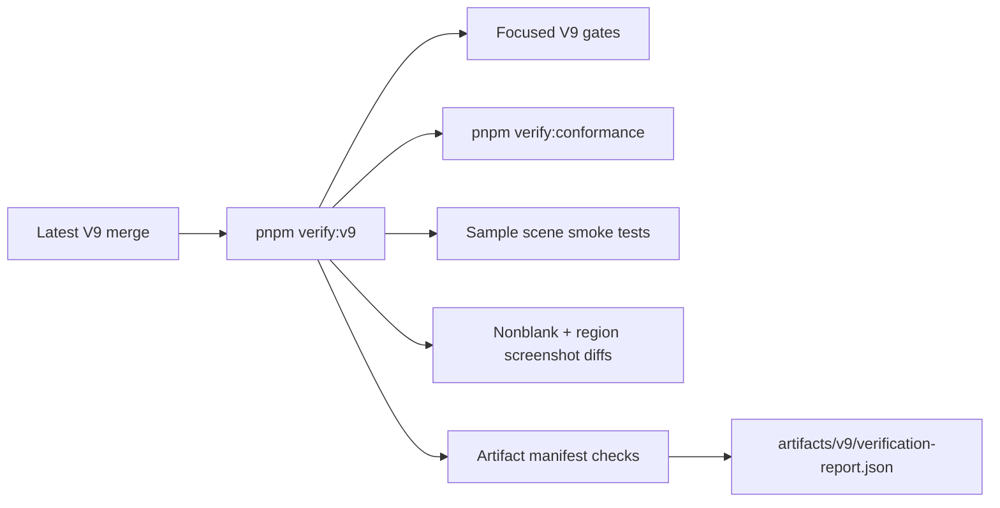
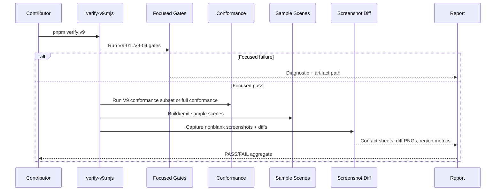

# V9-07 Engine Quality Control Hardening

Complexity: 10 -> HIGH mode

Score basis: +3 touches 10+ implementation/test/docs files, +2 adds a shared
quality-control gate, +2 spans compiler/IR/CLI/web/Bevy/examples/scripts/docs,
+2 coordinates visual, trace, fixture, and artifact verification, +1 affects
release-gate behavior.

## Context

**Problem:** Recent V9 PR merges added strong focused gates, but engine quality
is still protected by scattered scripts, partial aggregate coverage, and uneven
visual/sample-scene proof.

**Files Analyzed:**

- `package.json`
- `scripts/verify-conformance.mjs`
- `scripts/verify-v9-animation-particles.mjs`
- `scripts/verify-physics-character.mjs`
- `scripts/verify-v9-assets-gltf-scene-workflow.mjs`
- `scripts/verify-rendering-lights.mjs`
- `packages/cli/src/verify/renderingQuality.ts`
- `packages/ir/fixtures/conformance/README.md`
- `packages/ir/fixtures/conformance/animation-state/game.bundle/`
- `packages/ir/fixtures/conformance/animation-blending/game.bundle/`
- `packages/ir/fixtures/conformance/physics-character/game.bundle/`
- `packages/ir/fixtures/conformance/physics-character-solver/game.bundle/`
- `packages/ir/fixtures/conformance/rendering-lights/game.bundle/`
- `packages/ir/fixtures/conformance/animation-blending/game.bundle/`
- Three.js `examples/models/gltf/Soldier.glb`
  (`https://github.com/mrdoob/three.js/blob/dev/examples/models/gltf/Soldier.glb`)
- `docs/PRDs/v9/README.md`
- `docs/PRDs/v9/V9-01-animation-particles-runtime-parity.md`
- `docs/PRDs/v9/V9-02-physics-character-runtime-parity.md`
- `docs/PRDs/v9/V9-03-assets-gltf-scene-workflow.md`
- `docs/PRDs/v9/V9-04-rendering-lights-post-processing-parity.md`
- `docs/STATUS.md`
- `docs/bevy-feature-parity.md`
- `docs/visual-parity-policy.md`

**Current Behavior:**

- `pnpm verify:v9:*` scripts exist for V9-01 through V9-04 focused areas, but
  there is no root `pnpm verify:v9` aggregate gate.
- `pnpm verify:conformance` includes V9 animation state/blending traces but does
  not yet include V9 physics-character, assets/glTF workflow, or rendering-light
  evidence.
- Visual gates already support nonblank checks, region sampling, contact sheets,
  and diff PNGs, but only V9 rendering/lights currently uses the V9 visual
  region gate.
- V9 sample coverage is fixture-driven through animation, physics/character,
  glTF workflow, and rendering/lights bundles.
- Verification artifacts are useful but not normalized across latest PR areas;
  some gates write `ok`, others `status`, and required artifact checks are not
  consistently enforced.

## Integration Points

**How will this feature be reached?**

- [x] Entry point identified: `pnpm verify:v9`, `pnpm verify:conformance`,
  focused `pnpm verify:v9:*` scripts, sample-scene packages, screenshot diff
  helpers, and release docs.
- [x] Caller file identified: root `package.json`, `scripts/verify-v9.mjs`,
  `scripts/verify-conformance.mjs`, `packages/cli/src/verify/renderingQuality.ts`,
  V9 fixture directories, and V9 example packages.
- [x] Registration/wiring needed: package script registration, aggregate report
  artifact path, conformance command list additions, fixture catalog updates,
  sample-scene smoke commands, screenshot artifact assertions, and docs/status
  guard updates.

**Is this user-facing?**

- [x] YES -> user-facing through contributor commands, generated evidence,
  sample scenes, screenshots, diff reports, and release-gate status.
- [ ] NO -> Internal/background feature.

**Full user flow:**

1. Contributor merges or prepares V9 engine changes.
2. Contributor runs `pnpm verify:v9` locally or in CI.
3. The aggregate gate builds required packages, runs focused V9 checks, validates
   conformance fixtures, runs sample-scene smoke tests, captures visual diffs,
   and asserts required artifacts.
4. The contributor opens `artifacts/v9/verification-report.json` to see the first
   failing phase, command, diagnostic, and artifact path.
5. Release reviewers inspect contact sheets/diffs for visual areas and rely on
   trace JSON for nonvisual runtime parity.

## Solution

**Approach:**

- Create a single V9 quality-control gate that orchestrates latest V9 focused
  verifiers and fails if any required artifact, status code, screenshot, or
  trace comparison is missing.
- Normalize V9 verification report shape around `status`, `ok`, `diagnostics`,
  `commands`, `artifacts`, `promoted`, and `deferred` fields without rewriting
  older gates.
- Add sample scenes that exercise merged PR surfaces as actual user-authored
  content, not only hand-authored IR fixtures.
- Expand screenshot diff coverage beyond rendering/lights to include a compact
  multi-scene visual smoke harness with nonblank, framing, and region checks.
- Add PR-merge drift checks that compare V9 PRD claims, package scripts,
  conformance fixtures, artifacts, and docs so a merged feature cannot remain
  outside the aggregate gate.



**Key Decisions:**

- [x] Library/framework choices: reuse existing Node verification scripts,
  Playwright capture helpers, PNG analysis utilities, Three.js web preview, and
  Bevy binaries; do not introduce a new test runner.
- [x] Error-handling strategy: each gate failure must produce a stable
  diagnostic code, command name, exit code, and artifact path.
- [x] Reused utilities: `summarize` from `verify-v1.mjs`,
  `compareConformanceReports` from `verify-conformance.mjs`, V9 focused scripts,
  `verifyV9RenderingLightsVisual`, `analyzeNonblank`, `compareFrames`, and
  existing fixture/report write helpers.

**Data Changes:** None to runtime IR schemas unless a sample scene reveals a
missing diagnostic. This PRD primarily adds verification scripts, fixtures,
examples, docs, and evidence manifests.

## Sequence Flow



## Execution Phases

#### Phase 1: Aggregate V9 Gate - Contributors can run one command that proves the latest V9 merge set is healthy.

**Files (max 5):**

- `package.json` - add `verify:v9` script and keep focused script names stable.
- `scripts/verify-v9.mjs` - orchestrate focused V9 commands and write aggregate
  report.
- `scripts/verify-v9.test.mjs` - unit-test pass/fail aggregation with mocked
  command runners.
- `docs/PRDs/v9/README.md` - replace future aggregate wording with the concrete
  gate contract.
- `docs/STATUS.md` - document the new quality-control front door.

**Implementation:**

- [ ] Run focused gates for animation state, animation blending, animation
  particles, physics-character, assets/glTF scene workflow, and
  rendering/lights.
- [ ] Build required packages before gates that import `dist` output.
- [ ] Stop on first failing command but still write
  `artifacts/v9/verification-report.json`.
- [ ] Include `generatedBy`, `status`, `ok`, `commands`, `diagnostics`,
  `artifacts`, `promoted`, and `deferred` fields.
- [ ] Add deterministic tests for command success, command failure, and missing
  report file handling.

**Tests Required:**

| Test File | Test Name | Assertion |
| --- | --- | --- |
| `scripts/verify-v9.test.mjs` | `should pass when all V9 commands and reports pass` | Aggregate status is `pass` and all command summaries are present. |
| `scripts/verify-v9.test.mjs` | `should fail with artifact diagnostic when a focused report is missing` | Diagnostic code is `TN_VERIFY_V9_ARTIFACT_MISSING`. |
| `scripts/verify-v9.test.mjs` | `should stop at first failing command and write report` | First failing command is named and exit code is preserved. |

**Verification Plan:**

1. **Unit Tests:** `node --test scripts/verify-v9.test.mjs`.
2. **Integration Test:** `pnpm verify:v9`.
3. **Evidence Required:**
   - [ ] `artifacts/v9/verification-report.json`.
   - [ ] Command summaries with exit codes and durations.
   - [ ] Links to each focused gate report.

**User Verification:**

- Action: run `pnpm verify:v9`.
- Expected: one aggregate PASS/FAIL report with the first actionable failure.

#### Phase 2: Latest PR Conformance Coverage - V9-02 through V9-04 cannot drift outside shared web/native parity checks.

**Files (max 5):**

- `scripts/verify-conformance.mjs` - add V9 physics-character, assets/glTF, and
  rendering/lights steps or a clearly named V9 subset.
- `scripts/verify-conformance.test.mjs` - cover new artifact-path and fixture
  mapping diagnostics.
- `packages/ir/fixtures/conformance/README.md` - document V9 fixture ownership
  and required evidence.
- `packages/ir/fixtures/conformance/v9-fixture-catalog.json` - add a machine
  readable V9 fixture catalog.
- `packages/ir/src/conformance.test.ts` - assert catalog entries reference
  existing bundles and required artifacts.

**Implementation:**

- [ ] Register V9 physics-character trace parity in conformance or a
  conformance-called V9 subset.
- [ ] Register V9 assets/glTF scene workflow artifact comparison.
- [ ] Register V9 rendering/lights validation and report comparison, while
  keeping expensive screenshot capture inside `verify:v9`.
- [ ] Add a fixture catalog with owner PRD, promoted capabilities, rejected
  surfaces, expected report paths, and whether visual evidence is required.
- [ ] Fail when a V9 fixture has no owner PRD or no aggregate-gate registration.

**Tests Required:**

| Test File | Test Name | Assertion |
| --- | --- | --- |
| `scripts/verify-conformance.test.mjs` | `should map V9 physics failures to the V9 physics fixture` | Failure diagnostic includes `physics-character`. |
| `scripts/verify-conformance.test.mjs` | `should expose V9 artifact paths for latest PR gates` | Artifact paths include physics, assets, and rendering reports. |
| `packages/ir/src/conformance.test.ts` | `should require every V9 catalog fixture to have a bundle and owner PRD` | Missing owner or bundle fails. |

**Verification Plan:**

1. **Unit Tests:** `node --test scripts/verify-conformance.test.mjs`.
2. **IR Tests:** `pnpm --filter @threenative/ir test -- --run conformance`.
3. **Integration Test:** `pnpm verify:conformance`.
4. **Evidence Required:**
   - [ ] `packages/ir/artifacts/conformance/verification-report.json`.
   - [ ] V9 fixture catalog checked by tests.

**User Verification:**

- Action: run `pnpm verify:conformance`.
- Expected: V9 latest-merge fixtures are included or fail with named artifact
  diagnostics.

#### Phase 3: Sample Scene Matrix - Latest V9 features are exercised through TypeScript-authored scenes.

**Files (max 5):**

- `examples/physics-character/` - sample project for primitive solver,
  sensors, character push, and navigation.
- `examples/v9-assets-gltf-workflow/` - sample project for bundled/embedded/
  network asset policy, glTF handles, and inspection.
- `examples/rendering-lights/` - sample project for skybox, probes, light
  budget, HLOD fade, color grading, and debug gizmos.
- `packages/ir/fixtures/conformance/animation-blending/game.bundle/` - keep a
  skinned GLB fixture with clips and recorded provenance.
- `scripts/verify-v9-sample-scenes.mjs` - build/emit/validate all V9 sample
  scene bundles.
- `scripts/verify-v9-sample-scenes.test.mjs` - validate sample matrix and
  missing-scene diagnostics.

**Implementation:**

- [ ] Keep all required runtime assets inside each example folder or emitted
  bundle.
- [ ] Vendor or mirror the selected animated GLB into the animation fixture
  bundle after recording source URL, license/provenance, file size, hash, and
  clip names in fixture metadata.
- [ ] Each sample must be authored through SDK/ECS APIs and emitted by the
  compiler; no hand-authored runtime source of truth.
- [ ] Each sample emits a bundle under its own `dist/` directory and validates
  with `validateBundle`.
- [ ] Each sample declares expected promoted and deferred capabilities in a
  local verification manifest.
- [ ] The sample-scene verifier fails if examples are missing package scripts,
  generated bundle files, or required capability evidence.
- [ ] The skeletal-animation sample must prove at least idle/walk/run clip
  discovery, clip selection, animation time advancement, and a deterministic
  pose or bounds delta in web and native evidence.

**Tests Required:**

| Test File | Test Name | Assertion |
| --- | --- | --- |
| `scripts/verify-v9-sample-scenes.test.mjs` | `should require every V9 latest-merge domain to have a sample scene` | Animation, physics, assets, and rendering domains are present. |
| `scripts/verify-v9-sample-scenes.test.mjs` | `should fail when a sample scene bundle is missing required artifacts` | Diagnostic code is `TN_VERIFY_V9_SAMPLE_ARTIFACT_MISSING`. |
| `scripts/verify-v9-sample-scenes.test.mjs` | `should require animated GLB provenance for skeletal animation samples` | Source URL, license note, hash, and clip inventory are present. |

**Verification Plan:**

1. **Unit Tests:** `node --test scripts/verify-v9-sample-scenes.test.mjs`.
2. **Integration Test:** `node scripts/verify-v9-sample-scenes.mjs`.
3. **Aggregate Test:** `pnpm verify:v9`.
4. **Evidence Required:**
   - [ ] Valid emitted bundles for each V9 sample.
   - [ ] Sample-scene report under `tools/verify/artifacts/sample-scenes/`.

**User Verification:**

- Action: run `node scripts/verify-v9-sample-scenes.mjs`.
- Expected: every V9 sample builds from TypeScript, emits a valid bundle, and
  writes artifact evidence.

#### Phase 4: Screenshot Diff Gate - Visual regressions fail through objective screenshots, not manual inspection alone.

**Files (max 5):**

- `packages/cli/src/verify/v9VisualMatrix.ts` - shared V9 visual matrix helper.
- `packages/cli/src/verify/v9VisualMatrix.test.ts` - region/nonblank/diff tests
  with synthetic images.
- `scripts/verify-v9-visual-matrix.mjs` - capture V9 visual sample screenshots.
- `scripts/verify-v9-visual-matrix.test.mjs` - assert artifact and report
  behavior.
- `docs/visual-parity-policy.md` - document V9 visual-gate expectations.

**Implementation:**

- [ ] Reuse Playwright web capture and Bevy native capture helpers already used
  by rendering-quality gates.
- [ ] Define a compact matrix: skeletal animation pose, bounded particles,
  physics-character debug overlay, glTF handle material/visibility change, and
  rendering/lights skybox/probe/shadow/gizmo view.
- [ ] For skeletal animation, capture at least two timestamps from the animated
  GLB fixture and fail when the skinned character is blank, static, or outside
  the expected frame bounds.
- [ ] For every scene, assert web and Bevy screenshots are nonblank and framed.
- [ ] For visual parity scenes, sample named regions with thresholds and write
  `web.png`, `bevy.png`, `diff.png`, `contact-sheet.png`, and JSON metrics.
- [ ] For scenes where pixel parity is intentionally not asserted, require
  nonblank plus authored object/region presence evidence and mark the report as
  smoke-only.

**Tests Required:**

| Test File | Test Name | Assertion |
| --- | --- | --- |
| `packages/cli/src/verify/v9VisualMatrix.test.ts` | `should fail blank screenshots before region comparison` | Diagnostic code is `TN_V9_VISUAL_BLANK`. |
| `packages/cli/src/verify/v9VisualMatrix.test.ts` | `should fail when a required visual region is missing` | Diagnostic code is `TN_V9_VISUAL_REGION_MISSING`. |
| `scripts/verify-v9-visual-matrix.test.mjs` | `should require web bevy diff contact sheet and JSON report artifacts` | Missing artifact fails with path-specific diagnostic. |

**Verification Plan:**

1. **Unit Tests:** `pnpm --filter @threenative/cli test -- --run v9VisualMatrix`.
2. **Script Tests:** `node --test scripts/verify-v9-visual-matrix.test.mjs`.
3. **Integration Test:** `node scripts/verify-v9-visual-matrix.mjs`.
4. **Manual Verification:** inspect contact sheets only when the JSON report
   fails or thresholds are intentionally adjusted.
5. **Evidence Required:**
   - [ ] Per-scene screenshots and diffs.
   - [ ] Region metrics and nonblank checks.
   - [ ] Aggregate visual matrix report.

**User Verification:**

- Action: open `tools/verify/artifacts/visual-matrix/contact-sheet.png` after running the
  visual matrix.
- Expected: every latest-merge sample is visible, nonblank, framed, and either
  region-gated or explicitly smoke-only.

#### Phase 5: Merge Drift Guard - New PRD claims must be wired into tests, examples, and docs before merge.

**Files (max 5):**

- `scripts/check-v9-quality-gates.mjs` - static guard for PRD/script/fixture/
  artifact wiring.
- `scripts/check-v9-quality-gates.test.mjs` - tests for missing script, fixture,
  docs, and artifact claims.
- `package.json` - add `check:quality:v9` and include it in `verify:v9`.
- `docs/bevy-feature-parity.md` - identify V9 quality gate as the drift tracker
  for promoted latest-merge claims.
- `docs/STATUS.md` - describe merge drift guard expectations.

**Implementation:**

- [ ] Parse `docs/PRDs/v9/*.md` for `pnpm verify:v9:*`, fixture, example, and
  artifact claims.
- [ ] Assert every implemented V9 focused gate is included in `verify:v9`.
- [ ] Assert every V9 conformance fixture has an owner PRD and catalog entry.
- [ ] Assert every sample scene named by a PRD has a package script and emitted
  bundle path check.
- [ ] Assert docs/status/parity mention aggregate quality state for any newly
  completed V9 release-gate work.

**Tests Required:**

| Test File | Test Name | Assertion |
| --- | --- | --- |
| `scripts/check-v9-quality-gates.test.mjs` | `should fail when a V9 PRD names a verifier that is absent from package scripts` | Diagnostic code is `TN_DOCS_V9_VERIFIER_UNREGISTERED`. |
| `scripts/check-v9-quality-gates.test.mjs` | `should fail when a V9 fixture lacks catalog ownership` | Diagnostic code is `TN_DOCS_V9_FIXTURE_OWNER_MISSING`. |
| `scripts/check-v9-quality-gates.test.mjs` | `should fail when a completed V9 PRD lacks sample or visual evidence` | Diagnostic code names the missing evidence class. |

**Verification Plan:**

1. **Unit Tests:** `node --test scripts/check-v9-quality-gates.test.mjs`.
2. **Docs Gate:** `node scripts/check-v9-quality-gates.mjs`.
3. **Aggregate Test:** `pnpm verify:v9`.
4. **Evidence Required:**
   - [ ] Static guard diagnostics are stable.
   - [ ] V9 aggregate gate includes the static guard.

**User Verification:**

- Action: remove a V9 focused verifier from a test fixture copy of
  `package.json` and run the guard test.
- Expected: the guard fails with a stable diagnostic naming the missing script.

#### Phase 6: CI and Release Evidence - Release reviewers can audit engine quality from one evidence directory.

**Files (max 5):**

- `.github/workflows/verify.yml` or existing CI workflow - add `pnpm verify:v9`
  where CI already runs release gates.
- `docs/PRDs/v9/README.md` - document required V9 quality artifacts.
- `docs/developer-workflow.md` - add latest-merge verification command order.
- `docs/STATUS.md` - record the quality gate as implemented after completion.
- `docs/bevy-feature-parity.md` - link V9 quality evidence to remaining drift.

**Implementation:**

- [ ] Add CI execution for `pnpm verify:v9` with artifact upload for
  `artifacts/v9/**` and relevant `packages/ir/artifacts/conformance/**`.
- [ ] Keep broad `pnpm verify:all` separate if runtime cost is too high, but
  document when release reviewers must run it.
- [ ] Document local command order: focused gate first, `pnpm verify:v9`, then
  `pnpm verify:all` for shared runtime-contract changes.
- [ ] Require failed visual gates to include JSON diagnostics plus contact sheet
  before threshold changes are accepted.
- [ ] Add release evidence checklist for sample scenes, trace parity,
  screenshot diffs, and docs drift.

**Tests Required:**

| Test File | Test Name | Assertion |
| --- | --- | --- |
| `scripts/check-v9-quality-gates.test.mjs` | `should require CI or documented manual release coverage for verify:v9` | Missing CI/docs coverage fails. |
| `scripts/verify-v9.test.mjs` | `should include release evidence artifact paths in aggregate report` | Report paths are stable and relative to repo root. |

**Verification Plan:**

1. **Docs Tests:** `node --test scripts/check-v9-quality-gates.test.mjs`.
2. **Aggregate Gate:** `pnpm verify:v9`.
3. **Release Gate:** `pnpm verify:all` when shared runtime contracts changed.
4. **Manual Verification:** inspect uploaded contact sheets and diff reports in
   CI artifacts for visual PRs.
5. **Evidence Required:**
   - [ ] CI artifact upload path or documented manual fallback.
   - [ ] Release checklist updated.

**User Verification:**

- Action: inspect one CI run or local artifact directory after `pnpm verify:v9`.
- Expected: release reviewer can find aggregate report, focused reports,
  sample-scene evidence, screenshot diffs, and conformance outputs without
  searching script internals.

## Checkpoint Protocol

After each implementation phase:

1. Run the phase-specific tests listed above.
2. Run `pnpm verify:v9` once Phase 1 exists.
3. Run `pnpm verify:conformance` for phases touching shared web/native parity.
4. Spawn the PRD checkpoint reviewer with:

```txt
Review checkpoint for phase N of PRD at docs/PRDs/v9/V9-07-engine-quality-control-hardening.md
```

Manual checkpoints are required for Phase 4 and Phase 6 because screenshot
contact sheets and CI artifact discoverability need human review in addition to
JSON gates.

## Verification Strategy

- **Self-verification tests:** every new script has a `node --test` file using
  mocked command runners and temporary artifact directories.
- **Contract tests:** conformance fixture catalog tests prove every V9 fixture is
  owned, valid, and wired to a gate.
- **Sample scenes:** each latest-merge domain has a TypeScript-authored example
  that emits a valid bundle from SDK/compiler flows.
- **Screenshot diff tests:** visual matrix captures web and Bevy screenshots,
  checks nonblank/framing, writes contact sheets and diffs, and samples required
  regions when visual parity is claimed.
- **Artifact tests:** aggregate and focused reports fail when required JSON,
  PNG, SVG, or bundle artifacts are missing.
- **Docs drift tests:** static guards keep PRD claims, package scripts, fixture
  catalogs, examples, and status/parity docs aligned.

## Acceptance Criteria

- [ ] `pnpm verify:v9` exists and runs all implemented V9 focused gates.
- [ ] `pnpm verify:v9` writes `artifacts/v9/verification-report.json` on pass
  and fail.
- [ ] V9 physics-character, assets/glTF workflow, and rendering/lights latest
  merge surfaces are included in shared conformance or an explicitly documented
  V9 conformance subset.
- [ ] Sample scenes exist for V9 physics-character, assets/glTF workflow, and
  rendering/lights, and all sample bundles validate.
- [ ] Visual matrix produces web, Bevy, diff, contact-sheet, and JSON reports
  for required visual scenes.
- [ ] Static merge drift guard fails for unregistered V9 verifiers, ownerless
  fixtures, missing sample evidence, and stale docs claims.
- [ ] CI or documented release workflow captures `artifacts/v9/**`.
- [ ] `docs/STATUS.md`, `docs/bevy-feature-parity.md`, and
  `docs/PRDs/v9/README.md` reflect the implemented gate after completion.
