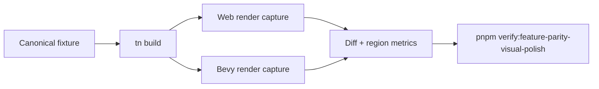

# Cross-Adapter Visual Calibration

Complexity: 12 -> HIGH mode

## Complexity Assessment

- +3 touches 10+ implementation/test/docs files during implementation
- +2 includes cross-runtime visual parity and screenshot evidence
- +2 spans SDK/IR/compiler, web runtime, Bevy runtime, examples, and docs
- +2 requires calibration thresholds and artifact inspection
- +2 covers multiple rendering systems
- +1 affects release/capability documentation

## Context

**Problem:** The parity table still names both adapters as the active gap for
visual calibration across lights, shadows, materials, post-processing, and
dense-scene rendering.

**Files Analyzed:**

- `docs/bevy-feature-parity.md`
- `docs/PRDs/done/other/post-v10-rendering-materials-geometry-residuals.md`
- `docs/PRDs/done/other/render-look-shadow-bloom-polish.md`
- `/home/joao/.agents/skills/prd-creator/SKILL.md`

**Current Behavior:**

- Baseline render-look, skybox/environment, portable shader material, bloom,
  LOD, instancing, and material-slot evidence exists.
- Remaining polish is about stronger screenshot-level calibration, not raw
  backend exposure.
- Shadow quality profiles, native UI-adjacent gradients/effects, billboard
  impostor visuals, dense-scene texture variants, and advanced material import
  evidence need tighter proof before stronger claims.

## Impact

**Planned files touched:** visual fixtures, web renderer adapter, Bevy renderer
adapter, material/light validators, verify tooling, artifacts, capability docs,
`docs/STATUS.md`, and `docs/bevy-feature-parity.md`.

**Features affected:** light/shadow quality profiles, material slots, advanced
blend diagnostics, render-look profiles, dense-scene LOD, impostors, texture
variants, and screenshot gates.

**Main risks:**

- Pixel diffs can be noisy if fixtures use uncontrolled camera, lighting, or
  asset loading.
- Bevy 0.14 renderer constraints can tempt backend-specific fields into the
  portable contract.
- Visual claims without artifact paths are hard to audit later.

## Integration Points

**How will this feature be reached?**

- [x] Entry point identified: structured scene/material/light declarations,
  `tn build`, web preview, native preview, and visual verification gates.
- [x] Caller file identified: compiler emit paths, web/Bevy render adapters,
  visual fixture runners, and report normalizers.
- [x] Registration/wiring needed: gate script, fixture enrollment, artifact
  paths, docs links, and capability status updates.

**Is this user-facing?**

- [x] YES. Authors see better visual parity in rendered scenes and stable
  diagnostics for unsupported visual intent.
- [ ] NO -> Internal/background feature.

**Full user flow:**

1. User authors a scene using promoted lighting, material, LOD, and render-look
   features.
2. `tn build` validates bounded declarations and rejects advanced backend
   escape hatches.
3. Web and Bevy previews render the same fixture.
4. A focused gate writes screenshots, diff/contact sheets, metrics, and report
   JSON with pass/fail thresholds.

## Solution

**Approach:**

- Add a focused `feature-parity-visual-polish` artifact set using stable
  canonical scenes.
- Calibrate only bounded visual features that already have shared contract
  support.
- Keep volumetrics, SSR/GI, custom post, raw render phases, and backend render
  path choices diagnostic-only.
- Require docs evidence links for every promoted visual claim.

**Key Decisions:**

- [x] Library/framework choices: reuse existing visual capture, render-look,
  portable shader material, and screenshot-diff tooling.
- [x] Error-handling strategy: unsupported visual features remain stable
  diagnostics with portable fallback suggestions.
- [x] Reused utilities: screenshot capture, contact-sheet generation,
  conformance reports, and material/light report serializers.

**Data Changes:** Report schema additions only. No database migrations.

## Execution Phases

#### Phase 1: Shadow And Light Profile Proof - Quality profiles have real web/native evidence.

**Files (max 5):**

- `packages/ir/src/*` - light/shadow profile validation
- `packages/runtime-web-three/src/*` - web profile mapping/reporting
- `runtime-bevy/src/*` - native profile mapping/reporting
- `tools/verify/src/*` - visual polish gate
- `examples/*/artifacts/feature-parity-visual-polish/*` - evidence

**Implementation:**

- [ ] Map low/medium/high shadow profiles to bounded runtime settings.
- [ ] Emit light-budget and cascade/filter observations from both adapters.
- [ ] Capture focused web/native screenshots and diff metrics.

**Tests Required:**

| Test File | Test Name | Assertion |
|-----------|-----------|-----------|
| `packages/ir/src/light-profile.test.ts` | `should reject shadow profile when budget exceeds target profile` | Diagnostic includes target budget. |
| `packages/runtime-web-three/src/light-profile.test.ts` | `should report selected shadow profile` | Report includes map size and filter. |
| `runtime-bevy/tests/light_profile.rs` | `should report selected shadow profile` | Native report matches fixture expectation. |

**User Verification:**

- Action: Run `pnpm verify:feature-parity-visual-polish`.
- Expected: Shadow profile screenshots and metrics are emitted for both
  adapters.

#### Phase 2: Material And Dense-Scene Visual Proof - Material and LOD polish is auditable.

**Files (max 5):**

- `packages/ir/src/*` - material/dense-scene report validation
- `packages/runtime-web-three/src/*` - web material and LOD reports
- `runtime-bevy/src/*` - native material and LOD reports
- `tools/verify/src/*` - artifact assertions
- `docs/status/capabilities/*.md` - capability docs

**Implementation:**

- [ ] Add native specular/advanced material proof artifacts where fields are
  promoted.
- [ ] Add billboard/impostor LOD screenshot calibration.
- [ ] Add dense-scene texture variant report evidence.
- [ ] Keep custom GPU attributes and advanced blends diagnostic-only unless
  the fixture proves parity.

**Tests Required:**

| Test File | Test Name | Assertion |
|-----------|-----------|-----------|
| `packages/ir/src/material-polish.test.ts` | `should preserve promoted material proof metadata` | Fixture includes evidence key. |
| `tools/verify/src/visual-polish.test.ts` | `should fail when a promoted material lacks web and native artifacts` | Missing artifact path fails gate. |
| `runtime-bevy/tests/material_polish.rs` | `should report specular texture fixture state` | Report identifies texture asset and slot. |

**User Verification:**

- Action: Inspect the generated contact sheet.
- Expected: Material and dense-scene rows show controlled, visible differences
  within threshold.

## Verification Strategy

- Run `pnpm verify:feature-parity-visual-polish`.
- Run `pnpm verify:render-look` if existing render-look fixtures are touched.
- Run `pnpm verify:conformance` for report-schema changes.
- Run `pnpm check:docs` after status updates.

## Acceptance Criteria

- [ ] Light/shadow profiles have web/native screenshots, metrics, and reports.
- [ ] Material and dense-scene visual claims cite artifact paths.
- [ ] Unsupported advanced renderer paths remain diagnostic-only.
- [ ] Focused visual gate passes in addition to conformance/docs checks.
- [ ] `docs/bevy-feature-parity.md` gap-side language is updated with evidence.
