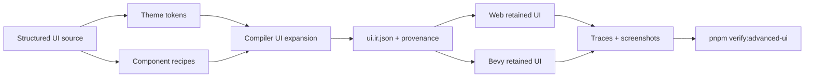
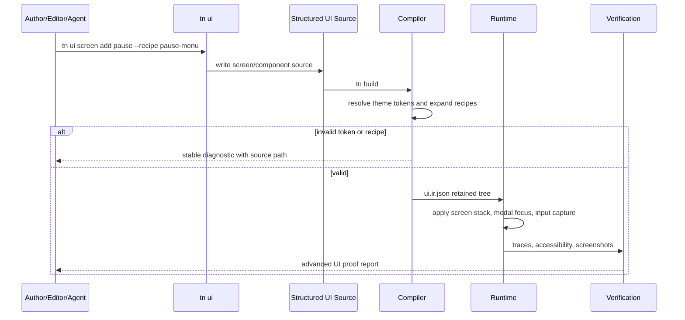

# Advanced Portable UI Composition and Screen Systems

Complexity: 13 -> HIGH mode

## Complexity Assessment

- +3 touches 10+ implementation/test/docs files during implementation
- +2 adds reusable UI composition, templates, theme tokens, and screen routing
- +2 includes stateful focus/modal/navigation behavior across runtimes
- +2 spans SDK, IR, compiler, structured authoring, CLI/editor, web runtime,
  Bevy runtime, examples, and verification
- +2 changes authoring ergonomics and reusable component contracts
- +1 requires visual/accessibility verification
- +1 affects capability documentation and parity status

## Context

**Problem:** Retained UI now covers many primitive runtime capabilities, but
authors still have to assemble complex game menus, inventories, dialogs, HUDs,
settings, screen flows, world-attached labels, and visual emphasis effects from
low-level nodes without a portable composition system, reusable visual language,
or strong screen-state/effect contract.

**Files Analyzed:**

- `AGENTS.md`
- `docs/PRDs/README.md`
- `docs/contracts/ui.md`
- `docs/STATUS.md`
- `docs/bevy-feature-parity.md`
- `docs/PRDs/done/v7/V7-04-rich-portable-ui-navigation-and-input-parity.md`
- `docs/PRDs/done/v8/V8-15-rich-ui-text-accessibility-residuals.md`
- `docs/PRDs/done/other/post-v10-input-ui-platform-polish.md`
- `docs/PRDs/other/complete-structured-authoring-parity.md`
- `docs/PRDs/done/other/portable-scripting-ui-persistence-settings-facades.md`
- `packages/sdk/src/ui.ts`
- `packages/ir/src/types.ts`
- `packages/ir/src/uiValidation.ts`
- `packages/cli/src/commands/sourceDocuments.ts`
- `packages/editor/src/workbench/uiInputSystemModel.ts`

**Current Behavior:**

- Retained `ui.ir.json` supports portable node primitives, focus/navigation,
  safe areas, scroll behavior, images, rich text, standard widgets, text input,
  accessibility metadata, debug reports, and web/Bevy rendering evidence.
- Structured UI source documents and `tn ui ... --json` operations can mutate
  basic UI nodes, text, layout, styles, and bindings.
- Scripts can address UI state through stable retained node IDs, and settings
  and persistence facades exist for declared local data.
- Optional React/webview overlays exist for rich non-portable shells, but they
  are not the default portable game UI contract.
- There is no promoted portable contract for reusable UI components, theme
  tokens, screen stacks, modal layers, transition recipes, list virtualization,
  responsive layout recipes, inventory/item-slot patterns, dialog trees,
  validation summaries, diegetic nameplates/health bars attached to 3D
  entities, bounded UI glow/highlight effects, controller glyphs, tooltips,
  toast queues, cooldown/progress affordances, localization keys, UI sound/
  haptic feedback hooks, or design-system-level consistency.

## Goals

- Make complex game UI practical without escaping to optional webview overlays.
- Give authors reusable, source-backed UI components that compile to plain
  retained UI IR and remain inspectable by CLI/editor tools.
- Add screen-level lifecycle and state semantics for menus, pause screens,
  inventory, dialogs, settings, loading overlays, game-over flows, and HUD
  variants.
- Promote a bounded theme/token system for consistent typography, spacing,
  colors, panel treatments, icon refs, focus rings, and widget variants.
- Add layout recipes for common game UI patterns while continuing to reject
  arbitrary browser CSS and runtime-specific handles.
- Promote a bounded visual emphasis contract for common game UI states such as
  focused, selected, interactable, damaged, quest target, invalid, and critical.
- Promote a bounded world-attached UI contract for player names, enemy health
  bars, interact prompts, quest markers, and pickup labels.
- Promote common game UI affordances such as controller glyph prompts,
  tooltips, toast queues, cooldown/progress indicators, localization keys,
  validation summaries, and UI audio/haptic feedback hooks.
- Strengthen verification so UI completeness is proven by source validation,
  emitted IR shape, web/native behavior traces, screenshots, accessibility
  reports, and mobile/desktop fit evidence.

## Non-Goals

- Do not make React DOM, browser CSS, or webview overlays the default portable
  game UI strategy.
- Do not support arbitrary CSS selectors, CSS cascade, media queries, DOM
  events, HTML forms, browser layout engines, or native widget handles.
- Do not promote broad 3D-world UI, render-to-texture UI, arbitrary 3D UI
  meshes, or UI viewport nodes. This PRD may promote a narrow world-attached
  screen-space UI contract that projects retained UI anchors from declared 3D
  entities without exposing renderer handles.
- Do not promote custom UI shaders or arbitrary CSS filters. This PRD may
  promote bounded effect presets such as glow, pulse, outline, shadow, tint, and
  focus ring when they lower to portable retained UI/render metadata.
- Do not add arbitrary scripting inside UI documents. Behavior remains in
  declared script modules and portable `ctx.ui`/settings/persistence facades.
- Do not introduce an unbounded design system. Ship a small set of game-oriented
  recipes with stable generated retained nodes.

## Impact

**Planned files touched by implementation:** SDK UI authoring APIs, IR UI
schemas and validators, compiler UI emit/provenance, structured UI source
schemas, authoring operations, CLI `tn ui` commands, editor operation registry,
web DOM UI runtime, Bevy UI runtime, scene/entity projection helpers,
conformance fixtures, example UI documents, verification tools, docs, status,
and parity tables.

**Features affected:** HUDs, pause menus, settings screens, inventories,
dialog/quest flows, notifications, modals, nameplates, health bars, interact
prompts, quest/pickup markers, controller prompts, tooltips, cooldowns,
progress indicators, localization, UI feedback hooks, UI glow/highlight states,
accessibility, focus navigation, responsive layout, UI source editing, UI
visual consistency, and web/native runtime parity.

**Main risks:**

- Reusable components can hide generated node IDs and break source-backed
  editor operations unless expansion provenance is explicit.
- Theme tokens can drift between web CSS and Bevy UI if every token is not
  lowered to retained IR values before runtime.
- Screen stacks and modals can create nondeterministic focus/input capture
  without strict ordering and lifecycle rules.
- Layout recipes can become a second CSS if the allowed options are not small,
  typed, and validated.
- Glowing/highlighted UI can drift visually if implemented as adapter-local CSS
  filters or Bevy materials instead of authored portable effect metadata.
- World-attached UI can become unreadable or nondeterministic without explicit
  camera projection, occlusion, distance scaling, clamping, and input policies.
- Localization, controller glyphs, audio, and haptics can leak platform details
  unless represented as logical keys/actions with target-specific reports.

## Integration Points

**How will this feature be reached?**

- [x] Entry point identified: `defineUiModule()`, structured
  `content/ui/*.ui.json`, future `content/ui/themes/*.ui-theme.json`, `tn ui`
  commands, compiler UI emit, web preview, native Bevy preview, editor
  operations, entity/world references, `ctx.ui`, and focused UI verification
  gates.
- [x] Caller file identified: SDK UI helpers, IR UI validator/types, compiler
  UI emit/provenance, authoring source operations, CLI source document commands,
  editor UI operation models, web UI adapter, Bevy UI adapter, camera projection
  helpers, and verification tool registration.
- [x] Registration/wiring needed: schema exports, compiler bundle manifest
  entries or UI metadata sections, capability derivation, CLI help, editor
  operation registry rows, conformance fixtures, screenshots, docs, and release
  gate evidence.

**Is this user-facing?**

- [x] YES. Authors and players see richer menus, HUDs, inventories, dialogs,
  loading states, and settings flows.
- [ ] NO -> Internal/background feature.

**Full user flow:**

1. User creates a UI theme and chooses portable recipes for HUD, pause menu,
   inventory, dialog, settings screens, nameplates, interact prompts, tooltips,
   and notifications.
2. User customizes components through `tn ui ... --json`, structured source,
   or editor operations while preserving stable source IDs, effect presets, and
   entity attachment references.
3. `tn authoring validate --json` checks tokens, component references,
   generated IDs, bindings, focus scopes, screen transitions, attached-entity
   references, effect presets, and accessibility.
4. `tn build` expands reusable components into retained `ui.ir.json` with
   provenance that maps every generated node back to source.
5. Web and Bevy runtimes render the same retained tree, apply screen stack and
   modal state, project attached UI from world entities, preserve focus/input
   capture, apply bounded effects, and emit matching traces.
6. `pnpm verify:advanced-ui` captures IR, runtime traces, accessibility
   reports, desktop/mobile screenshots, and UI-fit evidence.

## Solution

**Approach:**

- Add a source-level UI composition layer that expands into existing retained
  UI nodes before runtime.
- Introduce theme tokens and variants as build-time data, not runtime CSS.
- Add screen stacks, modal layers, focus scopes, and transition metadata as
  explicit retained UI state.
- Add bounded effect presets as authored metadata, not adapter-only CSS filters
  or custom shaders.
- Add world-attached UI anchors that project retained UI from declared 3D
  entities into screen-space with explicit occlusion, clamp, scale, and input
  rules.
- Provide game-oriented layout and component recipes for common UI surfaces.
- Extend CLI/editor operations so agents and future visual tooling can create
  and mutate advanced UI without hand-editing generated IR.
- Keep all runtime behavior data-only and portable across web and Bevy.



**Key Decisions:**

- [x] Library/framework choices: reuse retained UI IR, structured source docs,
  authoring operations, existing web DOM and Bevy UI adapters, accessibility
  reports, and screenshot proof tooling.
- [x] Error-handling strategy: reject unresolved tokens, unsupported recipes,
  invalid generated IDs, focus traps without exit actions, modal stacks without
  capture policy, and layout recipes that cannot lower to retained nodes.
- [x] Reused utilities: UI validation, source document operations, compiler
  provenance, `ctx.ui`, settings/persistence facades, UI debug reports, and
  artifact conventions.

**Data Changes:** Add source-level UI themes, component definitions, screen
definitions, common affordance metadata, effect presets, world attachment
metadata, and expansion provenance. Generated `ui.ir.json` remains the runtime
contract.

## Sequence Flow



## Required New Capability Slices

### Bounded UI Effects

Promote effect presets only when they can be expressed as portable metadata and
verified across web and Bevy:

- `glow`: color, intensity, radius, optional pulse rate, state binding.
- `outline`: color, width, offset policy, state binding.
- `pulse`: opacity/scale/intensity range, duration, easing, loop policy.
- `tint`: color, opacity, blend policy.
- `focusRing`: color, width, radius, inset/outset.
- `shadow`: existing shadow metadata reused as the fallback when glow is not
  supported by a target profile.

Rules:

- Effect presets are authored data and must appear in emitted IR/capability
  reports.
- Runtimes may approximate glow with layered shadow, bloom-compatible emissive
  quads, or native UI effect metadata, but reports must say which strategy was
  used.
- Custom CSS filters, custom UI shaders, and direct material handles remain
  rejected.
- Effects must be state-bindable for `focus`, `hover`, `selected`, `disabled`,
  `critical`, `invalid`, `questTarget`, and resource/component predicates.

### World-Attached Retained UI

Promote a narrow retained UI attachment model for common diegetic game UI:

- Nameplates above players/NPCs.
- Health/shield/stamina bars above actors.
- Interact prompts near usable objects.
- Pickup labels and quest markers.
- Off-screen edge indicators for tracked targets.

Rules:

- Attachment target must be a declared entity ID, prefab instance ID, or
  selected entity binding, not a runtime object handle.
- Attachment uses a local world offset, camera projection, optional distance
  scaling, safe-area clamping, and occlusion policy.
- Attached UI is still retained UI rendered in screen space unless a later PRD
  promotes true 3D UI surfaces.
- Input routing is opt-in. By default, attached UI is informational and does not
  capture world picking.
- Verification must include camera movement traces showing projected position,
  clamping, hidden/occluded state, scale, and stable ordering.

### Common Affordances Coverage

This PRD should cover at least the common 80% of game UI needs without requiring
optional webview overlays:

| Need | Covered By | Boundary |
|------|------------|----------|
| HUD counters, bars, timers, minimaps | Existing retained nodes plus recipes | Arbitrary canvas HUDs remain unsupported. |
| Pause, game-over, loading, settings, confirm dialogs | Screen stack, modal/focus scopes, recipes | Native platform dialog handles remain unsupported. |
| Inventory, shop, save/load lists, leader-style tables | Component recipes, virtualized lists, responsive fit | Arbitrary table/grid CSS remains unsupported. |
| Dialog/quest text and choices | Dialog recipe, rich text, focus scopes, localization keys | Branching story authoring beyond UI choices belongs in scripts/data. |
| Controller/keyboard/touch prompts | Logical input action glyph refs and target-profile glyph sets | Platform device handles and raw SVG injection remain unsupported. |
| Tooltips and contextual help | Tooltip/popover affordance with focus/hover/open policy | Browser title attributes and raw DOM hover events remain unsupported. |
| Notifications and combat/event toasts | Toast queue affordance with priority, duration, and stacking | Unbounded notification feeds require virtualization. |
| Cooldowns, progress rings, meters | Progress/cooldown recipe variants over bindings | Custom vector drawing remains unsupported. |
| Validation summaries and disabled reasons | Form/status affordance plus accessibility repair hints | Arbitrary HTML form behavior remains unsupported. |
| Localization and dynamic text | Localization keys, plural/select params, fallback policy | Runtime network translation remains unsupported. |
| UI audio and haptic feedback | Logical feedback action hooks into declared audio/input services | Raw native haptic/audio handles remain unsupported. |
| Glow, selected, critical, quest target highlight | Bounded effect presets | Custom shaders/CSS filters remain unsupported. |
| Nameplates, health bars, interact prompts on 3D actors | World-attached retained UI | True 3D UI surfaces remain unsupported. |

## Execution Phases

#### Phase 1: Theme Tokens and Variants - UI can share a portable visual language.

**Files (max 5):**

- `packages/ir/src/types.ts` - theme/token IR/source metadata types
- `packages/ir/src/uiValidation.ts` - token validation diagnostics
- `packages/compiler/src/emit/ui.ts` - token resolution before emit
- `packages/sdk/src/ui.ts` - theme/token authoring helpers
- `packages/ir/src/ui.test.ts` - accepted/rejected token tests

**Implementation:**

- [ ] Define bounded tokens for color, spacing, radius, border, shadow,
  gradient, font family, text size, icon/image refs, and focus ring.
- [ ] Allow component variants to reference tokens by stable IDs.
- [ ] Resolve tokens to concrete retained style/image/font fields during build.
- [ ] Reject unknown tokens, circular aliases, unsupported token types, and
  runtime-specific CSS/native style fields.

**Tests Required:**

| Test File | Test Name | Assertion |
|-----------|-----------|-----------|
| `packages/ir/src/ui.test.ts` | `should accept bounded UI theme tokens` | Valid tokens pass validation. |
| `packages/ir/src/ui.test.ts` | `should reject unresolved UI token references` | Diagnostic includes source path and token id. |
| `packages/compiler/src/emit/ui.test.tsx` | `should lower theme tokens to retained styles` | Emitted `ui.ir.json` contains concrete style values, not token refs. |

**User Verification:**

- Action: Build a themed HUD fixture and inspect `ui.ir.json`.
- Expected: Token references are resolved and source provenance points back to
  the theme document.

#### Phase 2: Component Expansion and Provenance - Reusable UI stays editable.

**Files (max 5):**

- `packages/sdk/src/ui.ts` - component recipe authoring helpers
- `packages/compiler/src/emit/ui.ts` - component expansion and generated IDs
- `packages/ir/src/uiValidation.ts` - component/provenance validation
- `packages/cli/src/commands/sourceDocuments.ts` - component-aware `tn ui`
  operations
- `packages/compiler/src/emit/ui.test.tsx` - expansion tests

**Implementation:**

- [ ] Add source-level component definitions with typed props and slots.
- [ ] Expand components into retained nodes with deterministic generated IDs.
- [ ] Preserve provenance from generated nodes to source component, prop, and
  slot paths.
- [ ] Add CLI operations for create/use/update/remove component instances.
- [ ] Reject component cycles, missing required props, invalid slot children,
  duplicate generated IDs, and attempts to mutate generated IR directly.

**Tests Required:**

| Test File | Test Name | Assertion |
|-----------|-----------|-----------|
| `packages/compiler/src/emit/ui.test.tsx` | `should expand reusable UI component with stable node IDs` | Rebuild emits identical IDs. |
| `packages/compiler/src/emit/ui.test.tsx` | `should preserve source provenance for generated UI nodes` | Provenance maps node to component source path. |
| `packages/cli/src/commands/source-documents-command.test.ts` | `should update component props through tn ui` | Source document changes and generated IR rebuilds. |

**User Verification:**

- Action: Create two inventory slot instances with different bindings.
- Expected: Both render from the same component, keep unique node IDs, and are
  independently editable through source operations.

#### Phase 3: Screen Stack, Modals, and Focus Scopes - Menus become first-class flows.

**Files (max 5):**

- `packages/ir/src/types.ts` - screen/modal/focus scope metadata
- `packages/ir/src/uiValidation.ts` - screen stack and modal diagnostics
- `packages/runtime-web-three/src/*` - web screen stack/focus behavior
- `runtime-bevy/crates/threenative_runtime/src/ui.rs` - native screen
  stack/focus behavior
- `packages/ir/fixtures/conformance/advanced-ui/*` - shared fixture

**Implementation:**

- [ ] Add screen definitions with `hud`, `menu`, `modal`, `overlay`,
  `loading`, and `dialog` roles.
- [ ] Add stack policies: replace, push, pop, overlay, and exclusive modal.
- [ ] Add focus scopes with entry node, restore behavior, escape/back action,
  and input capture policy.
- [ ] Emit deterministic transition observations without requiring full visual
  animation parity.
- [ ] Reject focus traps without exit action, modal overlays without capture
  policy, duplicate active exclusive screens, and hidden screens with active
  focus.

**Tests Required:**

| Test File | Test Name | Assertion |
|-----------|-----------|-----------|
| `packages/ir/src/ui.test.ts` | `should reject modal focus trap without exit action` | Diagnostic code/path are stable. |
| `packages/runtime-web-three/src/ui-screen-stack.test.ts` | `should restore focus after modal pop` | Previous focused node is restored. |
| `runtime-bevy/crates/threenative_runtime/tests/ui.rs` | `should apply screen stack input capture` | Hidden/lower screen does not dispatch action. |

**User Verification:**

- Action: Open pause menu, open confirm dialog, cancel it, then resume.
- Expected: Focus moves into the dialog, input is captured by the dialog, focus
  restores to the pause menu, and resume returns to HUD focus policy.

#### Phase 4: Game UI Recipes - Common screens are quick to author and prove.

**Files (max 5):**

- `packages/sdk/src/ui.ts` - recipe helpers
- `packages/cli/src/commands/sourceDocuments.ts` - `tn ui recipe ...`
  operations
- `templates/structured-source-starter/content/ui/*` - starter recipe usage
- `examples/*/content/ui/*` - focused advanced UI example
- `tools/verify/src/*` - advanced UI fixture registration

**Implementation:**

- [ ] Add bounded recipes for HUD status cluster, pause menu, settings list,
  inventory grid, item detail panel, dialog box, notification toast, and
  loading overlay.
- [ ] Allow recipes to bind resources/settings/actions through declared props.
- [ ] Generate accessible names, focus order, and responsive anchors by default.
- [ ] Add CLI/editor operation metadata for adding and customizing recipes.
- [ ] Keep recipe output as ordinary retained UI nodes with provenance.

**Tests Required:**

| Test File | Test Name | Assertion |
|-----------|-----------|-----------|
| `packages/sdk/src/ui.test.ts` | `should create inventory recipe source with bindings` | Recipe source uses stable IDs and declared props. |
| `packages/cli/src/commands/source-documents-command.test.ts` | `should add settings recipe through tn ui recipe` | Source file includes expected screen/component entries. |
| `tools/verify/src/advancedUi.test.ts` | `should require recipe screenshots and accessibility reports` | Missing artifacts fail the gate. |

**User Verification:**

- Action: Generate a settings screen and inventory screen in the starter.
- Expected: Desktop and mobile screenshots show usable, non-overlapping UI with
  working focus/action traces.

#### Phase 5: Responsive Fit, Lists, and Large Menus - UI scales beyond small HUDs.

**Files (max 5):**

- `packages/ir/src/uiValidation.ts` - responsive/list validation
- `packages/runtime-web-three/src/*` - web list/windowing behavior
- `runtime-bevy/crates/threenative_runtime/src/ui.rs` - native list/windowing
  behavior
- `packages/ir/fixtures/conformance/advanced-ui/*` - large-menu fixture
- `tools/verify/src/*` - UI fit proof metrics

**Implementation:**

- [ ] Add responsive recipe breakpoints by target profile class, not arbitrary
  CSS media queries.
- [ ] Add list and grid virtualization metadata for large inventories and save
  lists, with deterministic visible range observations.
- [ ] Extend UI-fit proof to catch clipping, overlap, missing focus targets,
  and unsafe-area violations on desktop and mobile viewports.
- [ ] Reject unbounded generated node counts where virtualization is required.

**Tests Required:**

| Test File | Test Name | Assertion |
|-----------|-----------|-----------|
| `packages/ir/src/ui.test.ts` | `should reject large list without virtualized range policy` | Diagnostic suggests adding list metadata. |
| `packages/runtime-web-three/src/ui-list.test.ts` | `should report deterministic visible item range` | Report includes start/end item ids. |
| `runtime-bevy/crates/threenative_runtime/tests/ui.rs` | `should preserve native virtual list range` | Native report matches fixture expectation. |

**User Verification:**

- Action: Open a 200-item inventory on desktop and mobile.
- Expected: UI remains responsive, visible items are deterministic, focus does
  not jump unexpectedly, and fit proof reports pass.

#### Phase 6: Common Affordances - Routine game UI patterns are first-class.

**Files (max 5):**

- `packages/ir/src/types.ts` - affordance metadata
- `packages/ir/src/uiValidation.ts` - affordance diagnostics
- `packages/sdk/src/ui.ts` - affordance helpers
- `packages/runtime-web-three/src/*` - web affordance traces
- `runtime-bevy/crates/threenative_runtime/src/ui.rs` - native affordance
  traces

**Implementation:**

- [ ] Add logical controller glyph refs for declared input actions and target
  profile glyph sets.
- [ ] Add tooltip/popover metadata with open policy, anchor node, delay,
  dismissal action, focus behavior, and accessible description.
- [ ] Add toast queue metadata with priority, duration, max visible count,
  stacking direction, and duplicate coalescing policy.
- [ ] Add progress/cooldown variants for bars, rings, radial fills, segmented
  meters, and textual value formatting when supported by retained nodes.
- [ ] Add localization keys with typed params, fallback text, plural/select
  cases, and missing-key diagnostics.
- [ ] Add UI feedback hooks that emit logical audio/haptic events through
  declared services when supported by target profile.

**Tests Required:**

| Test File | Test Name | Assertion |
|-----------|-----------|-----------|
| `packages/ir/src/ui.test.ts` | `should accept input glyph prompt for declared action` | Valid glyph/action metadata passes. |
| `packages/ir/src/ui.test.ts` | `should reject localization key without fallback` | Diagnostic includes node path and key. |
| `packages/runtime-web-three/src/ui-affordances.test.ts` | `should coalesce duplicate toast queue entries` | Report includes one visible toast and coalesced count. |
| `runtime-bevy/crates/threenative_runtime/tests/ui.rs` | `should preserve tooltip and glyph observations` | Native report includes tooltip/glyph metadata. |

**User Verification:**

- Action: Open the advanced UI fixture with keyboard, controller, and touch
  prompt states.
- Expected: Prompts, tooltips, toasts, cooldowns, localized text, and feedback
  traces appear without raw DOM/native handles.

#### Phase 7: Bounded Visual Effects - UI can glow, pulse, and highlight portably.

**Files (max 5):**

- `packages/ir/src/types.ts` - UI effect preset metadata
- `packages/ir/src/uiValidation.ts` - effect diagnostics
- `packages/runtime-web-three/src/*` - web effect rendering/reporting
- `runtime-bevy/crates/threenative_runtime/src/ui.rs` - native effect
  rendering/reporting
- `packages/ir/fixtures/conformance/advanced-ui/*` - effect fixture

**Implementation:**

- [ ] Add effect metadata for glow, outline, pulse, tint, focus ring, and
  fallback shadow strategy.
- [ ] Allow effects to bind to focus/hover/selected/disabled and declared
  resource/component predicates.
- [ ] Emit runtime reports that record the applied strategy for each effect.
- [ ] Reject arbitrary CSS filters, shader refs, render handles, unsupported
  blend modes, and unbounded animation loops.
- [ ] Add visual fixture states for selected item, quest target, invalid input,
  critical health, and focused button.

**Tests Required:**

| Test File | Test Name | Assertion |
|-----------|-----------|-----------|
| `packages/ir/src/ui.test.ts` | `should accept bounded UI glow effect preset` | Valid glow metadata passes. |
| `packages/ir/src/ui.test.ts` | `should reject custom UI shader effect` | Diagnostic rejects shader/material handle. |
| `packages/runtime-web-three/src/ui-effects.test.ts` | `should report active selected glow strategy` | Report includes node id, state, and strategy. |
| `runtime-bevy/crates/threenative_runtime/tests/ui.rs` | `should preserve native UI effect observations` | Native report includes matching effect ids. |

**User Verification:**

- Action: Toggle selected/critical/invalid states in the advanced UI fixture.
- Expected: Web and Bevy screenshots show visible emphasis, and reports identify
  whether glow was rendered directly or through the fallback strategy.

#### Phase 8: World-Attached UI - Nameplates and health bars follow 3D entities.

**Files (max 5):**

- `packages/ir/src/types.ts` - attachment target/projection metadata
- `packages/ir/src/uiValidation.ts` - attachment validation diagnostics
- `packages/runtime-web-three/src/*` - web camera projection and clamping
- `runtime-bevy/crates/threenative_runtime/src/ui.rs` - native camera
  projection and clamping
- `packages/ir/fixtures/conformance/advanced-ui/*` - attached UI fixture

**Implementation:**

- [ ] Add `attachTo` metadata for declared entity IDs, prefab instance IDs, and
  selected-entity bindings.
- [ ] Support local world offset, screen-space anchor, distance scale range,
  off-screen clamp, occlusion policy, max distance, and sort priority.
- [ ] Add default recipes for nameplate, enemy health bar, interact prompt,
  pickup label, quest marker, and off-screen indicator.
- [ ] Keep attached UI rendered as retained screen-space UI and reject true 3D
  UI surfaces, render-to-texture, scene mesh handles, and direct camera handles.
- [ ] Emit projection traces with target entity, camera id, projected screen
  position, depth, clamped state, occluded state, scale, and visible node ids.

**Tests Required:**

| Test File | Test Name | Assertion |
|-----------|-----------|-----------|
| `packages/ir/src/ui.test.ts` | `should reject attached UI target that is not a declared entity` | Diagnostic includes target id and UI path. |
| `packages/runtime-web-three/src/ui-attachments.test.ts` | `should project nameplate above moving entity` | Trace position changes with entity transform. |
| `runtime-bevy/crates/threenative_runtime/tests/ui.rs` | `should clamp off-screen attached UI marker` | Native trace reports clamped edge position. |

**User Verification:**

- Action: Move the camera around actors with nameplates and health bars.
- Expected: Labels follow the correct entities, hide or clamp according to
  policy, preserve relative ordering, and do not capture world input unless
  configured.

#### Phase 9: Verification, Docs, and Release Gate - Advanced UI is proven as a capability.

**Files (max 5):**

- `docs/contracts/ui.md` - advanced UI contract documentation
- `docs/STATUS.md` - promoted capability status
- `docs/bevy-feature-parity.md` - parity checklist and evidence anchors
- `tools/verify/src/*` - `pnpm verify:advanced-ui`
- `packages/ir/fixtures/conformance/advanced-ui/*` - final fixture artifacts

**Implementation:**

- [ ] Document source-level composition versus retained runtime IR.
- [ ] Add capability flags for theme tokens, component expansion, screen stack,
  modal focus scopes, recipes, virtualized lists, common affordances, bounded UI
  effects, and world-attached retained UI.
- [ ] Register `pnpm verify:advanced-ui` and include web/native reports,
  screenshots, accessibility audits, and UI-fit artifacts.
- [ ] Update release docs only after evidence exists.
- [ ] Keep diagnostic-only boundaries explicit for arbitrary CSS, DOM, webview,
  3D UI, render-to-texture UI, and native widget handles.

**Tests Required:**

| Test File | Test Name | Assertion |
|-----------|-----------|-----------|
| `tools/verify/src/advancedUi.test.ts` | `should pass when advanced UI evidence is complete` | Report includes all required artifacts. |
| `tools/verify/src/advancedUi.test.ts` | `should fail when native screen-stack trace is missing` | Gate returns non-zero with stable diagnostic. |
| `tools/verify/src/advancedUi.test.ts` | `should fail when attached UI projection trace is missing` | Gate reports missing world-attached evidence. |
| `packages/ir/src/capabilities.test.ts` | `should derive advanced UI capabilities from emitted metadata` | Capability manifest includes expected UI flags. |

**User Verification:**

- Action: Run `pnpm verify:advanced-ui`.
- Expected: Gate writes aggregate reports under
  `tools/verify/artifacts/advanced-ui/` and references example-local evidence.

## Acceptance Criteria

- [ ] Authors can define theme tokens and variants that lower to concrete
  retained UI values with stable diagnostics for invalid tokens.
- [ ] Authors can define and instantiate reusable UI components with typed
  props, slots, deterministic generated IDs, and source provenance.
- [ ] UI screens support explicit stack, modal, focus, transition, and input
  capture semantics with matching web/native traces.
- [ ] Starter templates can add HUD, pause, settings, inventory, dialog,
  notification, and loading UI from portable recipes without optional webview
  overlays.
- [ ] Large menu/list fixtures use bounded virtualization metadata and pass
  desktop/mobile UI-fit proof.
- [ ] Controller glyph prompts, tooltips/popovers, toast queues,
  cooldown/progress affordances, localization keys, validation summaries, and
  UI audio/haptic feedback hooks work through logical retained metadata.
- [ ] UI nodes can use bounded glow, pulse, outline, tint, and focus-ring
  effects with state bindings and matching web/native evidence reports.
- [ ] Nameplates, health bars, interact prompts, pickup labels, quest markers,
  and off-screen indicators can attach to declared 3D entities through a
  screen-space projection contract.
- [ ] Accessibility reports include names, roles, focus order, disabled state,
  modal scope, and repair hints for advanced UI surfaces.
- [ ] `pnpm verify:advanced-ui` proves emitted IR shape, web runtime behavior,
  Bevy runtime behavior, screenshots, accessibility reports, and fit metrics.
- [ ] `docs/contracts/ui.md`, `docs/STATUS.md`, and
  `docs/bevy-feature-parity.md` are updated when, and only when, the capability
  is implemented and release-gated.

## Open Questions

- Should component definitions live inside each `content/ui/*.ui.json` document,
  or should reusable component libraries use separate
  `content/ui/components/*.ui-component.json` files?
- Should theme documents be project-wide by default, or can a scene override the
  active theme through scene lifecycle metadata?
- Which recipes belong in the first promoted set versus example-local helpers?
- Which glyph sets should ship in the starter versus remain target-profile
  declarations supplied by projects?
- Should screen stack state be represented as UI IR metadata only, or also as a
  scene lifecycle overlay policy for cross-scene menus?
- How much transition animation should be promoted in this PRD versus delegated
  to the existing UI/property animation capability?

## Verification Strategy

Start with narrow validation and compiler tests, then prove runtime behavior and
visual fit:

```bash
pnpm --filter @threenative/ir test -- --run ui
pnpm --filter @threenative/compiler test -- --run ui
pnpm --filter @threenative/runtime-web-three test -- --run ui
cd runtime-bevy && cargo test ui
pnpm verify:conformance
pnpm verify:advanced-ui
```

If implementation changes shared runtime contracts, include
`pnpm verify:conformance` before release-gate updates.
